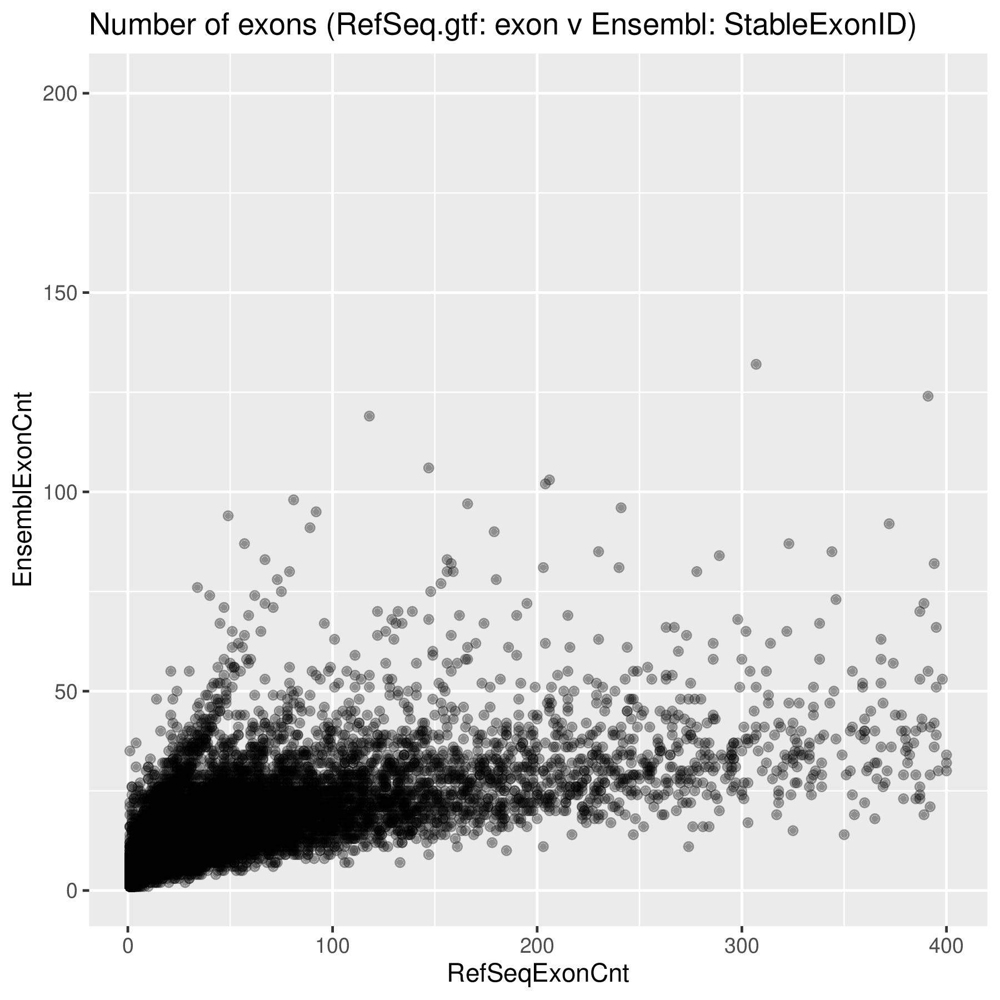
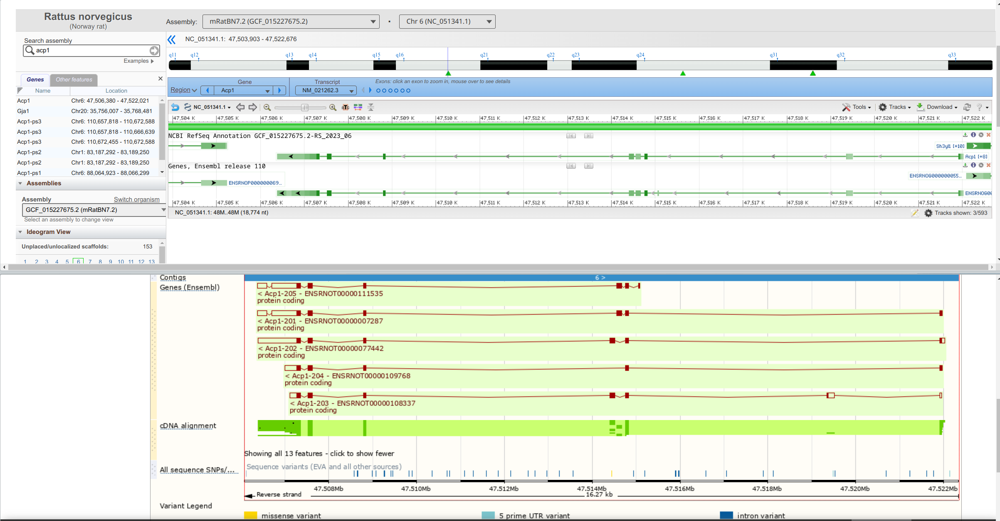

# Annotation difference between RefSeq and Ensembl

### Hao Chen

---

## Steps to find different Gene annotations between RefSeq and Ensembl

1. Download annotation from Ensembl BioMart, including the following fields
	1. Stable GeneID 
	2. Chr
	3. Strand
	4. Start
	5. End
	6. Gene Name
	7. NCBI GeneID
2. Extract lines annotated as "gene" from RefSeq GTF file using shell script, include the following fields
	1. Accession
	2. Chr
	3. Strand
	4. Start
	5. End
	6. Gene Name
	7. GeneID
3. Merge the two data sets based on GeneID
	1. extract genes with different annotations
        Same name, but different chr / strand / start / end 

---

## Questions
* What is the process of assigning GeneID to Ensembl genes
    * one GeneID matches to multiple ENSRNOG stable IDs (226)
    * one ENSRNOG stable IDs matches to multipe GeneIDs (493)
* What kind of correction will be carried over to the next annotation 
 
---

## Steps taken to count number of Exons annotated by RefSeq vs Ensembl

1. Download from BioMart ExonStableID, together with other fields (similar to above)
2. Extract from RefSeq GTF all the lines annotated as "exon"
3. Count the number of lines associated with GeneID in each annotation file
4. merge the counts based on GeneID

---

## Something is missing

---

## Same gene structure

Exon Count for Acp1, RefSeq=23, Ensembl=16

---

## Question

1. What is the proper way to find "exons"
2. What is needed to obtain consensus CDS (CCDS) for the rat?

https://www.ncbi.nlm.nih.gov/projects/CCDS/CcdsBrowse.cgi

---

