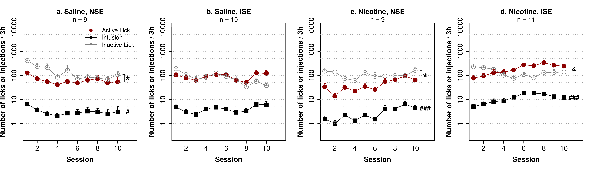
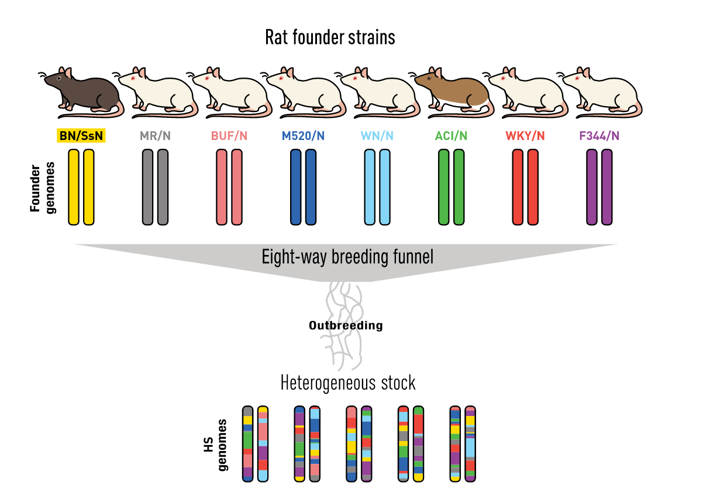
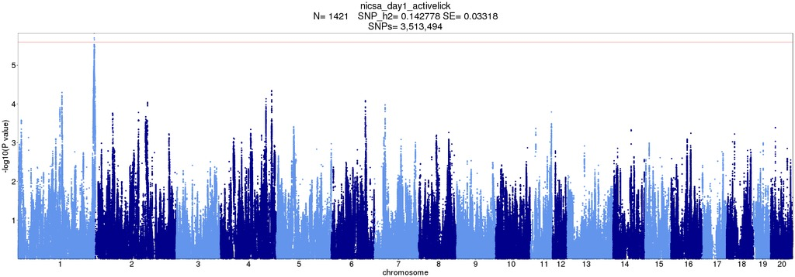
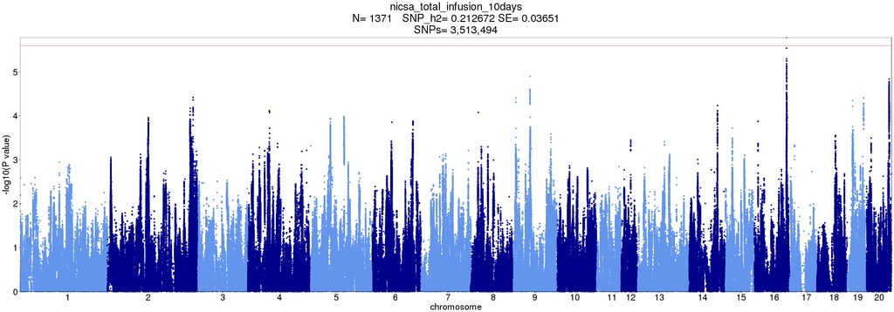

# Genetic Factors Influencing Socially-Acquired Voluntary Nicotine Intake in Rats

##	Hao Chen, Ph.D.

### Department of Pharmacology, Addiction Science and Toxicology
### University of Tennessee Health Science Center

---

## Nicotine is primarily aversive in non-smokers 
<table>
 <tr>
 <td width=50%>
 
 </td>
 <td width=90%>
 
 </td>
 </tr>
 <tr>
 <td>
 Coughing, nausea, dizziness, sickness, burning throat, headache.
 </td>
 <td>
 Nicotine induces drug high only in <em>significantly nicotine-deprived smokers</em>. 
 </td>
 </tr>
</table>

---

## Social influence is a key factor in smoking initiation 

 

 

---

## Social learning enables nicotine self-administration in rats

 No water or food deprivation or operant pretraining, can be used to model smoking initiation in adolescents. 

 
<cite> Chen, et al., Neuropsychopharmacology, 2011 </cite>

---

## Nicotine intake with an aversive cue 

<cite> Wang, et al., Psychopharmacology, 2016 </cite>

---

## Nicotine intake with appetitive vs aversive cues

<cite> Wang, et al., Psychopharmacology, 2016 </cite>

---

## Social learning is mediated by Carbon Disulfide (CS2) in rats 

 
 

---

## Both CS2 and flavor cue are necessary 
## for socially acquired nicotine IVSA 

<cite> Wang, et al., PLoS One, 2014 </cite>

---

## Socially acquired nicotine IVSA is hertiable

<cite> Han, et al., Sci Rep, 2017 </cite>

---

## Heterogeneous stock rats is suitable for genetic mapping studies

<cite> Garrett, et al, Trends Genetics 2020 </cite>

---

## Experimental design

| Age | Test |
|---|---|
|PND21|Wean, Body weight|
|PND31|Open field (60min)|
|PND32|Novel object (20min)|
|PND33|Social interaction in the same arena as openfield (20 min) |
|PND34|Elevated plus maze (6min)|
|PND38|Surgery|
|PND39 - 41| Recovery|
|PND42 - 51|Socially acquired nicotine IVSA|
|PND52| Progressive ratio test |
|PND53 - 56 |Extinction|
|PND57|Contextual cue induced reinstatement|
|PND59|Tissue Collection|

<table width=80%><tr><td>
We phenotyped 1600 adolescent heterogeneous stock rats on socially acquired nicotine IVSA using an flavor cue containing CS2. We also collected other behavioral traits before nicotine IVSA was started. Spleen from each rat was collected for genotyping once behavioral tests were completed. 
</td></tr></table>

---

## Nicotine self-administration

### Adolescent HS rats (711 F, 711 M)

---

### Genome-wide association 

## Number of licks on the active spout during the first session  

---

### Genome-wide association 

## Total nicotine infusions across 10 sessions 

---

## GWAS summary

|Behavior | Sample size | N traits | N QTL traits | N significant QTL| 
|---|---|---:|---:|---:|
| open field | 626 M, 620 F | 6 | 5 | 9 | 
| novel object interaction|623 M, 622 F| 6 | 4| 7|
| social interaction | 664 M, 664 F | 11| 10| 14| 
| elevated plus maze | 659 M, 658 F | 10| 7| 8| 
| socially acquired nicotine IVSA| 711 M, 711 F| 63| 24 | 30| 

One trait mapped to multiple loci; multiple traits mapped to the same loci

---

## Number of licks on the active spout in first session: chr1:278524299

The QLT region is 6.9 Mbp and has 39 known genes. Four genes has missense variants, two genes has cis-eQTL with r2 > 0.6.

---

## http://rats.pub

Rats.pub is designed to take a list of gene symbols and mine the PubMed and GWAS catalog for sentences pertain to addiction.

---

## Number of licks on the active spout

|ID |Session|Location| Genes (n) | Human Smoking GWAS Genes|
|---|:---:|---|---|---|
|12.20 | day 1 | chr1:278524299| 99 | Gpam&clubs;&diams;, [Vti1a](http://rats.pub/cytoscape/?rnd=tmpUpzbbT&genequery=VTI1A)&spades;, Nhlrc2&clubs;&diams;, Adrb1&clubs;, Tcf7l2, [Hspa12a](http://rats.pub/cytoscape/?rnd=tmpFrhLrJ&genequery=HEAT-SHOCK-PROTEIN-FAMILY-A-HSP70-MEMBER-12A_HSPA12A)&spades;, [Shtn1](http://rats.pub/cytoscape/?rnd=tmpJiHXFf&genequery=KIAA1598_SHOOTIN-1_SHOOTIN1_SHTN1)&spades;&diams;, [Nrap](http://rats.pub/cytoscape/?rnd=tmpaUzTZp&genequery=N-RAP_NEBULIN-RELATED-ANCHORING-PROTEIN_NRAP)&spades;, Casp7&diams; Gfra1|
|12.29 | day 2 | chr8:22496077| 29| [Carm1](http://rats.pub/cytoscape/?rnd=tmpaHVoNJ&genequery=carm1) |
|12.24 | day 4 | chr4:145377793| 20| [Emc3](http://rats.pub/cytoscape/?rnd=tmpQXgUzk&genequery=emc3) |
|12.12 | day 5 | chr16:83955432| 23| Tex29| 
|12.08 | day 7 | chr16:83489214| 23| Tex29| 
|12.02 | day 9 | chr10:32845925| 90| | 
|12.22 | day 10 | chr2:247766389|20| [Pkn2, Gtf2b](http://rats.pub/cytoscape/?rnd=tmpPoBkQf&genequery=Pkn2_Gtf2b) |
|12.16 | Reinstatment | chr1:161226950| 28|Usp35, Gab2, Nars2, Tenm4, [Alg8](http://rats.pub/cytoscape/?rnd=tmpJKLgcJ&genequery=Usp35_Gab2_Nars2_Tenm4_Alg8)&diams;&hearts; |

&spades;: smoking initiation genes
&clubs;: Alcohol consumption genes
&diams;: cis-eQTL
&hearts; missense variants

---

## Vti1a, Shtn1 and Nrap for smoking initiation 

Association studies of up to 1.2 million individuals yield new insights into the genetic etiology of tobacco and alcohol use
 
Mengzhen Liu, ... Scott Vrieze, Nature Genetics 2019

<b>Nrap</b> is not well detected in most RNAseq samples (FPKM: 0.1-0.2), involved in ribosome biogenesis (PMID11895476).  
<b>Vti1a</b> is expressed in all 5 brain regions, FPKM:30. Vti1a regulates synaptic vesicle and dense core vesicle secretion via protein sorting at the Golgi. PMID:30143604, 10908612. Vti1a does not have cis-eQTL
 
<b>Shtn1</b> expression is about FPKM:19. Shtn1 accumulates in the neurite tips and is a key regulator of axon outgrowth (PMID:20664640) Shtn1 has a cis-eQTL (but may not be in LD with top behavioral SNP).

---

## Number of infusions

|ID|Session|Location| Genes (n)| Human Smoking GWAS Genes|
|---|:---:|---|---|---|
|12.09 | day 5 | chr16:83500180| 23| Tex29 |
|12.13 | day 5 | chr17:17103044| 1| [ID4](http://rats.pub/cytoscape/?rnd=tmpdaIxug&genequery=ID4) |
|12.11 | day 7 | chr16:83500180| 23| Tex29|
|12.23 | day 7 | chr3:104723116| 8|[Hmgn4, Fmn1](http://rats.pub/cytoscape/?rnd=tmpSBamBX&genequery=Hmgn4_Fmn1) |
|12.15 | day 8 | chr19:26396258| 1| |
|12.03 | median of last 3 days | chr11:17834164|27| | 
|12.10 |total infusion | chr16:83500180| 23| [Tex29](http://rats.pub/cytoscape/?rnd=tmpesQlMB&genequery=tex29)|
|12.30 |slope of regression | chr8:4459578| 74| [Gria4](http://rats.pub/cytoscape/?rnd=tmpAjmeXn&genequery=Gria4_Pdgfd_Mmp12)&diams;, Pdgfd&diams;, Mmp12 |

&diams;: cis-eQTL

---

## Tex29

Exome Chip Meta-analysis Fine Maps Causal Variants and Elucidates the Genetic Architecture of Rare Coding Variants in Smoking and Alcohol Use 
 
David Brazel, ... Scott Vrieze, Biol Psychiatry 2019

<pre>

2. Pack Years (PckYr).
Defined in the same way as cigarettes per day but not necessarily binned, divided by 20 (cigarettes in 
a pack), and multiplied by number of years smoking. This yielded a measure of total overall exposure to
tobacco and is relevant to disease outcomes for which smoking is a risk factor, such as cancer and 
chronic obstructive pulmonary disease risk

</pre>

Note: 
Not much literature on this gene and expression level in the brain is almost 0. But GTex reports its detection. 
The annotation is intergenic! <a href=
"http://genome.ucsc.edu/cgi-bin/hgTracks?db=hg38&lastVirtModeType=default&lastVirtModeExtraState=&virtModeType=default&virtMode=0&nonVirtPosition=&position=chr13%3A110979763%2D112075449&hgsid=1028729693_QukEveNO4EoDL3hNviIqVJ3lcbnb"> What else is here?</a>

Could it be Arhgef7? Brain expression FPKM=30. Involed in spine morphogenesis. Loss of Arhgef7 results in extensive loss of axons PMID:30683798, PMID:29891904

---

## Summary

* Socially acquired nicotine self-administration is a model of adolescent smoking 
* Convergence between human and rat GWAS will likely yield novel mechanistic understanding of nicotine addiction 

---

## Acknowledgements

* Current lab members working on this project 

<table><tr>
<td width=20%>

Tengfei Wang

</td>
<td width=20%>

Angel Garcia Martinez

</td>
<td width=20%>

Shuangying Leng

</td>
<td width=20%>

Sarah Cartwright

</td>
<td width=20%>

Hakan Gunturkun

</td>

</tr>
</table>

* Past technicians 
	* *Xia Hong* | *Jie Shen* | *Wenyan Han* | *Pawandeep Kaur* | *Yanyan Lin* | *Xinyu Fan* | *Mallory Udell*|
* Abraham Palmer | Oksana Polesskaya | Apurva Chitre (University of California San Diego)
* Leah-Solberg Woods  (Wake Forest School of Medicine)
* Funding
	* NIH/NIDA P50DA037844 

