# Anti-HIV & Antiviral Agents

<hr>

[Hour 1](#/hour1) | [Hour 2](#/hour2)

Hao Chen, Ph.D

hchen@uthsc.edu Dept. Pharmacology, UTHSC

Please use the live online version at http://chen42.github.io/slides/antiviral.html

Or download the [**Printable version that can be saved as a pdf file**](http://chen42.github.io/slides/antiviral.html?print-pdf#/).

<b>Last update: Oct 28th, 2025</b>

---

## Formatting conventions

### used in this document

- Color and style guide:
  - Drug name: <span id="drug"> Enfuvirtide</span>
  - Links: [Clinicalkey](https://www.clinicalkey.com/#!/).
    - Shade change when mousing over indicates the image or text has a link
    - You need to login via your UTHSC netid when off campus to use e-textbooks.
    - [VPN](http://uthsc.edu/vpn/) provides a better experience.
- Open link in a new browser tab:

```
CTRL click
```

- Navigate the slides:

```
<- or ->
Space_bar
Page_down or Page_up
Home or End
```

---

<section id="hour1">

## Agents for the treatment of virus infections

### [Hour 1](#/hiv)

- <a href="#/hiv">Retrovirus (HIV)</a>
  - Fusion inhibitors <span id="drug">[Enfuvirtide](#/Enfuvirtide)</span>
  - Nucleoside reverse transcriptase inhibitors <span id="drug">[Lamivudine, Emtricitabine, Abacavir](#/nrti)</span>
  - Nucleotide inhibitors <span id="drug">[Tenofovir](#/Tenofovir)</span>
  - Non-nucleoside reverse transcriptase inhibitors <span id="drug">[Nevirapine](#/nnrti)</span>
  - Integrase strand transfer inhibitor <span id="drug">[Bictegravir, Dolutegravir, Cabotegravir ](#/Integrase) </span>
  - Protease inhibitors <span id="drug">[Darunavir, Ritonavir](#/pi) </span>

---

## Objectives

- Identify the <span id="yb">steps in the viral replication process</span> that provide targets for antiviral therapy.

- Understand the <span id="yb">current guidline for HIV/AIDS treatment. </span>

- Understand the <span id="yb">current Initial Combination Regimens</span> for drug naive patent.

- Describe the mechanism of action and significant pharmacological properties of the <span id="yb">six major classes</span> of anti-HIV agents

Note:
Try to come up a few questions for the yellow highlighted sections.

---

<section id="hiv">

## Human Immunodeficiency Viruses

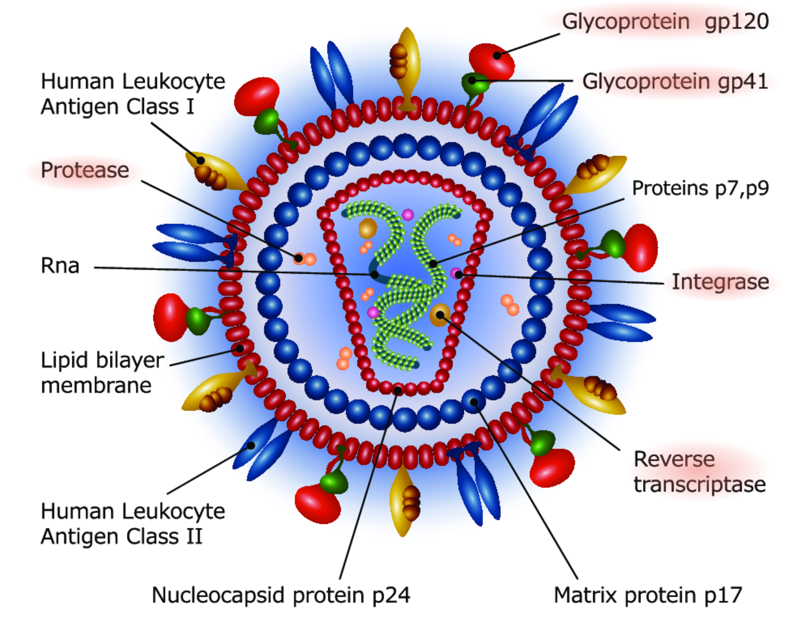

<div id="greyText">
single, positive strand RNA 
<br>
HIV-1 widely distributed, more pathogenic | HIV-2 restricted to Central and West africa
</div>

Note:
Viral envelope, capsid is cone shaped, see https://www.ncbi.nlm.nih.gov/pmc/articles/PMC4876022/, Fig 1. legend

Drug targets are highlighted using redish background

---

## [Stages of AIDS](https://www.clinicalkey.com/#!/content/book/3-s2.0-B9780323611794000107?scrollTo=%23t0015)

- Primary infection.
  - About 90% of patients develop a flu-like illness, which coincides with <a href="https://clinicalinfo.hiv.gov/en/glossary/seroconversion" target="_new"> seroconversion</a> (detectable HIV antibodies in blood), between 2 and 4 weeks post exposure. Symptoms include fever, night sweats, sore throat, lymphadenopathy, diarrhea. The illness is self-limiting.
- Asymptomatic phase.
  - Of variable duration, from 2 to 10 years. Patients are clinically well, but infectious.
- Acquired Immunodeficiency Syndrome (AIDS). Features:
  - Constitutional symptoms: fever, diarrhea, weight loss, skin rashes.
  - Immunodeficiency: increased susceptibility to opportunistic infections
  - Neurological disease: dementia, myelopathy, peripheral neuropathy
  - Rare malignancies: Kaposi sarcoma, oral hairy leukoplakia, or lymphoma

Note:

- seroconversion: antibody test is positive.
- should patents be treated if they are sympton free?

---

## AIDS Timeline

## <td> 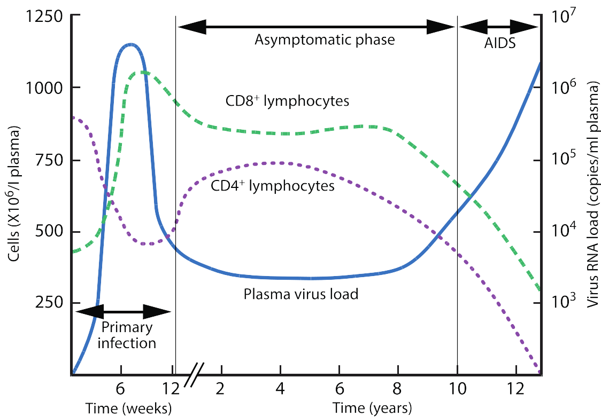 </td>

---

## Current [guidelines](https://clinicalinfo.hiv.gov/en/guidelines/adult-and-adolescent-arv/initiation-antiretroviral-therapy?view=full)

<b> The <span id="yb"> Initiation </span> of Antiretroviral Therapy </b>

- Antiretroviral therapy (ART) is recommended for all persons with HIV
  - reduce morbidity and mortality
  - prevent the transmission of HIV to others

- The Panel recommends initiating ART immediately after HIV diagnosis
  - increase the uptake of ART and linkage to care,
  - decrease the time to viral suppression for individual patients,
  - improve the rate of virologic suppression among persons with HIV.

- Educate patients
  - the benefits of ART
  - to deploy strategies to optimize care engagement
  - treatment adherence

[HAART - cART - ART](https://clinicalinfo.hiv.gov/en/glossary/antiretroviral-therapy-art)

---

## HIV Life Cycle

<table> <tr><td 50%>
<iframe width="560" height="315" src="https://www.youtube.com/embed/eS1GODinO8w" frameborder="0" allowfullscreen></iframe>
</td><td>

<iframe width="560" height="315" src="https://www.youtube.com/embed/GR9d9wrOl5E" frameborder="0" allowfullscreen></iframe>
</td></tr></table>

---

## [HIV Lifecycle](https://en.wikipedia.org/wiki/Discovery_and_development_of_HIV-protease_inhibitors#Life_cycle_of_HIV)

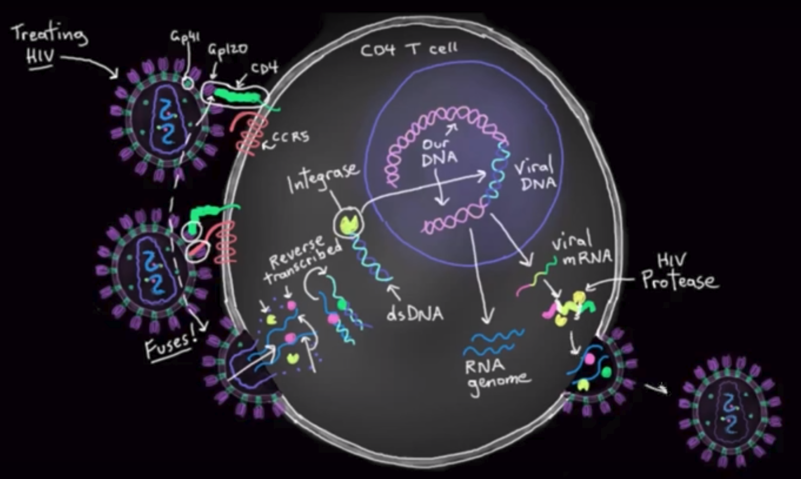

1. _Initiation_: attachment, penetration, uncoating
2. _Replication_: genome synthesis, RNA production, protein synthesis
3. _Release_: assembly, maturation, exit from cell

Note:
which stages of viral replication can be targeted for treatment?
The drug must kill the viral without kill the patient.

---

<section id="recommend">

### [Current Guideline](https://clinicalinfo.hiv.gov/en/guidelines/adult-and-adolescent-arv/what-start-initial-combination-regimens-antiretroviral-naive?view=brief)

<small>As of Sept 12, 2024, updated almost yearly in the last decade</small>

<hr>

##### Initial Regimens for most people with HIV who do not have a history of long-acting <span id="drug"> Cabotegravir </span> use as PrEP

- <span id="drug"> Bictegravir </span> plus <span id="drug"> tenofovir alafenamide </span> plus <span id="drug"> emtricitabine </span>
- <span id="drug"> Dolutegravir </span> plus (<span id="drug">tenofovir alafenamide</span> or<span id="drug"> tenofovir disoproxil fumarate</span>) plus (<span id="drug">emtricitabine </span> or <span id="drug"> lamivudine</span>)
- <span id="drug"> Dolutegravir </span> plus <span id="drug"> lamivudine </span>
  - except for
    - individuals with HIV RNA >500,000 copies/mL
    - HBV co-infection
    - ART is to be started before the results of HIV genotypic resistance testing for reverse transcriptase or HBV testing are available.

<hr>

##### For people who have a history of <span id="drug">CAB-LA</span> use as PrEP, integrase strand transfer inhibitor genotype resistance testing should be performed before starting ART. If ART is to be started before results of genotypic testing results, the following regimen is recommended:

- (<span id="drug">Darunavir/cobicistat</span> or <span id="drug">darunavir/Ritonavir</span>) plus (<span id="drug">tenofovir alafenamide</span> or<span id="drug"> tenofovir disoproxil fumarate</span>) plus (<span id="drug">emtricitabine </span> or <span id="drug"> lamivudine</span>)

<hr>

---

## General principle of ART

An antiretroviral regimen for a treatment-naive patient generally consists of

- two reverse transcriptase inhibitors (one nucleo<font color="red">s</font>ide and one nucleo<font color="red">t</font>ide) in combination with a third active drug from one of three drug classes:
  - an integrase strand transfer inhibitor
  - a protease inhibitor with a pharmacokinetic enhancer (also known as a booster)
  - a non-nucleoside reverse transcriptase inhibitor (less common)

Note:

- ART is cART, a combination of drugs targeting multiple viral replication pathways.
- Past recommendation includes protease inhibitors. Current recommendation all include INSTI
- Need to understand the exceptions as well.
- click on the title link to read the full recommendation, DTG = dolutegravir; 3TC = lamivudine; TAF = tenofovir alafenamide (no need to memorize these acronyms)
- <span id="drug"> Dolutegravir </span> plus <span id="drug"> abacavir </span> plus <span id="drug"> lamivudine </span> — only for individuals who are HLA-B\*5701 negative and without chronic hepatitis B virus (HBV) coinfection

---

<section id="Integrase">

## In<font color="darkred">tegra</font>se Inhibitor

Bic<font color="darkred">tegra</font>vir (Biktarvy) |
Dolu<font color="darkred">tegra</font>vir (Tivicay) |
Cabo<font color="darkred">tegra</font>vir (Vocabria) |
Ral<font color="darkred">tegra</font>vir (Isentress) |
Elvi<font color="darkred">tegra</font>vir

<table><tr><td width=30%>
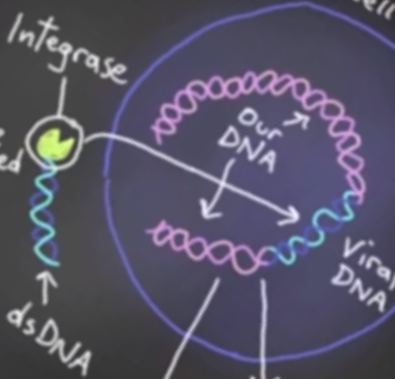
    <p>
    <a href="https://www.nature.com/articles/s41579-021-00586-9/figures/1"> Nat rev microbiology</a>

</td> <td>
<ul>
<li> <a href="#/sd">Mechanism of action</a>
<ul>
 <li> Binds to HIV-1 integrase and prevents strand transfer <br>
 <li> Prevents insertion of viral DNA into host genome <p>
 </ul>

<li> ADME
 <ul>
 <li> Oral drug (one tablet daily)
 <li> <span id="drug">Cabotegravir</span> is also available as long-acting injectable. 
 <li> Glucuronidation and by CYP3A<br>
 	<li> <span id=drug> <a href="https://www.clinicalkey.com/#!/content/drug_monograph/6-s2.0-5011">Bictegravir </a> </span> is a substrate of P-glycoprotein. 
	<li> Eliminated in both feces and urine <p>
</ul>

<li> Resistance
<ul>
<li> <span id="drug"> Dolutegravir </span> and <span id="drug"> Bictegravir </span> potently inhibit most mutants selected by <span id="drug">  Raltegravir </span> and <span id="drug"> Elvitegravir </span>. 
</ul>
</ul>
</td> </tr></table>

Note:

- <li> <span id="drug"> Elvitegravir </span> is mainly metabolized by CYP3A4 <br>
- this class of drug is named by its MoA
- this class of drug is safer because human host cells do not integrate new DNA into its genome, so human cells do not use integrase.

---

## Integrase Inhibitor

- Indication
  - <a href="#/recommend">Recommended</a> for naive patients as part of combination ART
  - <span id="drug"> Cabotegravir </span> injecable once a month for pre-exposure prophylaxis (PrEP) in HIV naive individuals ([news report on FDA approval](https://www.statnews.com/pharmalot/2021/01/21/fda-hiv-aids-injectable/))
- Adverse effects
  - Diarrhea, nausea, headache, and fever
  - <a href="https://pubmed.ncbi.nlm.nih.gov/34524918/">Hypersensitivity</a> to <span id="drug"> Dolutegravir </span> include serious rash, blisters/peeling of skin, hepatitis, facial edema, angioedema, difficulty breathing, or eosinophilia.
- Drug interactions
  - Metabolized by UDP glucuronosyltransferase (UGT)
  - <span id="drug"> Rifampin </span> (antibiotic) induces UGT, thus requires higher <span id="drug"> Raltegravir / Dolutegravir </span> dose

Note:
Among the five drugs, B and D are in the recommendations, C is a new drug (expensive injectable), R is relatively worese in drug resistance, E is a substrate of CYP3A4
<span id=drug>Bictegravir</span> displays a high resistance barrier and has an improved phenotypic resistance profile compared to <span id=drug>dolutegravir (DTG), raltegravir (RAL) and elvitegravir (EVG). Bictegravir </span> has a longer dissociation half-life from both wild-type and mutant HIV-1 integrase/DNA complexes compared with DTG, RAL, and EVG

---

## Commonly used integrase strand trasnfer inhibitors

| Characteristic        | Bictegravir (BIC)                                                                                                  | Dolutegravir (DTG)                                                                                                      |
| --------------------- | ------------------------------------------------------------------------------------------------------------------ | ----------------------------------------------------------------------------------------------------------------------- |
| **Half-life**         | ~17 hours                                                                                                          | ~14 hours                                                                                                               |
| **Metabolism**        | <a href="https://pubmed.ncbi.nlm.nih.gov/33626178/">CYP3A4 and UGT1A1 </a>                                         | <a href="https://pmc.ncbi.nlm.nih.gov/articles/PMC3719771/"> UGT1A1 and minor CYP3A4 involvement </a>                   |
| **Drug Interactions** | Interacts with CYP3A4/UGT1A1 substrates                                                                            |
| **Side Effects**      | Headache, nausea, diarrhea, <a href="https://pubmed.ncbi.nlm.nih.gov/28219610/">fewer neuropsychiatric effects</a> | Insomnia, headache, weight gain, <a href="https://pubmed.ncbi.nlm.nih.gov/39022519/">more neuropsychiatric effects </a> |
| **Resistance**        | High barrier to resistance, effective against resistant strains                                                    | High barrier to resistance, but specific mutations (R263K) may cause resistance                                         |
| **Clinical Use**      | Commonly used in first-line treatment (e.g., Biktarvy: BIC/TAF/FTC)                                                | Widely used in both first-line and second-line treatment (e.g., DTG/3TC, TDF/FTC/DTG)                                   |
| **Role in Pregnancy** | Insufficient safety data, not recommended                                                                          | Preferred in pregnancy, with caution in early pregnancy                                                                 |

<a href="#recommend">Current guideline</a>

---

<section id="nrti">

## Nucleoside Reverse Transcriptase Inhibitors (NRTIs)

- NRTIs
  - <span id="drug" style="background-color:#ff9">**Emtricitabine**</span> (Emtriva, FTC)
  - <span id="drug" style="background-color:#ff9">**Lamivudine**</span> (Epivir, 3TC)
  - <span id="drug" style="background-color:#ff9">**Abacavir**</span> (Ziagen, ABC)
  - many more available, some are no longer in use.

Note:

- <span id="drug">Zidovudine</span> (Retrovir, azidothymidine [ZVD], Apo-Zidovudine, Novo-AZT)

---

## Mechanism of action - NRTIs

<iframe width="560" height="315" src="https://www.youtube.com/embed/cC9kyoAo1ac?start=65&list=PLMO1589WRspykVPiy6SgKi3OPKbe9b0El" frameborder="0" allowfullscreen></iframe>

---

<section id="hostcell">

## Mechanisms of Action - NRTIs

- Analogs of naturally occurring [nucleosides](http://static.newworldencyclopedia.org/b/b9/Nucleotides.png)
- NRTIS are converted to their active triphosphate metabolites (i.e. a nucleotide) by <span id="yb">host cell </span>kinases
- Competitive inhibitor of viral reverse transcriptase
- Cause DNA chain termination
- Also inhibit host cell DNA polymerase

---

## Nucleoside Reverse Transcriptase Inhibitors (NRTIs)

- Indications
  - First line treatment of HIV infection as components of ART
  - Prevent acute infection of susceptible cells
  - Little effect on cells already infected by HIV
- Resistance
  - Drugs select for different mutations of the reverse transcriptase gene at the level of specific codons

Note:

- <span id="drug"> Zidovudine </span>
  - <span id="yb">passes placenta rapidly, reduce the rate of maternal-fetal HIV-1 transmission from <a href="https://www.nejm.org/doi/full/10.1056/nejm199411033311801">25% to 8%</a> </a>
  - also used in neonates to <a href="https://clinicalinfo.hiv.gov/en/guidelines/pediatric-arv/zidovudine">prevent perinatal transmission of HIV </a>.

---

## Pharmacological Properties of NRTIs

- Good oral absorption
- Crosses blood-brain barrier (NeuroAIDs)
- Metabolism plays limited role in clearance
- Excreted unchanged in urine
- <span id="drug"> Abacavir </span> metabolized by alcohol dehydrogenase

Note:
, except:

- <span id="drug"> Zidovudine </span> is metabolized to glucuronide

---

## Adverse Effects of NRTIs

- Common toxicities
  - [Mitochondrial toxicity](https://www.uptodate.com/contents/mitochondrial-toxicity-of-hiv-nucleoside-reverse-transcriptase-inhibitors/) is a major adverse effect of nucleoside analogues, which can lead to myopathy, peripheral neuropathy, and hepatic steatosis with lactic acidosis
  - [Lactic acidosis](https://hivinfo.nih.gov/understanding-hiv/fact-sheets/hiv-and-lactic-acidosis), [hepatic steatosis](https://www.ncbi.nlm.nih.gov/pmc/articles/PMC6550355/)
  - [Lipodystrophy](https://www.ncbi.nlm.nih.gov/PubMed/10509567): fat loss or buildup or both.
    - Including central obesity, dorsocervical fat enlargement [(buffalo hump)](https://www.clinicalkey.com/#!/content/medline/2-s2.0-9525364), peripheral wasting, accumulation of facial fat, [lipomas](http://www.mayoclinic.org/diseases-conditions/lipoma/basics/definition/con-20024646), breast enlargement, [gynecomastia](http://www.mayoclinic.org/diseases-conditions/gynecomastia/home/ovc-20257576)
  - Rash; Gastrointestinal distress
- Drug specific side effects
  - <span id="drug">Abacavir</span>: **hypersensitivity** reaction due to genetic predisposition (multi-organ autoimmune response, potentially life threatening)
    - <span id="yb"><a href="http://genome.ucsc.edu/cgi-bin/hgTracks?db=hg38&lastVirtModeType=default&lastVirtModeExtraState=&virtModeType=default&virtMode=0&nonVirtPosition=&position=chr6%3A31353875%2D31367067&hgsid=1488421281_ALYL8AoN0EV3FOejojvgWHHHoDaa">HLA-B\*5701</a> screening before starting therapy </span> [NEJM](http://www.nejm.org/doi/full/10.1056/NEJMoa0706135#t=article)
  - <span id="drug"> Emtricitabine </span>: psychiatric reactions, depression, dizziness, insomnia

Note:
These drugs inhibit DNA polymerase gamma, which replicates the mt genome.
https://journals.sagepub.com/doi/full/10.1177/0192623313503519

- older generations suppresses bone marrow (e.g. Zidovudine)
- muscle has a lot of mtDNA
- these drugs penetrate the BBB

---

<section id="FTC">

## Most commonly used NRTI

| Characteristic                  | Lamivudine (3TC)                                            | Emtricitabine (FTC)                                   |
| ------------------------------- | ----------------------------------------------------------- | ----------------------------------------------------- |
| **Bioavailability**             | ~85%                                                        | ~93%                                                  |
| **<a href="#/sd">MoA</a>**      | Nucleoside analog that inhibits reverse transcriptase       |                                                       |
| **Dosing Frequency**            | Once or twice daily                                         | Once daily                                            |
| **Excretion**                   | Renal (requires dose adjustment in renal impairment)        |                                                       |
| **Common Side Effects**         | Pancreatitis, peripheral neuropathy, lactic acidosis (rare) | Skin discoloration, headache, gastrointestinal issues |
| **Resistance (M184V mutation)** | Confers resistance                                          |
| **Clinical Use**                | Used in combination ART regimens, DTG/3TC regimen           | Used in combination ART regimens, BIC/TAF/FTC regimen |

[Current Recommendations](#/recommend)

---

<section id="Tenofovir">

## Nucleo<font color="darkorange">t</font>ide Reverse Transcriptase Inhibitor

[Teno<font color="darkorange">fo</font>vir disoproxil (Viread)](https://www.clinicalkey.com/#!/content/drug_monograph/6-s2.0-2477)

<span id="mem"> fo=pho=phosphate</mem>

- Properties
  - Tenofovir is an analogue of adenosine- <font color="darkorange">5'-monophosphate </font>, with low oral bioavailability.
  - <span id="drug"> Tenofovir disoproxil </span> is a prodrug. It is hydrolyzed to release tenofovir, increasing bioavailability.
  - Requires two intracellular phosphorylation steps for activation
  - Weak inhibitor of mammalian DNA and mt polymerase
  - Included in many <a href="#/recommend"> first-line ART regimens</a>
  - Also indicated for <span id="bg"> hepatitis B </span>
- <a href="#/sd">Mechanism of action</a>
  - Inhibits viral reverse transcriptase by chain termination
- Resistance
  - <span id='bg'>Does not tend to select the K65R mutation when used with <span id="drug">Emtricitabine</span></span> [PubMed](https://www.ncbi.nlm.nih.gov/pubmed/23027713)
  - Not affected by <span id="drug"> lamivudine-abacavir </span> associated mutations

---

## Tenofovir

- Administration
  - Once daily dosing
  - Increased bioavailability taken with a high fat meal
- Metabolism
  - Substrate of P-glycoprotein
  - Not substrate for P450
  - T&frac12; = 17 h
- Adverse effect
  - Most common: nausea, vomiting, diarrhea, flatulence, abdominal pain, dyspepsia, and anorexia with weight loss
  - CNS: depression, anxiety, headache
  - Hepatotoxicity: elevated hepatic enzymes
  - Exacerbates renal impairment

---

## Tenofovir and Emtricitabine

### (Truvada or Descovy)

- Better than Abacavir-Lamivudine for initial therapy
  - Extending time to [virologic failure](https://clinicalinfo.hiv.gov/en/glossary/virologic-failure) and first adverse event
  - [NEJM Dec 3 2009](https://www.ncbi.nlm.nih.gov/pubmed/?term=19952143)
- Effective as antiretroviral <span id='bg'>chemoprophylaxis </span>before exposure (PrEP)
  - [NEJM Dec 30 2010](https://www.ncbi.nlm.nih.gov/pubmed/21091279)
  - [NIH guideline, last updated July 3, 2025](https://hivinfo.nih.gov/understanding-hiv/fact-sheets/pre-exposure-prophylaxis-prep)
- <a href="#/recommend">Recommended for treatment naive patients</a>

---

<section id="pi">

## Protease Inhibitors, PIs

<div id="left">

- Rito<u>navir</u> (Norvir)
- Daru<u>navir</u> (Prezista)
- And many many more

</div>

<div id="right50">
<iframe width="560" height="400" src="https://www.youtube.com/embed/MK2r8J7SCSg?start=20&amp;stop=60" frameborder="0" allowfullscreen></iframe>
</div>

---

## Protease Inhibitors

- Mechanism of Action
  - Selective, competitive inhibitors of HIV proteases
  - Bind reversibly to protease active site
  - Prevent cleavage of polyprotein and block viral maturation
  - Early stages of HIV-1 replication cycle not affected
- Resistance
  - Each drug selects for different mutations in protease gene at level of specific codons
- Indications
  - Treatment of HIV as part of combination therapy
  - Effective in both acutely and chronic HIV-1 infected cells

---

## Protease inhibitors

- ADME
  - Oral absorption varies
  - Bind extensively to plasma proteins
  - Renal excretion is minimal
    - No adjustments needed for renal dysfunctions
  - Metabolized by cytochrome P-450 system
    - Concurrent use of potent P-450 inducer (e.g. <span id="drug"> rifampin </span> ) leads to decreased PI concentration
  - <span style="background-color:#ff9"> <span id="drug"> Ritonavir </span> is a potent inhibitors of CYP3A4</span>
    - used to increase (i.e. "boost") plasma concentration of other PIs except <span id="drug"> nelfinavir </span> (CYP2C19)
    - Toxic adverse effects related to drug accumulation due to PI-mediated inhibition of hepatic P450 system

note: rifampin is a bacterial RNA polymerase inhibitor

---

## Protease inhibitors

- Common Adverse Effects
  - Hyperlipidemia
  - May be more dramatic with <span id="drug"> ritonavir </span> due to interference in lipid metabolism.
  - [Lipodystrophy](https://www.ncbi.nlm.nih.gov/PubMed/9652687) Including central obesity, dorsocervical fat enlargement [(buffalo hump)](https://www.clinicalkey.com/#!/content/medline/2-s2.0-9525364), peripheral wasting, accumulation of facial fat, [lipomas](http://www.mayoclinic.org/diseases-conditions/lipoma/basics/definition/con-20024646), breast enlargement, [gynecomastia](http://www.mayoclinic.org/diseases-conditions/gynecomastia/home/ovc-20257576)
  - Insulin resistance and diabetes
  - Elevated liver function

---

<section id="Darunavir">

## Darunavir

- <a href="#/sd">Mechanism of action</a>
  - Inhibits the protease enzyme, preventing the cleavage of viral polyproteins into functional protein
- Achieves faster virologic response than other protease inhibitors(PI). [PubMed](https://www.ncbi.nlm.nih.gov/pubmed/21692667)
- Can be used to treat patients resist to other PIs.
  - <span id="drug"> darunavir </span> retains activity against 90% of HIV-1 isolates that are resistant to other protease inhibitors, exhibiting 10-fold decrease in susceptibility.
- Must be used in combination in an antiviral regimen.
  - Requires an enhancer (i.e. low does <span id="drug"> ritonavir </span> or [cobicistat](https://www.ncbi.nlm.nih.gov/pubmed/26566368) )
- No longer for treatment-naive patients (2017)
- <a href="#/recommend">Recommended </a> for treating patients with integrase PrEP history, before testing results is available (2024)

---

<section id="nnrti">

## Non Nucleoside Reverse Transcriptase Inhibitors (NNRTIs)

[Nevirapine (Viramune)](https://www.clinicalkey.com/#!/content/drug_monograph/6-s2.0-432)

- Indications
  - HIV-1 infections
    - Do not have significant activity against HIV-2
- <a href="#/sd">Mechanism of action</a>
  - Bind directly to a hydrophobic pocket of the reverse transcriptase
  - Induce conformational change in active site and block enzyme activity
  - Do not require intracellular phosphorylation for activity
- Resistance
  - Resistant HIV emerges rapidly when used as monotherapy.
  - Each drug selects for different mutations of the RT gene at the level of specific codons.

---

## NNRTIs

<iframe width="560" height="315" src="https://www.youtube.com/embed/RUUyd5bE9vQ?start=108&stop=150" frameborder="0" allowfullscreen></iframe>

---

<section id="Enfuvirtide">

## <font color="darkorange">Fu</font>sion inhibitors

[En<font color="darkorange">fu</font>vir<font color="darkorange">tide</font> (Fuzeon, T20)](https://www.clinicalkey.com/#!/content/drug_monograph/6-s2.0-2752)

<table><tr><td width=60% >

- Structure
  - a synthetic pep<font color="darkorange">tide</font> with <a href="https://www.drugbank.ca/drugs/DB00109">36 amino acids </a>

- <a href="#/sd">Mechanism of action</a>
  - Binds to <a href="https://en.wikipedia.org/wiki/Gp41#Function">gp41</a> of the viral envelope; prevents conformational change and impedes the fusion of the viral and host cell membranes.
- Indications
  - Reserved as salvage therapy for treatment resistant patients.
  - Prophylasis after occupational HIV exposure.
  - Not part of 1st line ART (injection site reaction, high cost).

</td><td>

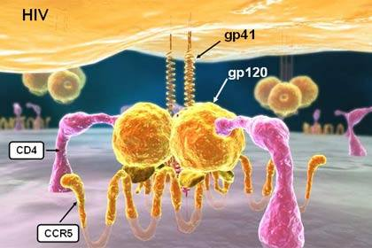[video](https://youtu.be/eS1GODinO8w?t=57s)

</td></tr></table>

---

## Enfuvirtide

- ADME
  - Administered subcutaneously (synthetic peptide)
  - Bound to plasma protein
  - Metabolized by proteolytic hydrolysis
  - T&frac12; = 4 h
- Adverse effect
  - Injection-site pain or infection
  - Hypersensitivity reaction (rash, fever, peripheral edema, acute respiratory distress, etc.)
- Resistance
  - gp41 mutations may develop when drug is given at suboptimal doses as monotherapy; No cross-resistance with other HIV Agents
  - Ineffective for HIV-2

---

## Antiretroviral Drug Selectivity

- NRTIs
  - Once phosphorylated by cellular kinases, NRTIs have greater affinity for viral reverse transcriptase than for cellular DNA polymerases.
- PIs
  - Greater affinity for HIV aspartyl protease than for human protease.
- Integrase Inhibitors
  - Much higher selectivity than other classes of anti-HIV drugs.

Note:

- NNRTIs
  - Do not undergo phosphorylation
  - Have greater affinity for viral reverse transcriptase than for cellular DNA polymerases

---

## [What not to use, updated Feb 2024](https://clinicalinfo.hiv.gov/sites/default/files/guidelines/archive/adult-adolescent-arv-2024-02-27.pdf)

- Drugs
  - <span id=drug>delavirdine, didanosine, indinavir, nelfinavir, stavudine</span>
- Monotheray
- Dual-NRTI regimens
- Tripple-NRTI regimens
- Specific drug combinations
  - <span id="drug"> Cobicistat </span> plus <span id="drug"> Ritonavir </span> (both are CYP3A4 inhibitors)
  - <span id="drug"> Emtricitabine </span> plus <span id="drug"> Lamivudine </span> (these two drugs are very similar)
  - <span id="drug"> Darunavir </span> without boosting (anti-viral effect unclear without boosting)

These are just a few examples. Detailed list available from the link above

---

<section id="hour2">

## Agents for the treatment of virus infections

### Hour 2

- <a href="#/hsv">Herpes Simplex Virus</a> and Varicella Zoster Virus
  - <span id="drug">[Acyclovir, Valacyclovir](#/Acyclovir), [Tenofovir](#/Tenofovir2), [Famciclovir, Penciclovir](#/Penciclovir)</span>
- <a href="#/cmv">Cytomegalovirus</a>
  - <span id="drug">[Ganciclovir, Valganciclovir](#/Ganciclovir), [Cidofovir](#/Cidofovir), [Foscarnet](#/Foscarnet)</span>
- <a href="#/hbv">Hepatitis Virus B </a> | <a href="#/hcv"> Hepatitis Virus C</a>
  - <span id="drug"> [Entecavir](#/Entecavir), [Interferon alpha](#/Interferon), [Sofosbuvir](#/sofosbuvir)
- <a href="#/flu">Influenza Virus </a>
  - Viral release inhibitors <span id="drug"> [Zanamivir, Oseltamivir](#/flurelease)</span>
  - Cap-dependent endonuclease inhibitor <span id="drug"> [Baloxavir](#/flucap)</span>
- <a href="#/covid">SARS-CoV-2 </a>
  - <span id="drug">[Nirmatrelvir](#/Nirmatrelvir)</span>
  - <span id="drug">[Remdesivir](#/remdesivir)</span>
  - <span id="drug">[Molnupiravir](#/molnupiravir)</span>

---

## Objectives

- For each virus, understand the <span id="yb"> major classes </span> of available antiviral agents.
- Describe the <span id="yb">mechanisms of action</span> for antiviral agents against HSV, CMV, HBV, HCV, SARS-CoV-2, and <span id="yb">mechanisms of viral resistance</span> to these agents.

---

## Agents to treat HSV, VZV and CMV

| Virus                                           | Disease                       |
| ----------------------------------------------- | ----------------------------- |
| Herpes simplex virus, human herpesvirus 1 and 2 | herpes genitalis              |
|                                                 | herpes labialis               |
|                                                 | herpetic keratoconjunctivitis |
|                                                 | herpetic encephalitis         |
| Varicella-zoster virus, human herpesvirus-3     | chickenpox (varicella)        |
|                                                 | shingles (herpes zostr)       |
| Cytomegalovirus, human herpesvirus-5            | retinitis &dagger;            |
|                                                 | esophagitis &dagger;          |
|                                                 |

&dagger; most often in immunocompromised (e.g. AIDS) patients.

---

<section id="hsv">

## Herpes Simplex virus

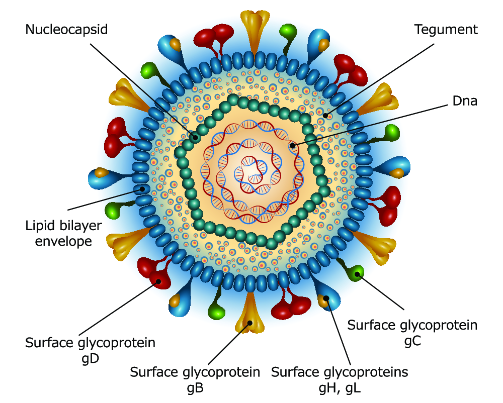

<div id="greyText">
Double stranded DNA virus
</div>

---

## Life cycle of HSV

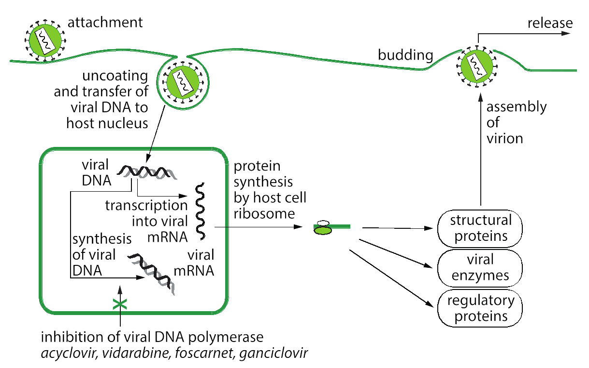

---

## Nucleoside Analogs and others

<table><tr><td width=40%>

<ul>
<li><span id="drug">Acyclovir</span> (Zovirax)
<li><span id="drug">Valacyclovir</span> (Valtrex)
<hr>
<li><span id="drug">Penciclovir</span> (Denavir)
<li><span id="drug">Famciclovir</span> (Famvir)
<hr>
<li><span id="drug">Ganciclovir</span> (Cytovene)
<li><span id="drug">Valganciclovir</span> (Valcyte)
<hr>
<hr>
<li><span id="drug">Cido<span id='bg'>fo</span>vir</span> (Vistide)
<li><span id="drug">Foscarnet</span> (Foscavir)
</ul>

</td><td>
<ul>
<li> Mechanism of action 
<ul><li> Inactivation of viral DNA polymerase through direct binding and competition for dNTPs.
<li> Inducing viral DNA chain termination 
</ul>
</td></tr></table>

---

## Mechanisms of Activation of [Nucleoside](http://static.newworldencyclopedia.org/b/b9/Nucleotides.png) Analogs

c.f. <a href=#/hostcell>NRTI for HIV</a>

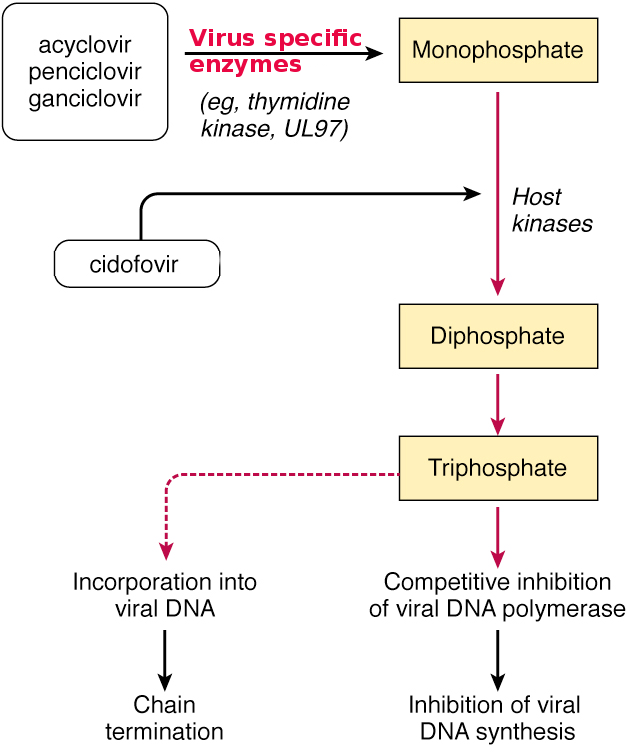

---

## Nucleoside analogues

- Drug selectivity:
  - The <span id="yb">virus in infected cells activates the drug to an active form</span>
    - Uninfected cells do not activate these drugs.
  - Preferential affinity of acyclovir triphosphate for viral DNA polymerase rather than cellular enzyme.
- Resistance:
  - Altered viral thymidine kinase substrate specificity
  - Absence of viral thymidine kinase
  - Mutated viral DNA polymerase

---

<section id="Acyclovir">

## Acyclovir

### [Valacyclovir](https://www.clinicalkey.com/#!/content/drug_monograph/6-s2.0-636) (L-valyl ester prodrug of acyclovir)

- <a href="#/sd">Mechanism of action</a>
  - <span id="drug"> acyclovir </span> is phosphorylated intracellularly by viral thymidine kinases (TK), then by cellular kinases to the triphosphate state, which terminates DNA replication when incorported into the viral DNA.
  - Only effective against actively replicating virus. Does not eliminate the viral genome.
- ADME
  - <span id="drug"> acyclovir </span> has low oral bioavailability (10-20%). (i.v. or topical)
  - <span id="drug"> Valacyclovir </span> is hydrolyzed to acyclovir in intestine or liver. Increase bioavailability (3.3 - 5 X)
- Indication:
  - HSV keratitis, herpes labialis, genital herpes, HSV encephalitis
  - VZV
  - CMV-positive bone marrow transplant recipients
- Adverse effects
  - Headache, nausea, diarrhea
  - Following high IV dose: Reversible renal dysfunction (crystalline nephropathy), Neurologic toxicity (tremors, delirium, seizures)

---

<section id="Penciclovir">

## Penciclovir

### [Famciclovir](https://www.clinicalkey.com/#!/content/drug_monograph/6-s2.0-240) (diacetyl ester prodrug)

- ADME
  - <span id="drug"> Penciclovir </span> is for topical application only.
  - <span id="drug"> Famciclovir </span> is oral, has longer intracellular half-life than <span id="drug"> Acyclovir </span>, but with lower affinity for the viral enzyme
  - Not a CYP450 substrate
- <a href="#/sd">Mechanism of action</a>
  - Selective substrate of HSV VZV thymidine kinase
  - Competitive inhibition of viral DNA polymerase
- Indications
  - Alternative to Acyclovir
  - Infection of HSV, VZV.
- Adverse effects
  - Well tolerated
  - Headaches, nausea, diarrhea

---

<section id="cmv">

## Cytomegalovirus

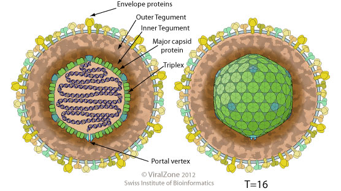

<div id="greyText">
Double stranded DNA virus
</div>

---

<section id="Ganciclovir">

## Ganciclovir

### [Valganciclovir](https://www.clinicalkey.com/#!/content/drug_monograph/6-s2.0-2584) (L-valyl ester prodrug)

- <a href="#/sd">Mechanism of Action </a>
  - Ganciclovir is phosphorylated to ganciclovir monophosphate by <a href="https://pubmed.ncbi.nlm.nih.gov/1319560/">a viral kinase</a>
  - Ganciclovir triphosphate inhibits viral DNA synthesis
    - competing for a position in the viral DNA
    - terminating DNA synthesis once incorporated
- ADME
  - <span id="drug"> Valganciclovir </span> is hydrolyzed by esterases following oral administration to <span id="drug"> ganciclovir </span>
- Indications
  - CMV retinitis in AIDS patients
    - Activity 100 x greater than <span id="drug"> Acyclovir </span>
  - CMV prophylaxis (e.g., liver transplant patients)
- Adverse effects
  - Bone marrow suppression, neutropenia, anemia,

---

<section id="Cidofovir">

## [Cido<font color="darkorange">fo</font>vir](https://www.clinicalkey.com/#!/content/drug_monograph/6-s2.0-125)

<span id="mem">fo=pho=phospho=nucleotide</span>

- <a href="#/sd">Mechanism of action</a>
  - Cytidine nucleo<font color="darkorange">t</font>ide analog
  - Not phosphorylated by viral thymidine kinase
  - Inhibits herpevirus DNA polymerase >> human DNA polymerase
  - Induce DNA fragmentation and Caspase-3 activity
- ADME
  - Once weekly i.v. <u>injection</u>
- Indications
  - <span id="drug"> Ganciclovir, foscarnet, </span> and <span id="drug"> acyclovir </span> -resistant CMV strains
  - <span id="drug"> cidofovir </span> i.v. delays progression of CMV retinitis in HIV+ patients
- <a href="#/adverse"> Adverse effects</a>
  - Nephrotoxicity, neutropeina, ocular hypotony, alopecia
  - Potential human carcinogen

---

<section id="Foscarnet">

## [<font color="darkorange">Fos</font>carnet (Foscavir)](https://www.clinicalkey.com/#!/content/drug_monograph/6-s2.0-267)

### Non-nucleoside Anti-HSV Agent

- <a href="#/sd">Mechanism of Action</a>
  - Inorganic pyro<font color="darkorange">phos</font>phate analog
  - Inhibits HSV DNA polymerase and HIV-1 reverse transcriptase
  - Binds to <a href="https://en.wikipedia.org/wiki/Pyrophosphate">pyrophosphate </a> binding site of polymerase
  - <a href="https://en.wikipedia.org/wiki/Nucleoside_triphosphate#/media/File:DNA_synthesis_EN.png">Inhibits cleavage of pyrophosphate from dNTP</a>
  - Blocks viral DNA synthesis
- Indications
  - Nucleoside-resistant HSV, VZV, and CMV infections
  - Effective in CMV retinitis, and acyclovir and ganciclovir-resistant strains of HSV and VZV
  - Has been used as [salvage therapy](https://www.ncbi.nlm.nih.gov/PubMed/16964823) for multi-drug resistant HIV
- Adverse effects
  - Renal failure or dysfunction
  - Seizure, depression, confusion, and anxiety (high CSF/plasma ratio)
- one marrow suppression
  - Nausea, vomiting, and fatigue

---

## Inhibitors of Viral DNA Replication

### Summary

- Indications
  - HSV, VZV, and CMV infections
- Mechanism of action
  - Inhibit viral DNA polymerases
- Resistance
  - Mutations of the viral polymerase gene
  - Deficiency of viral tyrosine kinase
- ADME
  - Bioavailability varies.
  - Renal excretion of unmetabolized parent drug through glomerular filtration -- Adjust dose
- Adverse effects
  - Generally well tolerated
  - Ganciclovir -- myelosuppressant and has teratogenic potential
  - Cidofovir and Foscarnet -- nephrotoxic

---

<section id="hbv">

## Hepatitis B Virus

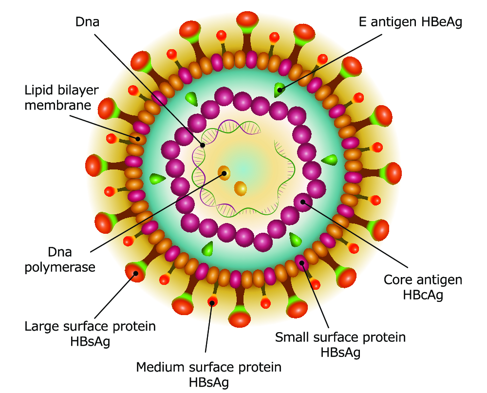

<div id="greyText">
Partially double-stranded DNA virus
</div>

---

## HBV life cycle

<iframe width="700" height="500" src="https://www.youtube.com/embed/sVpiXaEMs7I?start=342" frameborder="0" allowfullscreen></iframe>

partial DNA enters nucleus -> cccDNA -> RNA -> <span id='bg'>HBV polymerase</span> -> DNA (negative strand) -> DNA (positive strand)

<b>ccc</b>: covalently closed circular

HBV polymerase has reverse transcription activity

---

## Anti-Hepatitis Agents

### [treatment guideline](https://www.ncbi.nlm.nih.gov/pmc/articles/PMC5975958/)

- <span id="drug">Entecavir</span> (Baraclude)
- <span id="drug">Tenofovir</span> (Viread)
- <span id="drug">Interferon alfa-2a</span> (Roferon) and -2b (Intron A)
- <span id="drug">Peginterferon alfa-2a</span> (Pegasys) and alfa-2b (PegIntron)

---

<section id="Entecavir">

## [Entecavir](https://www.clinicalkey.com/#!/content/drug_monograph/6-s2.0-3427) (Baraclude)

- <a href="#/sd">Mechanism of action</a>
  - Nucleoside analog of <b>G</b>uanosine
  - Inhibits all 3 activities of HBV polymerase
    - Base priming ([GAA](https://youtu.be/sVpiXaEMs7I?t=6m12s)) [PubMed](https://www.ncbi.nlm.nih.gov/pmc/articles/PMC4399241/)
    - Reverse transcription of the negative DNA strand
    - DNA synthesis of positive strand
- Indication
  - Effective in treatment naive HBV patients
  - Equally active against <span id="drug"> lamivudine</span>-resistant HBV

---

## Entecavir

- ADME
  - Oral bioavailability is 37-80%
  - Not metabolized - not substrate for CYP450
  - Excreted by kidneys (both glomerular filtration and tubular secretion)
    - With CrCl < 50 ml/min, dose should be modified
- Adverse effects
  - Generally well tolerated
  - **HBV exacerbation upon discontinuation of treatment**
  - Elevation of hepatic enzymes may occur, lactic acidosis
  - Most commonly reported: headache, fatigue, dizziness

---

<section id="Tenofovir2">

## Tenofovir

- <a href="#/sd">Mechanism of action</a>
  - A nucleotide analog of adenosine monophosphate
  - First nucleotide reverse transcriptase inhibitor
  - Inhibits viral reverse transcriptase
- Resistance
  - Thymidine analogue mutations
  - Not effected by <span id="drug"> lamivudine-abacavir </span> associated mutationse
- Metabolism
  - Not substrate for P450
- Adverse effect:
  - Most commonly (>3%) in clinical trials: nausea, diarrhea, asthenia, headache, vomiting, flatulence, abdominal pain, and anorexia.
  - Increase in liver enzymes
  - watch for hepatitis flare if discontinued in patients with chronic HBV infection.

---

## Common to all the nucleoside analogs for HBV

<span id="drug">Entecavir </span> <span id="drug">Adefovir </span> <span id="drug">Tenofovir </span>

- Severe acute exacerbations of hepatitis B have been reported in patients who have stopped taking the drug.
- Lactic acidosis and severe hepatomegaly with steatosis is a more common adverse effect of the nucleoside analogs in the treatment of HIV, where they are always used in combination therapy, but these effects are much <u>less</u> likely to occur with monotherapy for treatment of hepatitis B.

Bonus question: Why is monotherapy used for HBV but combination therapy is needed for HIV?

---

## Immunoregulators

- [Interferons](https://www.clinicalkey.com/#!/content/book/3-s2.0-B9780323080583000137?scrollTo=%23hl0000129) (IFNs)
  - Potent cytokines that posses antiviral, antiproliferation (antineoplastic) and immunomodulating actions
    - Activates ribonucleases to degrade viral RNA
    - Inhibition of viral replication
    - Blocks protein synthesis &mdash; inhibits translation initiation complex
  - Three major classes of human IFNs

| Interferon | Type    | Receptor | Effect           |
| ---------- | ------- | -------- | ---------------- |
| &alpha;    | Type I  | IFNAR    | Antiviral        |
| &beta;     | Type I  | IFNAR    | Antiviral        |
| &gamma;    | Type II | IFNGR    | Immunomodulation |
|            |

---

## Interferons

- Type I has more potent antiviral effect.
  - It can be produced in almost any cell type when infected with a virus.
  - Triggered by molecular patterns characteristic of viral but not host components (e.g. viral 5'-triphosphorylated ssRNA and dsRNA) [PubMed](https://www.ncbi.nlm.nih.gov/pmc/articles/PMC1472073/)

- Interferon alpha is generally active against the following viruses <i> in vitro</i>: \* <span style="font-weight:normal; font-size: 0.6em"> adenovirus; coronavirus; encephalomyocarditis virus; hepatitis B virus; hepatitis C virus (HCV); hepatitis D virus; herpes simplex virus type 1; herpes simplex virus type 2; human immunodeficiency virus (HIV); papillomavirus; poliovirus; rhinovirus; vaccinia virus; varicella-zoster virus; vesicular stomatitis virus; human T-lymphotropic virus type I (HTLV-I).
  </span>

- Induces immune responses, alter the expression of genes, cell surface markers, phagocytic activity, cytotoxicity, etc.

- HBV is weak IFN inducer. <a href="https://www.ncbi.nlm.nih.gov/pmc/articles/PMC6058040/" target="_new">PubMed</a>

---

<section id="Interferon">

## [Interferon alpha-2a](https://www.clinicalkey.com/#!/content/drug_monograph/6-s2.0-2508)

## [peginterferon alpha-2a](https://www.clinicalkey.com/#!/content/drug_monograph/6-s2.0-2634)

- <a href="#/sd">Mechanism of Action</a>
  - Immune stimulation: Enhances natural killer cells, cytotoxic T lymphocytes, and antigen presentation.
  - Direct antiviral effects: Inhibits HBV replication, mRNA transcription, and viral particle assembly.
  - Antiproliferative effects: Limits hepatocyte proliferation, reducing the risk of liver fibrosis and cancer.
  - Immunomodulation: Shifts immune response towards Th1-mediated viral clearance.
  - cccDNA reduction: Indirectly reduces the activity of cccDNA, leading to lower viral persistence.

---

## [Interferon alpha-2a](https://www.clinicalkey.com/#!/content/drug_monograph/6-s2.0-2508)

- Indications
  - Chronic HBV, HPV and (Kaposi sarcoma, human herpesvirus-8)
  - HCV
    - <span id='bg'> <span id="drug"> peginterferon </span> in combination with <span id="drug"> Ribavirin </span></span>
- ADME
  - Administered i.m. or s.c.
  - High bioavailability
  - Proteolytic degradation in the Kidney is the main site of metabolism
  - Eliminated in the urine ( IFN-&alpha;2 T&frac12; = 5.1 h)
  - Peginterferon has much longer T&frac12; ( 80 h)
    - IFN-&alpha;2a is no longer produced in the USA

<small>
* PEG = bis-monomethoxy polyethylene glycol 
</small>
---

## Interferon alpha-2

- <a href="#/adverse">Adverse effects</a>
  - Flu-like syndrome: nausea, vomiting, anorexia
  - Bone marrow suppression (95% patients)
  - Psychiatric effects: depression, homicidal and suicidal ideation
  - Injection site reaction
  - Should not be administered during pregnancy
- Drug interactions
  - Increases in the level of many drugs:
    - <span id="drug"> theophylline </span> (for asthema) by 100%
    - <span id="drug"> zidovudine </span> by 93%.
  - Co-administration with <span id="drug"> zidovudine </span> can [increase severity of myelosuppression](#/zidovudine).
  - Additive myelosuppressive effects when combined with some anticancer agents or immunosuppressives.

---

## IFN-α vs. Entecavir

|                             | Interferon-Alpha                                                              | Entecavir                                                          |
| --------------------------- | ----------------------------------------------------------------------------- | ------------------------------------------------------------------ |
| **Treatment goal**          | Finite treatment with the potential for long-term remission (functional cure) | Long-term or indefinite viral suppression                          |
| **Treatment duration**      | Fixed, finite course, typically 48 weeks                                      | Long-term or indefinite                                            |
| **Mechanism of action**     | Immunomodulatory                                                              | Suppress viral replication                                         |
| **Route of administration** | Subcutaneous injection                                                        | Oral tablet                                                        |
| **Adverse effects**         | Frequent and severe (fever, fatigue, depression, bone marrow suppression)     | Rare, potent antiviral effect, and well-tolerated by most patients |

Functional cure: undetectable HBsAg and unquantifiable serum HBV DNA for at least 24 weeks after a finite course of therapy <a href="https://pmc.ncbi.nlm.nih.gov/articles/PMC11249939/" target="_new">PubMed</a>

---

<section id="hcv">

## Hepatitis C


<div id="greyText">
a single-stranded, positive-sense RNA 
</div>

---

## HCV life cycle

<a href="https://www.nature.com/articles/nm.3248/figures/3">


</a>

Viral RNA replication occurs near the ER, requirs nonstructural protein NS5B/NS5A, <a href="https://en.wikipedia.org/wiki/RNA-dependent_RNA_polymerase">RNA-dependent RNA-polymerases</a>.

Note:

https://www.wjgnet.com/1007-9327/full/v27/i28/4555.htm

---

## <a href="https://www.ncbi.nlm.nih.gov/books/NBK531720/"> WHO Hepatitis C treatment guideline</a>

- 9 HCV genotypes, type 1 is most common in the US.

- <span id="drug">sofosbuvir/ledipasvir </span> for genotypes 1, 4, 5 and 6 (1st line treatment)
- <span id="drug"> sofosbuvir/ribavirin </span> for genotype 2 and 3

- Antiviral medicines can <b>cure</b> more than 95% of persons with hepatitis C infection

---

<section id="sofosbuvir">

## Sofosbuvir

- <a href="#/sd">Mechanims of Action </a>
  - nucleotide analogue inhibitor
  - a direct-acting antiviral agent
  - NS5B is an <a href="https://en.wikipedia.org/wiki/RNA-dependent_RNA_polymerase"> RNA-dependent RNA polymerase</a>
  - incorporated into HCV RNA by the NS5B polymerase and acts as a chain terminator
  - interferes with the HCV lifecycle, restraining viral replication.

- ADME
  - oral
  - mainly eliminated in urine
- Toxicity
  - very mild (headache and fatigue)

---

<section id="Ledipasivir">

## Ledipasvir

- <a href="#/sd">Mechanism of Action </a>
  - a direct-acting antiviral agent
  - NS5A is an RNA-dependent RNA polymerase
  - Ledipasivir prevent hyperphosphorylation of NS5A polymerase
  - restraining viral replication.
  - there has been little drug resistance

- ADME
  - oral
  - mainly eliminated in feces
- Toxicity
  - very mild (headache and fatigue)

---

<section id="Ribavirin">

## [Ribavirin](https://www.clinicalkey.com/#!/content/drug_monograph/6-s2.0-542)

(Copegus | Moderiba | Rebetol | RibaPak | RibaTab | Ribasphere | Virazole)

- <a href="#/sd">Mechanism of Action</a>
  - Nucleoside analog of guanosine
  - Increase mutation of viral <a href="#/molnupiravir"> <span id="yb">RNA/DNA</span></a> and leads to "**error catastrophe**"
  - Interference with synthesis of GTP / Increase production of cytokine
- Indication
  - Treat <u>Hepatitis C</u> in combination with <span id="drug"> Sofosbuvir </span>
  - <u>Respiratory syncytial virus</u>: aerosolized form
  - <u>Hantaan virus</u>: intravenous
- Adverse effects
  - Bone morrow suppression
  - Psychiatric effects: depression, insomnia, anxiety.
  - Teratogenic in animals

---

<section id="flu">

## Influenza virus

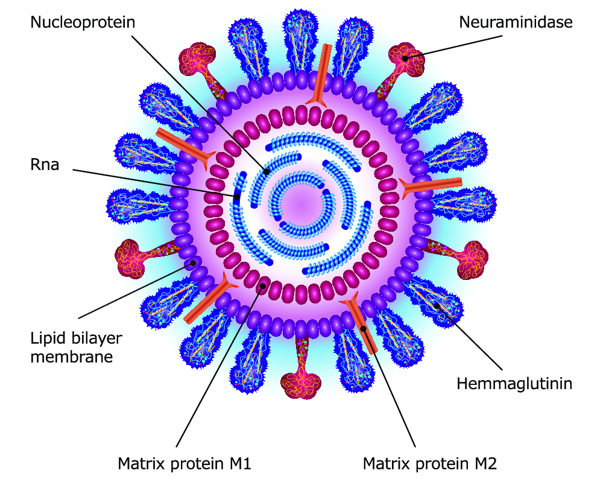

<div id="greyText"> Single negative strand, segmented (8) RNA virus || Type A H18N10, Type B or C </div>

---

## Life cycle

<iframe width="560" height="315" src="https://www.youtube.com/embed/2RMNwLdtRhw?si=MtlsQERrl-O3eTE8" title="YouTube video player" frameborder="0" allow="accelerometer; autoplay; clipboard-write; encrypted-media; gyroscope; picture-in-picture; web-share" referrerpolicy="strict-origin-when-cross-origin" allowfullscreen></iframe>

[Life cycle review](https://www.ncbi.nlm.nih.gov/pmc/articles/PMC2794490/)

---

## Mechanism of Action of Antiinfluenza Agents

<table><tr><td>
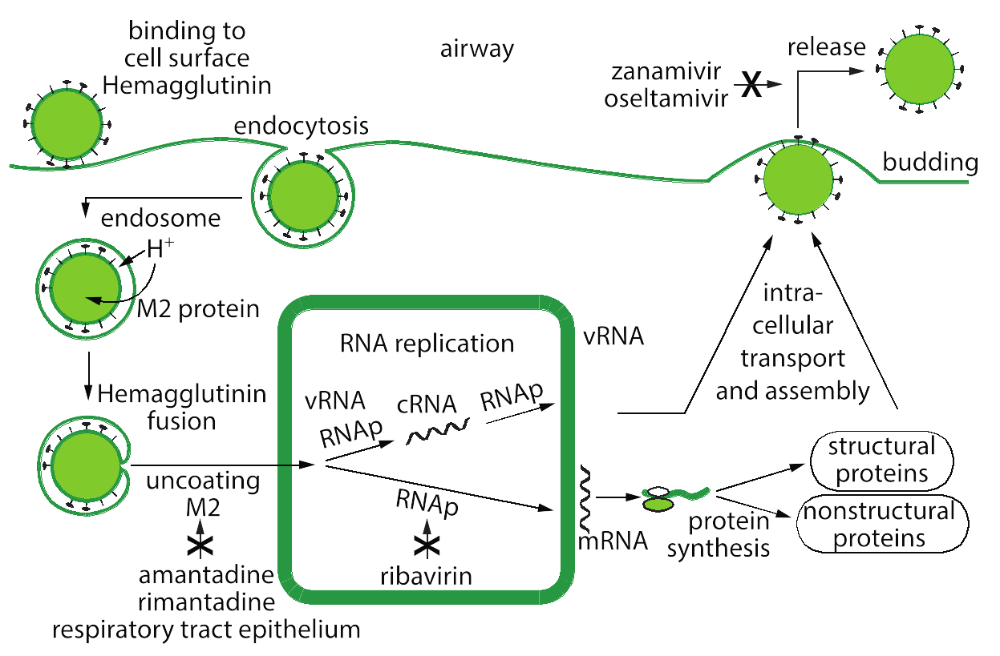
</td><td width=50%>

- Life cycle
  - virus enter the cell via H spikes. In the endosome, low pH in the endosome trigger the <span id='bg'> fusion of membranes</span>.
  - viral ribonucleoprotein and viral RNA enters the cell
  - viral RNA is replicated by RNA-dependent RNA polymerase.
  - viral RNA acquires the 5'cap of of cellular RNA (important for making protein) and exported into the cytoplasm.
  - viral protein is made and virus is packaged on cell surface
  - the N spikes cleave the H spikes and releases the viron.
  </td>
  </tr></table>

---

## Antiinfluenza Agents

- Virus release inhibitors
  - <span id="drug"> Zanamivir</span> (Relenza)
  - <span id="drug"> Oseltamivir</span> (Tamiflu)

- Cap-dependent endonuclease inhibitor
  - <span id="drug"> Baloxavir </span> (Xofluza)

- Uncoating inhibitors
  - most current strains of flu virus are resistant to these drugs

---

<section id="flurelease">

## [Zanamivir](https://www.clinicalkey.com/#!/content/drug_monograph/6-s2.0-2259) and [oseltamivir](https://www.clinicalkey.com/#!/content/drug_monograph/6-s2.0-2450)

### Inhibitors of Virus Release

Sialic acid analog inhibitors of influenza A and B neuraminidase

- <a href="#/sd">Mechanism of action</a>
  - Competitive <a href="https://youtu.be/caMne7nQUL8?t=94"> inhibitors of influenza neuraminidase</a>.
- Indications
  - Effective against influenza A and B viruses.
  - Patients who have been symptomatic for no more than 48 hours.
- Resistance
  - HA or neuraminidase mutations
- Adverse effects:
  - Zanamivir is orally inhaled and causes nasal and throat discomfort.
  - Oseltamivir is taken orally and can cause nausea and vomiting.

---

<section id="flucap">

## Baloxavir marboxil (Xofluza)

- Approved by the [FDA on October 24, 2018](https://www.fda.gov/NewsEvents/Newsroom/PressAnnouncements/ucm624226.htm)
  - The first oral, single-dose antiviral
  - The first medicine with a novel mechanism of action to treat the flu in nearly 20 years
- ADME
  - Effective against influenza A and B viruses
- Initiate treatment within 48 h of symptom onset
  - A single oral dose
  - Only for those aged 12 or more initialy, subsequent clinical trails found to be safe for children as well.

---

<section id="Baloxavir">

## <span id="drug"> Baloxavir marboxil (Xofluza) </span>

<div id="left">

<a href="https://www.virology.ws/2018/10/25/a-new-drug-for-influenza/">

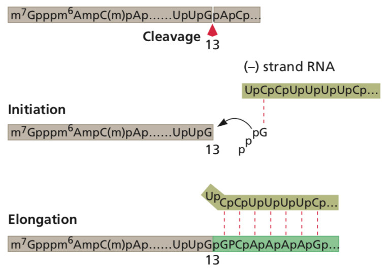

</a>

brown: 5'cap. red arrow: endonuclease. light green: new copy of viral RNA.

</div>

<div id="right">

- <a href="#/sd"> Mechanism of Action </a>
  - Cellular mRNA has a [5' methylated cap and a polyA tail](https://www.neb.com/-/media/nebus/page-images/tools-and-resources/feature-articles/fa_mindcaps_fig1_initiationloop.jpg)
  - Viral mRNA does not have a cap.
  - Cap-dependent endonuclease binds to the 5' methylated caps of cellular mRNAs
    and cleaves the cellular mRNAs' 10 to 15 nucleotides 3' to the cap structure. This cellular capped RNA fragment is used by the viral polymerase to prime the synthesis of viral mRNA.
  - Baloxavir is an inhibitor of this cap-dependent endonuclease
- Adverse effects:
  - headache, diarrhea, bronchitis

</div>

---

<section id="covid">

## SARS-CoV-2 virus

<a href="https://www.nature.com/articles/d41586-021-02039-y">
</a>

<div id="greyText">
Single stranded RNA virus
</div>

The RNA genome is [30 kilo bases](https://genome.ucsc.edu/cgi-bin/hgTracks?db=wuhCor1&lastVirtModeType=default&lastVirtModeExtraState=&virtModeType=default&virtMode=0&nonVirtPosition=&position=NC_045512v2%3A1%2D29903&hgsid=1203179451_8263g5HiGW1R07rmnBegtA4EAf7w)

---

## Life cycle of SARS-CoV-2

<div id="left">

<a href="https://www.nature.com/articles/s41579-020-00468-6">
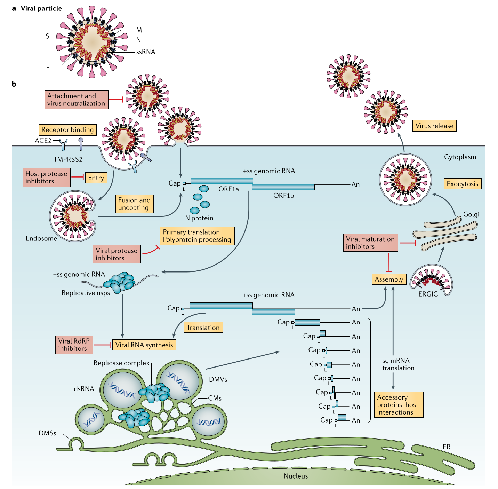
</a>
    <br>
Color legend: Orange boxes -> life cycle | 
	Red boxes -> therapeutic options under investigation

</div>

<div id="right">

- Infecting bronchial epithelial cells, pneumocytes and upper respiratory tract cells
- Spike protein <a href="https://pubs.acs.org/cms/10.1021/acs.jpcb.1c02048/asset/images/medium/jp1c02048_0002.gif">binds</a> to <a href="https://alphafold.ebi.ac.uk/entry/Q9BYF1">ACE2</a>
- Viral replication is particularly active early in COVID-19
- Antiviral therapy have greatest impact before disease progresses to the hyperinflammatory stage

Acronyms: <b>An</b>: 3′ polyA sequence; <b>ACE2</b>: angiotensin-converting enzyme 2; <b>RdRP</b>: RNA-dependent RNA polymerase; <b>TMPRSS2</b>: a cell surface serine protease

<hr>

<a href="https://media.nature.com/lw800/magazine-assets/d41586-021-02039-y/d41586-021-02039-y_19394008.png">
Another version of SARS-CoV-2 life cycle</a>

</div>

---

## [Recommendations on Antiviral Drugs for SARS-CoV-2](https://www.cdc.gov/covid/hcp/clinical-care/outpatient-treatment.html)

(last update: Jun 11, 2025)

#### Nonhospitalized Adults With Mild to Moderate COVID-19 Who Do Not Require Supplemental Oxygen

- All patients
  - symptom management
  - against the use of systemic corticosteroids
- For patients who are at high risk of progression to severe COVID-19 (Preferred therapies, listred in order of preference)
  - <span id="drug">Ritonavir</span>-boosted <span id="drug">nirmatrelvir</span> (Paxlovid)
  - <span id="drug">Remdesivir (Veklury)</span>
  - <span id="drug">Molnupiravir (Lagevrio)</span>

---

<section id="Nirmatrelvir">

## Nirmatrelvir

- <a href="#/sd">Mechanism of Action</a>
  - protease inhibitor
  - inhibits the maturation of nonstructural proteins (including proteases)
- ADME
  - orally bioavailable (thus can be given to patients without hospitalization).
  - substrate of CYP3A4.
  - undergoes minimal metablolism when administered with <span id="drug">Ritonavir</span>
  - <span id="drug">Paxlovid </span> = <span id="drug">Nirmatrelvir + Ritonavir </span>
- Indications
  - Used for the treatment of mild-to-moderate COVID-19 in patients at high risk of severe illness
- Timing of administration
  - Most effective when administered within 5 days of symptom onset.

---

<section id="Remdesivir">

### Remdesivir (Veklury)

<table> <tr><td width=35%>
<a href="https://www.ncbi.nlm.nih.gov/pmc/articles/PMC7566896/">
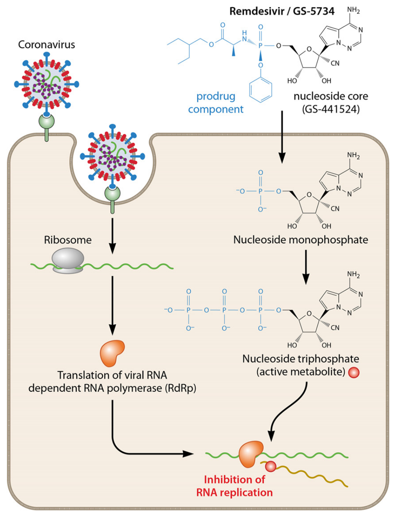
</a>

[FDA approves Remdesivir on Oct 22, 2020](https://www.fda.gov/news-events/press-announcements/fda-approves-first-treatment-covid-19)

</td><td width=65%>

- <a href="#/sd">Mechanism of Action</a>
  - Nucleoside analog of Adenosine
  - It is a prodrug, metabolized by carboxylesterase I to its triphosphate active form
  - Coronaviruses replication requires _RNA-dependent RNA polymerase_. These enzymes can incorporate remdesivir into new RNA strands. Shortly after adding remdesivir, the enzyme stops being able to function. This halts viral genome replication.
- ADME ([review article](https://www.ncbi.nlm.nih.gov/pmc/articles/PMC8308800/))
  - Administered as a slow i.v. infusion of a loading dose followed by a maintenance dose for 5 or 10 days
  - Eliminated in urine
- Adverse effects
  - GI symptoms, elevated transaminase levels (liver function), hypersensitivity
- Indication
  - Treatment of COVID-19 in hospitalized adult and pediatric patients

</td></tr></table>

---

<section id="Molnupiravir">

## Molnupiravir

- Received FDA emergency use auth on Dec 23, 2021
- <a href="#/sd">Mechanism of Action</a>
  - nucleoside analoge
  - [promotes SARS-CoV-2 mutagenesis via the <a href="#/Ribavirin"><span id="yb">RNA</a></a> template](https://www.ncbi.nlm.nih.gov/pmc/articles/PMC8110631/)
    - [can mimic either cytosine or uridine after incorporated into viral RNA template, causing mutations of the viral RNA](https://www.nature.com/articles/d41586-021-02783-1)
- [Clinical trial](https://www.science.org/doi/10.1126/scitranslmed.abl7430)
  - 202 outpatients with confirmed SARS-CoV-2 infection
  - Sympton onset within 7 days
  - Placebo, molnupiravir 200 mg, 400 mg, 800 mg
  - At Day 5, virus was not isolated from any participants receiving 400 or 800 mg (11.1% virus positive in placebo)
  - Adverse effect
    - headache, insomnia, increase alanine aminotransferase
- Indication
  - when other treatments are not suitable

---

## Antiviral Agent Summary

- Understand the genome of the virus
  - RNA
  - double stranded DNA
  - partially double stranded DNA
- Understand the life cycle of the virus
  - entry
  - replication
  - protein synthesis
  - release
- Understand the MoA of treatments
- Understand the how mutation of virus can evade the action of treatment agents.

---

<section id="sd">

## Summary of MoA

| Virus               | HIV                                                                | Herpes                                                                       | Cytomegalo.                             | Hep. B                               | Hep. C                      | Flu                                    | COVID                                                      |
| ------------------- | ------------------------------------------------------------------ | ---------------------------------------------------------------------------- | --------------------------------------- | ------------------------------------ | --------------------------- | -------------------------------------- | ---------------------------------------------------------- |
| **Genome**          | ssRNA                                                              | dsDNA                                                                        | dsDNA                                   | partial dsDNA                        | ssRNA                       | ssRNA (x8)                             | ssRNA                                                      |
| **Entry**           | <a href="#/Enfuvirtide">Enfuvirtide </a>                           |                                                                              |                                         |                                      |                             |                                        |                                                            |
| **Nucleoside**      | <a href="#/FTC">Emtricitabine, Lamivudine</a>                      | <a href="#/Acyclovir">Acyclovir</a>, <a href="#/Penciclovir">Penciclovir</a> | <a href="#/Ganciclovir">Ganciclovir</a> | <a href="#/Entecavir">Entecavir</a>  | [Ribavirin](#/Ribavirin)    |                                        | [Remdesivir](#/Remdesivir), [Molnupiravir](#/Molnupiravir) |
| **Nucleotide**      | <a href="#/Tenofovir"> Tenofovir </a>                              |                                                                              | [Cidofovir](#/Cidofovir)                | <a href="#/Tenofovir2">Tenofovir</a> | [Sofosbuvir](#/sofosbuvir)  |                                        |                                                            |
| **Non-Nucleoside**  | <a href="#/nnrti">Nevirapine</a>                                   |                                                                              | [Foscarnet](#/Foscarnet)                |                                      |                             |                                        |                                                            |
| **Integrase**       | <a href="#/Integrase">Bictegravir, Dolutegravir, Cabotegravir </a> |                                                                              |                                         |                                      |                             |                                        |                                                            |
| **Protease**        | [Darunavir, Ritonavir](#/Darunavir)                                |                                                                              |                                         |                                      |                             |                                        | [Nirmatrelvir](#/Nirmatrelvir)                             |
| **Immunoregulator** |                                                                    |                                                                              |                                         | [Interferons](#/Interferon)          |                             |                                        |                                                            |
| **NS5A**            |                                                                    |                                                                              |                                         |                                      | [Ledipasvir](#/Ledipasivir) |                                        |                                                            |
| **Cap-dependent**   |                                                                    |                                                                              |                                         |                                      |                             | [Baloxavir](#/Baloxavir)               |                                                            |
| **Neuraminidase**   |                                                                    |                                                                              |                                         |                                      |                             | [Zanamivir, Oseltamivir](#/flurelease) |                                                            |

---

## NotebookLM study guide

### <a href="https://notebooklm.google.com/notebook/a45a17ff-93b3-4e83-bcfc-a305d432c7ea?authuser=1">NotebookLM for this lecture</a>

- Lecture slides
- Treatment guidelines

---

## Additional Reading

- [Gene editing for HIV enters into human testing](https://www.fiercebiotech.com/biotech/excision-hiv-crispr-gene-editing-therapy-cleared-for-human-studies-by-fda)
- [Combination anti-HIV antibodies provide sustained virological suppression for up to 43 weeks](https://www.nature.com/articles/s41586-022-04797-9)
- [Is drug enough for Hepatitis-C?](https://www.nytimes.com/2024/04/28/health/hepatitis-c.html)
