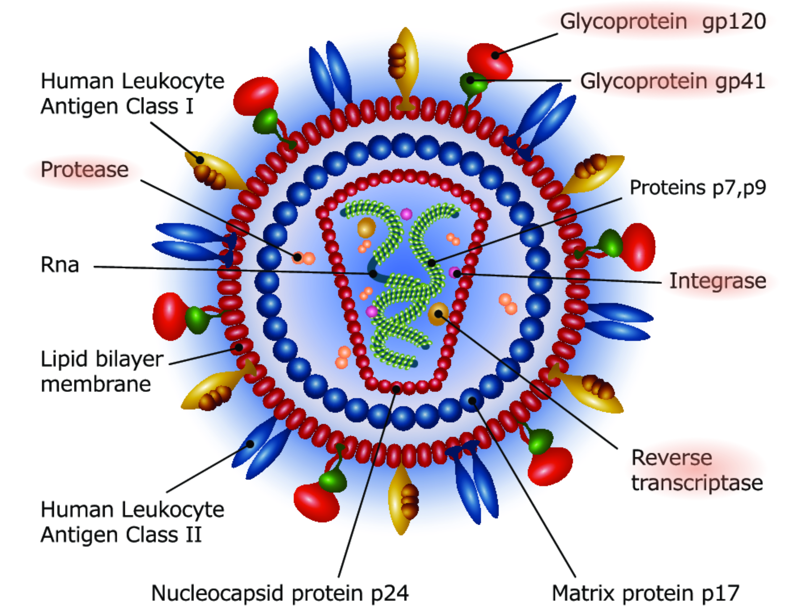
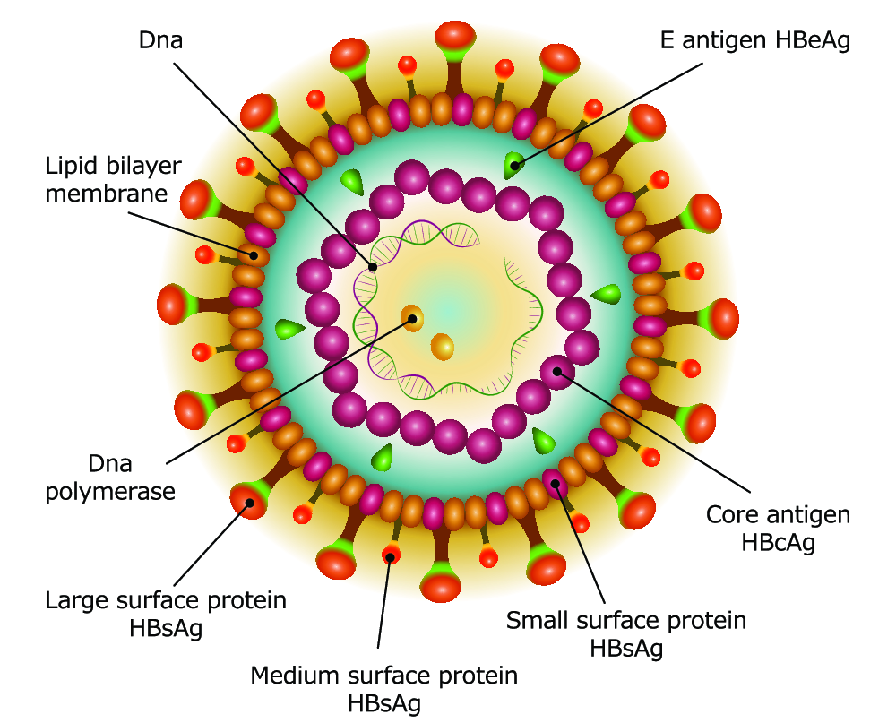
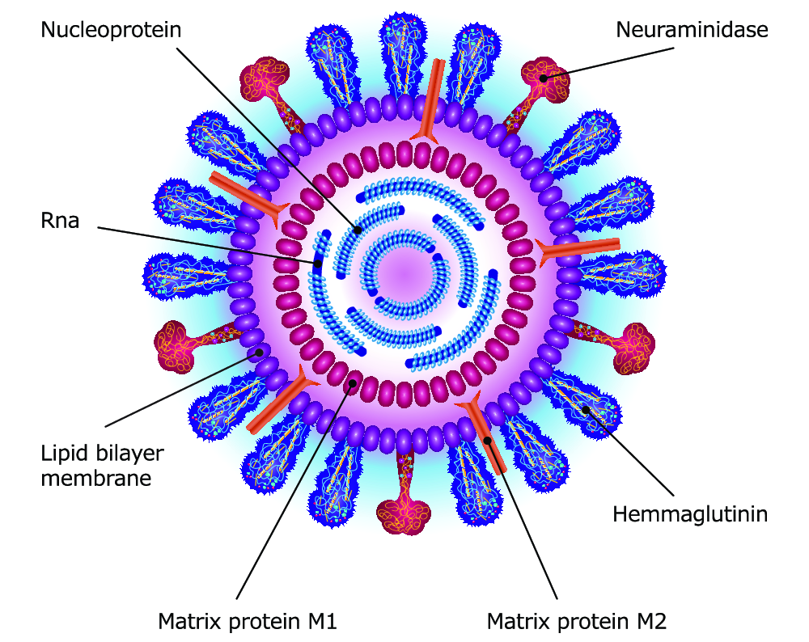
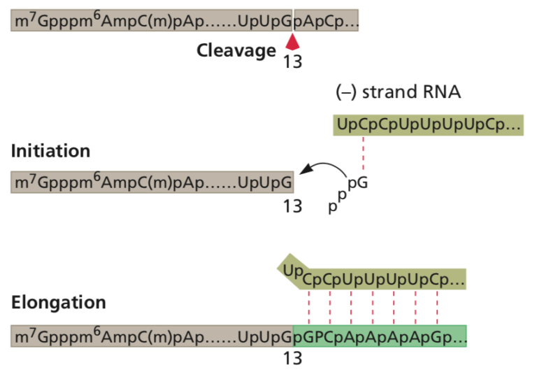
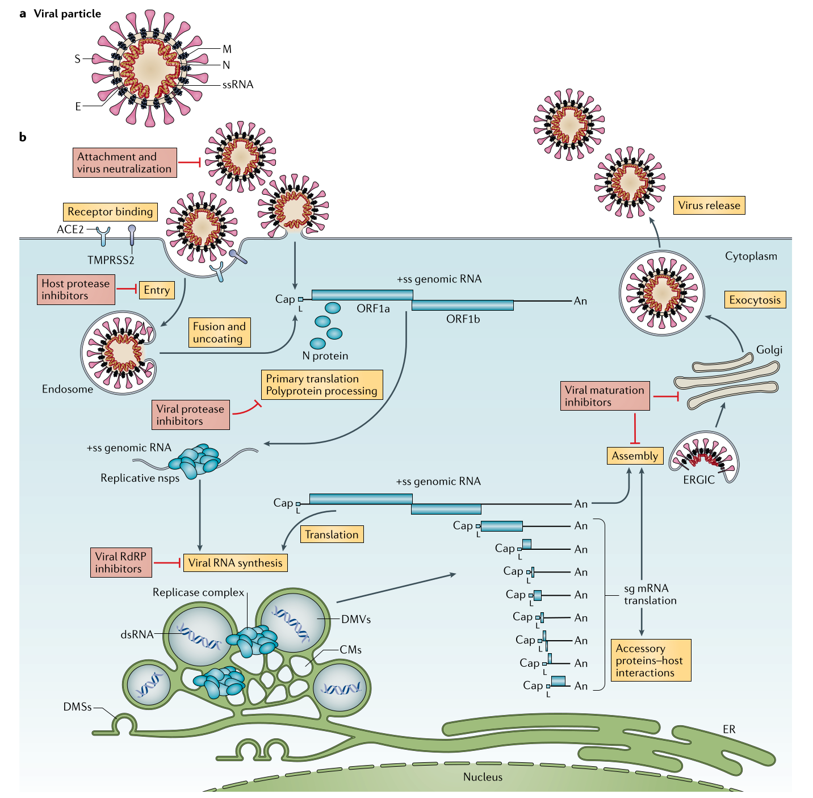
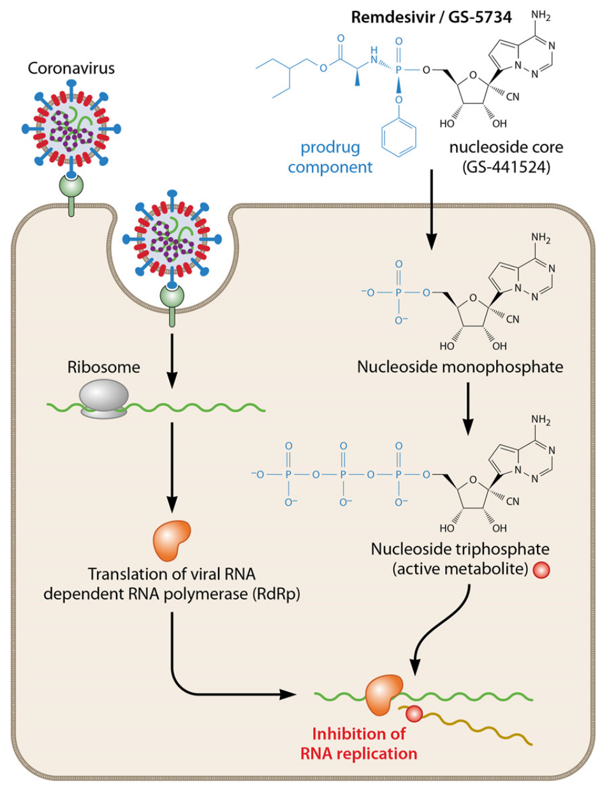

----
# Anti-HIV & Antiviral Agents
----

[Hour 1](#/hour1) | [Hour 2](#/hour2)

Hao Chen, Ph.D

hchen@uthsc.edu Dept. Pharmacology, UTHSC

### Last update: *Nov 9, 2021*

Please use the live online version at http://chen42.github.io/slides/antiviral.html

Or download the [**Printable version**](http://chen42.github.io/slides/antiviral_dental.html?print-pdf#/) before class.

---

## Formatting conventions 
### used in this document 

* Color and style guide: 
	* Drug name: <span id="drug"> Enfuvirtide</span>
	* Links: [Clinicalkey](https://www.clinicalkey.com/#!/). 
		* Shade change when mousing over indicates the image or text has a link
		* You need to login via your UTHSC netid when off campus to use e-textbooks. 
		* [VPN](http://uthsc.edu/vpn/) provides a better experience. 
* Open link in a new browser tab:
```
CTRL click
```
* Navigate the slides:
```
<- or -> 
Space_bar 
Page_down or Page_up 
Home or End
```

---

<section id="hour1">

## Agents for the treatment of virus infections 
### [Hour 1](#/hiv) 
* <a href="#/hiv">Retrovirus (HIV)</a>
	* Fusion inhibitors <span id="drug">[Enfuvirtide](#/Enfuvirtide), [Maraviroc](#/Maraviroc)</span>
	* Nucleoside reverse transcriptase inhibitors <span id="drug">[Zidovudine, Lamivudine, Abacavir, Emtricitabine](#/nrti)</span>
	* Nucleotide inhibitors <span id="drug">[Tenofovir](#/Tenofovir)</span>
	* Non-nucleoside reverse transcriptase inhibitors <span id="drug">[Nevirapine, Efavirenz](#/nnrti)</span>
	* Integrase strand transfer inhibitor <span id="drug">[Bictegravir, Raltegravir, Dolutegravir](#/Integrase) </span>
	* Protease inhibitors <span id="drug">[Ritonavir, Darunavir](#/pi) </span> 

---

## Objectives

1. Identify the <span id="yb">steps in the viral replication process</span> that provide targets for antiviral therapy.

2. Understand the <span id="yb">current guidline for HIV/AIDS treatment. </span>

3. Understand the <span id="yb">current Initial Combination Regimens</span> for drug naive patent.

4. Describe the mechanism of action and significant pharmacological properties of the <span id="yb">six major classes</span> of anti-HIV agents

---

<section id="hiv">

## Human Immunodeficiency Viruses



<div id="greyText">
single, positive strand RNA 
<br>
HIV-1 widely distributed, more pathogenic | HIV-2 restricted to Central and West africa
</div>

---

## [Stages of AIDS](https://www.clinicalkey.com/#!/content/book/3-s2.0-B9780323611794000107?scrollTo=%23t0015)

<ol> <li> <b>Primary infection.</b> About 90% of patients develop a flu-like illness, which coincides with <a href= https://clinicalinfo.hiv.gov/en/glossary/seroconversion> seroconversion</a>, between 2 and 4 weeks post exposure. Symptoms include fever, night sweats, sore throat, lymphadenopathy, diarrhea. The illness is self-limiting.

<li> <b>Asymptomatic phase.</b> Of variable duration, from 2 to 10 years. Patients are clinically well, but infectious.

<li> <b>Acquired Immunodeficiency Syndrome (AIDS). </b>Features:
	<ol>
		<li> Constitutional symptoms: fever, diarrhea, weight loss, skin rashes.
		<li> Immunodeficiency: increased susceptibility to opportunistic infections	
		<li> Neurological disease: dementia, myelopathy, peripheral neuropathy	
		<li> Rare malignancies: Kaposi sarcoma, oral hairy leukoplakia, or lymphoma
	</ol>
</ol>

---

## AIDS Timeline 


<td>  </td>
---

### Current [guidelines](https://clinicalinfo.hiv.gov/en/guidelines/adult-and-adolescent-arv/initiation-antiretroviral-therapy?view=full)

#### The <span id="yb"> Initiation </span> of Antiretroviral Therapy 

* Antiretroviral therapy (ART) is recommended for all persons with HIV 
	* reduce morbidity and mortality (AI) 
	* prevent the transmission of HIV to others (AI).

* The Panel recommends initiating ART immediately after HIV diagnosis
	* increase the uptake of ART and linkage to care, 
	* decrease the time to viral suppression for individual patients, 
	* improve the rate of virologic suppression among persons with HIV (AII).

* Educate patients (AIII)
	* the benefits of ART
	* to deploy strategies to optimize care engagement 
	* treatment adherence 

Rating of Recommendations: A = Strong; 
Rating of Evidence: I = Data from randomized controlled trials; II = Data from well-designed nonrandomized trials or observational cohort studies with long-term clinical outcomes; III = Expert opinion


[HAART - cART - ART](https://www.verywell.com/cart-hiv-combination-antiretroviral-therapy-48921)

---
## HIV Life Cycle 

<table> <tr><td 50%>
<iframe width="560" height="315" src="https://www.youtube.com/embed/eS1GODinO8w" frameborder="0" allowfullscreen></iframe>
</td><td>

<iframe width="560" height="315" src="https://www.youtube.com/embed/GR9d9wrOl5E" frameborder="0" allow="autoplay; encrypted-media" allowfullscreen></iframe>
</td></tr></table>

---
## [HIV Lifecycle](https://en.wikipedia.org/wiki/Discovery_and_development_of_HIV-protease_inhibitors#Life_cycle_of_HIV)

 

1. *Initiation*: attachment, penetration, uncoating
2. *Replication*: genome synthesis, RNA production, protein synthesis
3. *Release*: assembly, maturation, exit from cell
---

<section id="recommend">

### [Current Guideline](https://clinicalinfo.hiv.gov/en/guidelines/adult-and-adolescent-arv/what-start-initial-combination-regimens-antiretroviral-naive?view=brief)

#### for treatment-naive patients

updated on Jun 03, 2021

* Integrase inhibitor-based regimens 
 * <span id="drug"> Bictegravir </span> plus <span id="drug"> tenofovir alafenamide </span> plus <span id="drug"> emtricitabine </span> 
 * <span id="drug"> Dolutegravir </span> plus <span id="drug"> abacavir </span> plus <span id="drug"> lamivudine </span> — only for individuals who are HLA-B*5701 negative and without chronic hepatitis B virus (HBV) coinfection 
 * <span id="drug"> Dolutegravir </span> plus (<span id="drug"> emtricitabine </span> or <span id="drug"> lamivudine </span> ) plus (<span id="drug"> tenofovir alafenamide</span> or<span id="drug"> tenofovir disoproxil fumarate</span>) 
 * <span id="drug"> Dolutegravir </span> plus <span id="drug"> lamivudine </span> —except for individuals with HIV RNA >500,000 copies/mL, HBV co-infection, or in whom ART is to be started before the results of HIV genotypic resistance testing for reverse transcriptase or HBV testing are available.

<small>An antiretroviral (ARV) regimen for a treatment-naive patient generally consists of two nucleoside reverse transcriptase inhibitors (NRTIs) administered in combination with a third active ARV drug from one of three drug classes: an integrase strand transfer inhibitor (INSTI), a non-nucleoside reverse transcriptase inhibitor (NNRTI), or a protease inhibitor (PI) with a pharmacokinetic (PK) enhancer (also known as a booster; the two drugs used for this purpose are cobicistat and ritonavir). </small>

---

<section id="Integrase">

## In<font color="darkred">tegra</font>se Inhibitor
 Bic<font color="darkred">tegra</font>vir (Biktarvy) | Ral<font color="darkred">tegra</font>vir (Isentress) | Dolu<font color="darkred">tegra</font>vir (Tivicay) 
<table><tr><td>

</td> <td>
<ul>
<li>Mechanism of action
<ul>
 <li> Inhibits HIV-1 integrase enzyme <br>
 <li> Prevents insertion of viral DNA into host genome <p>
 </ul>

<li> ADME
 <ul>
 <li> Oral drug
 <li> Glucuronidation and by CYP3A<br>
 	<li> <span id=drug> <a href="https://www.clinicalkey.com/#!/content/drug_monograph/6-s2.0-5011">Bictegravir </a> </span> is a substrate of P-glycoprotein. 
	<li> <span id="drug"> Elvitegravir </span> is mainly metabolized by CYP3A4 <br>
	<li> Eliminated in both feces and urine <p>
</ul> 

<li> Resistance
<ul>
<li>	<span id="drug"> <a href="https://www.clinicalkey.com/#!/content/drug_monograph/6-s2.0-3823">Dolutegravir </a></span> has less resistance overlap with <span id="drug"> Raltegravir </span> than does <span id="drug"> elvitegravir </span> . 
</ul>
</ul>
</td> </tr></table>

<span id=drug>Bictegravir</span> displays a high resistance barrier and has an improved phenotypic resistance profile compared to <span id=drug>dolutegravir (DTG), raltegravir (RAL) and elvitegravir (EVG) . Bictegravir </span> has a longer dissociation half-life from both wild-type and mutant HIV-1 integrase/DNA complexes compared with DTG, RAL, and EVG

---

## Integrase Inhibitor 

* Indication
 * <a href="#/recommend">Recommended</a> for naive patients as part of combination ART 
* Adverse effects
 * Diarrhea, nausea, headache, and fever
 * Hypersensitivity to <span id="drug"> Dolutegravir </span> include serious rash, blisters/peeling of skin, hepatitis, facial edema, angioedema, difficulty breathing, or eosinophilia.
* Drug interactions
 * Not inducer, inhibitor or substrate of CYP3A4 (exeption: <span id="drug"> Elvitegravir </span> )
 * Metabolized by UDP glucuronosyltransferase (UGT)
 * <span id="drug"> Rifampin </span> (antibiotic) induces UGT, thus requires higher <span id="drug"> Raltegravir / Dolutegravir </span> dose
---

<section id="nrti">

## Nucleoside Reverse Transcriptase Inhibitors (NRTIs)

* NRTIs
	* <span id="drug">Zidovudine</span> (Retrovir, azidothymidine [ZVD], Apo-Zidovudine, Novo-AZT)
	* <span id="drug" style="background-color:#ff9">**Abacavir**</span> (Ziagen, ABC)
	* <span id="drug" style="background-color:#ff9">**Lamivudine**</span> (Epivir, 3TC)
	* <span id="drug" style="background-color:#ff9">**Emtricitabine**</span> (Emtriva, FTC)
	* many more available, some are no longer in use. 
---
## mechanism of action - NRTIs 
<iframe width="560" height="315" src="https://www.youtube.com/embed/cC9kyoAo1ac?start=65&list=PLMO1589WRspykVPiy6SgKi3OPKbe9b0El" frameborder="0" allowfullscreen></iframe>

---
<section id="hostcell">

## Mechanisms of Action - NRTIs 
* Analogs of naturally occurring [nucleosides](http://static.newworldencyclopedia.org/b/b9/Nucleotides.png)
* NRTIS are converted to their active triphosphate metabolites (i.e. a nucleotide) by <span id="yb">host cell </span>kinases
* MoA
 * Competitive inhibitor of viral reverse transcriptase
 * Cause DNA chain termination 
 * Also inhibit host cell DNA polymerase


---
## NRTIs

* [Zidovudine](https://www.clinicalkey.com/#!/content/drug_monograph/6-s2.0-653) (ZDV, AZT) 
	* Analogs of pyrimidine nucleoside (T) 
	* Phosphorylated to active triphosphate forms
	* Competes with deoxythymidine triphosphate for incorporation into DNA
* [Lamivudine ](https://www.clinicalkey.com/#!/content/drug_monograph/6-s2.0-339) (3TC), [Emtricitabine](https://www.clinicalkey.com/#!/content/drug_monograph/6-s2.0-2465) (FTC)
	* Analogs of pyrimidine nucleoside (C)
* [Abacavir](https://www.clinicalkey.com/#!/content/drug_monograph/6-s2.0-2332) (ABC)
	* Analog of purine nucleosides (G) 

---
## Nucleoside Reverse Transcriptase Inhibitors (NRTIs)
* Indications
	* First line treatment of HIV infection as components of ART
	* Prevent acute infection of susceptible cells
	* Little effect on cells already infected by HIV
	* <span id="drug"> Zidovudine </span> 
		* <span id="yb">Only NRTI shown to reduce perinatal HIV transmission</a>
* Resistance
	* Drugs select for different mutations of the reverse transcriptase gene at the level of specific codons 

---

## Pharmacological Properties of NRTIs
* Good oral absorption
* Crosses blood-brain barrier
* Metabolism plays limited role in clearance 
* Excreted unchanged in urine, except:
	* <span id="drug"> Zidovudine </span> is metabolized to glucoronide
	* <span id="drug"> Abacavir </span> metabolized by alcohol dehydrogenase 

---

## <a href="#/adverse">Adverse Effects</a> of NRTIs
* Common toxicities
	* Rash; Gastrointestinal distress
	* [Lactic acidosis](https://hivinfo.nih.gov/understanding-hiv/fact-sheets/hiv-and-lactic-acidosis), [hepatic steatosis](https://www.ncbi.nlm.nih.gov/pubmed/22760655) 
	* [Lipodystrophy](https://www.ncbi.nlm.nih.gov/PubMed/10509567): fat loss or buildup or both. 
		* Including central obesity, dorsocervical fat enlargement [(buffalo hump)](https://www.clinicalkey.com/#!/content/medline/2-s2.0-9525364), peripheral wasting, accumulation of facial fat, [lipomas](http://www.mayoclinic.org/diseases-conditions/lipoma/basics/definition/con-20024646), breast enlargement, [gynecomastia](http://www.mayoclinic.org/diseases-conditions/gynecomastia/home/ovc-20257576)
	*  [Mitochondrial toxicity](https://www.uptodate.com/contents/mitochondrial-toxicity-of-hiv-nucleoside-reverse-transcriptase-inhibitors/) is a major adverse effect of nucleoside analogues,  which can lead to myopathy, peripheral neuropathy, and hepatic steatosis with lactic acidosis

---

## <a href="#/adverse/">Adverse Effects </a>of NRTIs
 
* Toxicities
	* <span id="drug">Zidovudine</span>: bone marrow suppression; anemia, neutropenia; myopathy (mtDNA); 
	* <span id="drug">Abacavir</span>: **hypersensitivity** reaction due to genetic predisposition (multi-organ autoimmune response, potentially life threatening) 
		* <span id="yb">HLA-B\*5701	screening before starting therapy </span> [NEJM](http://www.nejm.org/doi/full/10.1056/NEJMoa0706135#t=article)
	* <span id="drug"> Emtricitabine </span>: psychiatric reactions, depression, dizziness, insomnia <span id="mem"> EmtriPSYtabine</span>

---

<section id="zidovudine">

## Drug Interactions of NRTIs
 
* <span id="drug"> Zidovudine </span> 
	* Avoid co-administration bone marrow suppressive drugs
		* <span id="drug">Ganciclovir, interferon alpha, dapsone, flucytosine, vincristine, vinblastine</span>

* <span id="drug"> Abacavir </span> 
	* Ethanol significantly increases plasma levels (metabolized by alcohol dehydrogenase)

---

## NRTIs 

### Summary 

* Indications 
	* First line treatment of HIV as part of ART
* Mechanism of action 
	* Inhibit viral reverse transcriptase
* Resistance 
	* Mutations in reverse transcriptase gene
* ADME 
	* Well absorbed by the GI tract; good oral bioavailability
	* Excreted unchanged by the kidney; except
		* <span id="drug"> zidovudine </span> (metabolized into glucoronide)
		* <span id="drug"> Abacavir </span> (metabolized by alcohol dehydrogenase)

---

## NRTIs 
### Summary 
* Adverse effects
	* All cause GI distress
	* Lactic acidosis with hepatic steatosis due to mitochondrial toxicity 
* Drug-Drug interactions
	* Can be severe due to synergistic effects on myelosuppression and peripheral neuropathy
 
[Current Recommendations](#/recommend)

---

<section id="Tenofovir">

## Nucleo<font color="darkorange">t</font>ide Reverse Transcriptase Inhibitor

[Teno<font color="darkorange">fo</font>vir disoproxil (Viread)](https://www.clinicalkey.com/#!/content/drug_monograph/6-s2.0-2477)

<span id="mem"> fo=pho=phosphate</mem>

* Properties
	* <span id="drug"> Tenofovir disoproxil </span> is a prodrug. It is hydrolyzed to release tenofovir
	* Tenofovir is an analogue of adenosine- <font color="darkorange">5'-monophosphate </font>
	* Requires two intracellular phosphorylation steps for activation
	* Weak inhibitor of mammalian DNA and mt polymerase
	* Included in many <a href="#/recommend"> first-line ART regimens</a>
	* Also indicated for <span id="bg"> hepatitis B </span>
* Mechanism of action
	* Inhibits viral reverse transcriptase by chain termination
* Resistance
	* <span id='bg'>Does not tend to select the K65R mutation when used with <span id="drug">Emtricitabine</span></span> [PubMed](https://www.ncbi.nlm.nih.gov/pubmed/23027713)
	* Cross resistance with preexisting <span id="drug"> zidovudine </span> associated mutations
	* Not affected by <span id="drug"> lamivudine-abacavir </span> associated mutations

---

## Tenofovir

* Administration
	* Once daily dosing
	* Increased bioavailability taken with a high fat meal
* Metabolism
	* Substrate of P-glycoprotein 
	* Not substrate for P450
	* T&frac12; = 17 h 
* <a href="#/adverse">Adverse effect </a>
	* Most common: nausea, vomiting, diarrhea, [flatulence](https://www.clinicalkey.com/#!/content/book/3-s2.0-B9781455770052000676?scrollTo=%23hl0000349), abdominal pain, dyspepsia, and anorexia with weight loss
	* CNS: depression, anxiety, headache
	* Hepatotoxicity: elevated hepatic enzymes 
	* Exacerbates renal impairment 


---

## Tenofovir disoproxil and Emtricitabine 
### (Truvada)

* Better than Abacavir-Lamivudine for initial therapy 
	* Extending time to [virologic failure](https://clinicalinfo.hiv.gov/en/glossary/virologic-failure) and first adverse event 
	* [NEJM Dec 3 2009](https://www.ncbi.nlm.nih.gov/pubmed/?term=19952143)
* Effective as antiretroviral <span id='bg'>chemoprophylaxis </span>before exposure (PrEP)
	* [NEJM Dec 30 2010](https://www.ncbi.nlm.nih.gov/pubmed/21091279)
	* [CDC page on PrEP](https://www.cdc.gov/hiv/risk/prep/index.html)
	* [full guideline pdf, updated in 2017](https://www.cdc.gov/hiv/pdf/risk/prep/cdc-hiv-prep-guidelines-2017.pdf)
* <a href="#/recommend">Recommended for treatment naive patients</a>

---

<section id="pi">

## Protease Inhibitors, PIs

<div id="left50">
Ataza<u>navir</u> (Reyataz)
<br>
Indi<u>navir</u> (Crixivan)
<br>
Nelfi<u>navir</u> (Viracept)
<br>
Saqui<u>navir</u> (Fortovase)
<br>
Fosampre<u>navir</u> (Lexiva)
<br>
<b>Rito<u>navir</u></b> (Norvir)
<br>
<b>Daru<u>navir</u></b> (Prezista)
<br>
PIs can be peptidomimetic (structural similarities to the cleavage site of HIV polyproteins) or not <span id="drug"> (nelfinavir) </span>.

</div>

<div id="right50">
<iframe width="560" height="400" src="https://www.youtube.com/embed/MK2r8J7SCSg?start=20&amp;stop=60" frameborder="0" allowfullscreen></iframe>
</div>

---

## Protease Inhibitors

* Indications
	* Treatment of HIV as part of combination therapy
	* Effective in both acutely and chronic HIV-1 infected cells
	* Effective in monocytes and macrophages 
		* Not affected by RT inhibitors
* Mechanism of Action
	* Selective, competitive inhibitors of HIV proteases
	* Bind reversibly to protease active site
	* Prevent cleavage of polyprotein and block viral maturation
	* Early stages of HIV-1 replication cycle not affected
* Resistance
	* Each drug selects for different mutations in protease gene at level of specific codons
 
---

## Protease inhibitors

* ADME
	* Oral absorption varies
	* Bind extensively to plasma proteins
	* Renal excretion is minimal
		* No adjustments needed for renal dysfunctions
	* Metabolized by cytochrome P-450 system
		* Concurrent use of potent P-450 inducer (e.g. <span id="drug"> rifampin </span> ) leads to decreased PI concentration
	* <span style="background-color:#ff9"> <span id="drug"> Ritonavir </span> is a potent inhibitors of CYP3A4</span>
		* used to increase (i.e. "boost") plasma concentration of other PIs except <span id="drug"> nelfinavir </span> (CYP2C19) 
		* Toxic adverse effects related to drug accumulation due to PI-mediated inhibition of hepatic P450 system
		 
note: rifampin is a bacterial RNA polymerase inhibitor

---


## Protease inhibitors
* Common <a href="#/adverse">Adverse Effects</a>
	* Hyperlipidemia 
		* May be more dramatic with <span id="drug"> ritonavir </span> due to interference in lipid metabolism. 
	* [Lipodystrophy](https://www.ncbi.nlm.nih.gov/PubMed/9652687)
		* Including central obesity, dorsocervical fat enlargement [(buffalo hump)](https://www.clinicalkey.com/#!/content/medline/2-s2.0-9525364), peripheral wasting, accumulation of facial fat, [lipomas](http://www.mayoclinic.org/diseases-conditions/lipoma/basics/definition/con-20024646), breast enlargement, [gynecomastia](http://www.mayoclinic.org/diseases-conditions/gynecomastia/home/ovc-20257576)
	* Insulin resistance and diabetes
	* Elevated liver function
*Specific Adverse Effects 
	* Ritonavir 
		* Hepatotoxicity at high doses

---

<section id="Darunavir">

## Darunavir

* Achieves faster virologic response than control PIs. [PubMed](https://www.ncbi.nlm.nih.gov/pubmed/21692667) 
* Can be used to treat patients resist to other PIs. 
	* <span id="drug"> darunavir </span> displays a < 10-fold decreased susceptibility against 90% of HIV-1 isolates resistant to <span id="drug"> amprenavir, atazanavir, indinavir, lopinavir, nelfinavir, ritonavir, saquinavir, </span> and/or <span id="drug"> tipranavir </span> . 	
* Must be used in combination in an antiviral regimen.
	* Requires an enhancer (i.e. low does <span id="drug"> ritonavir </span> or [cobicistat](https://www.ncbi.nlm.nih.gov/pubmed/26566368) )
* Was <a href="#/recommend">Recommended</a> for treatment-naive patients

---

## Protease Inhibitors 
### Summary 

* Indications
	* Treatment of HIV infection as part of combination therapy
* Mechanism of action 
	* Inhibition of HIV protease
* Resistance
	* Mutations of the protease gene 
		*	<span id="drug"> Indinavir, ritonavir </span> and <span id="drug"> lopinavir </span> acquire more mutations than other PIs
* ADME
	* Poor systemic bioavailability (need 'boost')
	* All PIs metabolized in liver by P450 enzymes
* Adverse effects
	* GI distress, diarrhea and vomiting
	* Increase bleeding hemophilia A or B
	* Hyperglycemia, insulin resistance and hyperlipidemia
	* Fat wasting, reaccumulation, and redistribution -- lipodystropy
* Drug interactions
	* Can be severe due to effects on P450 enzymes
 
---

<section id="nnrti">

## Non Nucleoside Reverse Transcriptase Inhibitors (NNRTIs)

 [Nevirapine (Viramune)](https://www.clinicalkey.com/#!/content/drug_monograph/6-s2.0-432)
|| [Efavirenz (Sustiva)](https://www.clinicalkey.com/#!/content/drug_monograph/6-s2.0-2244)

* Indications
	* HIV-1 infections
		* Do not have significant activity against HIV-2
* Mechanism of action
	* Bind directly to a hydrophobic pocket of the reverse transcriptase 
	* Induce conformational change in active site and block enzyme activity
	* Do not require intracellular phosphorylation for activity
* Resistance
	* Resistant HIV emerges rapidly when used as monotherapy.
	* Each drug selects for different mutations of the RT gene at the level of specific codons. 

---

## NNRTIs

<iframe width="560" height="315" src="https://www.youtube.com/embed/RUUyd5bE9vQ?start=108&stop=150" frameborder="0" allowfullscreen></iframe>

---

## NNRTIs

* ADME
	* Excellent oral absorption.
	* Metabolized by the cytochrome P-450 system
		* Drug interactions are significant
	* <span id="drug"> Efavirenz </span> and <span id="drug"> Nevirapine </span>: CYP3A4 inducer
		* Reduces PIs, rifabutin, clarithromycin, methadone and ethinyl estradiol plasma levels
* <a href="#/adverse">Adverse effects</a> 
	* Common toxicities
		* Maculopapular rashes in the trunk and extremities
		* Hepatotoxicity 
	* Unique toxicities 
		* <span id="drug"> Nevirapine </span> 
			* Fever, fatigue, headache, drowsiness, nausea
		* <span id="drug"> Efavirenz </span> 
			* Penetrate the blood brain barrier 
			* Neuropsychiatric (headache, dizziness, abnormal dreams, psychosis, suicidal ideation)
			* Teratogenic in nonhuman primates ([Pregnancy Category D](https://en.wikipedia.org/wiki/Pregnancy_category))
	 
---
## NNRTIs 
### Summary 

* Indications
	* Treatment of HIV infection as part of combination therapy
	* Not effective against HIV-2
* Mechanism of action 
	* Inhibit viral reverse transcriptase
* Resistance
	* Mutations in viral reverse transcriptase
* ADME
	* Well absorbed by the GI tract
	* Good oral bioavailability
	* Metabolized in the liver 	
	* Excreted in the urine as glucoronidated metabolites
* Adverse effects
	* All NNRTIs cause rash

---

<section id="Enfuvirtide">

## <font color="darkorange">Fu</font>sion inhibitors

[En<font color="darkorange">fu</font>vir<font color="darkorange">tide</font> (Fuzeon, T20)](https://www.clinicalkey.com/#!/content/drug_monograph/6-s2.0-2752)

<table><tr><td width=60% valign="top">
<b>Structure</b> <Br>
<ul>
<li> a synthetic pep<font color="darkorange">tide</font> with <a href="https://www.drugbank.ca/drugs/DB00109">36 amino acids </a>
</ul>
<p>

<b>Mechanism of action</b><br>
<ul>
<li> Binds to <a href="https://en.wikipedia.org/wiki/Gp41#Function">gp41</a> of the viral envelope; prevents conformational change and impedes the fusion of the viral and host cell membranes. 
</ul>
</p>
<b>Indications</b> <br>
<ul>
<li>Reserved as salvage therapy for treatment resistant patients. 
<li>Prophylasis after occupational HIV exposure. 
<li>Not part of 1st line ART (due to the self-injection method, injection site reaction, and high cost). 
</ul>
</td>

<td>

[video](https://youtu.be/eS1GODinO8w?t=57s)
</td></tr></table>


---

## Enfuvirtide 

* ADME
	* Administered subcutaneously (synthetic peptide)
	* Bound to plasma protein
	* Metabolized by proteolytic hydrolysis
	* T&frac12; = 4 h 
* <a href="#/adverse">Adverse effect</a>
	* Injection-site pain or infection 
	* Pancreatitis
	* Hypersensitivity reaction (rash, fever, peripheral edema, acute respiratory distress, etc.) 
	* Initial report of increased bacterial pneumonia (but no longer significant after adjusting for monitoring duration)
* Resistance 
	* gp41 mutations may develop when drug is given at suboptimal doses as monotherapy; No cross-resistance with other HIV Agents
	* Ineffective for HIV-2


---

<section id="Maraviroc">

## Fusion inhibitors

[Maraviroc (<font color="orange">Sel</font>z<font color="darkred">entry</font>) ](https://www.clinicalkey.com/#!/content/drug_monograph/6-s2.0-3567)
 

<div id="right50">


</div>	

<div id="left50">

**Mechanism of action** <br>

[Chemokine](https://www.ncbi.nlm.nih.gov/pubmed/7548618) receptor 5 antagonist<br>
Binds to CCR5 co-receptor<br>
Prevents virus from entering the host cell <br>
<p> 

**ADME** <br>
	Oral<br>
	Substrate for both [CYP3A4](https://en.wikipedia.org/wiki/CYP3A4#Function) and [P-glycoprotein](https://en.wikipedia.org/wiki/P-glycoprotein) <br>
	T&frac12;=14~18 h<br>
	Both urine and feces
</div>

---

## Maraviroc (Selzentry)
 
* Indication
	* Treatment of CCR5-tropic HIV-1 (not CXCR4)
	* Coreceptor (i.e. CCR5 vs CXCR4) tropism assay must be performed 
	* In combination for patients failing other antiretroviral drugs
* <a href="#/adverse">Adverse effects</a>
	* Rash
	* Elevated hepatic enzyme, hepatitis 
	* Systemic allergic reaction, cough, fever 
* Drug interactions
	* CYP3A inhibitors or inducers
		* Reduce dosage when <span id="drug"> ritonavir </span> or <span id="drug"> cobicistat </span> is coadministered 
		* Increase dosage with <span id="drug"> efavirenz </span> 
 
<a href="https://www.nature.com/articles/d41586-019-01739-w">Human genome editing on CCR5</a>
---

## Antiretroviral Drug Selectivity

* NRTIs
	* Once phosphorylated by cellular kinases, NRTIs have greater affinity for viral reverse transcriptase than for cellular DNA polymerases.
* NNRTIs
	* Do not undergo phosphorylation
	* Have greater affinity for viral reverse transcriptase than for cellular DNA polymerases
* PIs
	* Greater affinity for HIV aspartyl protease than for human protease.
* Integrase Inhibitors
	* Much higher selectivity than other classes of anti-HIV drugs.
---

### [Current Guideline](https://clinicalinfo.hiv.gov/en/guidelines/adult-and-adolescent-arv/what-start-initial-combination-regimens-antiretroviral-naive?view=brief)

#### for treatment-naive patients

* Integrase inhibitor-based regimens 
 * <span id="drug"> Bictegravir </span> plus <span id="drug"> tenofovir alafenamide </span> plus <span id="drug"> emtricitabine </span> 
 * <span id="drug"> Dolutegravir </span> plus <span id="drug"> abacavir </span> plus <span id="drug"> lamivudine </span> — only for individuals who are HLA-B*5701 negative and without chronic hepatitis B virus (HBV) coinfection 
 * <span id="drug"> Dolutegravir </span> plus (<span id="drug"> emtricitabine </span> or <span id="drug"> lamivudine </span> ) plus (<span id="drug"> tenofovir alafenamide</span> or<span id="drug"> tenofovir disoproxil fumarate</span>) 
 * <span id="drug"> Dolutegravir </span> plus <span id="drug"> lamivudine </span> —except for individuals with HIV RNA >500,000 copies/mL, HBV co-infection, or in whom ART is to be started before the results of HIV genotypic resistance testing for reverse transcriptase or HBV testing are available.

An antiretroviral (ARV) regimen for a treatment-naive patient generally consists of two nucleoside reverse transcriptase inhibitors (NRTIs) administered in combination with a third active ARV drug from one of three drug classes: 1. an integrase strand transfer inhibitor (INSTI), 2. a non-nucleoside reverse transcriptase inhibitor (NNRTI), 3. a protease inhibitor (PI) with a pharmacokinetic (PK) enhancer (also known as a booster; the two drugs used for this purpose are cobicistat and ritonavir). 


---

### [Current negative Recommendations]
## [What not to use](https://clinicalinfo.hiv.gov/en/guidelines/adult-and-adolescent-arv/what-not-use?view=full)

* Drugs
	* <span id=drug>delavirdine, didanosine, indinavir, nelfinavir, stavudine</span> 
* Monotheray
* Dual-NRTI regimens
* Tripple-NRTI regimens
* Specific drug combinations
	* <span id="drug"> Cobicistat </span> plus <span id="drug"> Ritonavir </span> (both are CYP3A4 inhibitors)
	* <span id="drug"> Emtricitabine </span> plus <span id="drug"> Lamivudine </span> (these two drugs are very similar)
	* <span id="drug"> Darunavir </span> without boosting (anti-viral effect unclear without boosting) 

These are just a few examples. Detailed list available from the link above

---

<section id="hour2">

## Agents for the treatment of virus infections 
### [Hour 2](#/hour2) 
* <a href="#/hsv">Herpes Simplex Virus</a> and Varicella Zoster Virus
	* <span id="drug">[Acyclovir, Valacyclovir](#/Acyclovir), [Tenofovir](#/Tenofovir2), [Famciclovir, Penciclovir](#/Penciclovir)</span>
* <a href="#/cmv">Cytomegalovirus</a>
	* <span id="drug">[Ganciclovir, Valganciclovir](#/Ganciclovir), [Cidofovir](#/Cidofovir), [Foscarnet](#/Foscarnet)</span>
* <a href="#/hbv">Hepatitis Virus B </a> | Hepatitis Virus C 
	* <span id="drug"> [Entecavir](#/Entecavir), [Ribavirin](#/Ribavirin), [Interferon alpha](#/Interferon) 
* <a href="#/flu">Influenza Virus </a>
	* Viral release inhibitors <span id="drug"> [Zanamivir, Oseltamivir](#/flurelease)</span>
	* Cap-dependent endonuclease inhibitor <span id="drug"> [Baloxavir](#/flucap)</span>
* <a href="#/covid">SARS-CoV-2 </a>
	* <span id="drug">[Remdesivir](#/remdesivir)</span>
	* <span id="drug">[Molnupiravir](#/molnupiravir)</span>
	* antibody drugs

---

## Objectives 

1. For each virus, understand the <span id="yb"> major classes </span> of available antiviral agents.
2. Describe the <span id="yb">mechanisms of action</span> for HSV, CMV, and HBV antiviral agents and <span id="yb">mechanisms of viral resistance</span> to these agents.
3. Describe the common and unique adverse effects of the distinct classes of antiviral agents

---

## Agents to treat HSV, VZV and CMV
|Virus| Disease| 
|---|---|
|Herpes simplex virus, human herpesvirus 1 and 2 | herpes genitalis | 
|| herpes labialis | 
|| herpetic keratoconjunctivitis |
|| herpetic encephalitis|
|Varicella-zoster virus, human herpesvirus-3 | chickenpox (varicella)|
|| shingles (herpes zostr)|
|Cytomegalovirus, human herpesvirus-5 | retinitis &dagger;| 
|| esophagitis &dagger;| 
||
&dagger; most often in immunocompromised (e.g. AIDS) patients.

---

<section id="hsv">

## Herpes Simplex virus


<div id="greyText">
Double stranded DNA virus
</div>

---

## Life cycle of HSV


---
## Nucleoside Analogs and others

<table><tr><td width=40%>

<ul>
<li><span id="drug">Acyclovir</span> (Zovirax)
<li><span id="drug">Valacyclovir</span> (Valtrex)
<hr>
<li><span id="drug">Penciclovir</span> (Denavir)
<li><span id="drug">Famciclovir</span> (Famvir)
<hr>
<li><span id="drug">Ganciclovir</span> (Cytovene)
<li><span id="drug">Valganciclovir</span> (Valcyte)
<hr>
<hr>
<li><span id="drug">Cido<span id='bg'>fo</span>vir</span> (Vistide)
<li><span id="drug">Foscarnet</span> (Foscavir)
</ul>

</td><td>
<ul>
<li> Mechanism of action 
<ul><li> Inactivation of viral DNA polymerase through direct binding and competition for dNTPs.
<li> Inducing viral DNA chain termination 
</ul>
</td></tr></table>


---


## Mechanisms of Activation of [Nucleoside](http://static.newworldencyclopedia.org/b/b9/Nucleotides.png) Analogs

c.f. <a href=#/hostcell>NRTI for HIV</a>


---

## Nucleoside analogues

* Drug selectivity:
	* The <span id="yb">virus in infected cells activates the drug to an active form</span>
		* Uninfected cell does not activate drug.
	* Preferential affinity of acyclovir triphosphate for viral DNA polymerase rather than cellular enzyme. 
* Resistance: 
	* Altered viral thymidine kinase substrate specificity
	* Absence of viral thymidine kinase 
	* Mutated viral DNA polymerase 

---
<section id="Acyclovir">

## Acyclovir 
### [Valacyclovir](https://www.clinicalkey.com/#!/content/drug_monograph/6-s2.0-636) (L-valyl ester prodrug of acyclovir)
	

* Mechanism of action 
	* <span id="drug"> acyclovir </span> is phosphorylated intracellularly by viral thymidine kinases (TK), then by cellular kinases to the triphosphate state, which terminates DNA replication when incorported into the viral DNA. 
	* Only effective against actively replicating virus. Does not eliminate the viral genome. 
* ADME
	* <span id="drug"> acyclovir </span> has low oral bioavailability (10-20%). (i.v. or topical) 
	* <span id="drug"> Valacyclovir </span> is hydrolyzed to acyclovir in intestine or liver. Increase bioavailability (3.3 - 5 X) 
	* competitive inhibition of viral DNA polymerase; chain termination. 
* Indication: * HSV keratitis, herpes labialis, genital herpes, HSV encephalitis
	* VZV 
	* CMV-positive bone marrow transplant recipients
* Adverse effects
	* Headache, nausea, diarrhea
	* Following high IV dose: Reversible renal dysfunction (crystalline nephropathy), Neurologic toxicity (tremors, delirium, seizures)

---
<section id="Penciclovir">


## Penciclovir
### [Famciclovir](https://www.clinicalkey.com/#!/content/drug_monograph/6-s2.0-240) (diacetyl ester prodrug)

* ADME
	* <span id="drug"> Penciclovir </span> is for topical application only.
	* <span id="drug"> Famciclovir </span> is oral, has longer intracellular half-life than <span id="drug"> Acyclovir </span>, but with lower affinity for the viral enzyme 
	* Not a CYP450 substrate
* Mechanism of action 
	* Selective substrate of HSV VZV thymidine kinase
	* Competitive inhibition of viral DNA polymerase
* Indications
	* Alternative to Acyclovir
	* Infection of HSV, VZV. 
* Adverse effects
	* Well tolerated
	* Headaches, nausea, diarrhea

---
<section id="cmv">

## Cytomegalovirus


<div id="greyText">
Double stranded DNA virus
</div>

---
<section id="Ganciclovir">

## Ganciclovir
### [Valganciclovir](https://www.clinicalkey.com/#!/content/drug_monograph/6-s2.0-2584) (L-valyl ester prodrug)

* MoA
	* Ganciclovir is phosphorylated to ganciclovir monophosphate by a viral protein kinase
	* Ganciclovir triphosphate inhibits viral DNA synthesis 
		* competing for a position in the viral DNA
		* terminating DNA synthesis once incorporated 
* ADME
	* <span id="drug"> Valganciclovir </span> is hydrolyzed by esterases following oral administration to <span id="drug"> ganciclovir </span> 
* Indications
	* CMV retinitis in AIDS patients
		* Activity 100 x greater than <span id="drug"> Acyclovir </span> <span id='mem'>Gangbuster drug for a gigantic virus</span> 
	* CMV prophylaxis (e.g., liver transplant patients) 
* <a href="#/adverse">Adverse effects</a>
	* Bone marrow suppression, neutropenia, anemia, 

---

<section id="Cidofovir">

## [Cido<font color="darkorange">fo</font>vir](https://www.clinicalkey.com/#!/content/drug_monograph/6-s2.0-125)

<span id="mem">fo=pho=phospho=nucleotide</span>

* Mechanism of action 
	* Cytidine nucleo<font color="darkorange">t</font>ide analog
	* Not phosphorylated by viral TK
	* Inhibits herpevirus DNA polymerase >> human DNA polymerase
	* Induce DNA fragmentation and Caspase-3 activity
* ADME	
	* Once weekly i.v. <u>injection</u> 
* Indications
	* <span id="drug"> Ganciclovir, foscarnet, </span> and <span id="drug"> acyclovir </span> -resistant CMV strains	
	* <span id="drug"> cidofovir </span> i.v. delays progression of CMV retinitis in HIV+ patients
* <a href="#/adverse"> Adverse effects</a>
	* Nephrotoxicity, neutropeina, ocular hypotony, alopecia
	* Potential human carcinogen
	

---
<section id="Foscarnet">

## [<font color="darkorange">Fos</font>carnet (Foscavir)](https://www.clinicalkey.com/#!/content/drug_monograph/6-s2.0-267)
### Non-nucleoside Anti-HSV Agent

* Mechanism of Action
	* Inorganic pyro<font color="darkorange">phos</font>phate analog
	* Inhibits HSV DNA polymerase and HIV-1 reverse transcriptase 
	* Binds to pyrophosphate binding site of polymerase
	* <a href="https://en.wikipedia.org/wiki/Nucleoside_triphosphate#/media/File:DNA_synthesis_EN.png">Inhibits cleavage of pyrophosphate from deoxyribonucleotide triphosphate (dNTP)</a>
	* Blocks viral DNA synthesis
* Indications
	* Nucleoside-resistant HSV, VZV, and CMV infections
	* Effective in CMV retinitis, and acyclovir and ganciclovir-resistant strains of HSV and VZV
	* Has been used as [salvage therapy](https://www.ncbi.nlm.nih.gov/PubMed/16964823) for multi-drug resistant HIV
* <a href="#/adverse">Adverse effects</a>
	* Renal failure or dysfunction 
	* Seizure, depression, confusion, and anxiety (high CSF/plasma ratio)
 * one marrow suppression
	* Nausea, vomiting, and fatigue


---

## Inhibitors of Viral DNA Replication 

### Summary 
* Indications
	* HSV, VZV, and CMV infections 
* Mechanism of action
	* Inhibit viral DNA polymerases
* Resistance
	* Mutations of the viral polymerase gene
	* Deficiency of viral tyrosine kinase 
* ADME
	* Bioavailability varies. 
	* Renal excretion of unmetabolized parent drug through glomerular filtration -- Adjust dose
* <a href="#/adverse">Adverse effects</a>
	* Generally well tolerated
	* Ganciclovir -- myelosuppressant and has teratogenic potential
	* Cidofovir and Foscarnet -- nephrotoxic

---
<section id="hbv">

## Hepatitis B Virus



<div id="greyText">
Partially double-stranded DNA virus
</div>

---

## HBV life cycle

<iframe width="700" height="500" src="https://www.youtube.com/embed/sVpiXaEMs7I?start=342" frameborder="0" allowfullscreen></iframe>

partial DNA enters nucleus -> cccDNA -> RNA -> <span id='bg'>HBV polymerase</span> -> DNA (negative strand) -> DNA (positive strand)

<b>ccc</b>: covalently closed circular

HBV polymerase has reverse transcription activity

---

## Anti-Hepatitis Agents

* <span id="drug">Entecavir</span> (Baraclude)
* <span id="drug">Adefovir</span> (Hepsera)
* <span id="drug">Tenofovir</span> (Viread)
* <span id="drug">Interferon alfa-2a</span> (Roferon) and -2b (Intron A)
* <span id="drug">Peginterferon alfa-2a</span> (Pegasys) and alfa-2b (PegIntron)

---
<section id="Entecavir">

## [Entecavir](https://www.clinicalkey.com/#!/content/drug_monograph/6-s2.0-3427) (Baraclude)

* Mechanism of action 
	* Nucleoside analog of <b>G</b>uanosine
	* Inhibits all 3 activities of HBV polymerase
		* Base priming ([GAA](https://youtu.be/sVpiXaEMs7I?t=6m12s)) [PubMed](https://www.ncbi.nlm.nih.gov/pmc/articles/PMC4399241/) 
		* Reverse transcription of the negative DNA strand 
		* DNA synthesis of positive strand
* Indication 
	* Effective in treatment naive HBV patients
	* Equally active against <span id="drug"> lamivudine</span>-resistant HBV

---

## Entecavir

* ADME
	* Oral bioavailability is 37-80%
	* Tablets and liquid form are interchangeable
	* Absorption is affected by food (decreased <40%)
		* Take on empty stomach (2 hrs before or 2 hrs after meal)
	* Not metabolized - not substrate for CYP450
		* No dosage alteration for hepatic impairment
	* Excreted by kidneys (both glomerular filtration and tubular secretion)
		* With CrCl < 50 ml/min, dose should be modified
		* Co-administration with other drugs that reduce renal function, may increase conc of <span id="drug"> entecavir </span> or other drug

---

## Entecavir

* Adverse effects
	* Generally well tolerated
	* **HBV exacerbation upon discontinuation of treatment**
	* Elevation of hepatic enzymes may occur, lactic acidosis 
		* Monitor hepatic function for several months and re-initiate therapy if warranted
	* Most commonly reported: headache, fatigue, dizziness
---

<section id="Tenofovir2">

## Tenofovir 

* Mechanism of action
	* A nucleotide analog of adenosine monophosphate
	* First nucleotide reverse transcriptase inhibitor
	* Inhibits viral reverse transcriptase
* Resistance
	* Thymidine analogue mutations
		* Cross resistance with preexisting <span id="drug"> zidovudine</span>-associated mutations
	* Not effected by <span id="drug"> lamivudine-abacavir </span> associated mutationse
---
## Tenofovir
* Administration
	* Once daily dosing
	* Increased bioavailability taken with a meal
* Metabolism
	* Not substrate for P450
	* No adverse drug interactions with other P450 substrate drugs
* Adverse effect: 
	* Most commonly (>3%) in clinical trials: nausea, diarrhea, asthenia, headache, vomiting, flatulence, abdominal pain, and anorexia. 
	* Increase in liver enzymes
	* watch for hepatitis flare if discontinued in patients with chronic HBV infection.
---
<section id="Adefovir">

## [Ade<font color="darkorange">fo</font>vir](https://www.clinicalkey.com/#!/content/drug_monograph/6-s2.0-2233)(Hepsera)

* Mechanism of action 
	* Nucleo<font color="darkorange">t</font>ide analog of deoxy<font color="darkorange">ade</font>nosine monophosphate
	* Following formation of the diphosphate by cellular kinases, it inhibits HBV DNA polymerase
	* ~10-fold more active for viral DNA polymerase than for the human DNA polymerase
	* No cross resistance of <span id="drug"> lamivudine</span>-resistant HBV strains
* Indication
	* chronic hepatitis B
* <a href="#/adverse">Adverse Effects</a>
	* Exacerbations of hepatitis after discontinuation of treatment 
	* Nephrotoxicity 
	* Lactic acidosis/severe hepatomegaly with steatosis
* [No longer](https://www.ncbi.nlm.nih.gov/pmc/articles/PMC5975958/) a preferred drug for HBV

---

<section id="Ribavirin">

## [Ribavirin](https://www.clinicalkey.com/#!/content/drug_monograph/6-s2.0-542)
(Copegus | Moderiba | Rebetol | RibaPak | RibaTab | Ribasphere | Virazole)

* MoA 
	* Nucleoside analog of guanosine
	* Increase mutation of viral <a href="#/molnupiravir"> <span id="yb">DNA</span></a> and leads to "**error catastrophe**"
	* Interference with synthesis of GTP / Increase production of cytokine
* Indication 
	* Treat <u>Hepatitis C</u> in combination with <span id="drug"> peginterferon alpha </span> 
	* Weight-based dosing results in a higher sustained virologic response 
	* <u>Respiratory syncytial virus</u>: aerosolized form 
	* <u>Hantaan virus</u>: intravenous 
* Adverse effects
	* Dose dependent hemolytic anemia (10-20% of patients) with systemic use
		* Extravascular hemolysis
	* Bone morrow suppression
	* Psychiatric effects: depression, insomnia, anxiety.
	* Aerosolized form well tolerated
		* Possible mild conjunctival irritation
		* Reversible deterioration in pulmonary function
	* Teratogenic in animals

---

## Common to all the nucleoside analogs

<span id="drug">Entecavir </span> <span id="drug">Adefovir </span> <span id="drug">Tenofovir </span> 

* Lactic acidosis and severe hepatomegaly with steatosis is a more common adverse effect of the nucleoside analogs in the treatment of HIV, where they are always used in combination therapy, but these effects are much <u>less</u> likely to occur with monotherapy for treatment of hepatitis B. 

* Severe acute exacerbations of hepatitis B have been reported in patients who have stopped taking the drug.

---

## Immunoregulators

* [Interferons](https://www.clinicalkey.com/#!/content/book/3-s2.0-B9780323080583000137?scrollTo=%23hl0000129) (IFNs)
	* Potent cytokines that posses antiviral, antiproliferation (antineoplastic) and immunomodulating actions
		* Activates ribonucleases to degrade viral RNA
		* Inhibition of viral replication
		* Blocks protein synthesis &mdash; inhibits translation initiation complex
	* Three major classes of human IFNs

|Interferon|Type| Receptor| Effect|
|---|---|---|---|
|&alpha;|Type I | IFNAR &dagger;| Antiviral|
|&beta;| Type I | IFNAR| Antiviral| 
|&gamma;|Type II| IFNGR &Dagger;|Immunomodulation|
||

<small>
 &dagger; composed of two subunits IFNAR1 and IFNAR2. &Dagger; composed of two subunits IFNGR1 and IFNGR2
 </small>

---

## Interferons 
### Antiviral effect 

* Type I has more potent antiviral effect. It can be produced in almost any cell type when it is infected with a virus. It is triggered by molecular patterns of characteristic of viral but not host components (e.g. viral 5'-triphosphorylated ssRNA and dsRNA). 
	* dsRNA is produced by positive-strand RNA viruses and DNA viruses, but not detectable by negative-strand RNA Viruses [PubMed](https://www.ncbi.nlm.nih.gov/pmc/articles/PMC1472073/)

* Interferon alpha is generally active against the following viruses <i> in vitro</i>: 
	* <span style="font-weight:normal; font-size: 0.6em"> adenovirus; coronavirus; encephalomyocarditis virus; hepatitis B virus; hepatitis C virus (HCV); hepatitis D virus; herpes simplex virus type 1; herpes simplex virus type 2; human immunodeficiency virus (HIV); papillomavirus; poliovirus; rhinovirus; vaccinia virus; varicella-zoster virus; vesicular stomatitis virus; human T-lymphotropic virus type I (HTLV-I).
</span>

* Induces immune responses, alter the expression of genes, cell surface markers, phagocytic activity, cytotoxicity, etc. 

* Exact mechanism remain unclear, but may include the induction of enzymes that interfer with key steps in the HBV life cycle, include those that degrade foreign, but not host DNA ([PubMed](https://www.ncbi.nlm.nih.gov/pubmed?term=24557838)) 
---

<section id="Interferon">

## [Interferon alpha-2a](https://www.clinicalkey.com/#!/content/drug_monograph/6-s2.0-2508) 
## [peginterferon alpha-2a](https://www.clinicalkey.com/#!/content/drug_monograph/6-s2.0-2634)

* Indications
	* Chronic HBV, HPV and (Kaposi sarcoma, human herpesvirus-8)
	* HCV 
		* <span id='bg'> <span id="drug"> peginterferon </span> in combination with <span id="drug"> Ribavirin </span></span>
* ADME
	* Administered i.m. or s.c.
	* High bioavailability
	* Proteolytic degradation in the Kidney is the main site of metabolism
	* Eliminated in the urine ( IFN-&alpha;2 T&frac12; = 5.1 h)
	* Peginterferon has much longer T&frac12; ( 80 h) 
		* IFN-&alpha;2a is no longer produced in the USA

<small>
* PEG = bis-monomethoxy polyethylene glycol 
</small>
---

## Interferon alpha-2

* <a href="#/adverse">Adverse effects</a>
	* Flu-like syndrome: nausea, vomiting, anorexia
	* Bone marrow suppression (95% patients)
	* Psychiatric effects: depression, homicidal and suicidal ideation
	* Injection site reaction
	* Should not be administered during pregnancy
* Drug interactions
	* Increases in the level of many drugs:
		* <span id="drug"> theophylline </span> (for asthema) by 100% 
		* <span id="drug"> zidovudine </span> by 93%. 
	* Co-administration with <span id="drug"> zidovudine </span> can [increase severity of myelosuppression](#/zidovudine).
	* Additive myelosuppressive effects when combined with some anticancer agents or immunosuppressives.

---

<section id="flu">

## Influenza virus



<div id="greyText"> Single negative strand, segmented (8) RNA virus || Type A H18N10, Type B or C </div>

---

## Life cycle


<iframe width="560" height="315" src="https://www.youtube.com/embed/2RMNwLdtRhw" frameborder="0" allow="autoplay; encrypted-media" allowfullscreen></iframe>

[Life cycle review](https://www.ncbi.nlm.nih.gov/pmc/articles/PMC2794490/)
---

## Mechanism of Action of Antiinfluenza Agents

<table><tr><td>

</td><td width=50%>
<ol>
<li> virus enter the cell via H spikes. In the endosome, low pH in the endosome trigger the <span id='bg'> fusion of membranes</span>.
<li> viral ribonucleoprotein and viral RNA enters the cell nucleus, replicate the viral genome. 
<li> viral RNA is also made and steals the 5'cap of of cellular RNA (important for making protein) and exported into the cytoplasm.
<li> viral protein is made and virus is packaged on cell surface
<li> the N spikes cleave the H spikes and releases the viron.
</ol>
</td>
</tr></table>

---

## Antiinfluenza Agents

* Virus release inhibitors
	* <span id="drug"> Zanamivir</span> (Relenza)
	* <span id="drug"> Oseltamivir</span> (Tamiflu)

* Cap-dependent endonuclease inhibitor
	* <span id="drug"> Baloxavir </span> (Xofluza)

* Uncoating inhibitors 
	* most current strains of flu virus are resistant to these drugs
	* <span id="drug"> Amantadine</span> (Symadine, Symmetrel)
	* <span id="drug"> Rimantadine</span> (Flumadine)
 

---

<section id="flurelease">

## [Zanamivir](https://www.clinicalkey.com/#!/content/drug_monograph/6-s2.0-2259) and [oseltamivir](https://www.clinicalkey.com/#!/content/drug_monograph/6-s2.0-2450)

### Inhibitors of Virus Release

Sialic acid analog inhibitors of influenza A and B neuraminidase 

* Mechanism of action
	* Competitive <a href="https://youtu.be/caMne7nQUL8?t=94"> inhibitors of influenza neuraminidase</a>. 
* Indications
	* Effective against influenza A and B viruses.
	* Patients who have been symptomatic for no more than 48 hours. 
* Resistance
	* HA or neuraminidase mutations
* Adverse effects: 
	* Zanamivir is orally inhaled and causes nasal and throat discomfort. 
	* Oseltamivir is taken orally and can cause nausea and vomiting.

---

<section id="flucap">

## <span id="drug"> Baloxavir marboxil (Xofluza) </span> 

* Approved by the [FDA on October 24, 2018](https://www.fda.gov/NewsEvents/Newsroom/PressAnnouncements/ucm624226.htm)
	* The first oral, single-dose antiviral
	* The first medicine with a novel mechanism of action to treat the flu in nearly 20 years
* ADME	
	* Effective against influenza A and B viruses
 * Initiate treatment within 48 h of symptom onset
	* A single oral dose
	* Only for those aged 12 or more initialy, subsequent clinical trails found to be safe for children as well.

---


## <span id="drug"> Baloxavir marboxil (Xofluza) </span> 

<div id="left">

<a href="https://www.virology.ws/2018/10/25/a-new-drug-for-influenza/">



</a>

</div>

<div id="right">

* MoA	
	* Cellular mRNA has a [5' methylated cap and a polyA tail](https://www.neb.com/-/media/nebus/page-images/tools-and-resources/feature-articles/fa_mindcaps_fig1_initiationloop.jpg)
	* Viral mRNA does not have a cap.
	* Cap-dependent endonuclease binds to the 5' methylated caps of cellular mRNAs
	and cleaves the cellular mRNAs' 10 to 15 nucleotides 3' to the cap structure. This cellular capped RNA fragment is used by the viral polymerase to prime the synthesis of viral mRNA. 	
	* Baloxavir is an inhibitor of this cap-dependent endonuclease
* Adverse effects:
	* headache, diarrhea, bronchitis

</div>

---

<section id="covid">

## SARS-CoV-2 virus

<a href="https://www.nature.com/articles/d41586-021-02039-y">
</a>

<div id="greyText">
Single stranded RNA virus
</div>

---

## Life cycle of SARS-CoV-2 

<div id="left">

<a href="https://www.nature.com/articles/s41579-020-00468-6">

</a>

</div>

<div id="right">

* Infecting bronchial epithelial cells, pneumocytes and upper respiratory tract cells
* The RNA genome is [30 kilo bases](https://genome.ucsc.edu/cgi-bin/hgTracks?db=wuhCor1&lastVirtModeType=default&lastVirtModeExtraState=&virtModeType=default&virtMode=0&nonVirtPosition=&position=NC_045512v2%3A1%2D29903&hgsid=1203179451_8263g5HiGW1R07rmnBegtA4EAf7w) 
* Spike protein binds to ACE2
* Viral replication is particularly active early in COVID-19
* Antiviral therapy have greatest impact before disease progresses to the hyperinflammatory stage
* Acronyms
	* <b>An</b>: 3′ polyA sequence; 
	* <b>ACE2</b>: angiotensin-converting enzyme 2;
	* <b>RdRP</b>: RNA-dependent RNA polymerase;
	* <b>TMPRSS2</b>: a cell surface serine protease
* Color legend
	* Orange boxes -> life cycle 
	* Red boxes -> therapeutic options under investigation

<hr>

<a href="https://media.nature.com/lw800/magazine-assets/d41586-021-02039-y/d41586-021-02039-y_19394008.png">
Another version of SARS-CoV-2 life cycle</a>

</div>

---

## [Summary Recommendations on Antiviral Drugs for SARS-CoV-2](https://www.covid19treatmentguidelines.nih.gov/therapies/antiviral-therapy/summary-recommendations/) 

by NIH COVID-19 Treatment Guidelines Panel 

* Nucleioside analog
	* <span id="drug">Remdesivir (Veklury)</span>
		* The only FDA approved drug for COVID-19
* Monoclonal antibodies (mAb) 
	* received emergency use authorization
	* <span id="drug">Sotrovimab</span>
	* <span id="drug">Bamlanivimab</span> plus <span id="drug"> etesevimab </span>
	* <span id="drug">Casirivimab</span> plus <span id="drug">imdevimab</span>

---

<section id="remdesivir">

### <span id="drug">Remdesivir (Veklury)</span>

<div id="left">

<a href="https://www.ncbi.nlm.nih.gov/pmc/articles/PMC7566896/">

</a>

</div>

<div id="right">

* [FDA approves Remdesivir on 2020-10-22](https://www.fda.gov/news-events/press-announcements/fda-approves-first-treatment-covid-19)
* Indication
	* Treatment of COVID-19 in hospitalized adult and pediatric patients
* MoA 
	* Originally developed to treat Ebola virus 
	* Nucleoside analog of Adenosine
	* It is a prodrug, metabolized by carboxylesterase I to its triphosphate active form
	* Coronaviruses replication requires **RNA-dependent RNA polymerase**. These enzymes can incorporate remdesivir into new RNA strands. Shortly after adding remdesivir, the enzyme stops being able to add more RNA subunits. This halts viral genome replication.
* ADME ([review article](https://www.ncbi.nlm.nih.gov/pmc/articles/PMC8308800/))
	* Administered as a slow i.v. infusion of a loading dose followed by a maintenance dose for 5 or 10 days
	* Eliminated in urine
* Adverse effects
	* GI symptoms, elevated transaminase levels (liver function), hypersensitivity

</div>

---

## SARS-CoV-2

### Monoclonal antibodies 
 
[NIH panel recommendation on mAB for SARS-CoV-2](https://www.covid19treatmentguidelines.nih.gov/therapies/anti-sars-cov-2-antibody-products/anti-sars-cov-2-monoclonal-antibodies/) 
* Indications
	* Treat nonhospitalized patients 
		* with mild to moderate COVID-19 who are at high risk of clinical progression 
			* Aged ≥65 years | Obesity (BMI >30) |  Diabetes  | Cardiovascular disease (including congenital heart disease) or hypertension | Chronic lung diseases (e.g., chronic obstructive pulmonary disease, moderate-to-severe asthma, interstitial lung disease, cystic fibrosis, pulmonary hypertension) 
	* Use one of the three combinations (AII)
* Anti-SARS-CoV-2 mAB received emergency use authorization from FDA 
	* <span id="drug">Sotrovimab</span>
	* <span id="drug">Bamlanivimab</span> plus <span id="drug"> etesevimab </span>
	* <span id="drug">Casirivimab</span> plus <span id="drug">imdevimab</span>
* Route of administration
	* i.v. infusion
	* <span id="drug">Casirivimab</span> plus <span id="drug">imdevimab</span> can be administered as SQ injection when iv is not an option

---

## <span id="drug">Sotrovimab</span>

* MoA 
	* Derived from the memory B cell of a patient recovered from SARS in 2003
	* It targets an epitope in the <a href="https://www.nature.com/articles/s41586-020-2180-5">Receptor Binding Domain</a> (<a href="https://media.springernature.com/lw685/springer-static/image/art%3A10.1038%2Fs41586-020-2180-5/MediaObjects/41586_2020_2180_Fig1_HTML.png?as=webp">RBD</a>) of the spike protein conserved between SARS-CoV and SARS-CoV-2
	* Dual action monoclonal antibody ([review](https://www.nature.com/articles/s41551-020-00660-2))
		* neutralizing against the spike protein
		* activates the antibody-dependent cellular cytotoxicity ([ADCC](https://en.wikipedia.org/wiki/Antibody-dependent_cellular_cytotoxicity)) and antibody-dependent cellular phagocytosis ([ADCP](https://www.frontiersin.org/articles/10.3389/fimmu.2019.00332/full)) pathways
	* [500 mg, 1-hour infusion](https://www.nejm.org/doi/full/10.1056/NEJMoa2107934)

---


<div id="left">

## <span id="drug">Bamlanivimab</span> plus <span id="drug"> etesevimab </span>
* MoA
	* Neutralizing mAbs that bind to different, but overlapping, epitopes in the spike protein RBD of SARS-CoV-2.
	* Gamma and Beta variants have reduced susceptibility to these mAbs.

</div>

<div id="right">

##	 <span id="drug">Casirivimab</span> plus <span id="drug">imdevimab</span>
* MoA 
	* Recombinant human mAbs that bind to nonoverlapping epitopes of the spike protein RBD of SARS-CoV-2

</div>

---

## What [NOT to use for COVID-19](https://www.covid19treatmentguidelines.nih.gov/therapies/antiviral-therapy/summary-recommendations/)

* <span id="drug">Nitazoxanide </span>
* <span id="drug">Hydroxychloroquine </span> or <span id="drug"> Chloroquine </span>
* <span id="drug">Azithromycin </span>
* <span id="drug">Lopinavir/Ritonavir </span> and Other HIV Protease Inhibitors
 


---

<section id="molnupiravir">

## <span id="drug">Molnupiravir</span>

* received approval in  UK on [Nov 4 2021](https://www.reuters.com/business/healthcare-pharmaceuticals/britain-approves-mercks-oral-covid-19-pill-2021-11-04/)
* MoA
	* nucleoside analoge 
	* [promotes SARS-CoV-2 mutagenesis via the <a href="#/Ribavirin"><span id="yb">RNA</a></a> template](https://www.ncbi.nlm.nih.gov/pmc/articles/PMC8110631/)
		* [can mimic either cytosine or uridine after incorporated into viral RNA template, causing mutations of the viral RNA](https://www.nature.com/articles/d41586-021-02783-1)
* [Clinical trial](https://www.medrxiv.org/content/10.1101/2021.06.17.21258639v1)
	* Outpatients with confirmed SARS-CoV-2 infection
	* Symton onset within 7 days
	* Placebo, monupiravir 200 mg, 400 mg, 800 mg
	* 202 treated patients 
	* At Day 5, virus was not isolated from any participants receiving 400 or 800 mg (11.1% virus positive in placebo)
	* Adverse effect
		* headache, insomnia, incrase alanine aminotransferase
---

## Additional reading 


* [Pfizer antiviral slashes COVID-19 hospitalizations](https://www.science.org/content/article/pfizer-antiviral-slashes-covid-19-hospitalizations)

* [How the coronavirus infects cells — and why Delta is so dangerous - Nature news feature](https://www.nature.com/articles/d41586-021-02039-y)

* A single injection of a drug called cabotegravir every month was so successful in preventing HIV that the clinical trial wrapped up ahead of schedule.
	* [Report by NPR](https://www.npr.org/sections/goatsandsoda/2020/11/11/933415492/protecting-women-against-hiv-just-got-9-times-easier)
	* [Report by STAT](https://www.statnews.com/pharmalot/2021/01/21/fda-hiv-aids-injectable/)
* [Gene editing for HIV enters into human testing](https://www.fiercebiotech.com/biotech/excision-hiv-crispr-gene-editing-therapy-cleared-for-human-studies-by-fda)


---

<section id="adverse">

## Antiviral Drugs with Overlapping toxicities

#### Not an exhaustive list

|Bone Marrow suppression|Peripheral neuropathy|Pancreatitis| Nephrotoxicity | Hepatoxicity| Lipodystrophy |Psychiatric CNS |Fever|Alopecia|
|---|---|---|---|---|---|---|---|---|
| | | Enfuvirtide | | Maraviroc| | | Maraviroc| | 
|Zidovudine|Zidovudine Didanosine Stavudine|Didanosine Stavudine Lamivudine (children) || Stavudine Didanosine Tenofovir|Stavudine Zidovudine Didanosine Lamivudine Abacavir|Abacavir Emtricitabine Tenofovir|Zidovudine Emtricitabine|Lamivudine|
|||||Nevirapine Efavirenz ||Efavirenz|||
|||||Dolutegravir|||||
||||Indinavir |Ritonavir|Indinavir Nelfinavir Fosamprenavir Darunavir Ritonavir|||Indinavir|
|Ganciclovir Cidofovir Foscarnet|||Cidofovir Foscarnet |||Foscarnet||Cidofovir|
|Ribavirin Peginterferon alpha2a|||Adefovir|Entecavir Adefovir||Ribavirin Peginterferon alpha2a|Ribavirin|Peginterferon alpha2a|

[Abacavir](#/nrti)||
[Acyclovir](#/Acyclovir)||
[Adefovir](#/Adefovir)||
[Cidofovir](#/Cidofovir)||
[Darunavir](#/Darunavir)||
[Dolutegravir](#/Integrase)||
[Efavirenz](#/nnrti)||
[Emtricitabine](#/nrti)||
[Enfuvirtide](#/Enfuvirtide)||
[Entecavir](#/Entecavir)||
[Foscarnet](#/Foscarnet)||
[Ganciclovir](#/Ganciclovir)||
[Lamivudine](#/nrti)||
[Maraviroc](#/Maraviroc)||
[Nevirapine](#/nnrti)||
[Oseltamivir](#/flurelease)||
[Peginterferon](#/Interferon)||
[Penciclovir](#/Penciclovir)||
[Ribavirin](#/Ribavirin)||
[Ritonavir](#/pi)||
[Tenofovir](#/Tenofovir)||
[Zanamivir](#/flurelease)||
[Zidovudine](#/nrti)|| 


---

tenofovir for HBV: https://pubmed.ncbi.nlm.nih.gov/29756595/
HBV recommendations 


