#### Anat 841 Behavior Neuroscience

# Automating rodent behavior experiments

## The DIY way

### Hao Chen, Department of Pharmacology, UTHSC

https://chen42.github.io/slides/behaut.html

<small> Written using [Reveal.js](https://github.com/hakimel/reveal.js) and [markdown](https://help.github.com/categories/writing-on-github/) </small>

---

## Outline

- Analysis of rodent behaviors and approaches for automation
- Know your tools
- Example systems

---

## Typical rodent behavior experiments

- Only visual observation --> camera
  - Open field, plus maze, object interaction, social interaction
  - Video analysis
- Measure a specific reaction --> sensor
  - Tail immersion
  - Tremor
- Operant conditioning --> sensor + motor
  - Lever pressing (switch)
  - Nose poking (RFID or IR)
  - Licking or touching (capatitive sensor)
- Rodent identification
  - RFID system
- What kind of behavior are you intersted in studing?

---

#### Single board computers

## Raspberry Pi Family

<a href="https://www.raspberrypi.com/products/raspberry-pi-5/">RPI 5</a>

---

## Raspberry Pi 3B+

---

## GPIO (general purpose input-output)

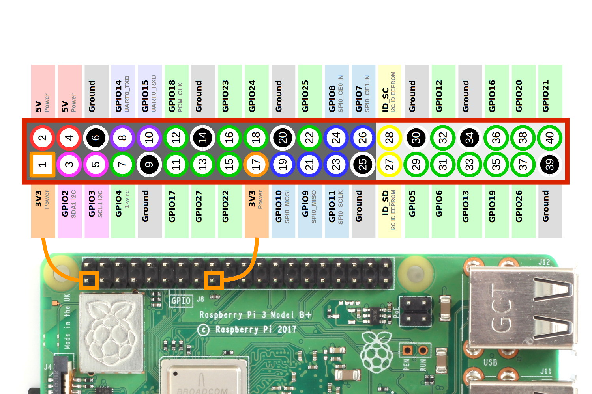

- Ground (grey), 5V (pink), 3V(orange),
- GPIO (either input or output, green)
- Special I/O protocols
  - I2C (magenta)
  - serial (purple)
  - SPI (blue)

---

## Operating system for the RPi

- Raspberry PI OS (previously Rasbian) is the official OS <a href="https://www.youtube.com/watch?v=RDAklos4F8k">YouTube Video</a>
  - derived from Debian Linux
  - command line interface (CLI)
  - graphical user interface (GUI)
- Why you should learn some Linux/Unix commands
  - Mac OS (Terminal app)
  - Windows subsystem for Linux (<a href="https://docs.microsoft.com/en-us/windows/wsl/install-win10">Installation guide</a>)
  - Servers
  - Supercomputer

---

## Breadboard and Jumper Wire

<a href="https://en.wikipedia.org/wiki/Breadboard" > Wikipedia</a>

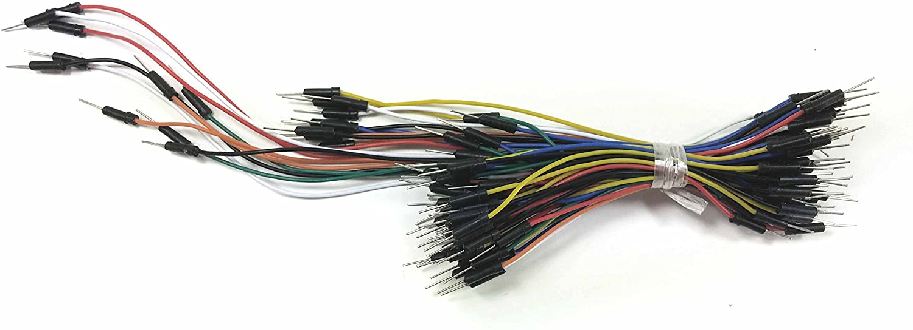

---

## Sensors: Temperature

<a href="https://raspberrypi.stackexchange.com/questions/48357/connecting-ds18b20-temperature-sensor-with-rj45-connector">
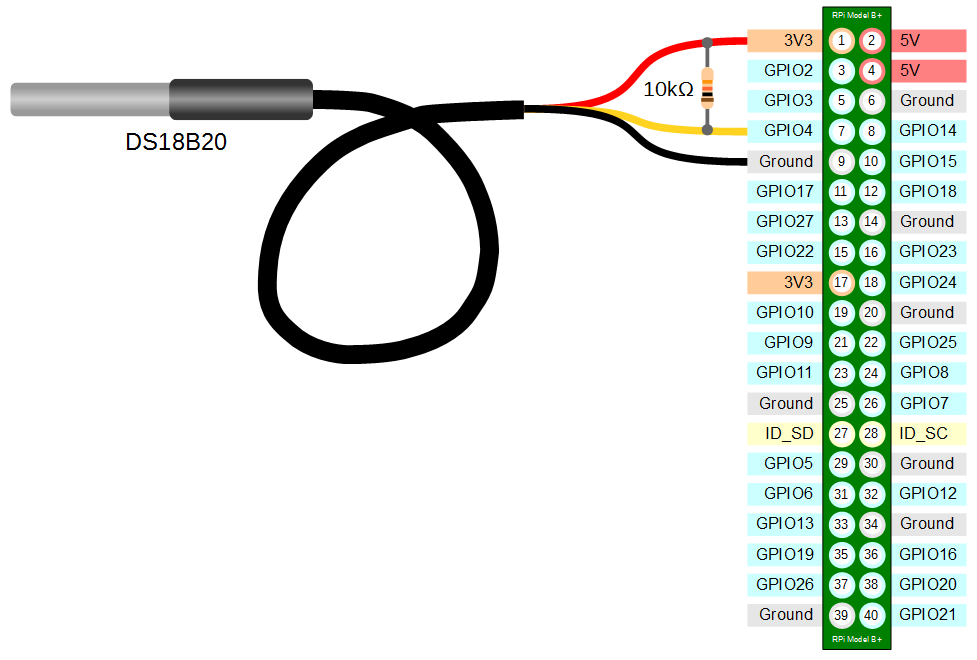</a>

---

## Sensors: Capacitive touch sensor

<iframe width="780" height="560" src="https://www.youtube.com/embed/Wk76UPRAVxI?start=15" frameborder="0" allow="accelerometer; autoplay; encrypted-media; gyroscope; picture-in-picture" allowfullscreen></iframe>

<a href="https://www.forbes.com/profile/limor-fried/?list=top-tech-women-america#2077af9a4ecc">America's top 50 women in tech, 2018</a>

<a href="https://www.adafruit.com/product/1982"> MPR121 Touch sensor (Adafruit) </a>

---

## Sensors: Camera

---

## Radio frequency ID

---

## Sensors: RFID reader (UART)

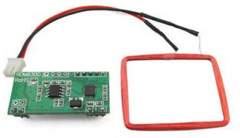

---

## Sensors: RFID reader (USB)

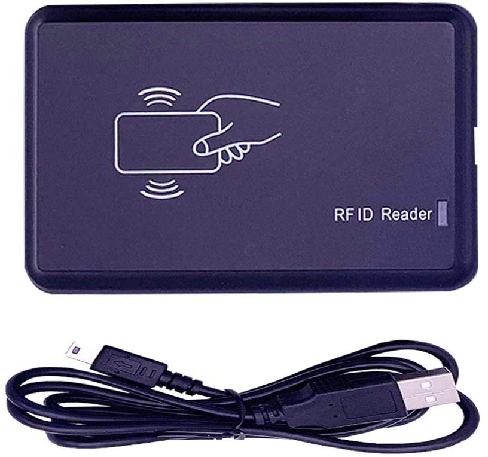

---

## Sensors: Infrared light

### "beam break"

---

## Output: LED

---

## Input/Output: LCD with touch sensors

<iframe width="780" height="560" src="https://www.youtube.com/embed/Fj3wq98pd20?start=30" frameborder="0" allow="accelerometer; autoplay; encrypted-media; gyroscope; picture-in-picture" allowfullscreen></iframe>

---

## Output: e-link display

---

## Output: Step motor

<a href="https://www.youtube.com/watch?v=C-6IK3zF1jg">YouTube Tutorial</a>

---

## Many many more

---

## Microcontrollers

### Arduino

<a href="https://docs.arduino.cc/learn/starting-guide/getting-started-arduino/"> Input-Output Coupling</a>

---

## 3D printing

<iframe width="780" height="560" src="https://www.youtube.com/embed/ZcohRrFfmvc?start=404" frameborder="0" allow="accelerometer; autoplay; encrypted-media; gyroscope; picture-in-picture" allowfullscreen></iframe>

---

## Example 1: RFID reader

<a href="https://github.com/chen42/openbehavior/tree/master/RFID">
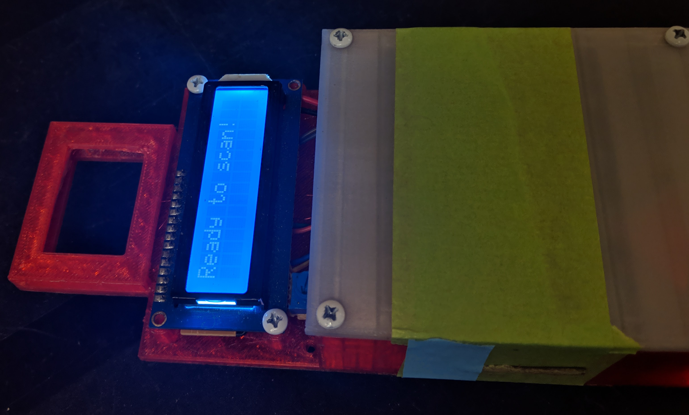</a>

---

## Example 2: Improved RFID reader

<a href="https://github.com/chen42/openbehavior/tree/master/RFID">
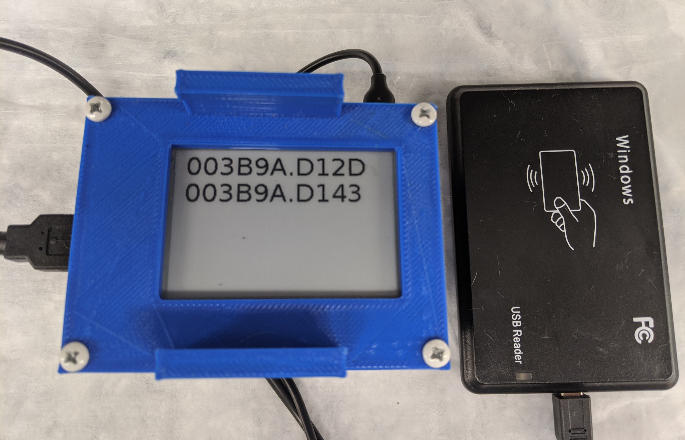</a>

---

## Example 3: Environment sensor

---

## Example 4: Operant Licking

<a href="https://peerj.com/articles/2981/"> Peer J Article </a>

---

## Example 5. Tremor

---

## Example 6: Video Recorder

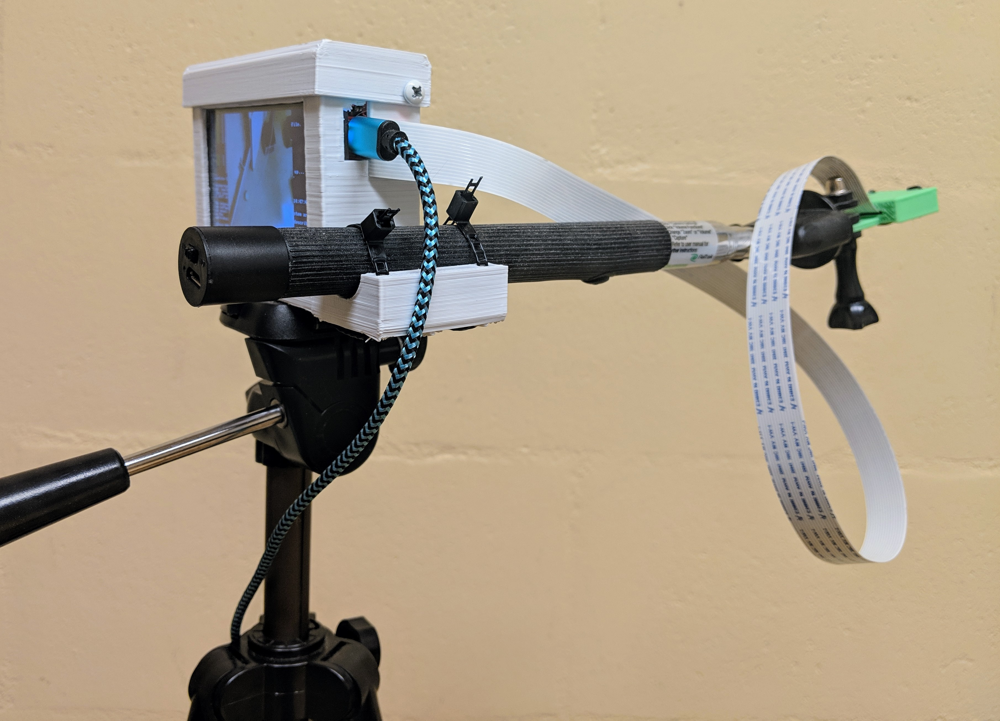

---

## Example 7: Zelfish

<a href="https://www.sciencedirect.com/science/article/pii/S016643281730801X?via%3Dihub">Zebrafish opioid self-administration </a>

<table> <tr><td>

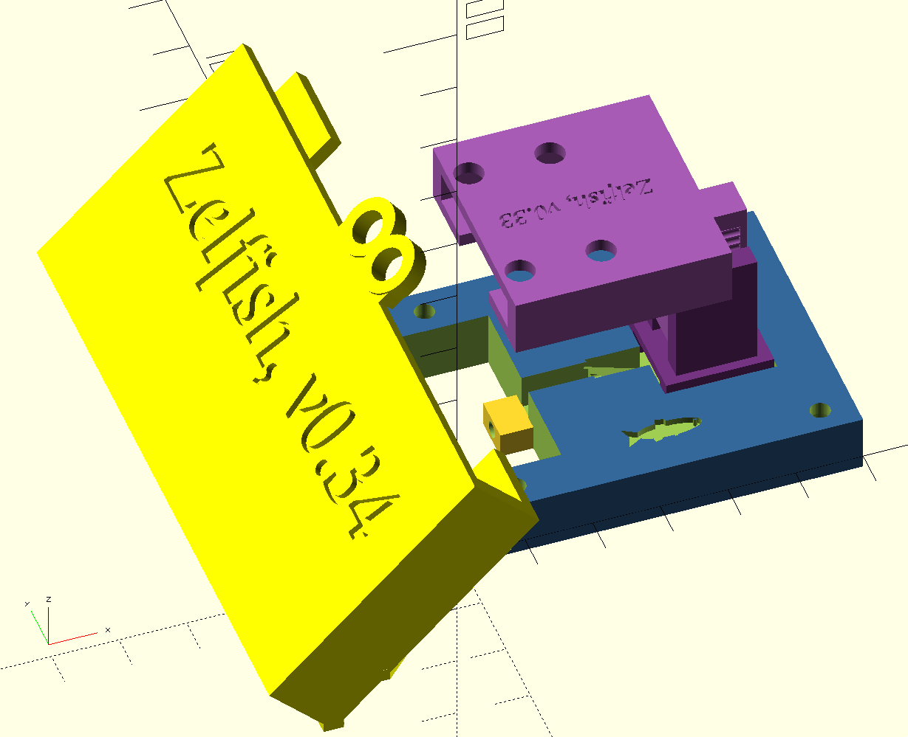
</td>

<td>

</td></tr></table>

<a href="https://photos.app.goo.gl/nR7o1ozhLZFYLRyWA">zebrafish in test chamber</a>

---

## Example 8: BlueBerry

---

## Example 8: BlueBerry

<a href="https://photos.google.com/photo/AF1QipNElegK0tDER-Wexms8bVeLN1nfKQzXcg8WBEWH">Stimulation of superior colliculus </a>

---

## Example 9. TailTimer

<a href="https://github.com/chen42/openbehavior/tree/master/RFID">
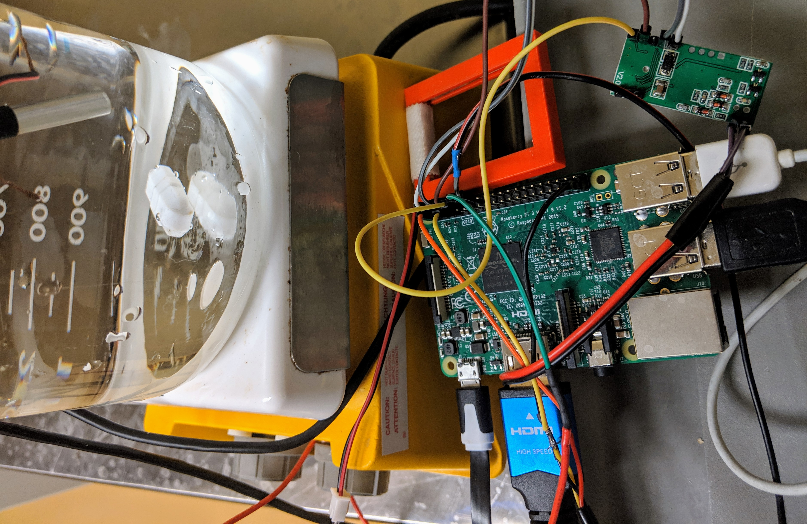
</a>

<a href="https://journals.plos.org/plosone/article?id=10.1371/journal.pone.0256264"> TailTimer Paper </a>

---

## Example 10. PeerPub

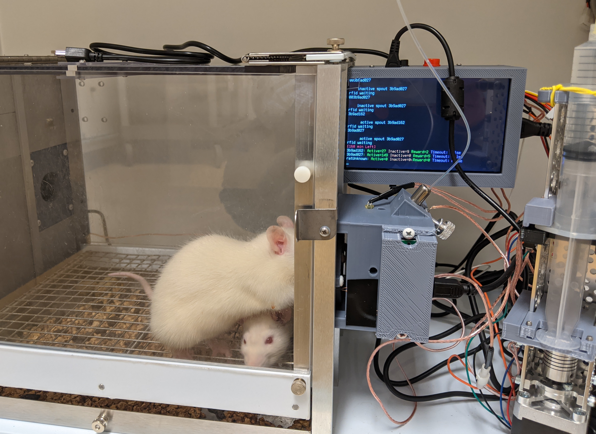

<a href="https://pmc.ncbi.nlm.nih.gov/articles/PMC11728851/"> PeerPub Paper</a>

---

## Example 11: HomeBrew

Tracking two rats independently during oral operant self-administration

<a href="https://github.com/miraclezero/HomeBrew">
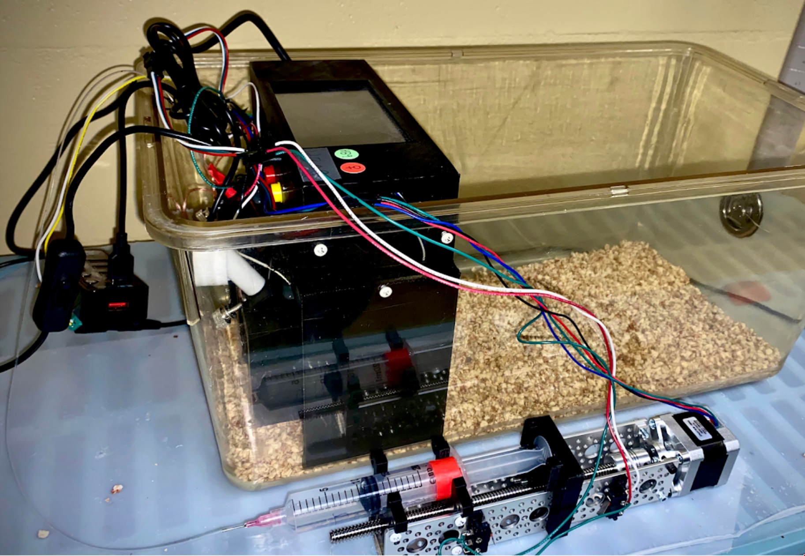
</a>

---

## Hands on

- Linux command line
  - <a href="https://chen42.github.io/slides/linux.html"> Hao's tutorial </a>
- 3D design using openscad
  - <a href="https://www.makeuseof.com/tag/beginners-guide-openscad-programming-3d-printed-models/">Makeuseof.com tutorial</a>
  - <a href="http://edutechwiki.unige.ch/en/OpenScad_beginners_tutorial#Primitive_Solids"> EduTech Wiki</a>
  - <a href="https://www.youtube.com/playlist?list=PLDhWPyde5E_Rz7LghBXmnhhY9F8X7k503">Patrick Conner YouTube series</a>

- 3D design using FreeCAD
  - <a href="https://www.youtube.com/watch?v=sxnij3CkkdU">Youtube: FreeCAD for beginners</a>
  - <a href="https://wiki.freecadweb.org/Tutorials">Official Tutorials</a>

- Replicable data analysis using AI agents
  - <a href="https://wwww.github.com/chen42/beaver-data">Beaver Data</a>

- Survey of open source behavior devices
- Your ideas
