# Genetic and genomic factors influencing voluntary nicotine intake in rats

## Hao Chen

### Department of Pharmacology, Addiction Science and Toxicology

### UTHSC

Dec 3rd, 2024

---

## Cigarette smoking and lung cancer

- Cigarette smoking accounts for over 90% of lung cancer cases
- Risk of lung cancer increases with duration of smoking
- Passive smokers are also at higher risk of lung cancer
- Mutagens and carcinogens in cigarette smoke promotes cancer
- Vaping products and e-cigs also contain carcinogens
- Nicotine may also promote tumor growth

Note: although long-term effects require further investigation.

---

## Voluntary nicotine consumption in rats

<table><tr><td width=60%>

Credit: biorender

</td>
<td>

- Operant nicotine self-administration
  - lever pressing models
  - nose poke models
  - lick models

</td>

</tr></table>

---

## Outline

- GWAS on socially-acquired nicotine self-administration
  - outbred
  - Hi-C
  - eQTL
- QTL mapping on menthol cue for nicotine self-administration
  - inbred
  - whole genome sequencing
  - T2T assemblies, pangenome
  - direct RNA-seq

---

## Nicotine is primarily aversive in non-smokers

<table>
 <tr>
 <td width=50%>
 
 </td>
 <td width=90%>
 
 </td>
 </tr>
 <tr>
 <td>
 Coughing, nausea, dizziness, sickness, burning throat, headache.
 </td>
 <td>
 Nicotine induces drug high only in <em>significantly nicotine-deprived smokers</em>. 
 </td>
 </tr>
</table>

---

## Nicotine conditioned taste aversion in rats

 Kumar, et. al., Br J Pharmac 1983

Note: https://www.ncbi.nlm.nih.gov/pmc/articles/PMC2044849/?page=3
flavors: sodium sacchaine vs sodium chloride
water access were limited to 1 h per day. flavors were presented every other day, followed by nicotine vs saline injections, s.c.

---

## Flavor cues conditioned to self-administered nicotine is aversive

 Chen, et al., Neuropsychopharmacology, 2011 

Note:
We previously reported that
adolescent rats developed conditioned aversion to an appetitive flavor cue (saccharine + grape odor) associated with self-administered i.v. nicotine. In this operant <i>licking</i> model, oral flavor cue and <strong>i.v.</strong> nicotine were delivered simultaneously upon the completion of a fixed-ratio 5 reinforcement schedule.

---

## Social influence is a key factor in smoking initiation

 

 

---

## Social transmission of food preference in rats

Galef,  Curr Protoc Neurosci, 2003

---

## Social learning enables nicotine self-administration

 Chen, et al., Neuropsychopharmacology, 2011 

Note:
However, with the presence of a "demonstrator" rat consuming the same flavor cue, nicotine i.v. self-administration was established.
No water or food deprivation or operant pretraining is needed. Thus the model is appropriate for studying smoking initiation in adolescents.

---

## Flavor cue with greater appetitiveness does not support nicotine IVSA

 Chen, et al., Neuropsychopharmacology, 2011 

---

## Social learning supports nicotine IVSA with an aversive flavor cue

 Wang, et al., Psychopharmacology, 2016 

Note:
We further reported that even when an aversive (i.e. quinine) flavor was used in place of the appetitive flavor, adolescent rats obtained nicotine IVSA, with the presence of a demonstrator consuming a flavor cue containing the same odor as the nicotine cue (i.e. inducive social environemnt (<b>ISE</b>). The number of nicotine infusions were almost identical between the two cues. <b>Therefore, licking on the active spout is most likely motivated by nicotine in this model</b> The reduced licks on the active spout was due to the reduction of licking during the timeout period following nicotine and cue delivery.

<b>NSE</b>: neutral social environemnt, i.e., the presence of a companion rat.
<b>ISE</b>: indusive social environment, i.e., the presences of a companion rat who has access to the flavor cue.
<b>AV</b>: audiovisual cue

---

## Aversive vs appetitive flavor cue

 Wang, et al., Psychopharmacology, 2016 

---

## What is transmitted from the demonstrator?

---

## Social learning is mediated by Carbon Disulfide (CS2) in rats

 
 

---

## Both CS2 and flavor cue are necessary for socially acquired nicotine IVSA

 Wang, et al., PLoS One, 2014 

Note:
We confirmed that neither nicotine associated flavor cue nor carbon disulfide alone supported nicotine IVSA. However, their combination was sufficient to replicate the behavior induced by live demonstrator rats.

---

<section id="cta1">

## Social learning facilitates the extinction of conditioned nicotine aversion

 Han, et al., Sci Report, 2017 

---

## Nicotine intake is heritable

### h2=0.54-0.65 estimated using 12 isogenic strains across two doses

 Han, et al., Sci Report, 2017 

---

### Summary

## Socially acquired nicotine IVSA in adolescent rats

- Nicotine has both aversive and reinforcing properties
- Flavor cues are associated with the aversive property of nicotine
- Social learning facilitates nicotine intake by
  - enhancing the extinction of nicotine CFA, and not by
  - increasing the appetitiveness of the flavor cue
- Operant responding is driven by the rewarding property of nicotine
  - dose response to nicotine across multiple strains
  - nicotine can be self-administered with an aversive flavor cue

---

## Heterogeneous stock rats

### Leah Solberg Woods, Wake Forest School of Medicine

<table><tr><td width=20%>
</b>
</td>
<td width=80%>

 Garret and Korstanje, Trends Genet, 2020
</td>
</tr></table>

---

## Socially acquired nicotine self-administration in HS rats

### 52 adult males and 48 adult females

 Wang, et al., Gene Brain Behav, 2014

---

## Experimental design

| Age        | Test                                              |
| ---------- | ------------------------------------------------- |
| PND21      | Wean, Body weight                                 |
| PND31      | Open field                                        |
| PND32      | Novel object                                      |
| PND33      | Social interaction in the same arena as openfield |
| PND34      | Elevated plus maze                                |
| PND38      | Surgery                                           |
| PND39 - 41 | Recovery                                          |
| PND42 - 51 | Socially acquired nicotine IVSA                   |
| PND52      | Progressive ratio test                            |
| PND53 - 56 | Extinction                                        |
| PND57      | Contextual cue induced reinstatement              |
| PND59      | Tissue Collection                                 |

<table width=80%><tr><td>
We phenotyped 1600 adolescent heterogeneous stock rats on socially acquired nicotine IVSA using an flavor cue containing CS2. We also collected other behavioral traits before nicotine IVSA was started. Spleen from each rat was collected for genotyping once behavioral tests were completed. 
</td></tr></table>

---

## Nicotine self-administration

Adolescent HS rats (711 F, 711 M)

---

## Genotyping and GWAS

### Abraham Palmer, UCSD

<table> <tr>
	<td width=50%>
		
  

		

		 Gileta et al., G3, 2020. 
		

	</td>
	<td width=50%>
		

		 
		

		

		<ul>	
			<li> 3.5 million SNPs per individual (estimated error rate <1%)
			<li> GCTA with liner mixed model
			<li> Leave one chromosome out procedure
			<li> Genome-wide significance level set by permuation: -log10(p) > 5.6 
		</ul>
	</td>
</tr>
</table>

---

## Summary of GWAS

| Behavior                        | Sample size  | N traits | N sig. QTL |
| ------------------------------- | ------------ | -------: | ---------: |
| open field                      | 626 M, 620 F |        6 |          9 |
| novel object interaction        | 623 M, 622 F |        6 |          7 |
| social interaction              | 664 M, 664 F |       11 |         14 |
| elevated plus maze              | 659 M, 658 F |       10 |          8 |
| socially acquired nicotine IVSA | 711 M, 711 F |       63 |         30 |

---

## GWAS on behaviors tested before nicotine IVSA

<table><tr><td>

OFT

</td>

<td>

NOIT

</td>
</tr><td>

SIT

</td>

<td>

EPM

</td></tr></table>

Gunturkun, et.al., Front Psychiatry, 2022</a>

---

## Candidate genes for OFT, NOIT, SIT

Gunturkun, et.al., Front Psychiatry, 2022</a>

Note:
We identified 17 candidate genes (Adarb2, Ankrd26, Cacna1c, Cacng4, Clock, Ctu2, Cyp26b1, Dnah9, Gda, Grxcr1, Eva1a, Fam114a1, Kcnj9, Mlf2, Rab27b, Sec11a, and Ube2h) for these traits. Many of these genes have been implicated by human GWAS of various psychiatric or drug abuse related traits.

---

## Porcupine plot: socially acquired nicotine IVSA

---

## Slope of nicotine intake chr8:4459578

There are 32 known genes in this 5.1 Mb interval. Gria4 is a candidate gene.

- Prioritizing candidate genes
  - mis-sense variants
  - expressed in relevant brain regions
  - cis-eQTL
  - relevant biological function
  - associated with related traits in human GWAS
  - chromatin interaction
  

---

<table> <tr>
<td width=40%>
	

	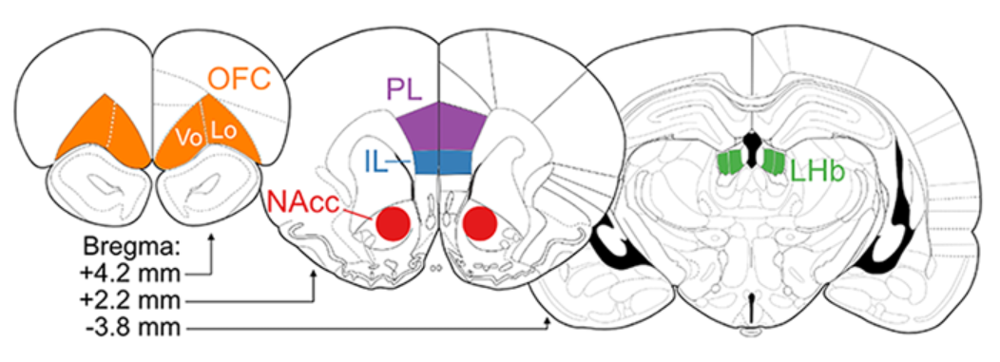
                 
	
	

</td>
<td width=60%>
	
</td>
</tr></table>

 Munro, et al., Nucleic Acids Research 2022

---

## GeneCup for literature mining

http://genecup.org is designed to take a list of gene symbols and mine the PubMed and GWAS catalog for sentences pertain to addiction.

 Gunturkun, et. al., G3, 2022

---

## The genome is 3D

Source: Nature Reviews Molecular Cell Biology v22, p511–528 (2021)

---

## Hi-C experimental procedures

Source: Aaron T.L. Lun & Gordon K. Smyth BMC Bioinformatics 2015

---

## Hi-C is a method to find 3D interactions

### Rob Williams (GGI), Burt Sharp (GGI)

### Rachel Ward, Panjun Kim (Chen Lab)

---

## Hi-C is a method to find 3D interactions

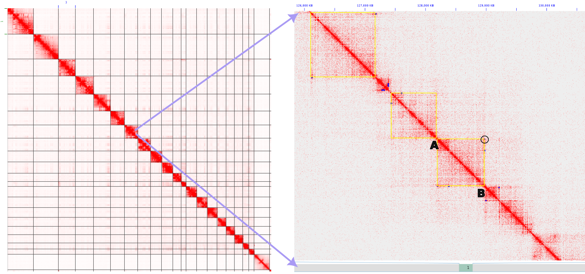

---

## Hi-C is a method to find 3D interactions

---

## Loops from PFC of 10 inbred rats

31,773 loops detected

---

## Overlap between loop & CTCF

---

## Overlap between loop & TSS

---

## Overlap between loop & Promoter

---

## Loops supported by CTCF and has TSS or Promoter

18,216 / 31,773 = 0.57

---

## Loops help identify candidate genes

Both Ist1 and Dhx38 have cis-eQTL. Ist1 is a human smoking initiation gene. Ist1 is involved in endosomal sorting.

---

## Candidate gene: LINC02337

Human GWAS: Pack years

PackYears: Cigarettes per day divided by 20, multiplied by number of years smoking

Rat GWAS: Total nicotine infusion

Common: total overall exposure to tobacco/nicotine.

<table> <tr> <td width=50%>

</td>
<td>

<a href="https://www.ebi.ac.uk/gwas/variants/rs2026174" target=_new> LINC02337 </a>

<a href="http://genome.ucsc.edu/cgi-bin/hgTracks?db=hg38&lastVirtModeType=default&lastVirtModeExtraState=&virtModeType=default&virtMode=0&nonVirtPosition=&position=chr13%3A110979763%2D112075449&hgsid=1385374851_DFWqHgcyTThiDJV0a0SLgElBbEDP" target=_new> Is Arhgef7 more likely?</a> Arhgef7 expression is FPKM=30 in our dataset. It is involed in spine morphogenesis. Loss of Arhgef7 results in extensive loss of axons (PMID:30683798, PMID:29891904)

Exome Chip Meta-analysis Fine Maps Causal Variants and Elucidates the Genetic Architecture of Rare Coding Variants in Smoking and Alcohol Use 
Brazel, et. al., Biol Psychiatry 2019

</td></tr></table>

Note:

---

## Candidate genes: Cacna1c

### Brendan Tunstall, Dean Kirson (PHAST)

<table> <tr><td width=70%>
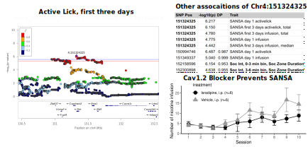

</td><td width=30%>

<a href="https://genecup.org/cytoscape/?rnd=tmpexEhqs&genequery=Cacna1c" target=_new>
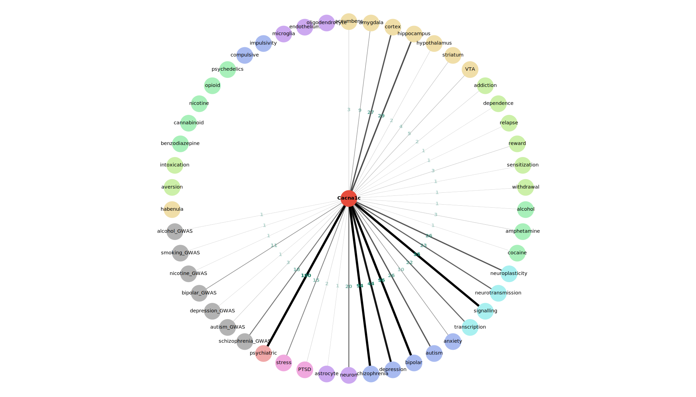
</a>
</td></tr></table>

---

## Multi-species validation

- C.elegans (Changhoon Jee, PHAST)
- Zebrafish (Thiru Vaithianathan, PHAST)
- Rat CRISPR/Cas9 (Burt Sharp, GGI)

---

## Gria4 null mutation abolishes nicotine CCP

---

## Zebrafish Nicotine Conditioned Place Preference Test

<table><tr><td width=50%>

</td><td>

</td></table>

---

## Generating gene knockout zebrafish using base editor

---

## Validating causal relationship using cell-type specific genome editing

<table><tr>

<td width=50%>

</td>
<td>

</td>

</tr></table>

 Sharp et. al., Scientific Report, 2024

---

## The cooling sensation of menthols is a conditioned cue for nicotine reward

 Wang et. al., Front Behav Neurosci. 2014 

---

## Using the hybrid rat diversity panel for mapping

#### Mindy Dwinell, Anne Kwitek (MCW), Laura Saba (Univ Colorado), Rob Williams (UTHSC)

---

## Whole genome sequencing of the HRDP

 de Jong, et al. Cell Genomics, 2024 

---

## Phylogenetic tree of laboratory rats

---

## First rat pangenome

### Flavia Villani, Andrea Gurracino, Erik Garrison, Enza Colonna (GGI)

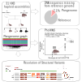

 Villani, et al. iScience, in press 

---

## Nanopore Sequencing

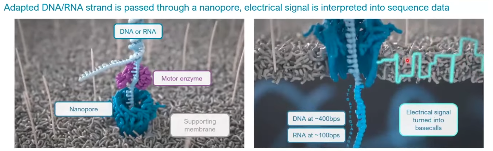

---

## ONT ultralong sequencing of SHR x BN-Lx F1

### Rob Williams, Burt Sharp, Erik Garrison (GGI)

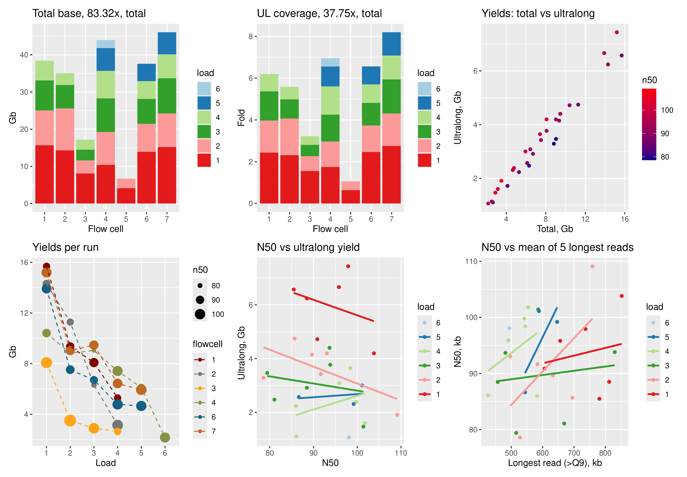

---

## Initial T2T assembly

### Andrea Guarracino, Erik Garrison (GGI)

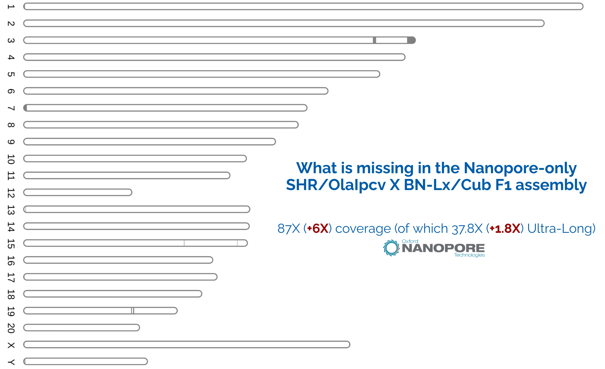

---

## Direct RNA-seq using ONT

<table><tr><td>

<h3>via cDNA</h3>

- Lost of base modification
- Lost of polyA tail length
- Short reads
- Potential PCR bias

</td><td>

<h3> Native RNA</h3>

- Base modification
- PolyA length
- Long (full length) reads
- No PCR bias

</td></tr></table>

---

## Rat Accumbens direct RNA

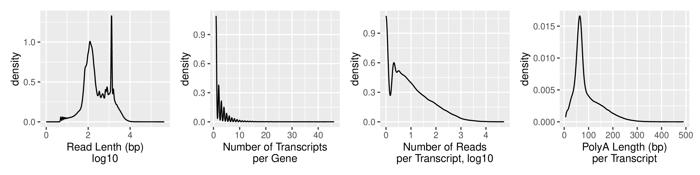

---

## Ncam1 Transcripts (Jbrowse2)

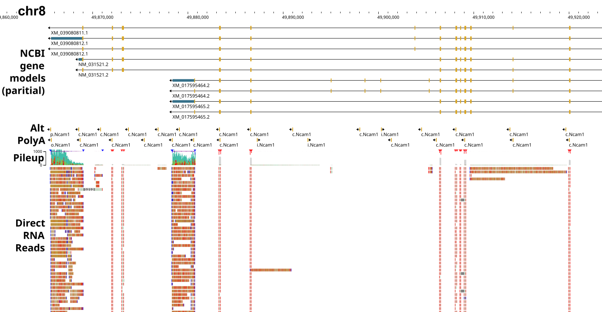

---

## Ncam1 Transcripts (Jbrowse2)

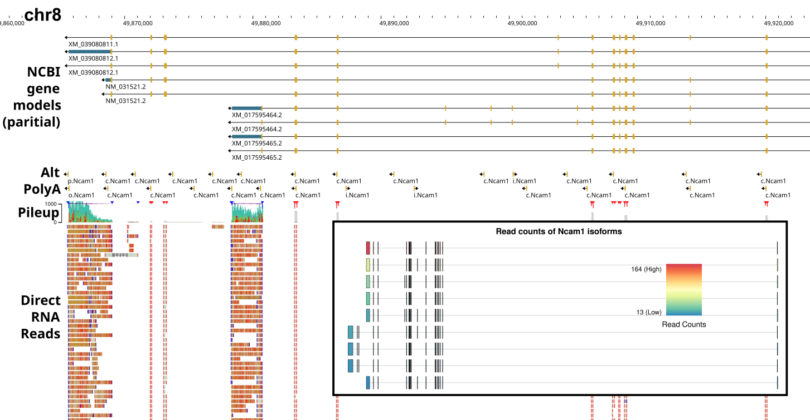

---

## Ncam1 Transcripts (Jbrowse2)

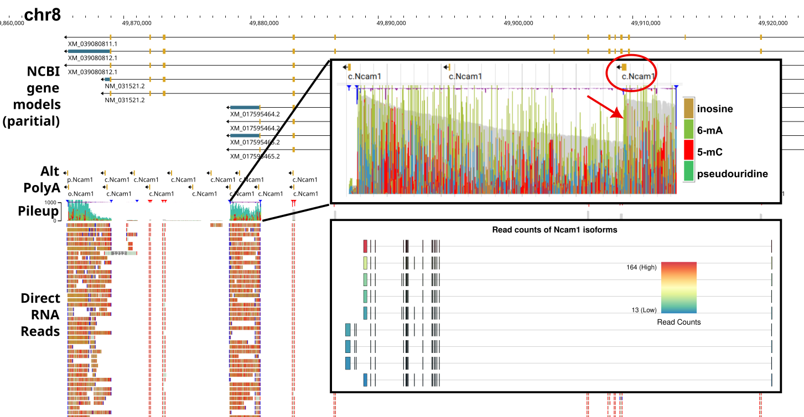

---

## Modified RNA base on Chr1

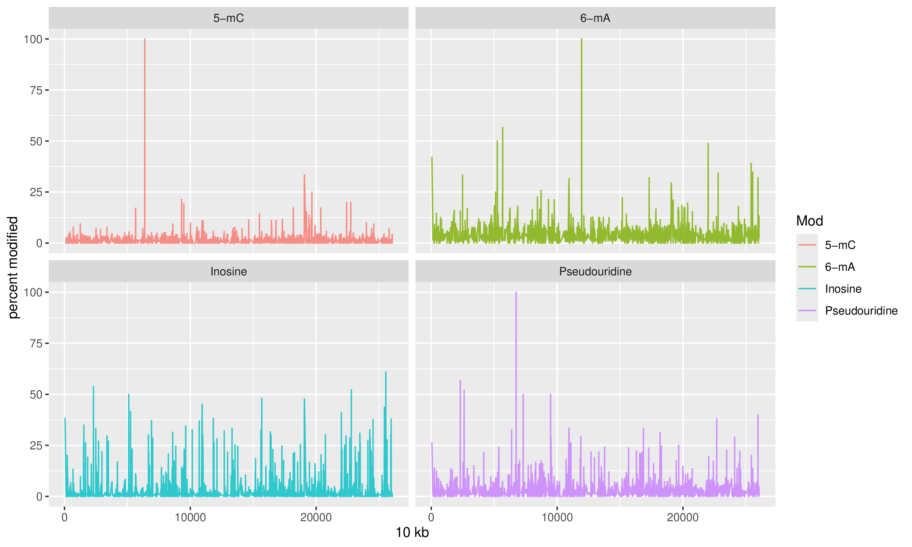

A-I mod is mediated by the <a href="https://www.ebi.ac.uk/gwas/genes/ADAR">ADAR</a> enzyme

---

## Acknowledgments

<table width=80% ><tr align=center>
<td width=25%>

 Caroline Jones</a>

</td>

<td width=25%>

 Shuangying Leng

</td>

<td width=25%>

 Rachel Ward</a>

</td>

<td width=25%>

 Jun Huang </a>

</td>

</tr>
</table>

  <!--- REHU students Abigale Salinero (2015) | Cindy Tay (2016) | Raven David (2017) | Christian Hurt (2018) | Gwen Johnson (2021) | Olivia Harrison (2022, 2023) | Ryan Luib (2023)
    --->

- P50 collaborators
  - Abraham Palmer | Oksana Polesskaya | Thiago Sanches | Apurva Chitre | Leah Solberg-Woods
- PhD students
  - Panjun Kim | Mallory Udell | Paige Lemen
- UTHSC collaborators
  - Changhoon Jee | Burt Sharp | Thirumalini Vaithianathan | Rob Williams | Brendan Tunstall | Dean Kirson | Erik Garrison | Enza Colonna
- Past technicians and analysts
  - _Tengfei Wang_ | _Xia Hong_ | _Jie Shen_ | _Wenyan Han_ | _Pawandeep Kaur_ | _Yanyan Lin_ | _Xinyu Fan_ | _Mallory Udell_ | _Gwen Johnson_ | _Hakan Gunturkun_ | _Angel Garcia Martinez_ |

Funding: NIDA P50DA037844 (Chen) U01DA053672 and U01DA057530 (Sharp, Chen, Williams)
