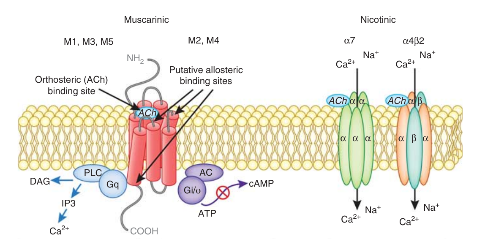
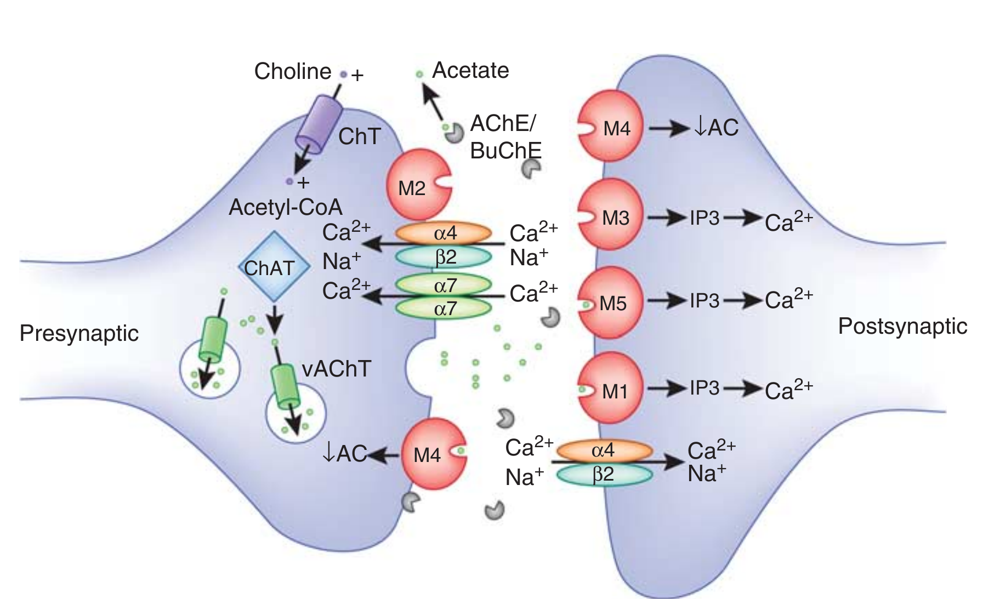

## Pharmacology 
----
# Cholinergic Antagonists 
----

Dr. Hao Chen 

Dept. Pharmacology, UTHSC

hchen@uthsc.edu

URL: http://chen42.github.io/slides/cho_at.html

Aug 15, 2019, 11-12  AM

Aug 16, 2018, 1-2 PM

---

## Conventions 
#### used in this document 

* Color and style theme: 
	* Drug name: <span id="drug"> Enfuvirtide</span>
	* Links: [Clinicalkey](https://www.clinicalkey.com/#!/). 
		* You need to login via your UTHSC netid when off campus to use e-textbooks. 
		* [VPN](http://uthsc.edu/vpn/index.php) provides a better experience. 
	* [Printable](http://chen42.github.io/slides/cho_at.html?print-pdf#/) version 
* Open link in a new browser tab:
```
CTRL click
```
* Navigate the slides:
```
<- or -> 
Space_bar 
Page_down or Page_up 
Home or End
```
* To zoom in or out:
``` 
CTRL + or CTRL -
CTRL mouse_wheel_up or CTRL mouse_wheel_down 
```


<small>

Written using <a href="https://github.com/hakimel/reveal.js"> Reveal.js </a> and <a href="https://guides.github.com/features/mastering-markdown/"> Markdown</a>

</small>


---


## Textbook chapters used

[Cholinoceptor-Blocking Drugs](http://accessmedicine.mhmedical.com/content.aspx?bookid=1193&sectionid=69104442) Katzung and Trevor, Basic & Clinical Pharmacology, 13e

[Acetylcholine Receptor Agonists](https://www.clinicalkey.com/#!/content/book/3-s2.0-B9780323391665000074) Brenner and Stevens, Pharmacology, 5e. 

Supplemental materials: [Drug Monographs](https://www.clinicalkey.com/#!/browse/drugs),  PubMed articles 

---

## Learning Objectives

* Describe classes of anticholinergics.
* Describe effects of anticholinergics on organ systems.
* Describe therapeutic uses of anticholinergics.
	* Explain the rationale for the therapeutic use of muscarinic antagonists in diseases such as bronchoconstriction, excessive salivation, and motion sickness. 
	* Explain the rationale for the therapeutic use to produce mydriasis and cycloplegia.

---

## Learning Objectives
* Describe side effects and drug interactions of anticholinergics.
	* Explain why muscarinic antagonists cause xerostomia, blurred vision, photophobia, tachycardia, anhidrosis, difficulty in micturition, hyperthermia, glaucoma and mental confusion in the elderly.
	* Explain why muscarinic antagonists are contraindicated in glaucoma, obstructive disease of the gastrointestinal tract or urinary tract, intestinal atony.
	* List the adverse effects of drug acting at autonomic ganglia.
* Describe the use of neuromuscular blockers in general anesthesia
	* Explain the selection criterior of neuromuscular blockers 
	* Explain the cause of hyperkalemia and malignant hyperthermia
* Describe the principles of treating cholinergic poisoning

---

## Drug List 

<table><tr><td>

<b> Muscarinic Antagonists</b> <p>
Atropine<br>
Cyclopentolate (Cyclogyl)<br>
Darifenacin (Enablex)<br>
Dicyclomine (Bentyl)<br>
Glycopyrrolate (Robinul)<br>
Hyoscyamine (Anaspaz)<br>
Ipratropium (Atrovent)<br>
Oxybutynin (Ditropan)<br>
Scopolamine<br>
Solifenacin (Vesicare)<br>
Tiotropium (Spiriva)<br>
Tolterodine (Detrol)<br>
Tropicamide (Mydriacyl Ophthalmic)<br>
Trospium (Spasmex)<br>
<br>
</td>

<td>
<b>Ganglionic Blockers</b><p>
Mecamylamine (Inversine)<br>

<b>Neuromuscular Blockers</b><p>
Atracurium (Tracrium)</br>
Cisatracurium (Nimbex)</br>
Pancuronium (Pavulon) </br>
Rocuronium (Zemuron)</br>
Succinylcholine (Anectine, Quelicin)</br>
Vecuronium (Norcuron)</br>

</td></tr></table>

---

## outline
<ol>
<li> Cholinoreceptors
<li> Antimuscarinic
	<ol type="a"><li> Organ System Drug Effects
		<li> Atropine / Scopolamine
		<li> Synthetic Antimuscarinics
	</ol>
<li> Antinicotinic 
	<ol type="a"> 
		<li>Nicotinic Ganglionic Blockers
		<li>Nicotinic Neuromuscular Blokers
		</ol>
<li> Cholinergic Poisoning
</ol>


---

<section id='diagram'>

## Sites of drug actions


<br>

<small>What if sympathetic and parasympathetic system are <a href="http://chen42.github.io/slides/cho_ag.html#/vaspara"> both stimulated</a>?</small>

---

<section id="alpha7">

## Cholinergic receptors

<a href="https://www.ncbi.nlm.nih.gov/pmc/articles/PMC3238081/figure/fig2/"></a>

<small>Each mAChR subtype is a seven-transmembrane protein, which belongs to two major functional classes based on G-protein coupling. The M1, M3, and M5 mAChRs selectively couple to the Gq/G11-type G-proteins resulting in the generation of inositol-1,4,5-trisphosphate (IP3) and 1,2-diacylglycerol (DAG) through activation of the phosphoinositide-specific phospholipase-C&beta; leading to increased intracellular calcium levels. The M2 and M4 mAChRs preferentially activate Gi/Go-type G-proteins, thereby inhibiting adenylate cyclase, reducing intracellular concentration of cAMP, and prolonging potassium channel opening. Neuronal nAChRs are pentameric ligand-gated ion channels. The most abundant neuronal subunits are &alpha;4, &beta;2, and &alpha;7, with the heteromeric &alpha;4&beta;2 receptor subtype in highest abundance. </small>

[Neuropsychopharmacology. 2012 Jan;37(1):16-42.](https://www.ncbi.nlm.nih.gov/pubmed/21956443 )

---

## mAChR subtypes

<a href="https://www.ncbi.nlm.nih.gov/pmc/articles/PMC3238081/figure/fig1/"></a>
<small>
The M2 and M4 mAChRs serve as autoreceptors on cholinergic terminals to suppress ACh release at select synapses in the CNS (left neuron). <font color="darkred">The mAChRs located on non-cholinergic neurons act as heteroceptors controlling the release of other neurotransmitters, such as Dopamine. (not draw) </font> M1, M3, M5, but also M4 mAChRs that are located postsynaptically facilitate slow cholinergic synaptic neurotransmission relative to nAChR subtypes. The alpha7 and alpha4beta2 nAChR subtypes mediate fast synaptic transmission and also use-dependent changes required for neuronal plasticity. These nAChR subtypes can have both pre- and postsynaptic localization. </small>

// The endogenous ligand of these cholinergic receptors, ACh, is synthesized in cholinergic neurons (left neuron) by the enzyme ChAT through the transfer of acetyl-CoA onto choline. Choline uptake is mediated by presynaptic high-affinity choline transporters (ChT). After synthesis, ACh is packaged into synaptic vesicles by the vesicular ACh transporter (vAChT). After neuronal activation-mediated release into the synaptic cleft, ACh can bind to pre- and postsynaptic receptors, or it can be inactivated through hydrolysis by the AChE enzymes, a process that can be inhibited by different substances (eg, organophosphates, AChE inhibitors) to increase synaptic ACh levels. Once ACh is hydrolyzed, choline is transported through the ChTs into the presynaptic terminal, where it is again synthesized into ACh.

---


### cholinergic receptor subtypes 


<table><thead><tr><th> TYPE OF RECEPTOR </th><th> <font color="yellow">PRINCIPAL</font> LOCATIONS</th> <th> MECHANISM OF SIGNAL TRANSDUCTION</th> <th> EFFECTS</th></tr></thead>

<tr><td colspan=4><b>Muscarinic</b></td></tr> 
<tr><td>M 1 </td><td> Autonomic ganglia, presynaptic nerve terminals, and CNS </td><td>Increased IP 3 </td><td>Modulation of neurotransmission</td></tr>
<tr><td>M 2 </td><td> Cardiac tissue (sinoatrial and atrioventricular nodes) </td><td>Increased potassium efflux or decreased cAMP </td><td>Slowing of heart rate and conduction</td></tr>

<tr><td>M 3 </td><td>Smooth muscle and glands </td><td>Increased IP 3 Contraction of smooth muscles and stimulation of glandular secretions </td><td> Vascular smooth muscle Increased cGMP as a result of nitric oxide stimulation Vasodilation</td></tr>

<tr><td colspan=4><b>Nicotinic</b> </td></tr>

<tr><td>Muscle type </td><td>Neuromuscular junctions </td><td> Increased sodium influx </td><td>Muscle contraction </td></tr>

<tr><td>Ganglionic type </td><td> Autonomic ganglia </td><td> Increased sodium influx </td><td> Neuronal excitation </td></tr>

<tr><td>CNS type </td><td>CNS </td><td>Increased sodium influx </td><td>Neuronal excitation
</td></tr>

</table>
<br> cAMP, cyclic adenosine monophosphate; cGMP, cyclic guanosine monophosphate; CNS, central nervous system; IP 3 , inositol triphosphate </br>
</a>

<section id="receptorSubtype">
---

## Major Groups of cholinergic blockers

antimuscarinic = <font color="gray">parasympatholytic </font>

* Muscarinic Receptor Antagonists
	* Belladonna Alkaloids
		* <span id="drug"> Atropine, scopolamine, Hyoscyamine</span> 
	* Semisynthetic and Synthetic Muscarinic Receptor Antagonists
		* hundreds available
		* <span id="drug"> Dicyclomine, Glycopyrrolate, Ipratropium, Oxybutynin, Tropicamide</span> 
* Nicotinic Receptor Antagonists
	* Neuromuscular Blocking Agents
		* Nondepolarizing Neuromuscular Blocking Agents
			* <span id="drug"> Rocuronium, Cisatracurium, Pancuronium</span>
		* Depolarizing Neuromuscular Blocking Agents 
			* <span id="drug"> Succinylcholine </span> 
---

## Antimuscarinics: Structure 
<table><tr><td width=50% align=right>
<a href="http://accessmedicine.mhmedical.com/content.aspx?bookid=1193&sectionid=69104442#1104841776">

</a>
</td><td>
<b>Atropine</b>:  oxygen [red] at [1] is missing 
<p>
<b>Scopolamine</b>: oxygen present
<p>
<b>Homatropine</b>: the hydroxymethyl at [2] is replaced by a hydroxyl group, and the oxygen at [1] is absent.

</td><tr></table>

---

## Antimuscarinics: ADME

* Absorption 
	* tertiary antimuscarinic drugs are well absorbed
	* quaternary antimuscarinic drugs are not well absorbed 
* Distribution 
	* tertiary antimuscarinics are widely distributed in the body.
		* Significant levels are achieved in the CNS within 30 minutes to 1 hour.
	* quaternary derivatives are poorly taken up by the brain and therefore are relatively free of CNS effects.
* Metabolism 
	* the elimination of <span id="drug"> atropine </span> from the blood occurs in two phases: the t1/2 of the rapid phase is 2 hours and that of the slow phase is approximately 13 hours. 
	* Effect on parasympathetic function declines rapidly in all organs except the eye, where it can persist for &gt; 72 hours.
* Excretion 
	* About 50% of the dose is excreted unchanged in the urine. The rest appears in the urine as hydrolysis and conjugation products. 

---

## antimuscarinics: MoA
<table><tr><td align="right">
<ul>
<li> Reversible (surmountable) blockade of muscarinic receptor 
	<ul>
	<li> representative drug: <span id="drug"> atropine</span>
	<li> can be overcome by ACh or cholinomimetics 
	<li> binds to the aspartate in the third transmembrane segment of the heptahelical receptor 
	<li> prevents the release of IP3 and inhibits adenylyl cyclase (<a href="http://accessmedicine.mhmedical.com/data/books/1193/m_kat_ch1_f003.png">inverse agonists</a>)
	<li> sensitivity to atropine: salivary, bronchial, sweat glands >> gastric parietal cells 
	<li> receptor subtype selectivity
		<ul> <li> <span id="drug"> Atropine </span>: no nAChR activity but  non-selelctive for mAChR
		<li> other: moderately selective on mAChRs 
		<li> synthetic antimuscarinics may interact with nAChR or histamine receptors
		</ul>
		</ul>
</td><td>
<a href="http://www.nature.com/nrd/journal/v13/n7/full/nrd4295.html">
</a>
<br>
Nature Reviews Drug Discovery 13, 549-560 (2014) 
</td></tr></table>

---

Antimuscarinics: Organ System Effects

### Central nervous system

Compare with [indirect cholinergic agonists](http://chen42.github.io/slides/cho_ag.html#/cns) [Galantamine](http://chen42.github.io/slides/cho_ag.html#/galantamine) 


* sedative effects, drowsiness, amnesia: <span id="drug"> Atropine, scopolamine </span>
	* initial effect is mild stimulation
* reduce Parkinsons tremor: <span id="drug"> atropine</span> 
* motion sickness (vestibular disturbance): <span id="drug"> Scopolamine </span> 
* high dose cause an acute confusional state known as [delirium](pdfs/anesthprog00291-0025.pdf), which can be reversed by <span id="drug"> [Physostigmine](http://chen42.github.io/slides/cho_ag.html#/stigmine) ([Antilirium](http://chen42.github.io/slides/cho_ag.html#/6))

---

<section id="cycloplegia">

Antimuscarinics: Organ System Effects

### Eye 

Compare with [cholinomimetics ](http://chen42.github.io/slides/cho_ag.html#/eye)

<table><tr><td>
<ul>
<li> reduce lacrimal secretion ("sandy" eyes)
<li> Belladonna (Italian, "beautiful lady")
	<ul> <li><a href="http://www.e-safe-anaesthesia.org/sessions/15_05/gif/ana_1_011_autonomic_nervous_system_08_t1_01_med.gif"> mydriasis </a>
	<li> remove parasympathetic opposition to the sympathetic system in the iris
	</ul>
<li> causes cycloplegia 
<ul>
	<li> defined as the paralysis of ciliary muscle  
	<li> results in the loss of accomondate (i.e. focus on near objects)
		<ul><li> can cause acute close angle glaucoma
		</ul>
</ul></ul></td><td>


<br>
Contraction of ciliary muscle --> accommodation

</td>

</tr></table>


---

Antimuscarinics: Organ System Effects

### Cardiac system 

Compare with [cholinomimetics ](http://chen42.github.io/slides/cho_ag.html#/cardiac)

* sinoatril and atrioventricular nodes
	* blocking the effects of the vagus nerve 
		* tachycardia, increase conduction velocity 
		* low dose i.v. administration results in initial bradycardia 
			* due to block of prejunctiona [M1 auto-receptors](#/9)
			* stimulation of the vagal motor nucleus in the brain stem. 
	* reduce [PR interval](https://en.wikipedia.org/wiki/PR_interval#/media/File:SinusRhythmLabels.svg)	of the ECG 

---

Antimuscarinics: Organ System Effects

### Vascular system 

Compare with [cholinomimetics ](http://chen42.github.io/slides/cho_ag.html#/vascular)

* most blood vessels receive no direct innervation from the parasympathetic system
	* except those in the thoracic and abdominal viscera
	* almost all vessles contain [endothelia muscarinic receptors](http://chen42.github.io/slides/cho_ag.html#/18) &rarr; vasodilation
		* blocked by antimuscarinic drugs

// ### net cardiovascular effect of atropine
* in patients with normal hemodynamics
	* no dramatic effect, tachycardia may occur, but little effect on blood pressure
	* prevent the cardiovascular effect of direct-activing muscarinic agonits

---

<section id="COPD">

Antimuscarinics: Organ System Effects

### Respiratory system

Compare with [cholinomimetics ](http://chen42.github.io/slides/cho_ag.html#/respiratory)

<table><tr><td width=50%>
<ul><li> potent inhibitors of secretions in the upper and lower respiratory tract.
<li> bronchial smooth muscle relaxation and bronchodilation
<ul><li>	 used before inhalant anesthetics to reduce trachea secretion 	 
</ul><li> chronic obstructive pulmonary disease (COPD)
</ul>

In COPD, the small airways are narrowed through thickening of the bronchiolar periphery wall by inflammation and fixed narrowing as a result of fibrosis, disruption of alveolar attachments as a result of [emphysema](http://www.webmd.com/lung/emphysema) and luminal occlusion by mucus and inflammatory exudate. 
</td><td>
		
</td><tr></table>

[COPD review](https://www.ncbi.nlm.nih.gov/pubmed/27189863)

---

Antimuscarinics: Organ System Effects

### Gastrointestinal tract 

Compare with [cholinomimetics](http://chen42.github.io/slidess/cho_ag.html#/urinary)

* dry mouth is a common side effect of antimuscarinics.
* gastric secretion is not as effectively blocked because [other neurotransmitters](http://accessmedicine.mhmedical.com/data/books/1193/m_kat_ch6_f002.png) are involved. 
* gastrointestinal smooth muscle mobility is affected
	* from stomach to colon
	* diminish the tone and propulsive movement
	* relax viscera wall, prolong gastric emptying time.
	* stop diarrhea caused by cholinomimetics. 

---

Antimuscarinics: Organ System Effects

### Genitourinary tract 

Compare with [cholinomimetics](http://chen42.github.io/slides/cho_ag.html#/urinary)

* relaxes smooth muscle of the ureters and bladder ball. 
* treating spasm induced by mild inflammation or surgery. 
* can precipitate urinary retention 

---


Antimuscarinics: Organ System Effects

### Sweat glands

* suppresses thermoregulatory sweating.
* body temperature increase when large dose of Antimuscarinics is given
	* "Atropine" fever in infants and children

// atropic toxicity

---
<section id="scopolamine">


## <span id="drug"> Atropine, Scopolamine</span> 


### ADME
* <span id="drug"> atropine </span> and <span id="drug"> scopolamine</span> are nonionized tertiary amines. 

	* well absorbed from the gut and are readily distributed to the CNS.

* <span id="drug"> scopolamine </span> has longer duration of action and stronger CNS effect than <span id="drug"> atropine </span> 

* excreted in the urine with a half-life of about 2 hours. 


---

## <span id="drug"> Atropine, Scopolamine </span> 
### Ocular Indications
* localized application to produce mydriasis 
	* facilitate ophthalmoscopic examination of the peripheral retina
	* effect of <span id="drug"> atropine, scopolamine </span> can last for days 
		* they bind to pigments in the iris that slowly release the drugs. People with darker irises bind more atropine and experience a more prolonged effect than do people with lighter irises. 
* to produce cycloplegia and permit the accurate determination of refractive errors 
* [cyclopentolate](https://www.clinicalkey.com/#!/content/drug_monograph/6-s2.0-1277) is preferred for inducing cycloplegia and mydriasis (rapid onset of action, lasting a day) for diagnostic purpose. 
* should be only used when both mydriasis and cycloplegia or prolonged action is required 
	* short-lasting mydriasis can be induced by <span id="drug"> phenylephrine </span>, which does not induce cycloplegia.
* reduce muscle spasm and pain caused by inflammation
	* treat iritis and cyclitis (inflammation of the iris and ciliary muscles) associated with infection, trauma, or surgery.
	* long-lasting effects are valuable

---

## <span id="drug"> Atropine, Scopolamine </span> 

### Respiratory Tract Indications

* to reduce salivary and respiratory secretions, prevent airway obstruction in patients who are receiving general anesthetics. 
	* <span id="drug"> scopolamine </span> may cause amnesia associated with surgery 
	* [Glycopyrrolate](#/glycopyrrolate) is mostly used for this purpose 

* no longer used for bronchodilation because of its many adverse effects.
	* e.g., impairs ciliary activity, reducing the clearance of mucus from the lungs and causing accumulation of viscid material in the airways. 
	* [ipratropium](#/ipratropium) is preferred 
	 
---

## <span id="drug"> Atropine, Scopolamine</span> 

### Gastrointestinal and urinary tract Indications

* relieve intestinal or uninary bladder spasms and pain 

* not used to treat peptic ulcer due to large adverse effects. 
	*	a selective muscarinic [M1 receptor](#/receptorSubtype) blocker, [pirenzepine](#/pirenzepine) can be used.


---

## <span id="drug"> Atropine, Scopolamine</span> 

### central nervous system indications

* motion sickness 
	* A transdermal formulation of <span id="drug"> scopolamine</span> can be used to prevent motion sickness. 
	* blocking acetylcholine neurotransmission from the vestibular apparatus to the vomiting center in the brain stem. 
  
* used in the treatment of Parkinson disease.
	* adjunctive therapy with adverse effects 
	* better drugs available

---

<section id="bradycardia">

## <span id="drug"> Atropine, Scopolamine</span> 


### Cardiac Indications
* sinus bradycardia with reduced cardiac output and hypotension or ischemia. 
	* sometimes occurs after a myocardial infarction. 
	* i.v. <span id="drug"> Atropine </span> 
		* blocking the effect of vagus nerve on sinoatrial and atriventricular nodes
		* low dose causes a paradoxical slowing of heart rate 
		* full dose increase heart rate
		* which drug has the opposite effect[??](http://chen42.github.io/slides/cho_ag.html#/cardiac)		
* symptomatic atrioventricular blocking
	* <span id="drug"> atropine </span>  can be used to increase atriventricular conduction velocity.
* primary use of <span id="drug"> atropine </span> 

---

<section id="toxicity">

## <span id="drug"> Atropine, Scopolamine</span> 

### Toxicity

<table><tr><td width=70%>


</td><td width=30%>

</td><tr></table>

Atropine toxicity: "dry as a bone, blind as a bat, red as a beet, and mad as a hatter." 

Treatment: 1. activated charcoal. 2. [Physostigmine](http://chen42.github.io/slides/cho_ag.html#/stigmine) (a tertiary amine with CNS effects)

---

## Other Muscarinic Receptor Antagonists

The pharmacologic effects of these agents are similar to those of atropine, their unique pharmacokinetic properties are advantageous in specific situations. 

---

<section id="glycopyrrolate">

## <span id="drug"> Glycopyrrolate, hyoscyamine </span> 


adjunctive for general anesthesia

* AMDE 
	* <span id="drug"> glycopyrrolate </span> is synthetic quaternary amine. <span id="drug"> hyoscyamine </span> is optical isomer of <span id="drug"> atropine </span> 
	* less CNS effects
	* excreted in the urine with a half-life of about 2 hours. 
* Indications
	* <span id="drug"> glycopyrrolate </span> reduce salivary and respiratory secretions, prevent airway obstruction in patients who are receiving general anesthetics. <span id="drug"> hyoscyamine </span> can also be used. 
	* <span id="drug"> glycopyrrolate </span> reduces chronic severe drooling in patients aged 3 to 16 years with neurologic conditions such as cerebral palsy.
	* <span id="drug"> Hyoscyamine </span> can be used to control hypermotility of the lower urinary tract. 
	* <span id="drug"> hyoscyamine </span> oral or sublingual formations are used to treat intestinal spasms and other gastrointestinal symptoms. Many [other drugs](#/intestinal) are available. 

---

<section id="tropicamide">

## <span id="drug">cyclopentolate,  Tropicamide</span> 

Eye

* synthetic drugs
* topical ocular administration as a mydriatic. 
* given before ophthalmoscopy to facilitate examination of the peripheral retina. 
	* <span id="drug"> cyclopentolate </span> produces maximum mydriatic and cycloplegic effects within 15-60 minutes. The duration of both effects is normally 24 hours. Mydriasis may persist for several days in selected patients. 
	* <span id="drug"> tropicamide </span> has a short duration of action (about 1 hour) and is often preferable for short-term mydriasis. 
*  Why induce [cycloplegia](#/cycloplegia) to measure refraction error [ref](https://www.omicsonline.org/cycloplegic-refraction-in-children-with-cyclopentolate-versus-atropine-2155-9570.1000239.pdf) 
	* refraction power of the eye is determined by 
		* static power (cornea, lens)
		* accomondation power (mainly cililary body, contains mAChR)
		* accurate measurement of refraction in children need to eliminate the accomondation component. Adults are less affected.

 <small>There is no statistically significant difference between <span id="drug"> cyclopentolate </span> and <span id="drug"> tropicamide </span> for either cycloplegic retinoscopy or distance subjective refraction.
[Optom Vis Sci. 1993 Dec;70(12):1019-26.](https://www.ncbi.nlm.nih.gov/pubmed/8115124) </small>

---

<section id="ipratropium">

## <span id="drug"> Ipratropium, Tiotropium </span> 


respiratory tract

* ADME and MoA
	* quaternary amine derivatives of atropine, structurally similar 
		* not well absorbed from the lungs into the systemic circulation,
	* administered by <u>inhalation</u> to patients with obstructive lung diseases. 
	* main difference is duration of action. 
		* <span id="drug"> Tiotropium </span> *once* daily dosing
		* <span id="drug"> ipratropium </span> requires *four* times daily dosing
* Indications
	* <span id="drug"> Ipratropium </span> is a first line drug for patients with mild stable [COPD](#/COPD), and a second line drug for exercise-induced bronchospasm 
	* <span id="drug"> Tiotropium </span> may be used in all groups of COPD patients with varying symptoms and risks of exacerbations as monotherapy.
	* <span id="drug"> Tiotropium </span> is the first long-acting anticholinergic agent to be approved for long-term asthma maintenance therapy in the US. 
	* <span id="drug"> Ipratropium </span> and <span id="drug"> Tiotropium </span> are often combined with beta-agonist treatments during severe, acute asthma exacerbations.


// atropine ->  trophy -> metal -> chest 

---

<section id="intestinal">

## <span id="drug"> <u>Di</u>cyclomine </span> 

<u>Di</u>gestive tract

* ADME 
	* synthetic tertiary amine	
	* MoA unclear, likely exert a nonspecific, local, direct musculotropic action on the smooth muscle of the GI tract
	* excreted in urine
	* elimination half-life: 9-10 h
* Indications
	* relieve irritable bowel symptoms, such as intestinal cramping. 
* Adverse effects
	* does *not* produce characteristic atropine-like effects on the salivary or sweat glands, or on the cardiovascular system.
	* not used in infants 


---

<section id='pirenzepine'>

## <span id="drug"> Piren<u>zepine</u> </span>  (Gastro<u>zepin</u>)

GI tract 

* selective for [M1 receptors](#/receptorSubtype)
* reduce vagally stimulated gastric acid secretion 
	* treat	patients with peptic ulcers.  
* it [blocks M1 receptors on paracrine cells](https://image1.slideserve.com/2068049/slide6-n.jpg) and inhibits the release of histamine, a potent gastric acid stimulant. 
* Pirenzepine is available in Canada and Europe but not in the United States. 

---

<section id="urinary">

## <span id="drug"> Oxybutyn<u>in</u></span> (Ditropan), <span id="drug">Trospium </span> (Spasmex)  

Ur<u>in</u>ary tract

* ADME and MoA
	* <span id="drug"> oxybutynin </span> is tertiary amine, <span id="drug"> trospium </span> is quaternary amine 
	* both are nonselective antimuscarinic
	* both have stronger urinary effect than <span id="drug"> atropine </span> 
	
* Indications
	* reduce the four major symptoms of overactive bladder: daytime urinary frequency, nocturia (frequent urination at night), urgency, and incontinence. 
	* <span id="drug"> oxybutynin </span> available in both oral and transdermal formulations. 
		* side effect: dry mouth
	* <span id="drug"> trospium </span> has fewer side effects (e.g. dry mouth: 4% trospium vs 23% oxybutynin).
	* long-term (1 year) safety and efficacy of <span id="drug"> trospium </span> has been [demonstrated](https://www.ncbi.nlm.nih.gov/pubmed/12811500). Main side effect is dry mouth. 

---

## <span id="drug"> solifenac<u>in</u>, darifenac<u>in</u>, tolterod<u>in</u> </span> 

Ur<u>in</u>ary tract

* ADME 
	* [competitive](https://en.wikipedia.org/wiki/Receptor_antagonist#Competitive) muscarinic antagonist. 
	* <span id="drug"> solifenacin </span> and <span id="drug"> tolterodin </span> are not selective. <span id="drug"> darifenacin</span> has a greater affinity for the M3 receptor than for other known muscarinic receptors 	
	* <span id="drug"> tolterodine </span> very low lipophilicity, greatly limits CNS effect
	* <span id="drug"> solifenacin </span> is primarily metabolized by CYP3A4. <span id="drug"> darifenacin </span> is metabolized by both CYP3A4 and CYP2D6 <span id="drug"> tolterodine </span> is primarily metabolized by CYP2D6

* Indications
	* reduce the four major symptoms of overactive bladder: daytime urinary frequency, nocturia (frequent urination at night), urgency, and incontinence. 
	* <span id="drug"> tolterodine </span> is preferred in the geriatric population 

---

## Nicotinic Receptor Antagonists 

### Ganglionic Blocking Agents

* Characteristics 
	* reduce excessive activity of the sympathetic or parasympathetic nervous system, 
	* lack selectivity for sympathetic or parasympathetic ganglia 
	* have numerous adverse effects
	* rarely used clinically but still useful for preclinical (i.e., [animal model](https://www.ncbi.nlm.nih.gov/pmc/articles/PMC3230486/)) research 
* All synthetic amines
	* <span id="drug"> Mecamylamine </span> 
		* [a noncompetitive antagonist](https://en.wikipedia.org/wiki/Receptor_antagonist#Non-competitive) of the nAChR
		* a secondary amine, good GI track absorption, has CNS effects
		* the first oral antihypertensive agent. 
		* block sympathetic ganglion neurotransmission [diagram](#/diagram) 
		* vasodilation, and reduced cardiac output
		* the only drug of this class remain on the market 
	* <span id="drug"> Hexamethonium </span>  and  <span id="drug"> Tetraethylammonium </span> 
		*  No longer on the market 

---

## Nicotinic Receptor Antagonists 

### Neuromuscular Blocking Agents

* MoA
	* neuromuscular blocking agents = paralytics = muscle relaxants
	* bind to the muscle type  of nicotinic acetylcholine receptor 
	* inhibit neurotransmission at skeletal neuromuscular junctions
	* causing muscle weakness and paralysis.

* classification
	* nondepolarizing blockers
		* [competitive antagonists](https://en.wikipedia.org/wiki/Receptor_antagonist#Competitive) at the neuromuscular junction
	* depolarizing blocker 
		* <span id="drug"> succinylcholine </span> 


// muscle type: alpha1 beta1


---

<section id="muscleDiagram">

## Muscle contraction 

<a href="http://droualb.faculty.mjc.edu/Course%20Materials/Physiology%20101/Chapter%20Notes/Fall%202011/chapter_12%20Fall%202011.htm">

</a>

---

<section id="nondepol">

Nicotinic Receptor Antagonists 
## Neuromuscular Blocking Agents 
### Chemistry and Pharmacokinetics 

<table><thead>
<th> Drug </th><th>Depolarizing Agent </th><th>HISTAMINE RELEASE </th><th>GANGLIONIC BLOCKADE </th><th>Effects Reversed by Cholinesterase Inhibitors </th><th>Duration of Action (Minutes) </th><th>Routes of Elimination</th></thead>
<tr><td><a href="pdfs/anesthprog00291-0025.pdf">Atracurium</a> </td><td>No </td><td>Varies </td><td>Low </td><td>Yes </td><td>Intermediate (30-60) </td><td>Plasma esterase</tr>
<tr><td>Cisatracurium </td><td>No </td><td>None </td><td>Low </td><td>Yes </td><td>Intermediate (30-60) </td><td>Spontaneous chemical degradation</tr>
<tr><td>Pancuronium </td><td>No </td><td>None </td><td>Medium </td><td>Yes </td><td>Long (60-120) </td><td>Renal excretion</tr>
<tr><td>Rocuronium </td><td>No </td><td>None </td><td>Low </td><td>Yes </td><td>Intermediate (30-60) </td><td>Biliary and renal excretion</tr>
<tr><td>Vecuronium </td><td>No </td><td>None </td><td>Low </td><td>Yes </td><td>Intermediate (30-60) </td><td>Biliary and renal excretion and hepatic metabolism</tr>
<tr><td>Succinylcholine </td><td>Yes </td><td>Minimal </td><td>None </td><td>No </td><td>Short (5-10) </td><td>Plasma (butyryl) cholinesterase</tr>
</table>

---

Nicotinic Receptor Antagonists 
## Nondepolarizing Neuromuscular Blocking Agents 
### ADME 
* <span id="drug"> tubocurarine</span>, was extracted from plants used by native South Americans as arrow poisons for hunting wild game. [(which class of drug can save the bird?)](https://chen42.github.io/slides/cho_ag.html#/curare)) 
* <b>curariform drugs</b>: <span id="drug"> atracurium, cisatracurium, pancuronium, rocuronium, </span> and <span id="drug"> vecuronium </span>. 
	* The curariform drugs are not well absorbed from the gut.
	* administered only by the intravenous route.
* most eliminated by renal and biliary excretion of the unchanged compounds 
	* or hepatic metabolites
* most of the isomers of atracurium are hydrolyzed by [plasma esterases](https://en.wikipedia.org/wiki/Butyrylcholinesterase). 
* <span id="drug"> cisatracurium </span> spontaneously decomposes by nonenzymatic chemical degradation. 
	* preferred paralytic agent for critically ill patients with impaired hepatic and renal function. 

---
Nicotinic Receptor Antagonists 
## Nondepolarizing Neuromuscular Blocking Agents 
### MoA 

* competitive antagonists of nAChR in skeletal muscle
	* sequence of muscle paralyzing effect 
		1. the small and rapidly moving muscles of the eyes and face
		2. the larger muscles of the limbs and trunk
		3. the intercostal muscles and diaphragm, causing respiration to cease. 
		4. it enables relaxation of abdominal muscles for surgical procedures without producing apnea. 
		5. respiratory function should always be closely monitored
* stimulate the release of histamine from mast cells, block autonomic ganglia and muscarinic receptors.
	* cause bronchospasm, hypotension, and tachycardia. 
	* Newer drugs tend to cause less histamine release,  and fewer autonomic side effects than does <span id="drug"> pancuronium </span>.

---

Nicotinic Receptor Antagonists 
## Nondepolarizing Neuromuscular Blocking Agents 
### Indications

* primarily used to induce muscle relaxation during surgery.
* used as an adjunct to electroconvulsive therapy to prevent injuries that might be caused by involuntary muscle contractions.
* facilitate intubation of the respiratory tract. 

---

<section id="postsurgical">

Nicotinic Receptor Antagonists 
## Nondepolarizing Neuromuscular Blocking Agents 
### Adverse effects 

* Residual neuromuscular blockade	
	* causes of postoperative pulmonary and respiratory complications, hypoxia, upper airway obstruction and decreased oxygen saturation
	* increase the incidence of tracheal re-intubation in critical care units
* [neostigmine](http://chen42.github.io/slides/cho_ag.html#/stigmine) can be used to counteract  this effect, but in turn may cause nausea and vomiting, increased secretions, heart rhythm abnormalities and bronchospasm.

---

Nicotinic Receptor Antagonists 
## Nondepolarizing Neuromuscular Blocking Agents 
### Interactions

* muscle-relaxing effects are potentiated by volatile inhalational anesthetic agents (e.g., <span id="drug"> sevoflurane</span> ) and by the aminoglycoside antibiotics, tetracycline antibiotics, and calcium channel blockers. 

* effects is more pronounced in myasthenia gravis patients.

---

<section id="sugammadex">

Nicotinic Receptor Antagonists 
## Nondepolarizing Neuromuscular Blocking Agents 
###  selective relaxant binding agents
* <span id="drug">  Sugammadex </span> 
	*  A [new drug classs](https://www.ncbi.nlm.nih.gov/pmc/articles/PMC3789633/) approved by the FDA [on Dec 15, 2015](https://www.fda.gov/newsevents/newsroom/pressannouncements/ucm477512.htm)
	* selectively bind to <span id="drug"> rocuronium </span> or <span id="drug"> Vecuronium </span> and removes the drug from the neuromuscular junction
	* reverses neuromuscular blockade more rapidly and reliably than acetylcholinesterase inhibitors. 
	* reduced all signs of residual postoperative paralysis by 46%  compared with neostigmine in a recent [meta analysis](http://onlinelibrary.wiley.com/enhanced/figures/doi/10.1111/anae.13277#figure-viewer-anae13277-fig-0004) 
	* safe to use in patients with neuromuscular disease, [PubMed](https://www.ncbi.nlm.nih.gov/pubmed/20105151/)
	* the end of succinylcholine? [Anesth Analg. 2000;90:S24-8.](https://www.ncbi.nlm.nih.gov/pubmed/10809515), [Can J Anaesth. 2017;64(1):104-106.](https://www.ncbi.nlm.nih.gov/pubmed/27770379)	

---

<section id="succinylcholine">

Nicotinic Receptor Antagonists 
## Depolarizing Neuromuscular Blocking Agents
### <span id="drug"> Succinylcholine</span> 

* ADME and MoA 
	* the only depolarizing agent available for clinical use today
	* composed of two covalently linked molecules of acetylcholine.
	* succinylcholine binds to nAChR in skeletal muscle.
		* <span id="drug"> succinylcholine </span> is not a substracte of AChE, it is hydrolyzed by [plasma (pseudo-, or butyryl- ) cholinesterase](https://www.openanesthesia.org/pseudocholinesterase_synthesis/), which is slower than ACh. 
		* This causes "persistent" depolarization of the NMJ, and unable to respond to subsequent ACh
		* In essence, the endplate and adjacent sarcolemma are refractory to subsequent stimulation. 
	* when the drug is first administered, it produces transient muscle contractions called fasciculations, followed by a sustained muscle paralysis. 
* Indications 
	* the preferred neuromuscular blocker for endotracheal intubation or adults with emergency airway situations.
		* rapid onset (1 min ) and offset (short duration, 5 min)
* Adverse effects 
	* repeated application may cause cardiac arrest
	* patients with atypical cholinesterase cannot metabolize <span id="drug"> succinylcholine </span> at normal rates 
		* susceptible to prolonged neuromuscular paralysis and apnea 
    
---

Nicotinic Receptor Antagonists 
## Depolarizing Neuromuscular Blocking Agents
### <span id="drug"> Succinylcholine</span> 

<table><tr><td>
<ul><li> Interactions and adverse effects
	<ul><li> can cause <u>hyperkalemia </u> &rarr; cardiac arrest 
	<li> avoid third-degree burn patients, prolonged chemical denervation (e.g. muscle relaxant), direct muscle trauma 
	<li> these conditions increase muscle nAChR, including <a href=#/alpha7>&alpha;7 homomer </a>
	<li> muscle cells do express &alpha;7 nAChR. These receptors do not desensitize. 
		<li> choline (metabolite of Ach and Succinylcholine) is a full agonist for muscle &alpha;7 
		<li> activation of &alpha;7 increases K+ outflow
		</ul>
</ul>

</td><td width=50%>

</td></tr></table>

<br>

[Anesthesiology 1 2006, Vol.104, 158-169](http://anesthesiology.pubs.asahq.org/article.aspx?articleid=1923491)

---

Nicotinic Receptor Antagonists 
## Depolarizing Neuromuscular Blocking Agents
### <span id="drug"> Succinylcholine</span> 

* Interactions and adverse effects
	* [malignant hyperthermia:](https://ojrd.biomedcentral.com/articles/10.1186/s13023-015-0310-1) pharmacogenetic disorder of skeletal muscle that presents as a hypermetabolic response to anesthetic gases *or* <span id="drug"> Succinylcholine</span>
	* The classic signs of MH include hyperthermia, tachycardia, tachypnea, increased carbon dioxide production, increased oxygen consumption, acidosis, hyperkalaemia, muscle rigidity, and rhabdomyolysis, all related to a hypermetabolic response.
	* In most cases, the syndrome is caused by a defect in the [ryanodine receptor](http://droualb.faculty.mjc.edu/Course%20Materials/Physiology%20101/Chapter%20Notes/Fall%202007/chapte2.jpg), causes increase Ca2+ in the muscle cells -> generate heat -> produce acid. 
	* Likely fatal if untreated. Mortality has decreased from 80 % thirty years ago to <5 % in 2006.
	* <span id="drug"> Dantrolene </span> is a specific treatment for MH. 
		* decrease muscle contraction by directly [interfering with calcium ion release ](https://www.clinicalkey.com/#!/content/drug_monograph/6-s2.0-167) from the [sarcoplasmic reticulum](#/muscleDiagram) within skeletal muscle cells.
		
<a href="https://ojrd.biomedcentral.com/articles/10.1186/s13023-015-0310-1">Orphanet J Rare Dis. 2015 Aug 4;10:93</a>


---

## Cholinergic Poisoning
### types of cholinergic poisoning

* cholinesterase inhibitor  ([cholinergic crisis](https://chen42.github.io/slides/cho_ag.html#/achcrisis))

* insecticides 

* chemical warfare

* eating wild mushrooms

---

## Cholinergic Poisoning
### treatment 

* no treatment for nicotinic effect 	
	* agonists and antagonists cause blockage of transmission (receptor desensitization)
* antimusacrinic therapy
	* muscarinic effect can be blocked by a tertiary amine
		* <span id="drug"> atropine </span> is the preferred drug 
	* both peripheral and CNS effects
	* AChE inhibition can lasting for more then 24 or 48 h
	* need large dose, need to give several times 
		* dosage must be titrated to the patient's response. 
* cholinesterase regenerator 
	* [pralidoxime](http://chen42.github.io/slides/cho_ag.html#/39) 
		* does not reverse CNS effects
* pretreatment
	* use intermediate-acting enzyme inhibitors to prevent binding of the much longer-acting inhibitor
	* [pyridostigmine](http://chen42.github.io/slides/cho_ag.html#/stigmine) 

---

## Cholinergic Poisoning
### Mushroom poisoning 

* rapid-onset	
	* apparent 1/2 - 2 h after ingestion
	* can be caused by a variety of toxins
	* some have muscarinc signs (nausea, vomiting, diarrhea, urinary urgency, sweating, salivation, and sometimes bronchoconstriction)
		* treat with <span id="drug"> atropine </span> 
	* some will have antimuscarinic signs ([atropine poisoning](#/toxicity)) 
* delayed-onset
	* first manifestation 6 - 12 h after ingestion 
	* initially nausea and vomiting
	* major toxicity involves hepatic and renal cellular injury by amatoxins that inhibit RNA polymerase. 
		* <span id="drug"> atropine </span> has no effect 
---

<table><tr><td width=50%>
 
</td><td width=50%>

</td><tr></table>

---

## Summary of Important Points

* Muscarinic acetylcholine receptor antagonists relax smooth muscle, increase heart rate and cardiac conduction, and inhibit exocrine gland secretion. They include belladonna alkaloids (e.g., [atropine and scopolamine](#/scopolamine)) and semisynthetic and synthetic drugs (e.g., [ipratropium](#/ipratropium)).
* Muscarinic blockers are used to treat [bradycardia](#/bradycardia), [obstructive lung diseases](#/ipratropium), [intestinal spasms](#/intestinal), and [overactive urinary bladder](#/urinary). They are also used to [reduce salivary and respiratory secretions](#/glycopyrrolate) and to [produce mydriasis and cycloplegia](#/tropicamide).
* <span id="drug"> Atropine </span> [toxicity](#/toxicity) can cause dryness of the mouth and skin, blurred vision, tachycardia, palpitations, urinary retention, delirium, and hallucinations.
* Nicotinic acetylcholine receptor antagonists include nondepolarizing neuromuscular blocking agents known as curariform drugs, such as [rocuronium](#/nondepol) and [cisatracurium](#/nondepol). These drugs are used to produce muscle relaxation during surgery.
* Curariform drugs competitively block nicotinic receptors in skeletal muscle. They do not cause muscle fasciculations, and their effects can be reversed by cholinesterase inhibitors or [Sugammadex](#/sugammadex) .
* [Succinylcholine](#/succinylcholine) is a depolarizing neuromuscular blocking agent with a short duration of action. It produces muscle fasciculations that are followed by muscle paralysis. Its effects are not reversed by cholinesterase inhibitors.

