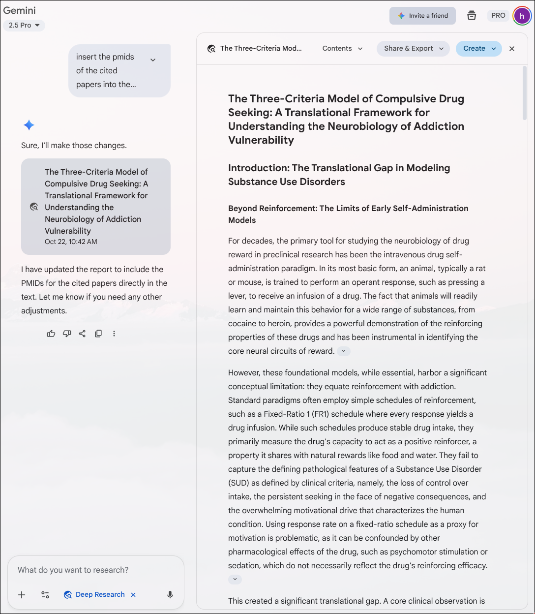
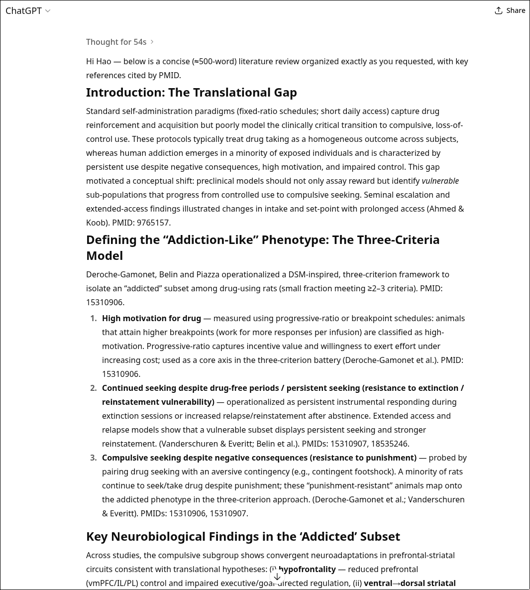
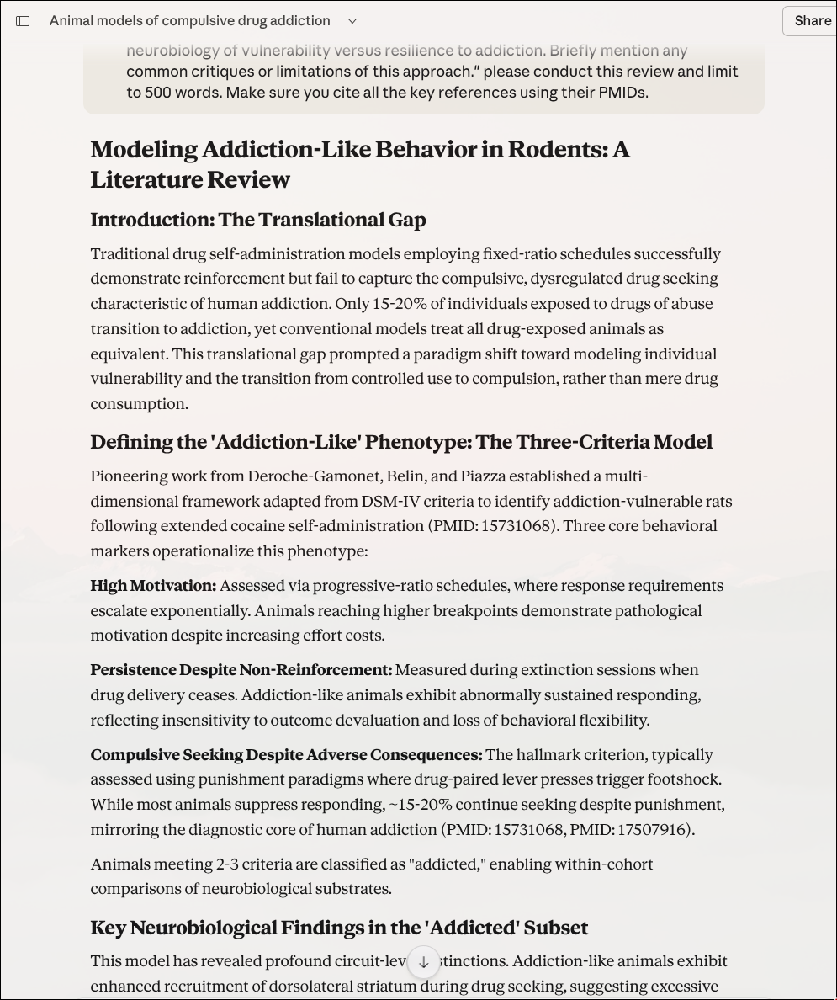
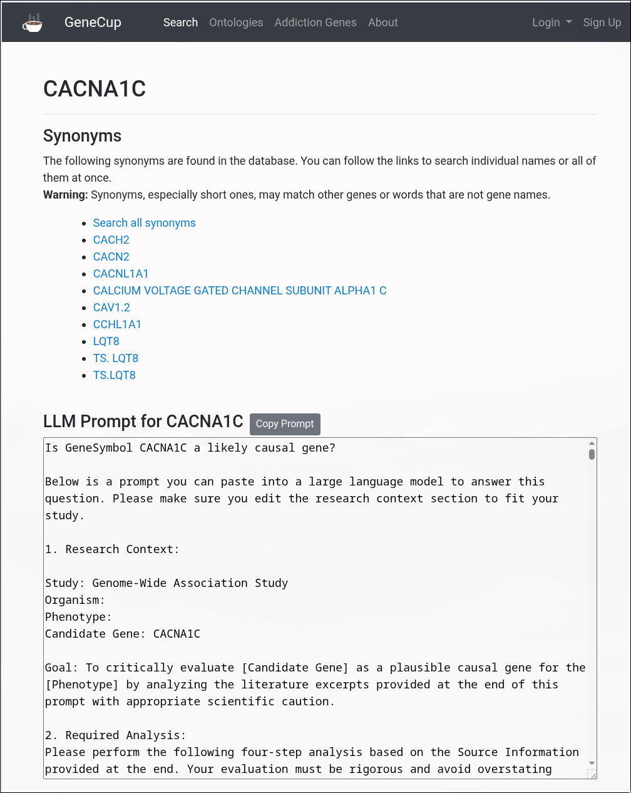
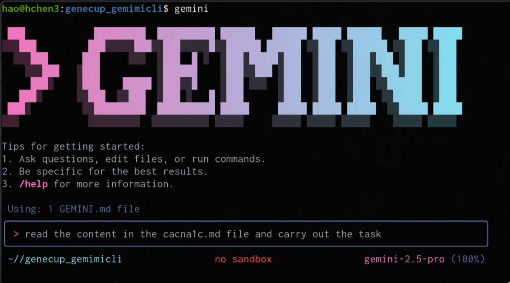
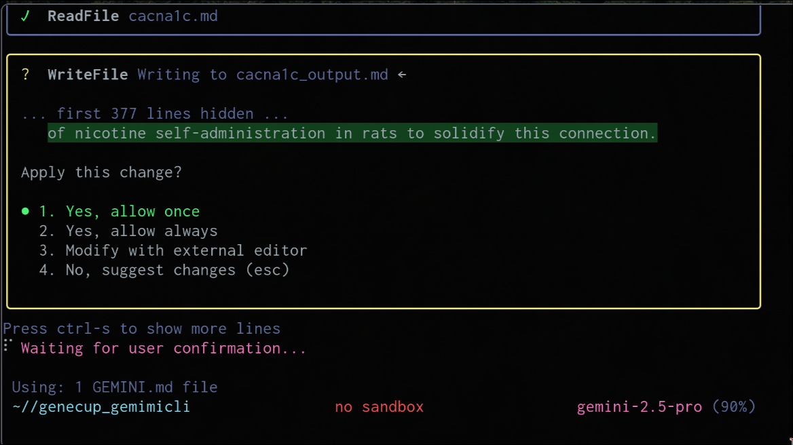

## AI for LifeScience Researchers: A 2025 Snapshot

# Navigating Literature, PDFs, and Hypotheses with Emerging AI Tools

### Hao Chen, Ph.D

### hchen@uthsc.edu

#### Department of Pharmacology, Addiction Science and Toxicology

#### University of Tennessee Health Science Center, Memphis, TN, USA

---

## 1.  Are LLMs Finally Getting Citations Right?

- **The Test:** I asked Gemini 2.5 Pro to pick a suitable research area and generate a literature review prompt.
  - My additions: make it ~500 words and include PMIDs.

- **The Contenders:**
  - Gemini Pro 2.5 (with and without Deep Research)
  - OpenAI GPT-5
  - Claude Sonnet 4.5 (with and without the PubMed connector)

- **The Question:** How relevant are the PMIDs they generate?

---

## Need a Tool to Help with the Evaluation

- Expressing intent is sufficient for some coding tasks:
  - I want to hover over a PMID in a block of text and instantly see the paper's title, authors, and abstract.
  - I want it all in a single, shareable HTML file.
- Getting the Code: Many LLMs can help
  - Gemini CLI
  - Claude Code
  - OpenAI Codex
- Iterating and Refining
  - <a href="https://chen42.github.io/SourceCery/" target="_new"> SourceCery</a>
  - Adding a theme switcher, font size controls, a clear text button.

---

## The Prompt

Please act as an expert in behavioral neuroscience. Your task is to generate a comprehensive literature review on the animal models designed to operationalize 'addiction-like' behavior by identifying a sub-population of animals that exhibit compulsive drug seeking. The review must be structured around the translational framework that uses **DSM-like criteria** to distinguish this vulnerable subset from the general population of drug-using animals. Please structure your review using the following distinct sections:

- **Introduction: The Translational Gap**
  - Explain the limitations of standard drug self-administration models (e.g., fixed-ratio schedules) in modeling the full spectrum of human addiction.
  - Introduce the conceptual shift toward modeling the _transition_ to compulsion rather than just drug reinforcement.

- **Defining the 'Addiction-Like' Phenotype: The Three-Criteria Model**
  - Detail the **three core behavioral criteria** (often associated with the Deroche-Gamonet, Belin, and Piazza labs) used to identify this phenotype.
  - You must specifically define and explain how each is measured:
    - **High Motivation:** (e.g., progressive-ratio schedules).
    - **Continued Seeking Despite No-Drug Periods:** (e.g., resistance to extinction).
    - **Compulsive Seeking:** (e.g., resistance to punishment, such as a footshock contingency).

- **Key Neurobiological Findings in the 'Addicted' Subset**
  - Summarize the primary neuroadaptations that have been consistently shown to differentiate this 'addiction-like' cohort from their 'non-addicted' counterparts.
  - Focus on key findings in **prefrontal-striatal circuits** (e.g., changes in the dorsal striatum, hypofrontality).

- **Significance and Limitations**
  - Conclude by summarizing the major contribution of this model to understanding the neurobiology of vulnerability versus resilience to addiction.
  - Briefly mention any common critiques or limitations of this approach."

---

## Gemini 2.5 Pro

#### (Released June 17, 2025)

<table> <tr> <td width="40%"> </td><td>

- **Without Deep Research:**
  - Cited only four papers, and just one was marginally relevant.
- **With Deep Research:**
  - Produced a much longer report, pulling from about 50 websites and citing 20 web-based papers.
  - When asked to convert links to PMIDs, most citations pointed to just one or two papers, and some PMIDs were irrelevant.
- AI Studio (Grounded with Google Search):
  - Results were similar to Deep Research, linking to webpages, converted PMIDs had the same issues.

</td></tr></table>

---

## GPT-5

#### (Released Aug 7, 2025)

<table> <tr> <td width="40%"> </td><td>

- Cited about 10 papers, all of which were relevant.
- The content was somewhat superficial.

</td></tr></table>

---

## Claude Sonnet 4.5

#### (Released Sept 29, 2025)

<table> <tr> <td width="40%"> </td><td>

- **Default Chat:**
  - <a href="https://claude.ai/share/4c7eb3a1-cc97-48df-bc7f-1d24468f8cf1"  target="_new">The citations were entirely fabricated.</a>

---

## <a href="https://www.anthropic.com/news/claude-for-life-sciences" target="_new">Claude for Life Sciences</a>

#### (Released Oct 20, 2025)

<table> <tr> <td width="40%"> </td><td>

- **With PubMed Connector ($17/mo for a pro account):**
  - <a href="https://claude.ai/public/artifacts/a19a6257-e67a-4375-838c-d35f058a0081"  target="_new"> Citations were mostly relevant, and covered detailed findings quite well.</a>
  - Still included a few irrelevant citations.

    </td></tr></table>

---

## LLMs with  tool integration  are improving at generating trustworthy literature summaries, but validation remains essential.

---

## 2. Chatting with Your PDFs

- LLM for your PDFs (or links, videos)
  - <a href="https://notebooklm.google.com" target="_new">NotebookLM</a>

- **Potential Use Cases:**
  - Reading complicated papers
  - Navigating Unfamiliar Domains
    - <a href="https://www.congress.gov/bill/119th-congress/house-bill/27/text" target="_new">H.R. 27 HALT Fentanyl Act</a>
      - <a href="https://notebooklm.google.com/notebook/a2872f10-6ec1-4e15-935c-a18de326087c?authuser=1"  target="_new">How does this bill affect university researcher studying SUD using controlled substances? </a>

  - **A Better Teaching Assistant:** Helping students digest dense material.

---

## 3.  Hypothesis Generation

### Found a great QTL, but there are 10 genes under the peak. Need to read all the literature about these genes to generate a hypothesis about the causal gene.

- Search PubMed
  - Think about a complete list of keywords related to the phenotypes.
  - Search each gene against each of these keywords.
  - Read the abstracts.
  - Take notes on what is relevant.
  - Synthesize the knowledge
  - <a href="https://genecup.org" target="_new">https://genecup.org </a>

---

## Hypothesis Prompt Structure

<table> <tr> <td width="30%"> </td><td>

- Research Context
- Goal
- Required Analysis:
  - A. Term Disambiguation
    - MADD = MAP kinase-activating death domain protein ? Mothers against drunk driving
  - B. Synthesis of Function and Experimental Context
  - C. Critical Evaluation of Causal Gene Plausibility (with In-text Citations)
    - Assessment of Functional Plausibility
    - Assessment of Tissue/Cell Type Relevance
    - Assessment of Pathway and Network Involvement
    - Assessment of Existing Disease/Trait Associations:
  - D. Balanced Concluding Assessment

    </td></tr></table>

---

## Using Commandline tools to process large texts

<table> <tr> <td width="50%"> </td><td>

</td></tr>

</table>

---

## Hypothesis Evaluation Results

### <a href="https://docs.google.com/document/d/1c46UYfp3DVfnEMBhSNb_QWXyWP7SQktOTq0QZZGAoPA/edit?usp=sharing"  target="_new"> Full report</a>

Reduced 99 pages of relevant sentences into 2.5 pages of structured summary, with likely valid citations.

**Summary of Supporting Evidence:**

The evidence supporting CACNA1C as a plausible causal gene for socially acquired nicotine intravenous self-administration is **substantial**. The strongest lines of evidence are: **1.** Its critical role in reward processing, learning, and memory, which are core components of addiction (PMID: 25290268, 28604818). **2.** Its expression and function in key brain regions of the reward pathway, such as the nucleus accumbens (PMID: 28165117). **3.** Its position as a hub gene in addiction-related molecular networks (PMID: 36744178, 36865068). **4**. Existing genetic associations with nicotine dependence and other substance use disorders in humans (PMID: 25555482, 36551763).

---

## Overall impression

### LLMs are capable but need guidance and verification

---

## Acknowledgement

- Hakan Guntunken
- Jun Huang
- Pjotr Prins
