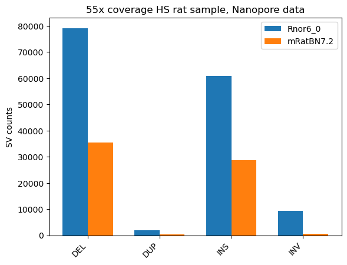
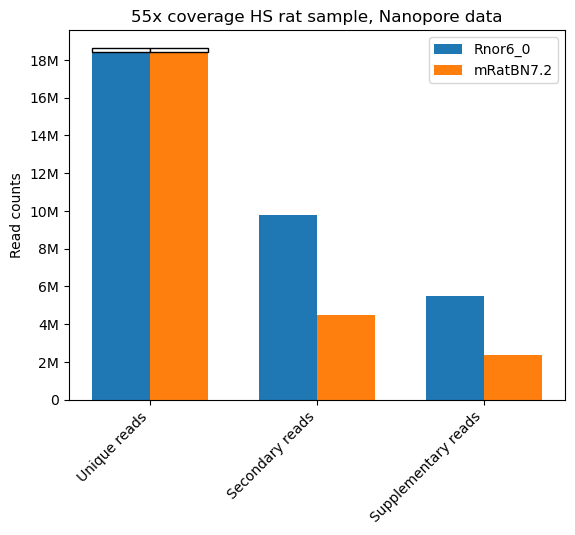
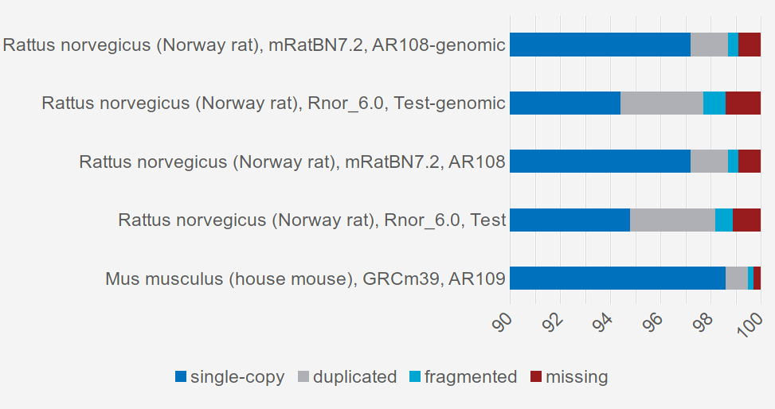
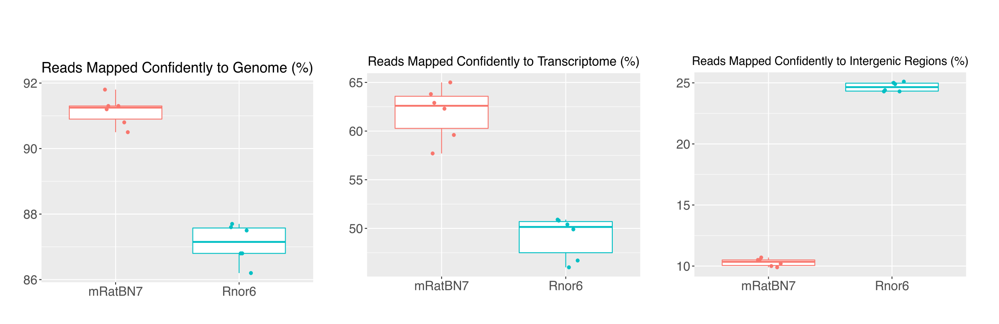
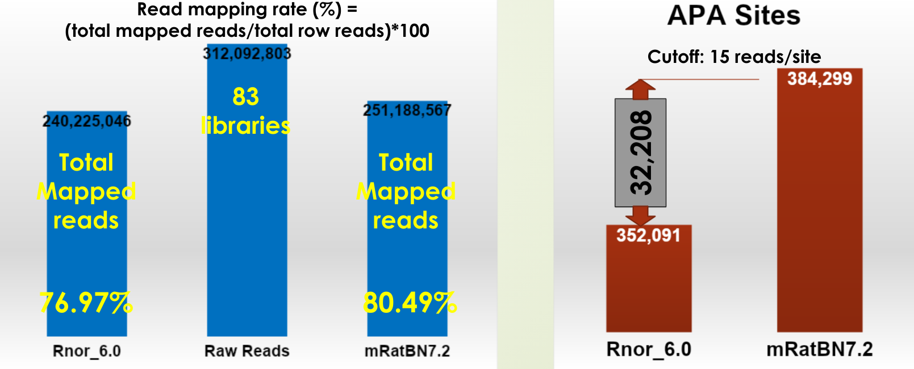
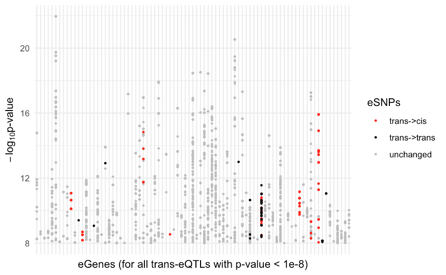
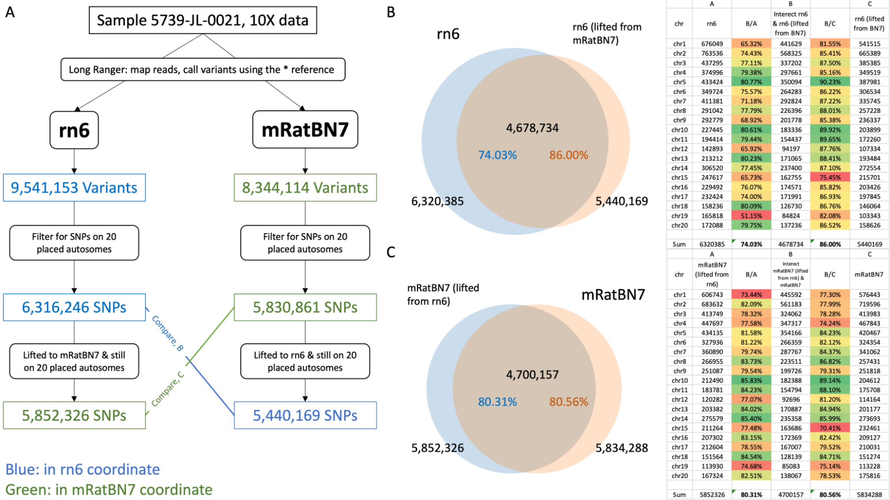

# mRatBN7 ushers in a new era of rat genomics and genetics research
## International rat omics consortium (IROC)

<b>de Jong T, Pan Y, Murphy T, Martin F, Akil H, Benner C, Chitre A, Colonna E, Dalgard C, Doris PA, Dwinell M, Garrison E, Geurts A, Gillette T, Gunturkun MH, Guryev V, Haggerty L, Hourlier T, Howe K, Howe K, Jun H, Kalbfleisch T, Mohammadi P, Mortazavi M, Munro D, Ozel AB, Polesskaya O, Pravenec M, Prins P, Rastas PMA, Saba L, Sharp B, Tabakoff B, Telese F, Tutaj M, Villani F, Wang X,  Palmer AA, Williams RW, Kwitek AE, Li J, Chen H
</b>

---

## mRatBN7 fixes many large structural issues in the reference

Linkage map from 1893 rats HS rats (from 378 families)

Dot plot 

Pasi Rastas, University of Helsinki

---

## Deletion calls from linked read data

Tristan de Jong, Hao Chen, et al., UTHSC

---

## Mapping stats from linked read data

Tristan de Jong, Hakan Gunturkun, Hao Chen, et al., UTHSC

---

## Mapping stats from PacBio CLR (SHR)

|	|Rnor6.0| mRatBN7.2|
|:---|---:|---:|
|Forward |2106576| 2127468|
|Reverse |2103210| 2119793|
|Unmapped| 298422| 260947|
|Total read count| 4508208| 4508208|
|Fraction mapped |0.934| 0.942|

 Ted Kalbfleisch, Peter Doris, Univ Texas Health Science Center

---

## Mapping stats and SV calls from nanopore data
 one HS rat with 55X coverage 

 Milad Mortazavi, Abraham Palmer, et al UCSD

---

## mRatBN7.2 improves base level accuracy 

### SNPs and Indels shared by 32 HXB/BXH strains and 4 BN/NHsdMcwi samples

Tristan de Jong, Hao Chen, et al., UTHSC

---

## Gene annotations on mRatBN7.2 at RefSEQ

||Rnor6.0|mRatBN7.2| Mouse GRCm39|
|---|---|---|---|
|protein coding | 23,514| 22,228|22,173|
|coding with major errors| 1,831 (7.8%)|519 (2.3%)|
|&nbsp;&nbsp;&nbsp;&nbsp;with frame shifts|1,476|458|
|1:1 human ortholog|16,068|16,315|16316|

 Terrence Murphy, et al., NCBI

---

## Gene annotations on mRatBN7.2 by Ensembl 

Fergal Martin, et al., Ensembl

---

##  RNAseq analysis

352 samples from 88 HS rats

||Rnor6|mRatBN7.2|
|---|---|---|
|Average percent of reads aligned to the reference |97.4|98.3|
|Average percent of reads aligned concordantly once to the reference|89.3|94.6 |
|Average percent of reads aligned to Ensembl transcriptome|67.6 |74.8 |

738 genes changed **biotype** in Ensembl from Rnor6 to mRatBN7.2  

|Rnor6 to mRatBN7.2 | number |
|:---|---:|
|processed pseudogene to protein coding  |224|
|pseudogene to protein coding | 136|
|pseudogenes to protein coding |89|
|lncRNA to protein coding |65|

Laura Saba, et al., University of Colorado

---

##  scRNAseq analysis 

Francesca Telese, et al., UCSD

---

## proteome analysis 

 Tessa Gillette, Victor Guryev, UMGC, Netherland

---

##  the identification of transcription start sites

### capped short RNA-seq

||Number of Transcript start site|
|---|---|
|Rnor6|42,420|
|mRatBN7.2|44,985|

Chris Benner, Francesa Telese, UCSD

---

## the identification of polyadenylation sites 

### Whole Transcriptome Termini Site Sequencing

Zhuhua Jian, et al., WSU

---

##  eQTL mapping 

Dan Munro, Pejman Mohammadi, Abraham Palmer, et al., UCSD

---

##  pQTL mapping

21 HXB/BXH strains,  brain proteome

 XuSheng Wang, Univ North Dakota

---

## liftover from Rnor6.0 to mRatBN7.2?? 

 Yanchao Pan (Han), Jun Li, et al., Univ Michigan

---

## potential remaining errors in mRatBN7.2 

* 134,781 variants (SNPs and indels) shared by more than 92 of 94 WGS samples (including 6 BN/NHsdMcwi samples) (10X reduction compared to <a href="#/sharedrn6">Rnor6</a>)

||Hom| Het|
|---|---|---:|
|Indel| 95,131| 998 |
|SNP| 24,292 |13,360|

 Monika Tutaj,  Mindy Dwinell et al., MCW for sharing data
 

---

## Potential remaining errors in mRatBN7.2 

|Impact|Annotation|Count|
|:---|:---|---:|
|HIGH|frameshift_variant| <a href="#/refseq">550<a> |
|HIGH|splice_acceptor_variant|615|
|HIGH|splice_donor_variant|25|
|MODERATE|missense_variant|291|
|MODIFIER|3_prime_UTR_variant|884|
|MODIFIER|5_prime_UTR_variant|418|
|MODIFIER|downstream_gene_variant|6381|
|MODIFIER|intergenic_region|68990|
|MODIFIER|intron_variant|45338|

Examples of genes with high impact variants:  <b>Akap10, Cacna1c, Crhr1, Chat, Egfr, Gabrg2, Grin2a, Oprm1, etc.</b>

aaaTaaaAAAgAAA 

aaaTaaa

---

## Rat as a model system

After filtering potential remaining errors in mRatBN7.2, in the 118 WGS samples, we found 

|number of genes | variant type|
|---:|---|
|102 | start_lost|
|105 | stop_lost|
|106 | frameshift_variant & splice_region_variant|
|166 | splice_acceptor_variant & splice_donor_variant & intron_variant|
|340 | splice_acceptor_variant & intron_variant|
|406 | stop_gained|
|474 | splice_donor_variant & intron_variant|
|1188 | frameshift_variant|

---

# Acknowledgements

## IROC members

<b>de Jong T, Pan Y, Murphy T, Martin F, Akil H, Benner C, Chitre A, Colonna E, Dalgard C, Doris PA, Dwinell M, Garrison E, Geurts A, Gillette T, Gunturkun MH, Guryev V, Haggerty L, Hourlier T, Howe K, Howe K, Jun H, Kalbfleisch T, Mohammadi P, Mortazavi M, Munro D, Ozel AB, Polesskaya O, Pravenec M, Prins P, Rastas PMA, Saba L, Sharp B, Tabakoff B, Telese F, Tutaj M, Villani F, Wang X,  Palmer AA, Williams RW, Kwitek AE, Li J</b>

---

