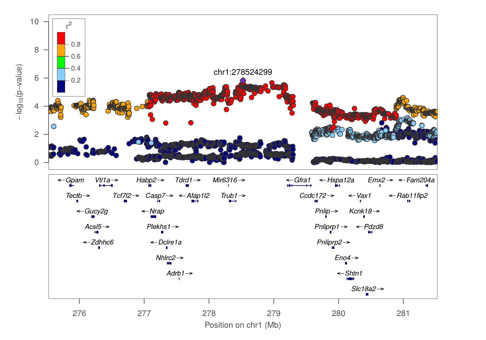
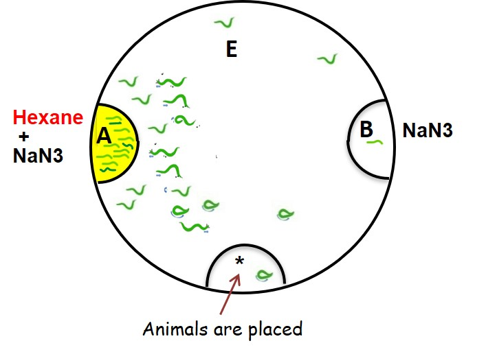

## GWAS on socially acquired nicotine IVSA in heterogeneous stock rats highlights genes implicated in human smoking behavior

Tengfei Wang1, Apurva S. Chitre2, Angel Garcia Martinez1, Oksana Polesskaya2, Leah C. Solberg-Woods3, Changhoon Jee1, Abraham A. Palmer2, Hao Chen1

1Department of Pharmacology, Addiction Science and Toxicology, University of Tennessee Health Science Center; 2Department of Psychiatry, University of California San Diego; 3Department of Molecular Medicine, Wake Forest School of Medicine

---

## Both genetic and social factors contributes to cigarette smoking 

* Many tween studies have found genetic factors contributes to about 50% of the variance in smoking behavior.
* Human GWAS has identified hundreds of genome-wide significant SNPs associated with smoking behavior but most of them with unknown functional significance.
* When teenagers are asked why they smoke cigarettes, "Because my friends are smoking" is the most common answer

---

## Social learning enables nicotine self-administration

[Chen et al, 2011 Neuropsychopharm](https://pubmed.ncbi.nlm.nih.gov/21796102)

---

## Social learning supports nicotine IVSA with an aversive cue

[Wang, et al. Psychopharmacology 2016](https://pubmed.ncbi.nlm.nih.gov/26911379)

---

## Socially acquired nicotine IVSA is hertiable

[Han, et al, Sci Rep, 2017](https://pubmed.ncbi.nlm.nih.gov/28808247/)

---

## Both CS2 and flavor cue are necessary for socially acquired nicotine IVSA 

[Wang, et al. PLoS One, 2014](https://pubmed.ncbi.nlm.nih.gov/25532105/)

---

## GWAS behavior test pipeline 

| Age | Test |
|---|---|
|PND21|Wean|
|PND31|Open field |
|PND32|Novel object |
|PND33|Social interaction in the same arena as openfield |
|PND34|Elevated plus maze|
|PND38|Surgery|
|PND39 - 41| Recovery|
|PND42 - 51|Socially acquired nicotine IVSA|
|PND52| Progressive ratio test |
|PND53 - 56 |Extinction|
|PND57|Contextual cue induced reinstatement|
|PND59|Tissue Collection|

---

## Socially acquired nicotine IVSA 

Adolescent heterogeneous rats (711 F, 711 M)

---

## GWAS summary

|Behavior | Sample size | N traits | N sig. QTL| 
|---|---|---:|---:|
| socially acquired nicotine IVSA| 711 M, 711 F| 63| 30| 

---

## Number of licks on the active spout in first session: chr1:278524299

---

#### Summary of nicotine GWAS

## Number of licks on the active spout

|ID |Session|Loc| Genes (n) | Overlapping with human smoking GWAS|
|---|:---:|---|---|---|
|12.20 | day 1 | chr1:278524299| 99 | Gpam&clubs;&diams;, [Vti1a](http://rats.pub/cytoscape/?rnd=tmpUpzbbT&genequery=VTI1A)&spades;, Nhlrc2&clubs;&diams;, Adrb1&clubs;, Tcf7l2, [Hspa12a](http://rats.pub/cytoscape/?rnd=tmpFrhLrJ&genequery=HEAT-SHOCK-PROTEIN-FAMILY-A-HSP70-MEMBER-12A_HSPA12A)&spades;, [Shtn1](http://rats.pub/cytoscape/?rnd=tmpJiHXFf&genequery=KIAA1598_SHOOTIN-1_SHOOTIN1_SHTN1)&spades;&diams;, [Nrap](http://rats.pub/cytoscape/?rnd=tmpaUzTZp&genequery=N-RAP_NEBULIN-RELATED-ANCHORING-PROTEIN_NRAP)&spades;, Casp7&diams; Gfra1|
|12.29 | day 2 | chr8:22496077| 29| [Carm1](http://rats.pub/cytoscape/?rnd=tmpaHVoNJ&genequery=carm1) |
|12.24 | day 4 | chr4:145377793| 20| [Emc3](http://rats.pub/cytoscape/?rnd=tmpQXgUzk&genequery=emc3) |
|12.12 | day 5 | chr16:83955432| 23| Tex29| 
|12.08 | day 7 | chr16:83489214| 23| Tex29| 
|12.02 | day 9 | chr10:32845925| 90| | 
|12.22 | day 10 | chr2:247766389|20| [Pkn2, Gtf2b](http://rats.pub/cytoscape/?rnd=tmpPoBkQf&genequery=Pkn2_Gtf2b) |
|12.16 | Reinstatment | chr1:161226950| 28|Usp35, Gab2, Nars2, Tenm4, [Alg8](http://rats.pub/cytoscape/?rnd=tmpJKLgcJ&genequery=Usp35_Gab2_Nars2_Tenm4_Alg8)&diams;&hearts; |

&spades;: smoking initiation genes
&clubs;: Alcohol consumption genes
&diams;: cis-eQTL
&hearts; missense variants

 
---

#### Summary of nicotine GWAS

## Number of nicotine infusions

|ID |Session|Loc| Genes (n) | Overlapping with human smoking GWAS|
|---|:---:|---|---|---|
|12.09 | day 5 | chr16:83500180| 23| Tex29 |
|12.13 | day 5 | chr17:17103044| 1| [ID4](http://rats.pub/cytoscape/?rnd=tmpdaIxug&genequery=ID4) |
|12.11 | day 7 | chr16:83500180| 23| Tex29|
|12.23 | day 7 | chr3:104723116| 8|[Hmgn4, Fmn1](http://rats.pub/cytoscape/?rnd=tmpSBamBX&genequery=Hmgn4_Fmn1) |
|12.15 | day 8 | chr19:26396258| 1| |
|12.03 | median of last 3 days | chr11:17834164|27| | 
|12.10 |total infusion | chr16:83500180| 23| [Tex29](http://rats.pub/cytoscape/?rnd=tmpesQlMB&genequery=tex29)|
|12.30 |slope of regression | chr8:4459578| 74| [Gria4](http://rats.pub/cytoscape/?rnd=tmpAjmeXn&genequery=Gria4_Pdgfd_Mmp12)&diams;, Pdgfd&diams;, Mmp12 |

&diams;: cis-eQTL

---

## Cross species validation in c.elegans 

### conditioned cue preference (CCP)

<h2>SI= (A-B)/(A+B+E)</h2>

---

## Loss of function of Gria4 impairs nicotine CCP in c.elegans  

<table>
<tr>
<td>  </td>
<td>  </td> 
<td>  </td>
</tr>
<table>

---

## Acknowledgements

* Hao Chen lab
	* 	prior members: Wenyan Han, Pawandeep Kaur, Yanyan Lin, 
	* 	current memebers: Angel Garcia Martinez, Shuanying Leng, Hakan Gunturkun

* Abraham Palmer lab: 
	* Apurva Chitre and Oksana Polesskaya and many others

* Leah C. Solberg-Woods lab 

* Changhong Jee Lab 
	* Aziz Eshov

Funding: NIDA P50DA037844

---

## Nicotine metabolism

---

## Correlation among behavioral measures 

open field, novel object, social interaction, and elevated plus maze

<cite> <a href="https://pubmed.ncbi.nlm.nih.gov/30584246/">PMID: 30584246</a> </cite>

