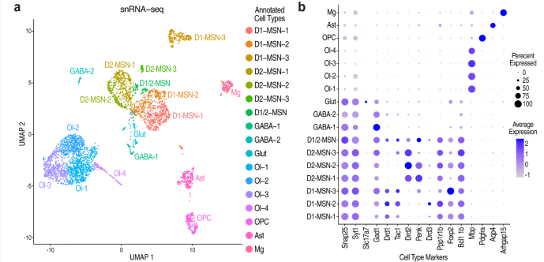
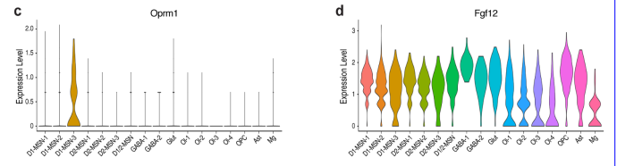
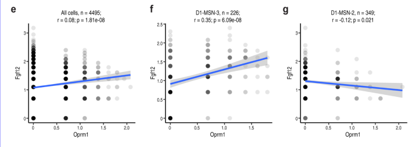
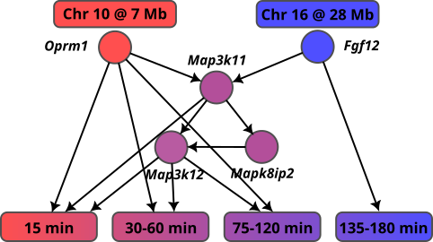
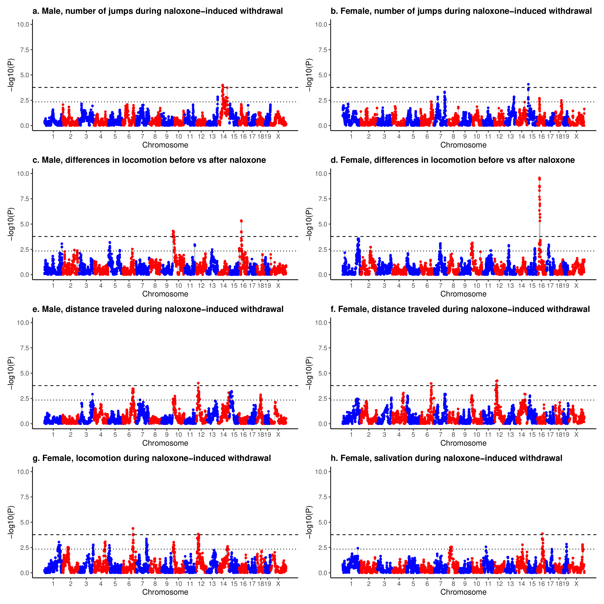
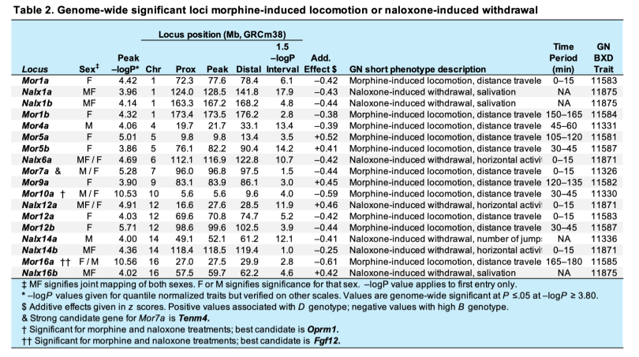
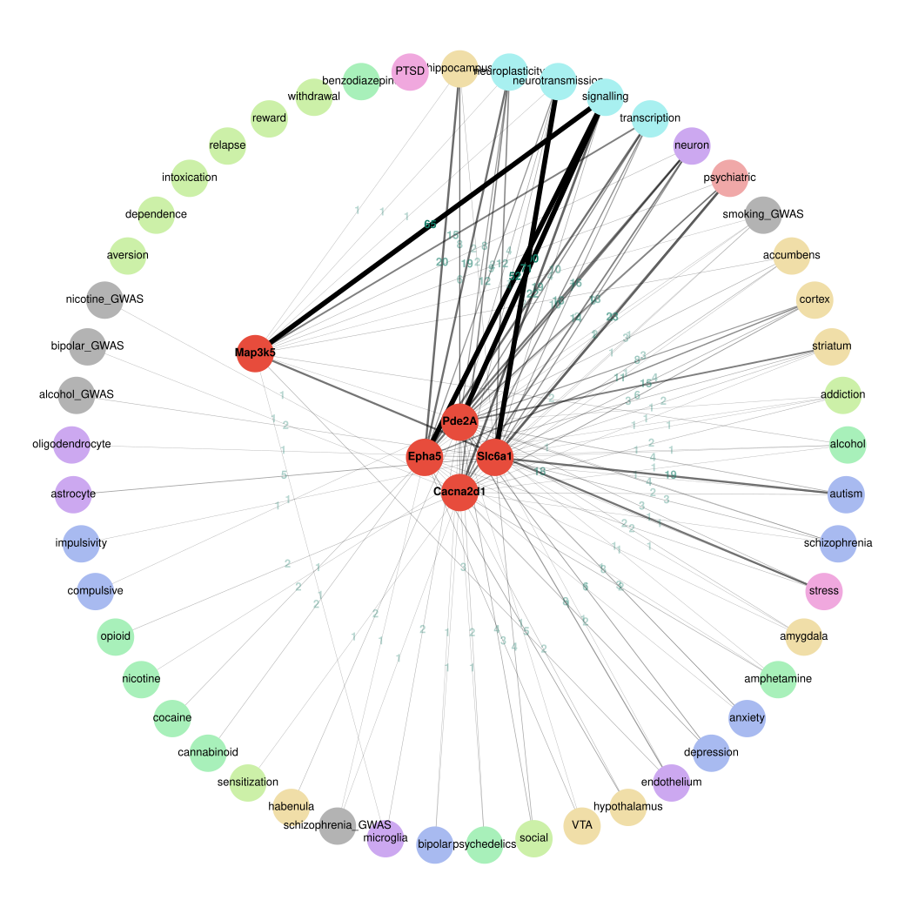
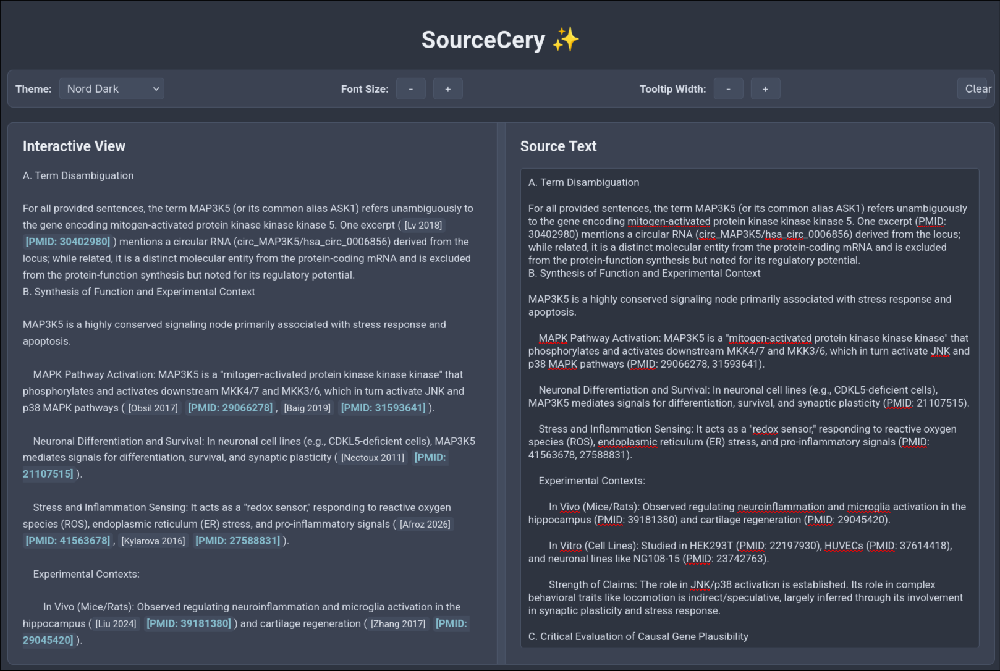

## snRNA-seq of NAc

---

## snRNA-seq of NAc

---

## snRNA-seq of NAc

---

## Bayesian Network Analysis for Causality

---

## Signals in Human Genetics Studies

---

## Naloxone responses

---

## Many other loci

---

## GeneCup Literature Mining

---

## Structured LLM Literature Summary

Scientific Evaluation of MAP3K5 as a Causal Gene for Morphine-Induced Locomotion in Mice.

- A. Term Disambiguation

- B. Synthesis of Function and Experimental Context

- C. Critical Evaluation of Causal Gene Plausibility

  - 1. Assessment of Functional Plausibility

  - 2. Assessment of Tissue/Cell Type Relevance

  - 3. Assessment of Pathway and Network Involvement

  - 4. Assessment of Existing Disease/Trait Associations

- D. Balanced Concluding Assessment

  - Supporting Evidence:

  - Limitations and Gaps:

  - Final Judgment:

Based on the provided information, MAP3K5 is a plausible candidate gene. It possesses the necessary regional expression and general signaling machinery to influence behavioral traits. However, it cannot be classified as a "strong" candidate without specific functional validation (e.g., knockout or knockdown studies) directly targeting morphine-induced locomotor phenotypes in mice.

---

## Assisted Manual Validation of Citations

---

## Summary

---

## Acknowledgment

#### Paige M Lemen, Yanning Zuo, Alexander S Hatoum, Price E Dickson, Guy Mittleman, Arpana Agrawal, Benjamin C Reiner, Wade Berrettini, David G Ashbrook, Mustafa Hakan Gunturkun, Xusheng Wang, Megan K Mulligan, Caleb J Browne, Eric J Nestler, Francesca Telese
