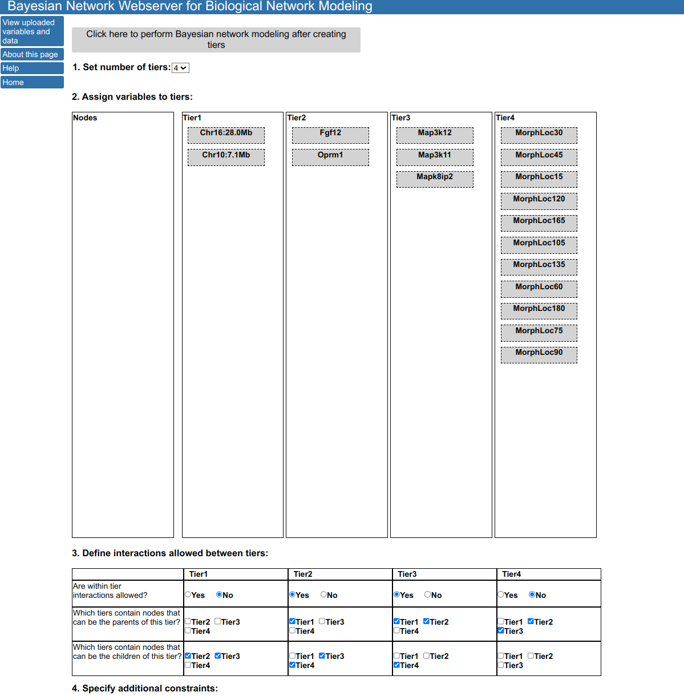
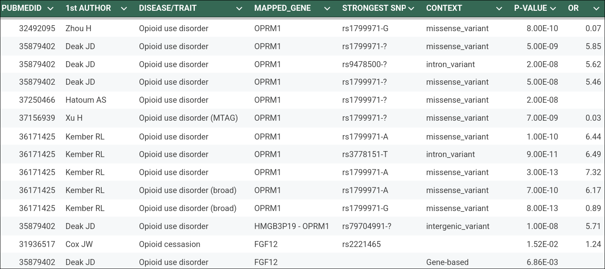
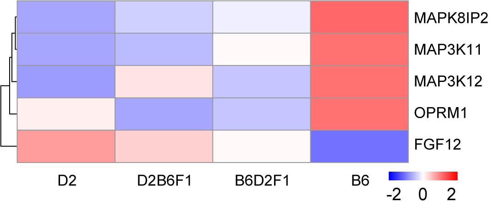

## snRNA-seq of NAc

  

   Y Zuo and F Telese, UCSD 

---

## Cell-type Specific Expression of Oprm1 and Fgf12 in NAc

  

   Y Zuo and F Telese, UCSD 

---

## Cell-type Specific Correlation Between Oprm1 and Fgf12

  

   Y Zuo and F Telese, UCSD 

---

## Using Bayesian Networks to Infer Causal Architecture

- The Bayesian Network Webserver
  - Identifies **directed, causal relationships** in genetic, multi-omic and behavioral datasets
- Step 1: Local Scoring:
  - For every potential parent-child pair, calculates a local score based on the conditional probability P(B|A)
  - Uses Conditional Gaussian Distributions to allow discrete variables (e.g., Genotypes) to be the parents of continuous traits (e.g., Gene Expression)
- Step 2: Global Optimization:
  - Assembles these local "parent-child" blocks into the single most probable global map of the entire system
- Integrates prior knowledge by enforcing biological flow
  - e.g., Genotype -> Transcripts -> Phenotypes

---

## Bayesian Network Webserver

  

   Y Cui, et al., UTHSC 

---

## Bayesian Network Analysis for Causality

---

## OPRM1 and FGF12 in Human Genetics Studies

---

## Enrichment of OPRM1 and FGF12 Associated Genenework

- Generating correlation networks
  - Obtain top 500 genes correlated to ORPM1 or FGF12 from GTEx v8 from 8 related tissues
  - Find genes shared between OPRM1 and FGF12 within each tissue
  - Find genes shared between more than 3 tissues.
  - Use MAGMA to conduct enrichment analysis.

| VARIABLE              | NGENES | BETA    | BETA_STD | SE    | P     |
| --------------------- | ------ | ------- | -------- | ----- | ----- |
| OUD                   |        |         |          |       |       |
| Network               | 68     | 0.00197 | 0.00012  | 0.113 | 0.493 |
| Addiction Risk Factor |        |         |          |       |       |
| Network               | 68     | 0.21938 | 0.01348  | 0.124 | 0.039 |

  

  A Hatoum, Wash U

---

## Naloxone Responses

---

## Many More Loci!

---

## GeneCup Literature Mining

  

   P Prins, et al., UTHSC 

---

## Structured LLM Literature Summary

Evaluation of
<a href="https://genecup2.genenetwork.org/synonyms?node=Rgs7&rnd=" target=_new> Rgs7 </a> as a Causal Gene for Morphine-Induced Locomotion in Mice.

- A. Term Disambiguation
- B. Synthesis of Function and Experimental Context
- C. Critical Evaluation of Causal Gene Plausibility
  - 1. Assessment of Functional Plausibility
  - 2. Assessment of Tissue/Cell Type Relevance
  - 3. Assessment of Pathway and Network Involvement
  - 4. Assessment of Existing Disease/Trait Associations
- D. Balanced Concluding Assessment
  - Supporting Evidence:
  - Limitations and Gaps:
  - Final Judgment:
- Results
  - <a href="https://gemini.google.com/share/55a1a9faa9d5" target=_new> Gemini </a>
  - <a href="https://claude.ai/share/6fe1fa08-3c21-4fc0-b736-70b44fa2318b" target=_new> Claude </a>

---

## Assisted Manual Validation of Citations

---

## Summary

- Morphine-induced locomotion is governed by a dynamic timeline where _Oprm1_ (Chr 10) dominates the early phase, while the novel _Fgf12_ (Chr 16) locus controls the late phase.

- A significant but transient gene-gene interaction between _Oprm1_ and _Fgf12_ occurs specifically between 45–90 minutes post-injection, representing a rare demonstration of time-dependent epistasis in mammals.

- Single-nucleus RNA sequencing identified the D1-MSN-3 neuronal subtype in the Nucleus Accumbens as the likely site of this interaction, where both genes are co-expressed and positively correlated.

- Bayesian modeling suggests the interaction is mediated through a MAP kinase network, specifically identifying Map3k11 as a potential molecular bridge between opioid receptor signaling and Fgf12.

- Human GWAS data corroborates the importance of the _FGF12_ locus in substance use disorders, suggesting _Fgf12_ and its interaction with sodium channels as a novel therapeutic target for OUD.

- This work highlights how FAIR data reanalysis and the merging of human and animal neurogenomic data can facilitate bidirectional translational validation to uncover novel disease variants and molecular networks.

---

## Acknowledgment

## Paige M Lemen, Yanning Zuo, Alexander S Hatoum, Price E Dickson, Guy Mittleman, Arpana Agrawal, Benjamin C Reiner, Wade Berrettini, David G Ashbrook, Mustafa Hakan Gunturkun, Xusheng Wang, Megan K Mulligan, Caleb J Browne, Eric J Nestler, Francesca Telese

### University of Tennessee Health Science Center, Memphis; University of California San Diego, San Diego; Washington University in St. Louis, St Louis; Marshall University, Huntington; Ball State University, Muncie; University of Pennsylvania, Philadelphia; Nash Family Department of Neuroscience and Friedman Brain Institute, Icahn School of Medicine at Mount Sinai, New York

---

## Proteomic Data

  

   X Wang, UTHSC 

---
