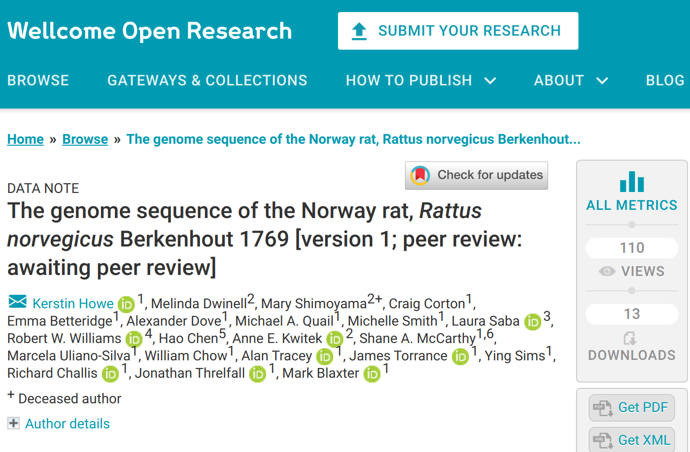
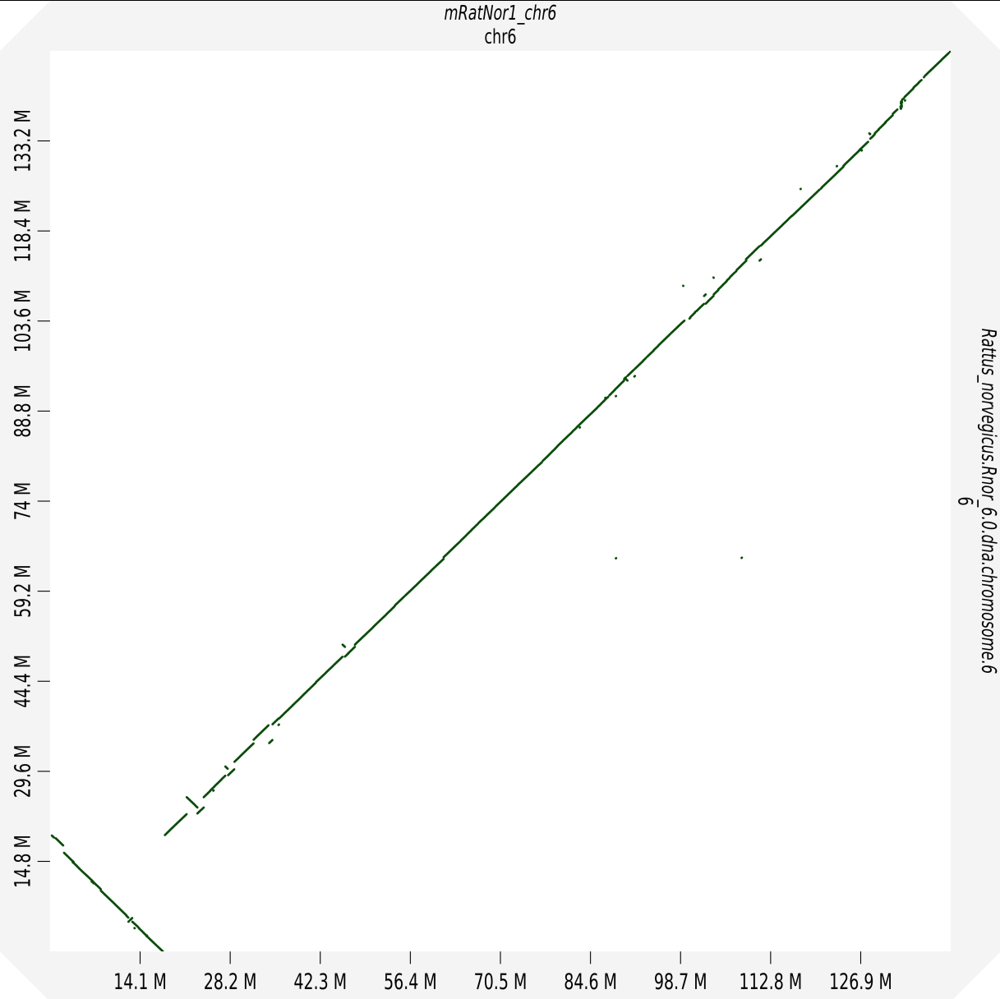
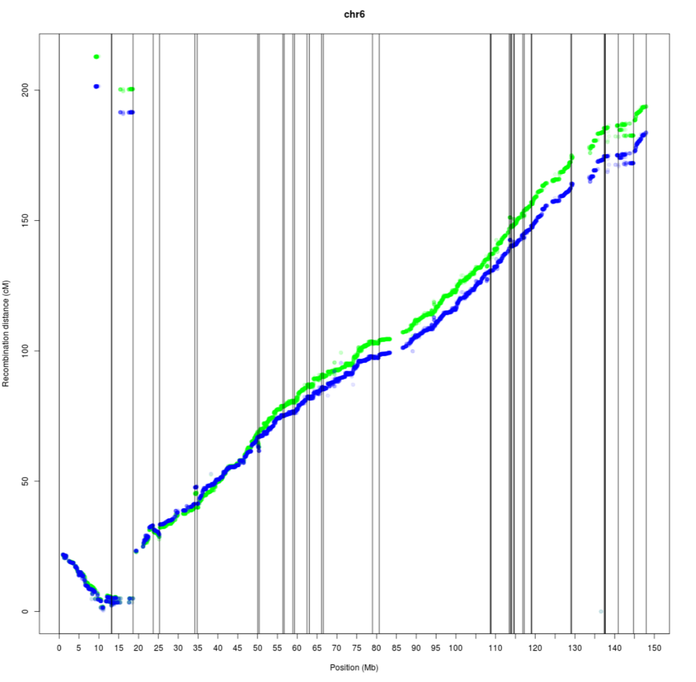
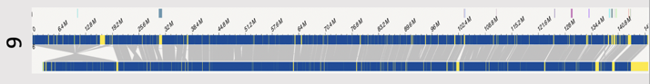
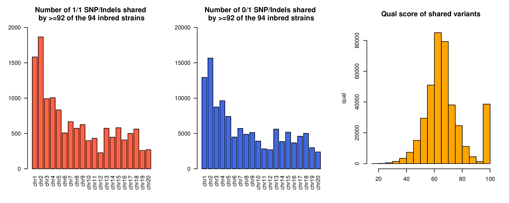

# A community effort in comparing Rnor6 v mRatBN7.2 

## Hao Chen, Ph.D.

### University of Tennessee Health Science Center

---

## International Rat Omic Consortium 

* Open to all, free to attend
* Monthly Zoom meeting
* 12 PM CDT, last Tuesday of each month
* Recorded and archived
* Contact: hchen@uthsc.edu

---

## Ongoing data collection 

### Whole genome sequencing data
* Mindy Dwinell, Anne Kwitek, MCW
	* Illumina short reads of close to 50 inbred strains
* Jun Li, Univ Michigan
	* Illumina short reads of 8 inbred strains (founders of the HS) 
	* Illumina short reads of 20 outbred rats
	* Bionano data of two inbred strain (founder of the HXB RI panel)
* Hao Chen, Burt Sharp, Rob Williams, UTHSC 
	* 10X Chromium linked reads (40 inbred strains analyzed, 40 more in progress) (with Li's group)  
	* Nanopore on two inbred strains
	* PacBio HiFi on two inbred strains
	* Hi-C on two inbred strains (more to come)
* Peter Doris (Univ Texas at Houston) 
	* Nine inbred strains planned (including BN)
	* PacBio HIFI/CLR/IsoSeq
	* Hi-C 
	* Bionano
* Abraham Palmer, Jonathan Sebat, Mellissa Gymrek,  UCSD 
	* PacBio on more than 80 inbreds 

---

### RNA-seq data
* Laura Saba, Boris Tabakoff, Univ Corolado
	* Illumina data of brain and liver of 50 inbred strain	
	* Iso-seq data 
* Hao Chen, Laura Saba,  Abraham Palmer (UCSD),
	* five brain regions per brain, 88 HS brains
	* more than 400 HS brains in process by many labs
* Francesca Telese, UCSD
	* snRNAseq
	* ATACseq
	* csRNAseq

Monthly Zoom meeting organized by Laura Saba

---

### Proteomics data

* Victor Guryev (Univ Groningen) 
	* liver from two rats, transcriptome and proteome
* Xusheng Wang (Univ North Dakota)
	* Whole brain (12 brains)  
	* RNA-seq data from the same strains from Laura Saba

---

### mRatBN7.2

* Using DNA from a BN/NHsdMcwi male rat
* Multiple sequencing technologies   
	* PacBio
	* 10X chromim
	* Hi-C
	* Bionano
* Assembled by Kerstin Howe, et al.
* Genome Note is just [published by Wellcome Open Research ](https://wellcomeopenresearch.org/articles/6-118/v1)

 

---

## Rnor6 vs mRatBN7.2 

|| mRatBN7.2 |Rnor6 | 
|---|---|---|
|Total sequence length | 2,647,915,728| 2,870,184,193|
|Total ungapped length| 2,626,580,772| 2,729,985,504|
|Gaps between scaffolds| 0| 440|
|Number of scaffolds| 176| 1,395|
|Scaffold N50| 135,012,528| 14,986,627|
|Scaffold L50| 8| 65|
|Number of contigs| 757| 75,697|
|Contig N50| 29,198,295| 100,461|
|Contig L50| 27| 7,356|
|Total number of chromosomes and plasmids| 23| 23|
|Number of component sequences (WGS or clone)| 757| 75,996|

---

## Inversion in Chr6

Courtesy of Pasi Rastas (Univ Helsinki), Abraham Palmer (UCSD) Yanchao Pan, Jun Li (Univ Mich)

---

##  10x Chromium Linked reads WGS data 

* 36 inbred strains
	* Four BN/NHsdMcwi samples (including the one used for mRatBN7.2)
	* BN-Lx/Cub and SHR/OlaIpcv
	* 30 HXB and BXH strains 
* Most strains have about 60x coverage
* Longranger 2.2.2 against Rnor6 and mRatBN72 for mapping and SV
* Deepvariant/GLnexus for joint SNP and Indel analysis 

---

#### Linked-reads data 

## Mapping stats 

<iframe src="pdfs/longranger_mapping_stats_mRatBN7_v_Rnor6_selected.pdf" width="100%" height=600px>

---

#### Linked-reads data 
## Type of SV and their locations  

<iframe src="pdfs/hxb_location_of_sv_rn6_v_bn7.pdf" width="100%" height=600px>

---

#### Linked-reads data 
## Type of SNPs and indels  

 Joint calling by Deepvariant/GLNexus 

<iframe src="pdfs/deepvariant_36_samples_rn6_v_bn7.pdf" width="100%" height=600px>

---

## Oxford nanopore WGS data for BN-Lx/Cub and SHR/OlaIpcv 

* about 20x coverage 
* N50 of the reads is 15-20kb
* Winnowmap for mapping	against both refs
* Sniffles for SV detection

---

#### Nanopore data 
## Read depth per chromosome

mRatBN7.2 increase read depth by 7-8% compare to Rnor6

<iframe src="pdfs/nanopore_per_chr_coverage_bnlx_shrola_rn6_v_mRatBN7.pdf" width="100%" height=600px>

---

#### Nanopore data

## SV calls by Sniffles

<iframe src="pdfs/bnlx-shrolaipcv_nanopore_sniffle_size.pdf" width="100%" height=600px>

---

## Brain RNA-seq

* 352 Samples from 88 HS rats
* median number of paired-end reads: 26.8 million  
* average % of reads that aligned to the Ensembl transcriptome
	* Rnor6: 67.6%
	* mRatBN72:  74.8%
* mapping of eQTL
	* a total of ~ 90 trans-eQTL were found with p<1e-8 in Rnor6
	* 8 of them become cis-eQTL in mRatBN72
	* 8 of them are still trans-eQTL but the regulatory region moved to a different chr.

Courtesy of Laura Saba (Univ Colorado), Dan Munro (UCSD, Palmer lab)

---

## Potential errors in mRatBN7.2? 

94 whole genome sequencing data (Illumina + 10X chromimum), including multiple BN/NHsdMcwi samples, and the samples used for mRatBN7.2. Mapped to mRatBN7.2 using `bwa mem`, variant called using `deepvariant/GLNexus`

13k 1/1 SNPs/Indels across autosomes

117k 0/1 SNPs/Indels across autosomes

---

<section id="table">

#### Linked-reads data 

## SV shared by more than 30 of the 36 samples on mRatBN7.2

|Chr|Begin|End|SV Type|Length|Strains|
|---|---|---|---|---|---|
|chr1|54119451|54946980|Translocation|827529|32|
|chr1|138882092|138934698|<a href="#/chr1_138">Deletion</a>|52606|36|
|chr2|148864168|148911755|<a href="#/chr2_148">Duplication</a>|47587|36| 
|chr4|100799349|100865002|Deletion|65653|31|
|chr9|113817704|114048709|Duplication|231005|34|
|chr17|37794956|37852590|<a href="#/chr17_37">Duplication</a>|57634|32|
|chr19|22724887|22881779|Deletion|156892|33|

#### Same criteria found 177 DEL, 59 DUP, 47 INV and 1 TRANS on Rnor6

---

# Thanks to the IROC community!
# Thanks to the GRC for adopting the rat!

---

<section id="chr1_138">

## chr1 138 Mb Duplication

---

<section id="chr2_148">

## chr2 148 Mb Duplication

---

<section id="chr17_37">

## chr17 37 Mb Duplication

