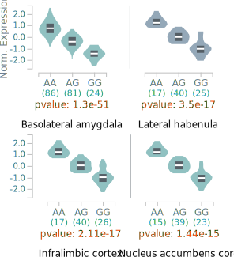
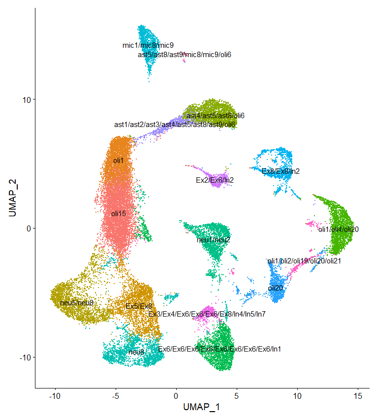

# Genetic factors influencing individual differences in vulnerability to oxycodone in rats

## Hao Chen, Ph.D.
#### Professor

#### Department of Pharmacology, Addiction Science and Toxicology, University of Tennessee Health Science Center

October 4th, 2023

---
## Oxycodone is highly addictive 

* Prescription oral oxycodone is a major contributor to the current opioid abuse epidemic.
* In general, rapid intravenous infusion of abused drugs produces greater positive subjective effects than slow infusion.
* It has been claimed that delayed absorption of oxycodone reduces its abuse liability.
* Oxycodone has strong addiction liability even when it is delivered orally in controlled-release formulation.

---
## Early prevention is key 

* Early diagnosis and prevention is critical for stemming opioid abuse epidemic.
* Readily available and easy to use test for many chronic diseases has been successful.
* Identifying early behavioral phenotypes that predict drug abuse and their genetic contribution will have high impact. 

---
## Oral self-administration of oxycodone in rats

<table> <tr><td width=40%>

</td>
<td>

<li> Operant licking procedure, one session per day
<li> Gradual increase in session length and oxycodone dose 
<li> No water or food restrictions, no drug pre-exposure

 Sharp et. al., Genes Brain Behav, 2021

</td>
</tr></table>
---
## Hybrid rat diversity panel

<b>Rat Genome Database | Medical College of Wisconsin</b>

---
## Whole genome sequencing of the HRDP
<table><tr>

<td width=60%>
 
</td>

<td>

 de Jong et. al., BioRxiv 2023

</td>
</tr></table>

---
#### Oxycodone self-administration in rats
## Rewards and intake, all strains combined by sex 

---
#### Oxycodone self-administration in rats
## Individual differences in initiation 

---
#### Oxycodone self-administration in rats
## Individual differences in stable intake, 4h 

---
#### Oxycodone self-administration in rats
## Individual differences in escalated intake with extended availability, 16h 

---
#### Oxycodone self-administration in rats
## Individual differences in motivation for oxycodone 

---
#### Oxycodone self-administration in rats
## Individual differences in cue-induced relapse 

---

## Correlations between sexes 

---

## Correlations between oxycodone and other behavioral traits

<b>females</b>
 

<b>males</b>
 

---
## Genetic mapping of substance use related traits in rats
### Socially acquired nicotine intravenous self-administration

 Chitre, Palmer et. al., unpublished

---

##  Literature mining for biologically relevant candidate genes |  https://genecup.org 

 Gunturkun, et. al., G3, 2022

---

## Combining brain region or cell type specific gene expression to identify candidate genes

<table> <tr>
<td width=50% align="right">

 Munro, Palmer et. al., Nucleic Acid Res. 2022

</td>

<td width=50%>

</td>
</table>

---

## Validating causal relationship using cell-type specific genome editing

<table><tr>

<td width=50%>

</td>
<td>

</td>

</tr></table>

 Sharp et. al., BioRxiv, 2023

---

## Summary

* Oral oxycodone self-administration captures some key features of opioid use disorder 
* Large phenotypic differences in oxycodone between inbred strains 
* The rat is a powerful model organism to dissect the molecular mechanisms underlying SUD 

---

## Acknowledgements

####  Current lab members working on this project 

<table><tr>

<td width=20%>

Shuangying Leng
</td>

<td width=20%>

Caroline Jones 
</td>

<td width=20%>

Angel Garcia Martinez
</td>

<td width=20%>

Tristan de Jong
</td>

</tr>
</table>

#### Collaborators

* Burt M Sharp | Megan K Mulligan | Robert W Williams (UTHSC)
* Abraham A Palmer  (UCSD)

Funding: NIDA U01DA053672 | U01U01DA047638 |   1U01DA057530 | P50DA037844 |  R01DA048017 
 

