# Genome-Wide Association Study on Three Behaviors Tested in an Open Field in Heterogeneous Stock Rats 

###	Hao Chen

### University of Tennessee Health Science center

---

## Project 2 of the P50: Socially acquired nicotine self-administration in adolescent HS rats

* Main phenotypes of interest
	* intravenous nicotine self-administration (active operant response, nicotine intake, reinstatement of drug seeking) 
* Additional phenotypes 
	* open field test (OFT), novel object interaction (NOIT), social interaction (SIT), elevated plus maze (EPM)
	* conducted before nicotine IVSA

---

## Personality traits are predictors of vulnerability to addiction

* Individuals with symptoms of anxiety are more likely to be smokers
* Novelty seeking is positively correlated with smoking onset
* Social environment plays a critical role in the development and treatment of addiction

---

## Behavioral tests 

* Breeding HS rats 
* PND 21: wean
* PND 32: open field test (OFT) (mean: 31.8 ± 2.6) 
* PND 33: novel object interaction (NOIT) 
* PND 34: social interaction test (SIT)
* PND 35: elevated plus maze (EPM)
* PND 38: jugular surgery for nicotine IVSA
* Sample size: 626 males and 630 females

 
 
<cite> Gunturkun, et al., Front Psychiatry. 2022 
</cite>

---

## Phenotype correlations

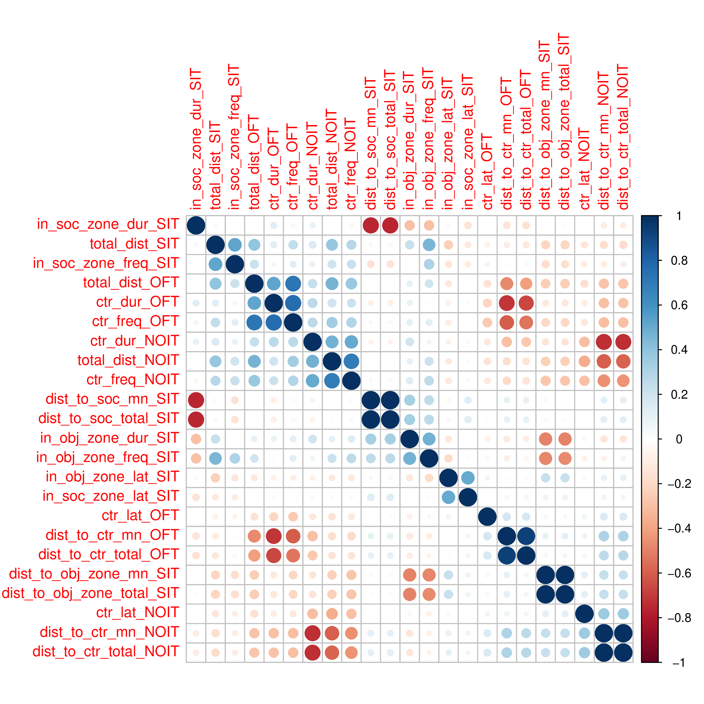

---

## Selected correlations

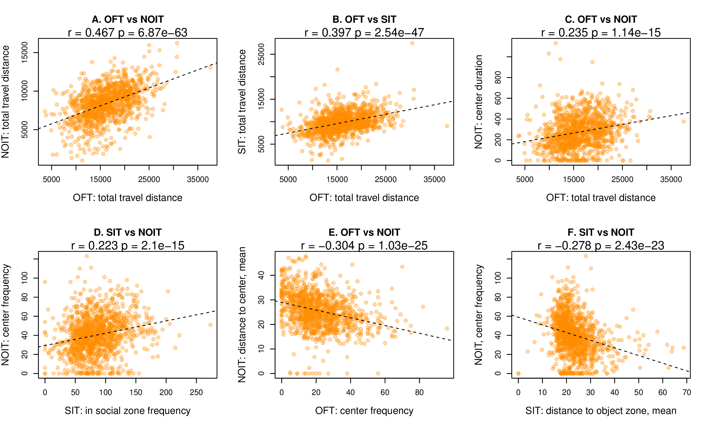

---

## Association between behavioral phenotype and nicotine intake

#### Loading of PCA

 

 
 
<cite>
Wang et al., GBB 2014, Sci Report 2018
</cite>

#### PCA regression summary 

|Phenotype | Sex| Variance Explained| 
|---|---|---|
|Infusion, first 3 d| F| 0.18| 
|Infusion, first 3 d| M| 0.17| 
|Infusion, last 3 d | F | 0.12| 
|Infusion, last 3 d | M | 0.20| 
|Infusion, progressive ratio | F | 0.14| 
|Infusion, progressive ratio | M | 0.18| 
|Active spout lick, reinstatement | F | 0.08| 
|Active spout lick, reinstatement | M | 0.19| 

---

## Genotyping and SNP heritability 

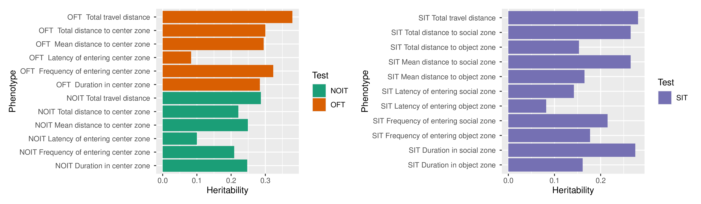

---

## GWAS: porcupine plot

OFT: 9 QTL; NOIT: 9 QLT; SIT: 14 QTL.

Note: pleiotrophic within traits but not between traits.

---

## Example QTL for OFT 

### Frequency of entering the center zone, Chr4:11801306
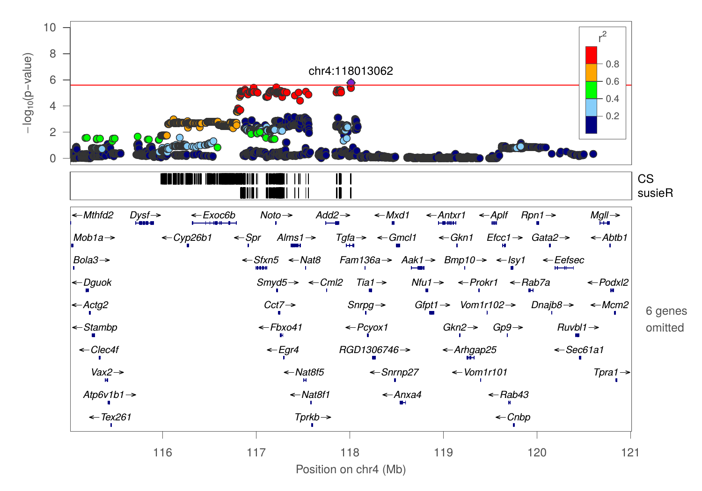

---

## Example QTL for NOIT 

### Duration in center zone, Distance to center zone, Chr4:112234344

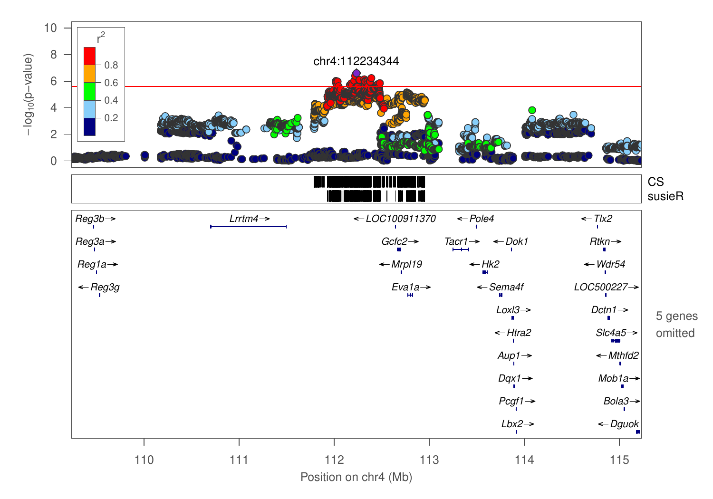

---

## Example QTL for SIT 

### Latency of entering the social zone, Chr17:58611795

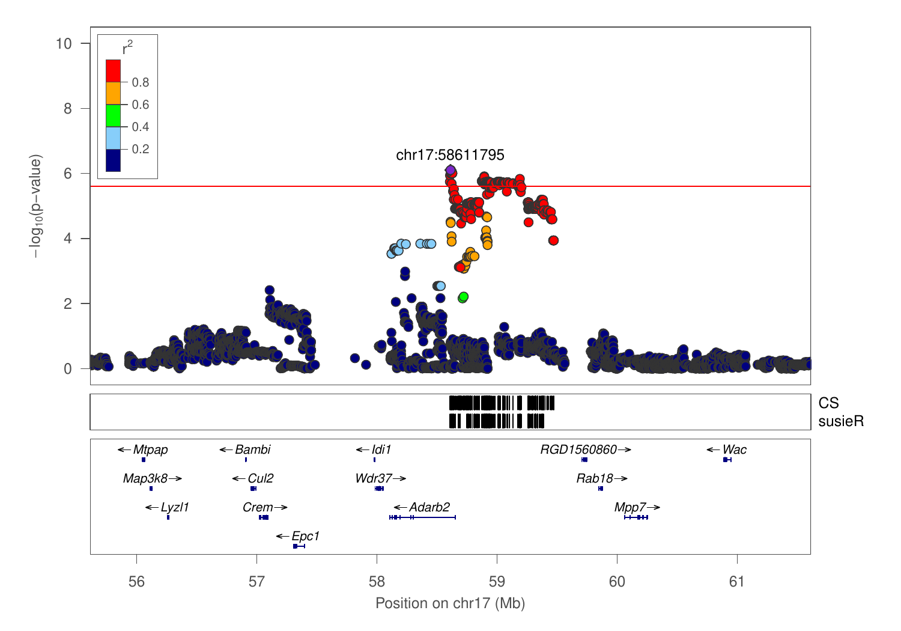

---

## Candidate gene selection

* Fine mapping (CS, Susie)
* High impact variants
* cis-eQTL 
* Expressed in the brain
* Humang GWAS on psychiatric traits 
* Functional relevance from the literature 

---
## Candidate genes: Cyp26b1

### Open field: Frequency of entering center zone, total distance to center zone

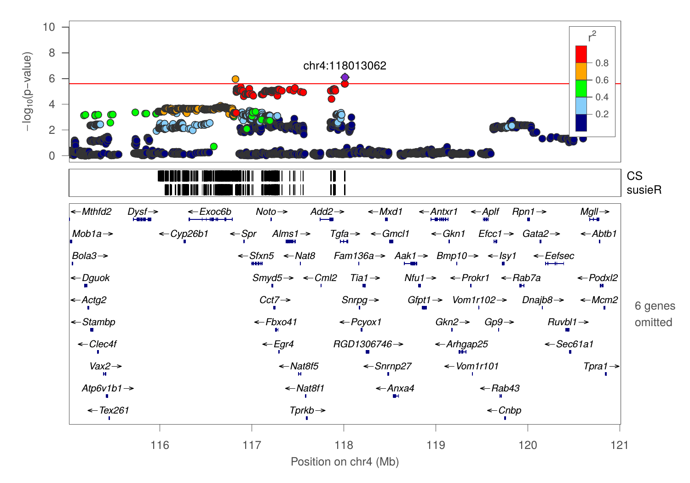

---

## Candidate genes: Cyp26b1

### effect plot

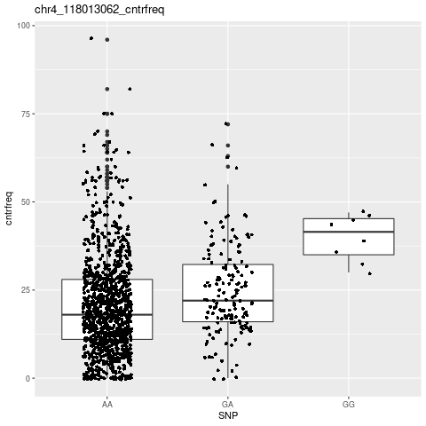

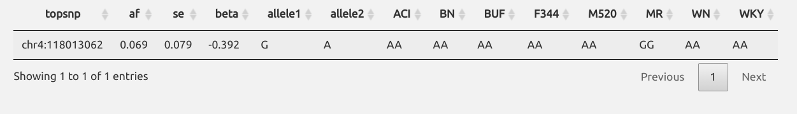

---

## Candidate genes: Cyp26b1

### coding variant and cis-eQTL

<table width=70%><tr><td>

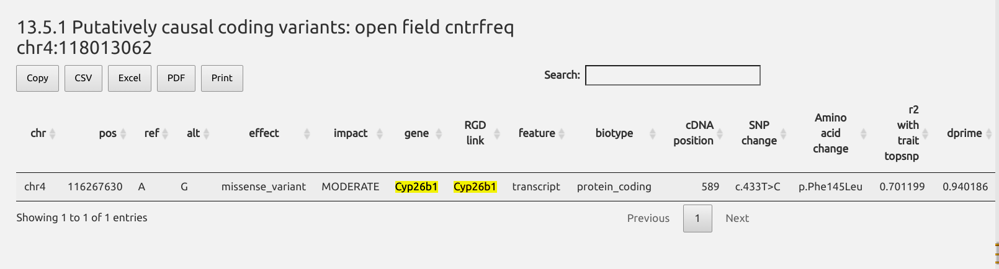
</td>
</tr>
<tr>
<td>
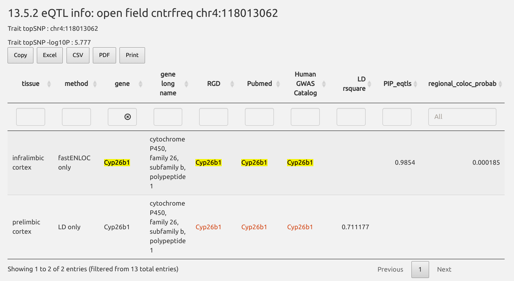
</td></tr>
</table>

---
## Candidate genes: Cyp26b1

### cis-eQTL in RatGTEx

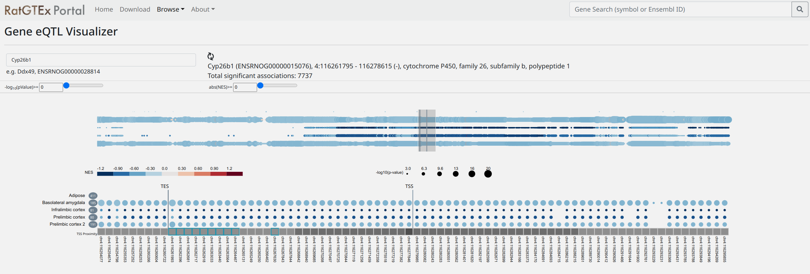

 
 
<cite> Munro, et al., BioRxiv. 2022 
</cite>

---

## RatGTEx: expression levels of candidate genes 
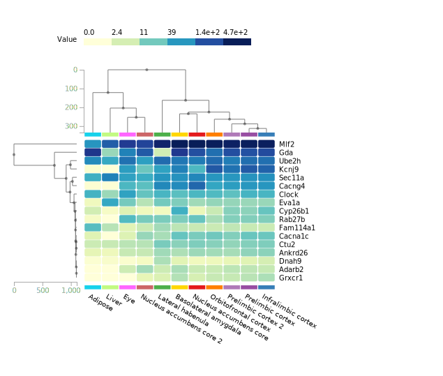

---

## Candidate genes: Cyp26b1

### Literature mining: Cyp26b1 

<a href="https://genecup.org/cytoscape/?rnd=tmpklRCuX&genequery=Cyp26b1">
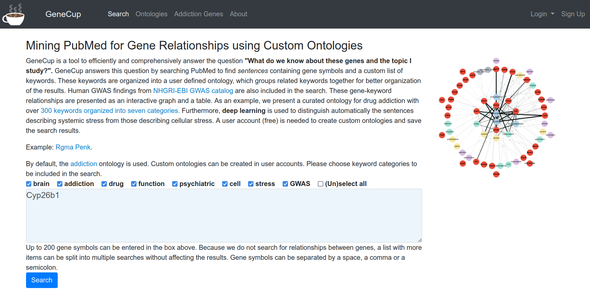
</a>

 
 
<cite> Gunturkun, et al., G3. 2022 
</cite>

---

## Other candidate genes

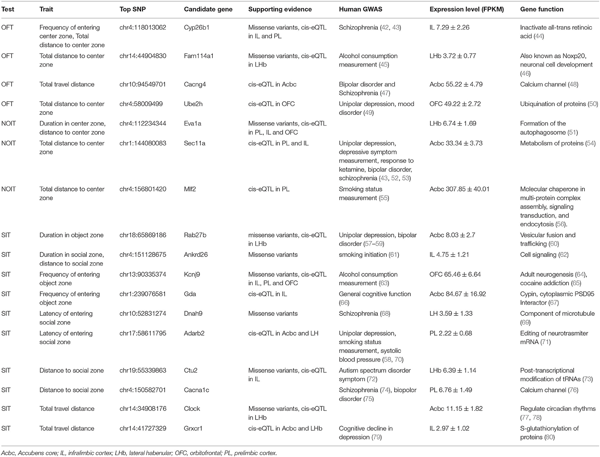

---

## Acknowledgements

<table><tr >
<td width=20% >
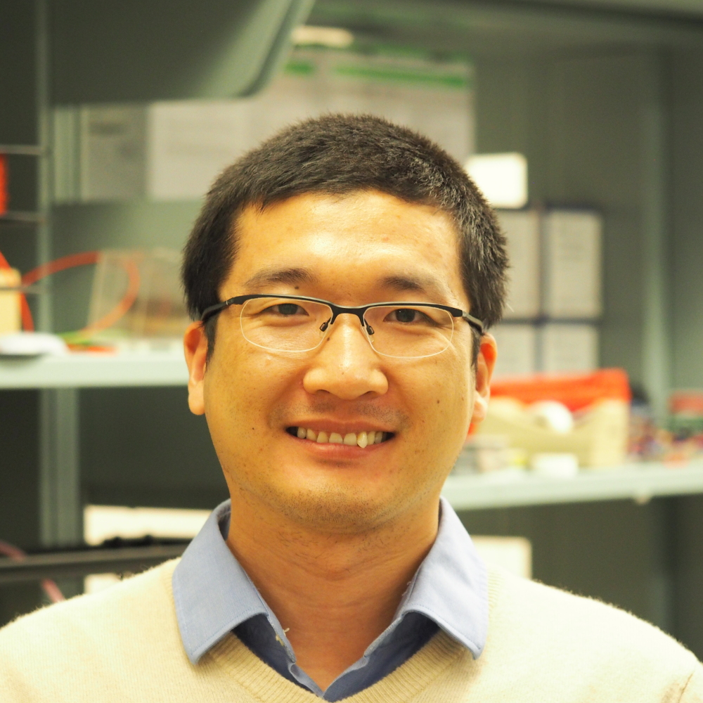

Tengfei Wang

</td>
<td width=20%>

Angel Garcia Martinez

</td>
<td width=20%>

Shuangying Leng

</td>
<td width=20%>

Caroline Jones

</td>
<td width=20%>
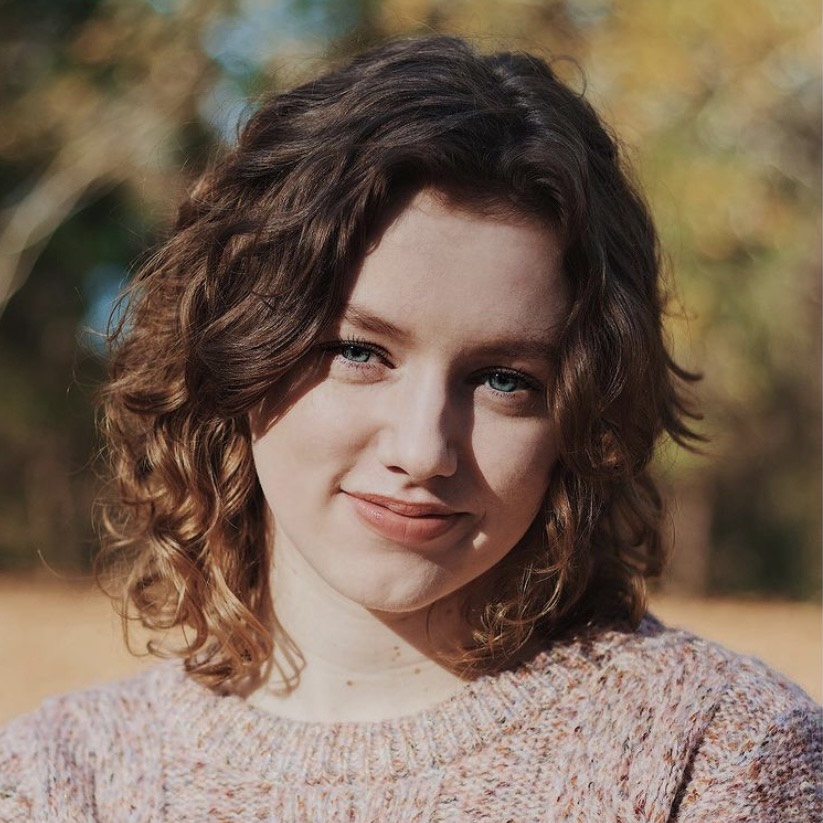

Gwen Johnson

</td>

</tr>
</table>

* Past lab members and summer students 
	 * Xia Hong | Jie Shen | Wenyan Han | Pawandeep Kaur | Yanyan Lin | Xinyu Fan | Mallory Udell | Sarah Cartwright | Hakan Gunturkun | Abigale Salinero | Cindy Tay | Raven Davis | Christian Hurt 

* P50 collaborators 
	* Abraham Palmer | Oksana Polaskaya | Apurva Chitre | Leah Solberg Woods | others 

---

## Heritability vs QTL

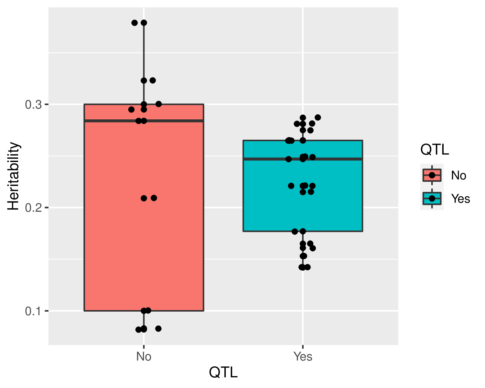

