# Socially Acquired Nicotine Self-administration in Rats Identifies Candidate Genes Shared with Human Smoking GWAS

## Hao Chen, Ph.D.

### Department of Pharmacology, Addiction Science and Toxicology

### University of Tennessee Health Science Center

---

## Nicotine is primarily aversive in non-smokers

<table>
 <tr>
 <td width=50%>
 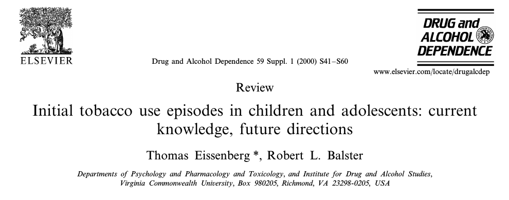
 </td>
 <td width=90%>
 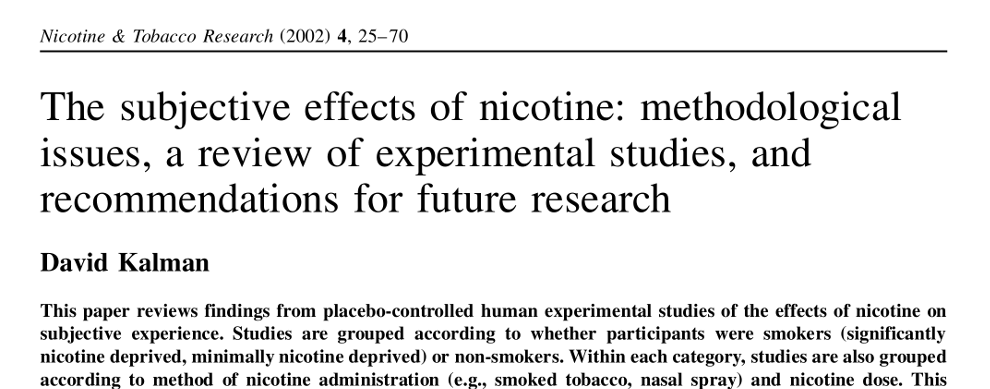
 </td>
 </tr>
 <tr>
 <td>
 Nausea, dizziness, sickness, headache, burning throat, coughing, etc..
 </td>
 <td>
 Nicotine induces drug high only in <em>significantly nicotine-deprived smokers</em>. 
 </td>
 </tr>
</table>

Note:
We all know nicotine is higly addicitive. However, unlikely other addicive sustances, it does not produce strong euhphorian. Not only that, it also has has strong aversive properties. This aversiveness is especially promimant in non-smokers, or in otherwords, for people start experimenting with tobacco. New smokers experience diziness, sickness

---

## Nicotine conditioned taste aversion in rats

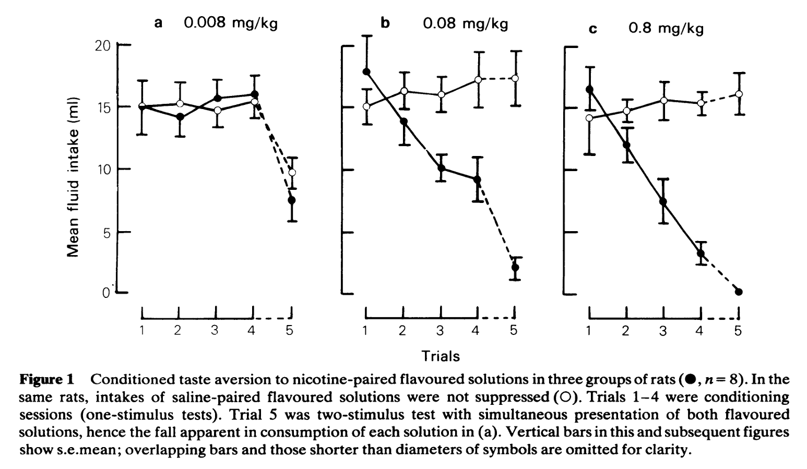

 Kumar, et. al., Br J Pharmac 1983

Note: https://www.ncbi.nlm.nih.gov/pmc/articles/PMC2044849/?page=3
flavors: sodium sacchaine vs sodium chloride
water access were limited to 1 h per day. flavors were presented every other day, followed by nicotine vs saline injection.

Here is an early nicotine conditioned taste aversion experiment.

The dose here, 0.08mg/kg, is about 3 infusions in most nicotine self-admionistration studies using rats. But rats also self-administer iv nicotine. One question is then do rats also experience the aversive response when nicotine is self-administered.

---

## Flavor cues conditioned to self-administered nicotine is aversive

<a href="#/demo">
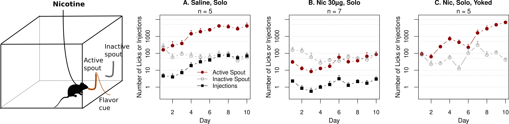
</a>

 Chen, et al., Neuropsychopharmacology, 2011 

Note:
One way you can study this is by combining conditioned taste aversion with i.v. self-administraion.
adolescent rats developed conditioned aversion to an appetitive flavor cue (saccharine + grape odor) associated with self-administered i.v. nicotine. In this operant <i>licking</i> model, oral flavor cue and <strong>i.v.</strong> nicotine were delivered simultaneously upon the completion of a fixed-ratio 5 reinforcement schedule.

---

## Social influence is a key factor in smoking initiation

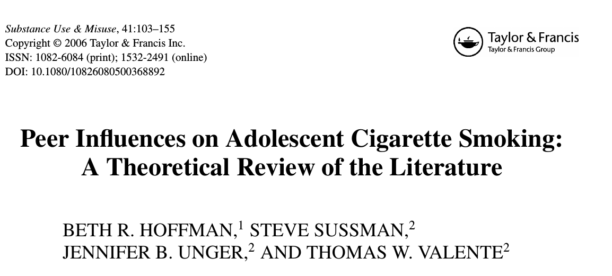 

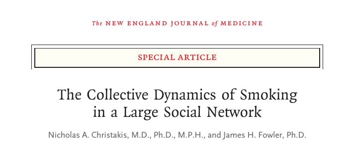 

Note:
Now that we established self-administered nicotine is aversive, the question then is why do invididuals take it? In humans, a lot of research points out that social environment is a key.

---

## Social transmission of food preference in rats

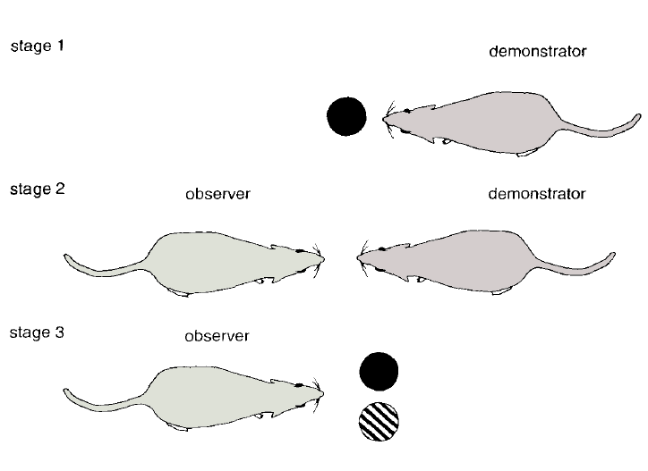

Galef, Curr Protoc Neurosci, 2003

Note:
In rats, there is also a long tradition of studying social learning. The particular procedure is called STFP. It takes advantage to the fact that rats are neophobic when it comes to novel foods. This is a three stage protocol.

---

## Social learning enables nicotine self-administration

<a href="#/solo">
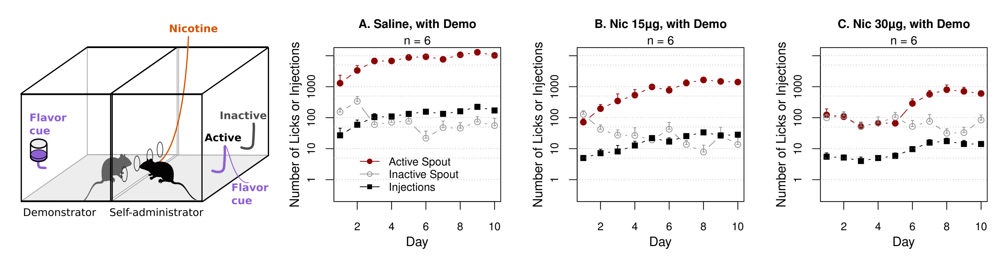
</a>

 Chen, et al., Neuropsychopharmacology, 2011 

Note:
However, with the presence of a "demonstrator" rat consuming the same flavor cue, nicotine i.v. self-administration was established.
No water or food deprivation or operant pretraining is needed. Thus the model is appropriate for studying smoking initiation in adolescents.

---

## Social learning changes the subjective value of the reward

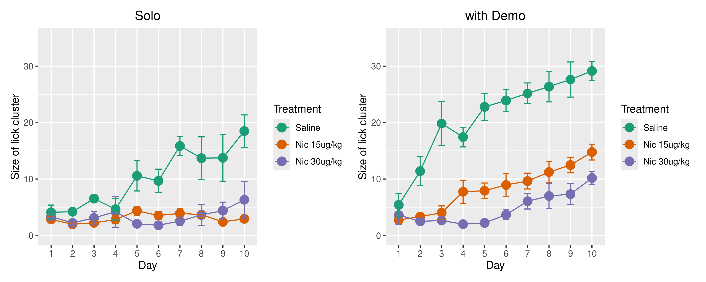

---

## IVSA is driven by nicotine

#### NOT by the subjective value of the flavor cue

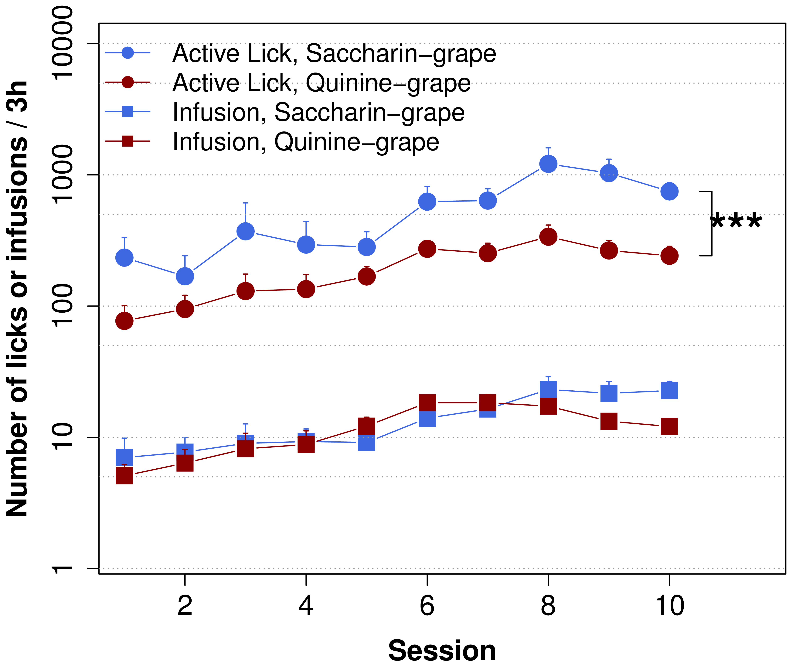

 Wang, et al., Psychopharmacology, 2016 

---

## What is transmitted from the demonstrator?

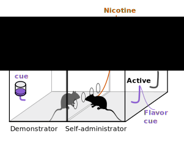

---

## Social learning is mediated by Carbon Disulfide (CS2) in rats

            

            

 

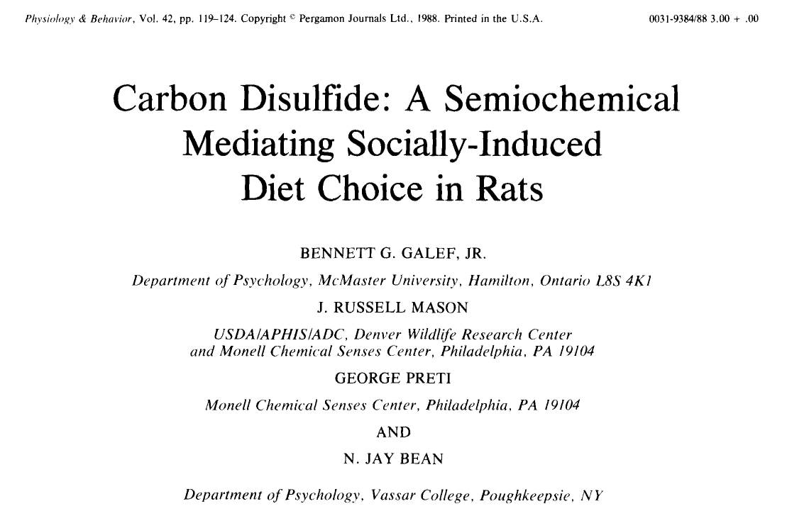

---

## Both CS2 and flavor cue are necessary for socially acquired nicotine IVSA

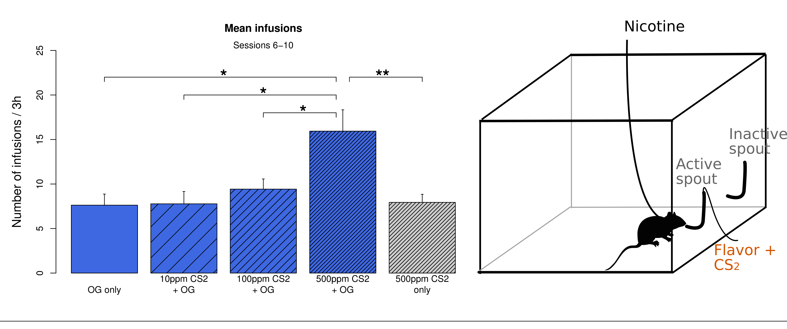

 Wang, et al., PLoS One, 2014 

Note:
We confirmed that neither nicotine associated flavor cue nor carbon disulfide alone supported nicotine IVSA. However, their combination was sufficient to replicate the behavior induced by live demonstrator rats.

---

### Summary

## Socially acquired nicotine IVSA in adolescent rats

<ul>
<li > This model incorporates the aversive and reinforcing properties of nicotine </li>
<li > Flavor cues are associated with the aversive property of nicotine </li>
<li > Operant responding is driven by the reinforcing property of nicotine </li>
<li > Social environment determines the subjective value of nicotine</li>
<li > Social learning facilitates nicotine intake by enhancing the extinction of conditioned aversion</li>
<li > Nicotine IVSA is heritable in this model.</li>

</ul>

---

## Heterogeneous stock rats

<table><tr><td width=20%>

<b>Leah Solberg Woods  Wake Forest School of Medicine 
</b>
</td>
<td width=80%>
             

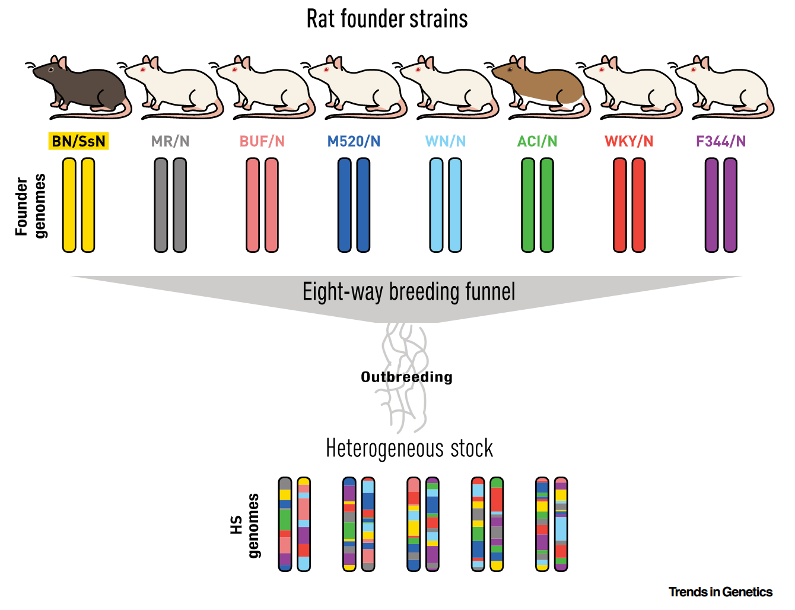
              

 Garret and Korstanje, Trends Genet, 2020
</td>
</tr></table>

---

## Behavioral Test Schedule

<table> <tr><td width=30%>

<a href="#/ethovision_v4_v15">
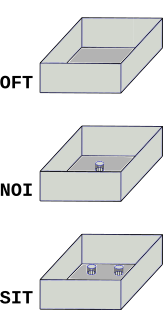
</a>

</td><td>

| Age         | Test                                 |
| ----------- | ------------------------------------ |
| PND21       | Wean, Body weight                    |
| PND31       | Open field test (20min)              |
| PND32       | Novel object interaction (20min)     |
| PND33       | Social interaction test (20 min)     |
| PND34       | Elevated plus maze (6min)            |
| PND38       | Surgery                              |
| PND39 -- 41 | Recovery                             |
| PND42 -- 51 | Socially acquired nicotine IVSA      |
| PND52       | Progressive ratio test               |
| PND53 -- 56 | Extinction                           |
| PND57       | Contextual cue induced reinstatement |
| PND59       | Tissue Collection for the IVSA rats  |

</td></tr></table>

---

## Genotyping and GWAS

<table> <tr>
	<td width=50%>
		
 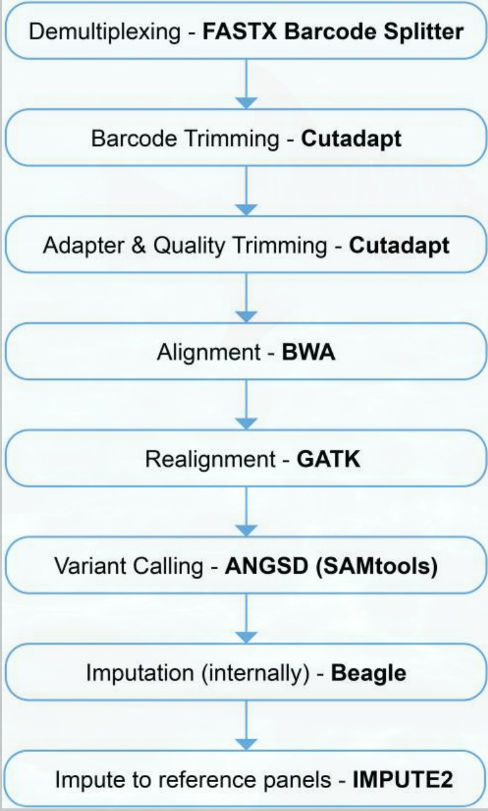 

		

		 Gileta et al., G3, 2020. 
		

	</td>
	<td width=50%>
		

		
		 
		<b>Abraham Palmer, UCSD</b>
		

		

		<ul>	
			<li> 3.5 million SNPs per individual (estimated error rate <1%)
			<li> GCTA with liner mixed model
			<li> Leave one chromosome out procedure
			<li> Genome-wide significance level set by permuation: -log10(p) > 5.6 
		</ul>
	</td>
</tr>
</table>

---

## GWAS: Open Field Test

n=1857

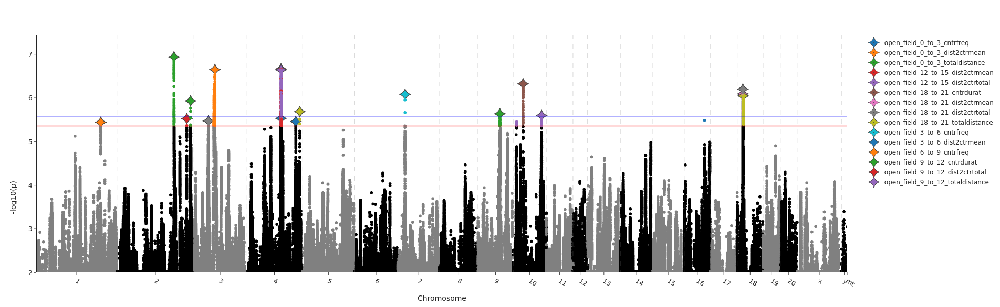
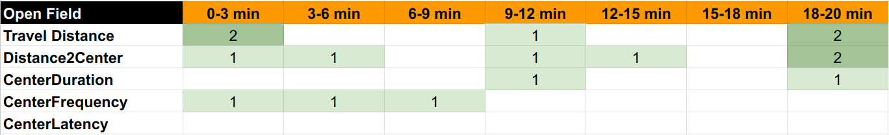

---

## GWAS: Novel Object Interaction

n=1963

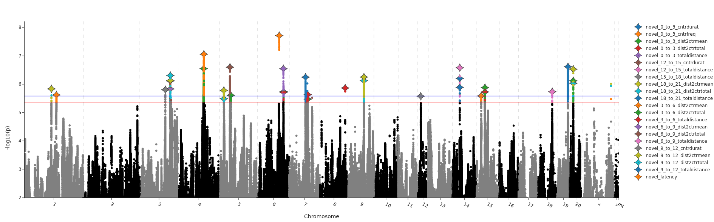
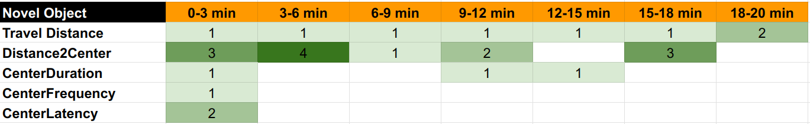
---

## GWAS: Social Interaction

n=1835

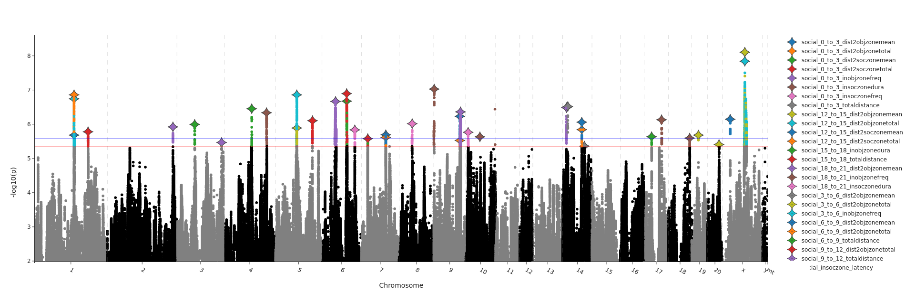
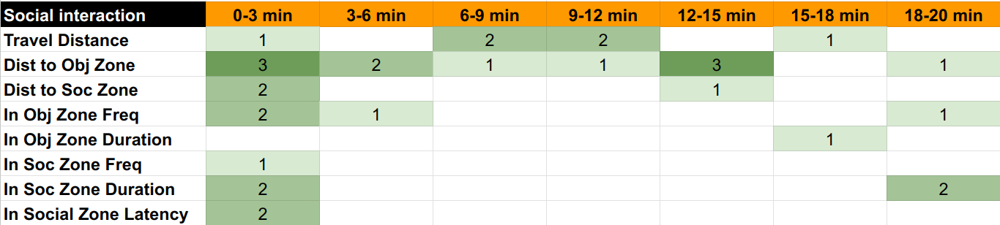

---

## GWAS: Elevated Plus Maze

n=1875

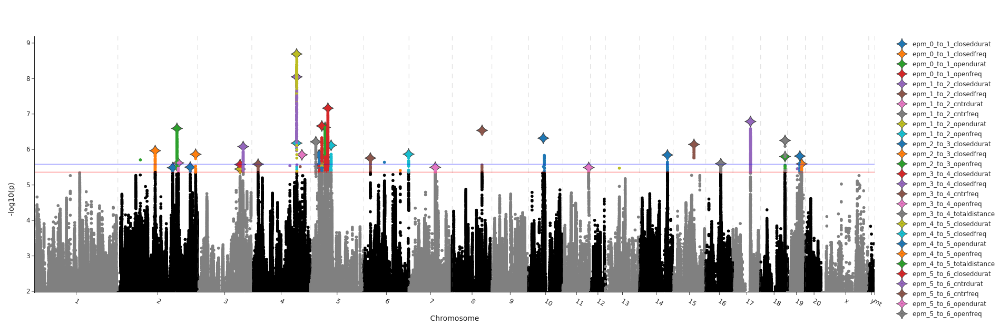
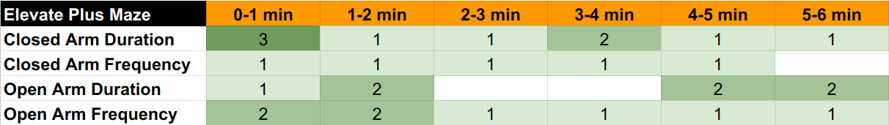

---

## GWAS: Socially Acquired Nicotine IVSA

n=1995

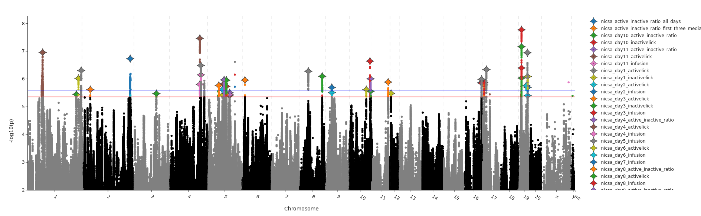

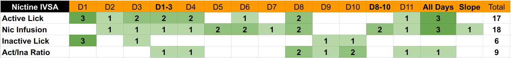

---

## PheWAS: Social Interaction & Socially Acquired Nicotine IVSA

<table><tr>
<td width=33%> 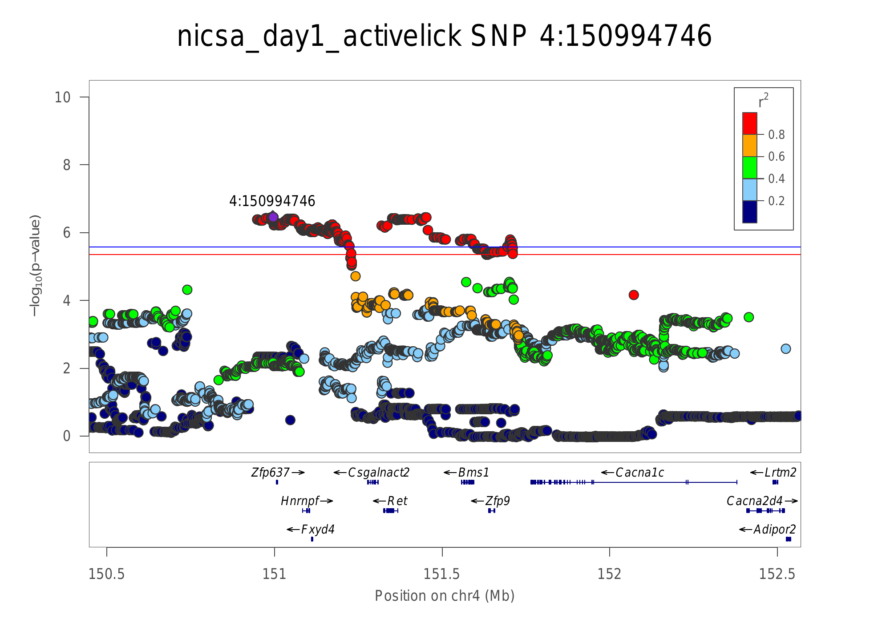 </td>
<td width=33%> 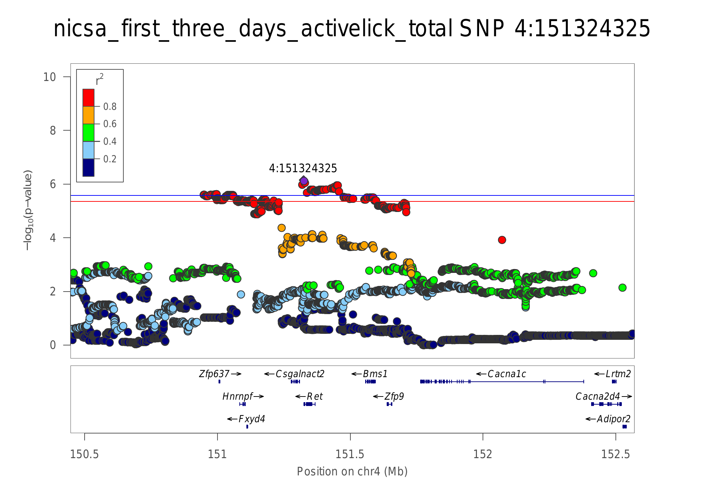</td>
<td width=33%>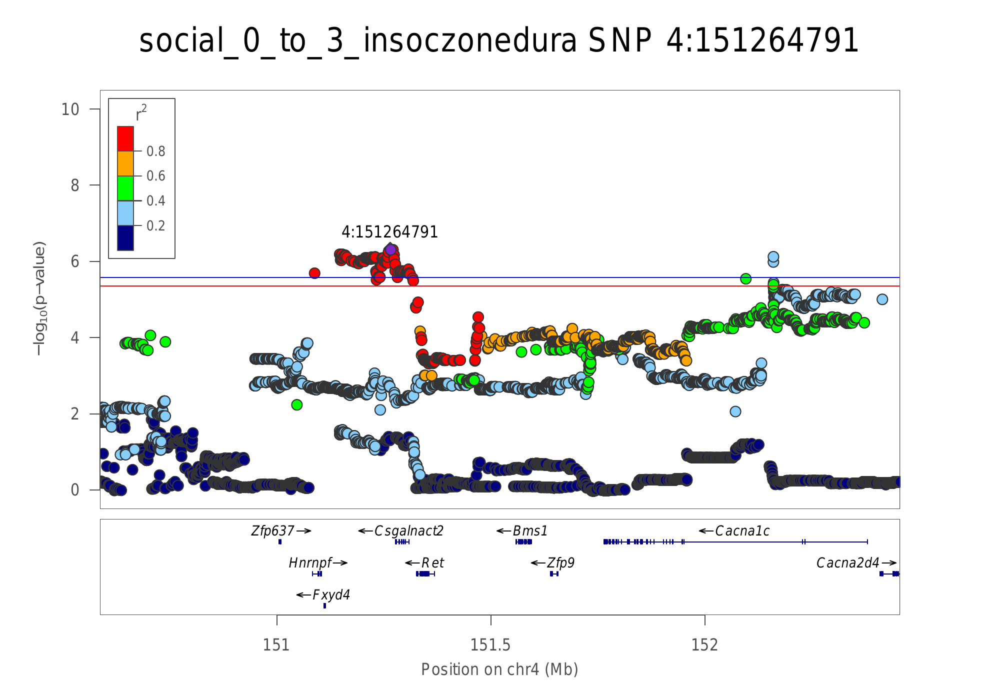</td>
</tr></table>

| SNP PheDb   | -Log10(p)PheDb | R2    | DP    | trait PheDb                                                 |
| ----------- | -------------- | ----- | ----- | ----------------------------------------------------------- |
| 4:151349337 | 5.04           | 0.959 | 0.982 | nicsa day1 infusion                                         |
| 4:151240226 | 4.057          | 0.798 | 0.995 | nicsa day1 active inactive ratio                            |
| 4:151324325 | 6.15           | 0.966 | 0.987 | nicsa first three days activelick total                     |
| 4:151324325 | 4.78           | 0.966 | 0.987 | nicsa first three days infusion total                       |
| 4:151964479 | 4.329          | 0.408 | 0.953 | <b>social interaction: in social zone duration, 0-3 min</b> |

---

## Many QTL are Very Narrow

<table><tr><td width=50%>

 
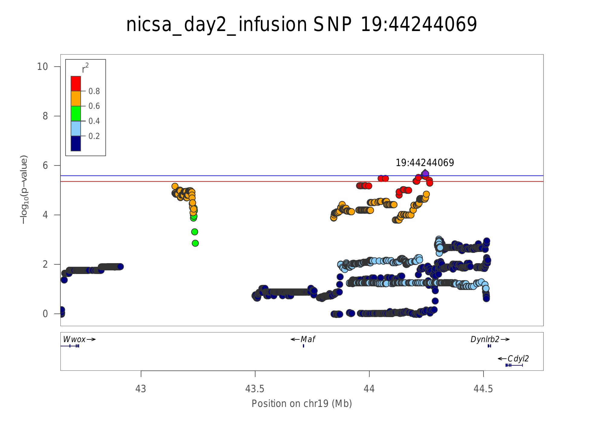

</td><td>

 
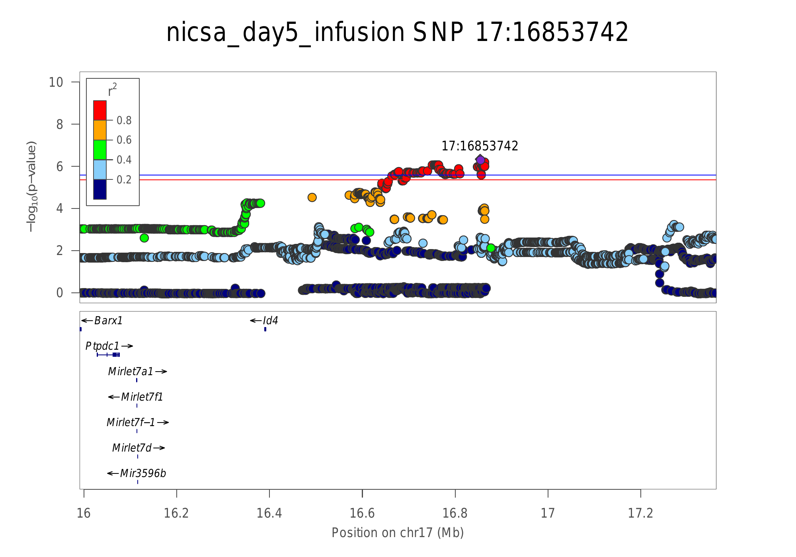 

</td></tr></table>

---

## A Few QTL are Wide

---

## Multiple Causal Genes in One QTL?

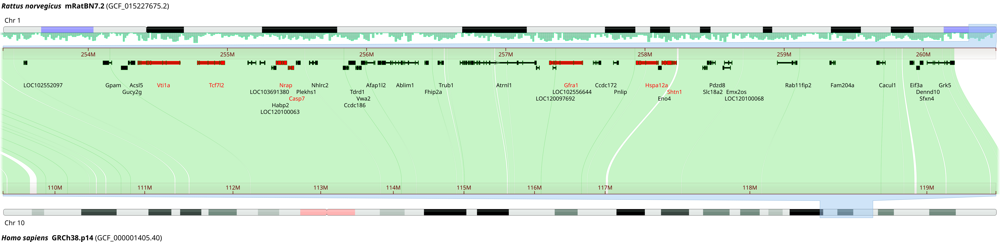

---

## Top Smoking Phenotypes in GWAS Catalogue

| Trait                           | Number of Sig. SNPs 1 | Note                                                                     |
| ------------------------------- | -------------------------------- | ------------------------------------------------------------------------ |
| Smoking initiation 2 | 5498                             | 5269 from Saunders, et al. PMID: 36477530 and Liu et al., PMID: 30643251 |
| Cigarettes smoked per day       | 610                              |                                                                          |
| Smoking status 3     | 481                              | 218 were from Karlsson Linnér et al. PMID: 30643258.                     |
| Smoking cessation 4  | 452                              | 335 were from Saunders, et al., PMID: 36477530.                          |
| Age of smoking initiation       | 243                              |                                                                          |

<table><tr><td>

1. p-val < 5E-8, replicated finding not filtered out
 
2. Ever being a regular smoker in their life (current or former) vs never being a regular smoker in their life 
 
3. Ever vs nerver smoker
 
4. Current smokers vs former smokers 

</td></tr></table>

---

## Overlap Between Genes Under Rat Nictotine IVSA QTL

## and Human Smoking Initiation

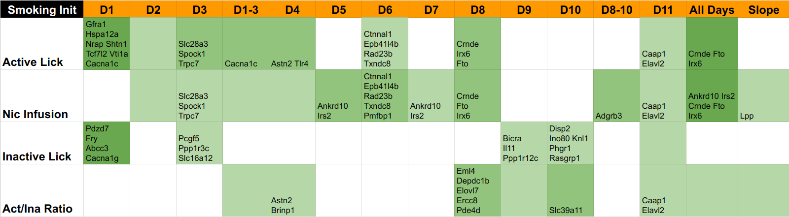

---

## Overlap Between Genes Under Rat Nicotine IVSA QTL

## and Cigarettes per Day

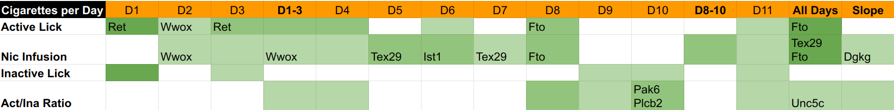

---

## Gene Ontology Enrichment of Overlapping Rat and Human Genes

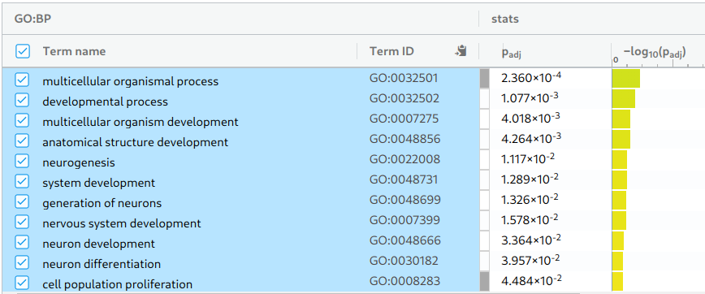

---

## LINC02337/TEX29

Human GWAS: Pack years (Cigarettes per day divided by 20, multiplied by number of years smoking)

Rat GWAS: Total nicotine infusion

Common: total overall exposure to tobacco/nicotine.

<table> <tr> <td width=50%>
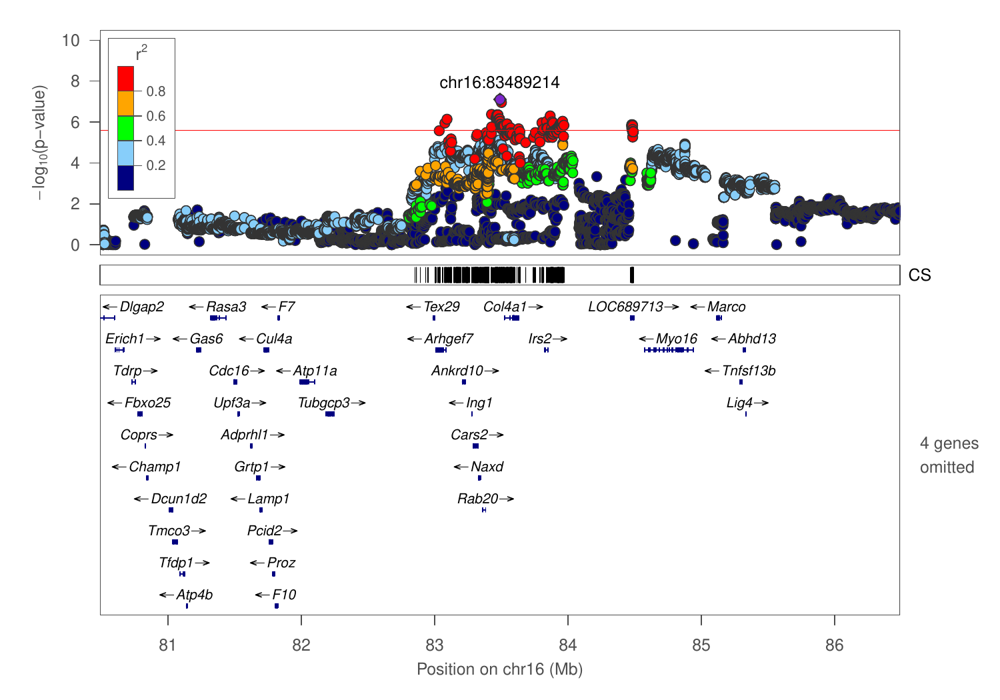

</td>
<td>

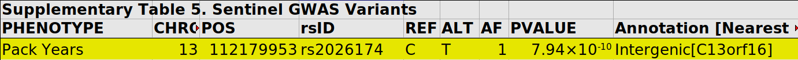

<!--
<a href="https://www.ebi.ac.uk/gwas/variants/rs2026174" target=_new> New annotation: LINC02337 </a>

<a href="http://genome.ucsc.edu/cgi-bin/hgTracks?db=hg38&lastVirtModeType=default&lastVirtModeExtraState=&virtModeType=default&virtMode=0&nonVirtPosition=&position=chr13%3A110979763%2D112075449&hgsid=1385374851_DFWqHgcyTThiDJV0a0SLgElBbEDP" target=_new> Is Arhgef7 more likely?</a> Arhgef7 expression is FPKM=30 in our dataset. It is involed in spine morphogenesis. Loss of Arhgef7 results in extensive loss of axons (PMID:30683798, PMID:29891904)
        --->

Exome Chip Meta-analysis Fine Maps Causal Variants and Elucidates the Genetic Architecture of Rare Coding Variants in Smoking and Alcohol Use 
Brazel, et. al., Biol Psychiatry 2019

</td></tr></table>

Note:

---

## Novel Candidate Genes for Nicotine IVSA not Reported in Human GWAS

#### literature search conducted using https://GeneCup.org

<a href="https://genecup.org/cytoscape/?rnd=tmpxUiwWs&genequery=Camk1_Tlr9_Grm2_Trim32_Akap2_Scn3b_Col4a1">

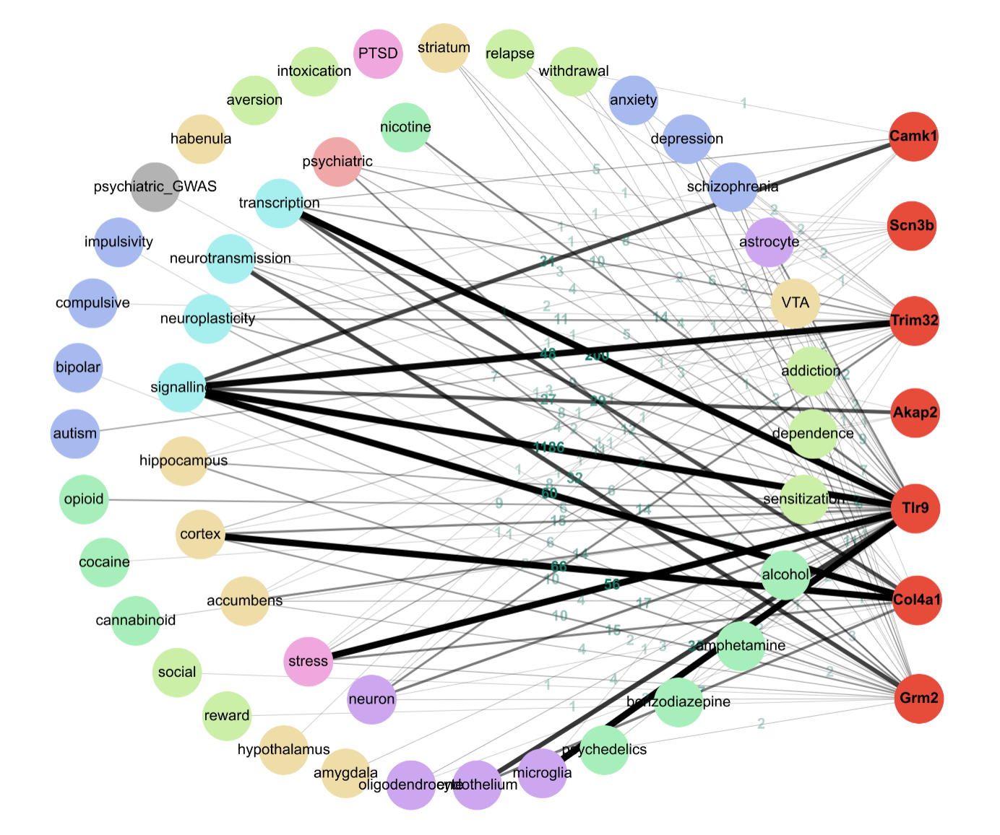

</a>

---

## Zebrafish Nicotine Conditioned Place Preference Test

<table><tr><td width=50%>

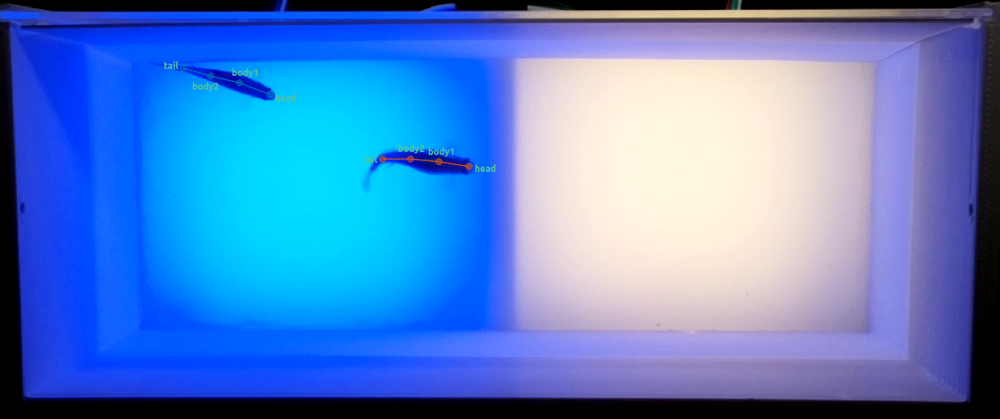

</td><td>

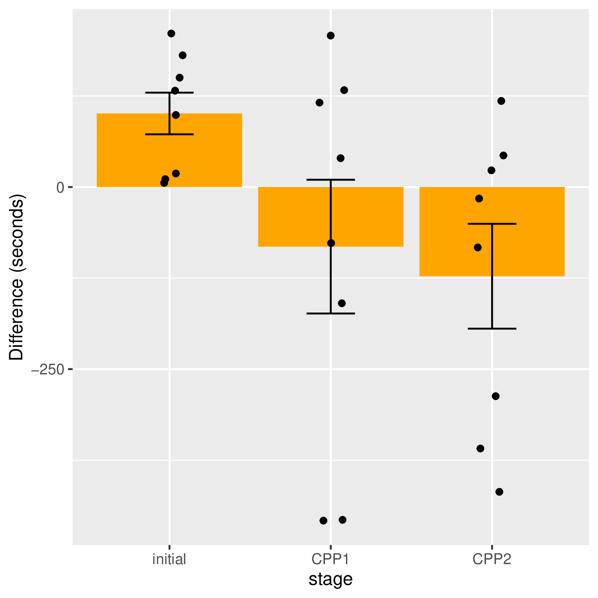

</td></table>

---

## In vivo genome editing in rats

 Sharp, et. al., Scientific Report, 2024 

---

## Acknowledgements

<table><tr align=center>

<td width=16.7%>

Angel G Martinez
</td>
<td width=16.7%>

Shuangying Leng
</td>
<td width=16.7%>

Caroline Jones
</td>
<td width=1>

<td width=16.7%>

Tomomi Green
</td>

<td width=16.7%>

Rachel Ward
</td>

<td width=16.7%>

Jun Huang
</td>

</tr>
</table>

- Past technicians and analysts
  - _Xia Hong_ | _Jie Shen_ | _Wenyan Han_ | _Pawandeep Kaur_ | _Yanyan Lin_ | _Xinyu Fan_ | _Mallory Udell_ | _Gwen Johnson_ | _Hakan Gunturkun_ | _Tengfei Wang_ |
  <!--- REHU students Abigale Salinero (2015) | Cindy Tay (2016) | Raven David (2017) | Christian Hurt (2018) | Gwen Johnson (2021) | Olivia Harrison (2022, 2023) | Ryan Luib (2023)
    --->
- P50 collaborators
  - Abraham Palmer | Oksana Polesskaya | Sanches, Thiago | Apurva Chitre | Shae Ziegler | Leah Solberg-Woods
- UTHSC collaborators
  - Changhoon Jee | Burt Sharp | Thirumalini Vaithianathan | Rob Williams | and others

Funding: NIH/NIDA P50DA037844

---

## Nicotine metabolism

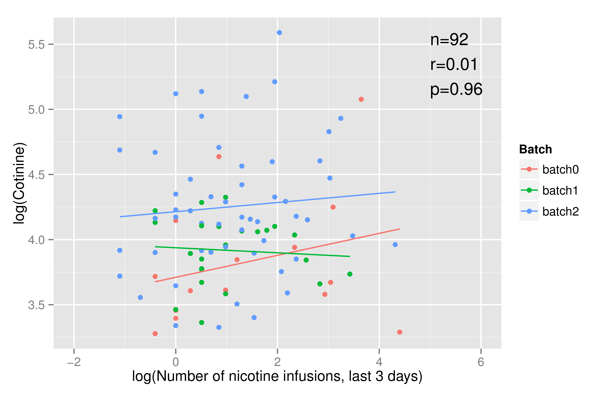

---

<section id="cta0">

## Flavor cues conditioned to self-administered nicotine is aversive

<a href="#/cta1">
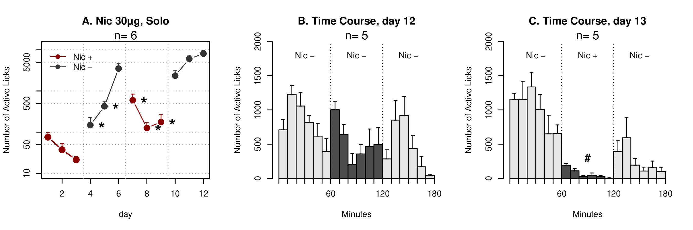
</a>

 
 Chen, et al., Neuropsychopharmacology, 2011 

Note:
To further confirm that nicotine is aversive, we tested removing nicotine after three sessions. So this is an extinction procedure, where the cue is presented without the uncontitioned stimulus. In these adolescent SD rats, extinction happened relatively quickly. We'll come back to this extinction procedure shortly.

---

## Is CS2 relevant to human?

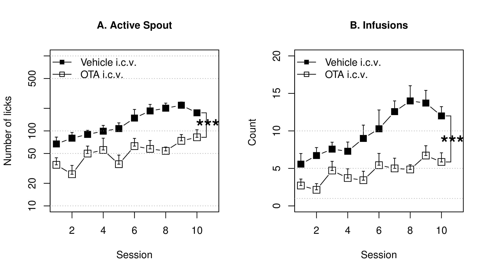

 Chen, unpublished data

---

## Nicotine intake is heritable

### h2=0.54-0.65 estimated using 12 isogenic strains across two doses

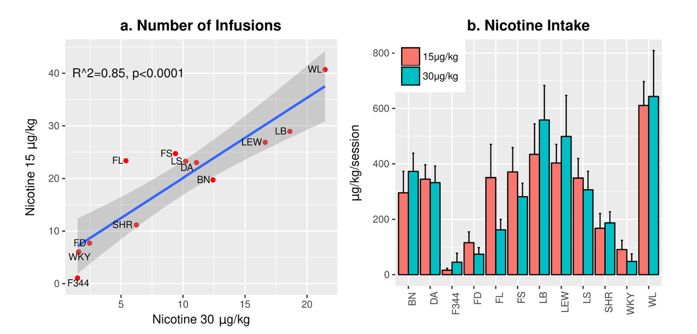

 Han, et al., Sci Report, 2017 

---

<section id="cta1">

## Social learning facilitates the extinction of conditioned nicotine aversion

 Han, et al., Sci Report, 2017 

Note:
With these inbred rats, we wanted to ask another question, which is the relationship between the aversive response and nicotine intake. One obvious hypothesis was that rats with stronger conditioned aversion to nicotine will self-administer less. To measure CTA, we have two groups, one recives nicotine and one recives iv nicotine. We did three days of nicotine becasuse we knew it was sufficient. After day 4, both groups recived saline. The difference in number of rewards between nicotine and saline on day 4 is an index for CFA. I really hated to discard the rats away after only getting four days data, especailly we went through all the trouble in during jugular surgery. So we added five extinction sessions. we use the number of rewards on the last session as an index of extion. So CFA and Extion of CFA are on the y-axis, the x-axis of these plots are number of nicotine infusions. It turns out, there was no correlations between CFA and intake but extinction of CFA is a predictor of nicotine intake. So this suggests, that the way social learning works is by facilite the extinction, or the dissociation between the flavor and the aversive effect of nicotine.

---

## Social learning supports nicotine IVSA with an aversive flavor cue

<table>
<tr><td width=15% valign="middle">Social, Non-learning</td><td rowspan=2>
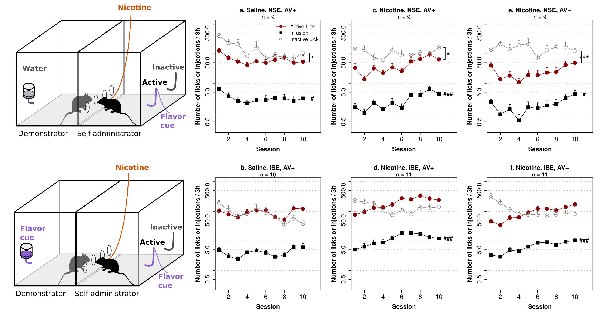
</td></tr>
<tr><td> Social, Learning</td></tr></table>

 Wang, et al., Psychopharmacology, 2016 

Note:
To further demonstrate that the appetitiveness of flavor cue is driving nicotine intake in our model, we replace the saccyhrine cue with a quinine cue. The bitterness of quinine is often used to show rats with self-administration history that will resist the punishment in order to obtain drug. Here we paired it as a contingent cue at the begining of nicotine self-administration. We also improved our control by adding a demonstration rat on the left side of the operant chamber.
<b>NSE</b>: neutral social environemnt, i.e., the presence of a companion rat.
<b>ISE</b>: indusive social environment, i.e., the presences of a companion rat who has access to the flavor cue.
<b>AV</b>: audiovisual cue

---

## Socially acquired nicotine self-administration in HS rats

### 52 adult males and 48 adult females

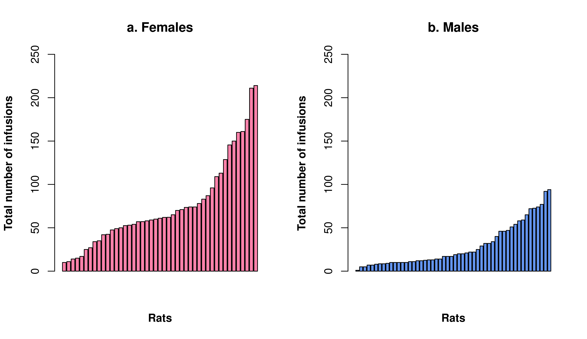

 Wang, et al., Gene Brain Behav, 2014

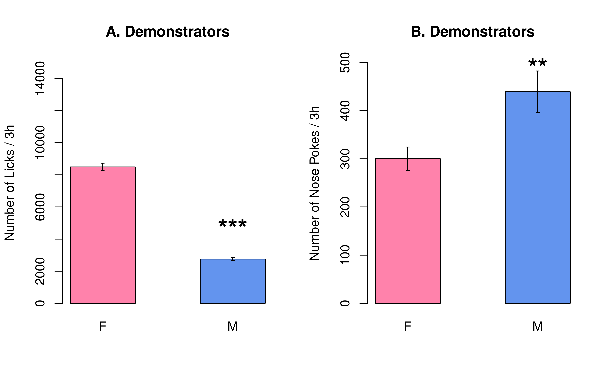

---

## Can behavioral traits predict nicotine IVSA?

#### Loading of PCA

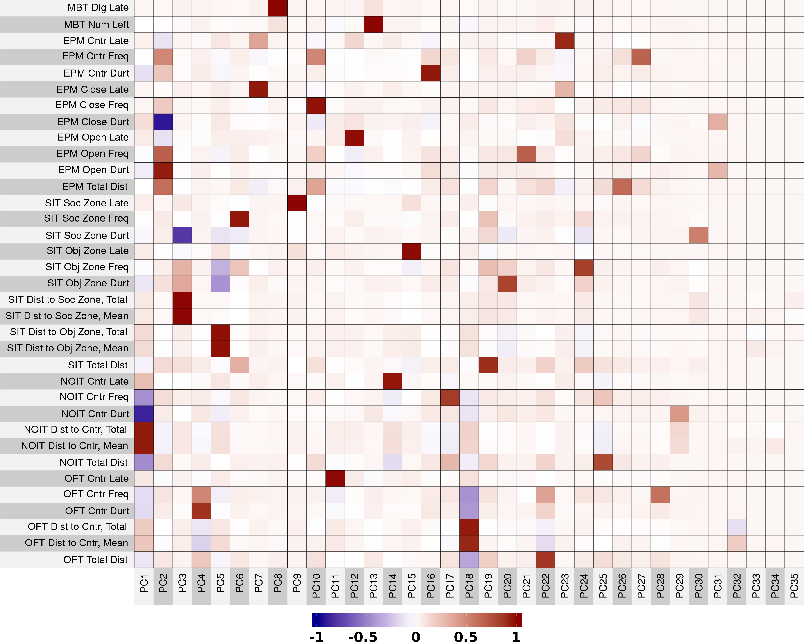 

 Wang, et al., Scientific Report, 2018 

#### PCA regression summary

| Phenotype                        | Sex | Variance Explained |
| -------------------------------- | --- | ------------------ |
| Infusion, first 3 d              | F   | 0.18               |
| Infusion, first 3 d              | M   | 0.17               |
| Infusion, last 3 d               | F   | 0.12               |
| Infusion, last 3 d               | M   | 0.20               |
| Infusion, progressive ratio      | F   | 0.14               |
| Infusion, progressive ratio      | M   | 0.18               |
| Active spout lick, reinstatement | F   | 0.08               |
| Active spout lick, reinstatement | M   | 0.19               |

---

## Gria4 Western blot

<table><tr><td width=60%>

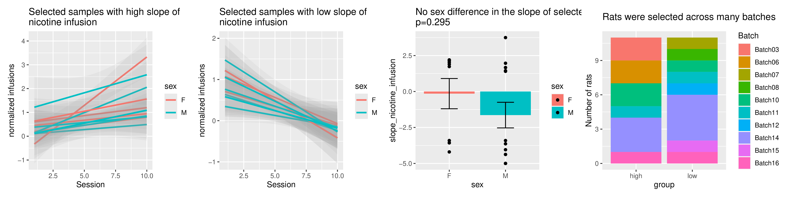

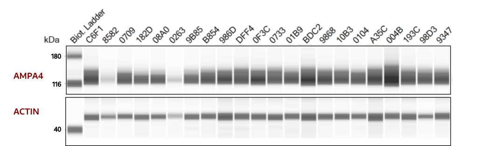
</td>
<td width=40% valign="middle"> 
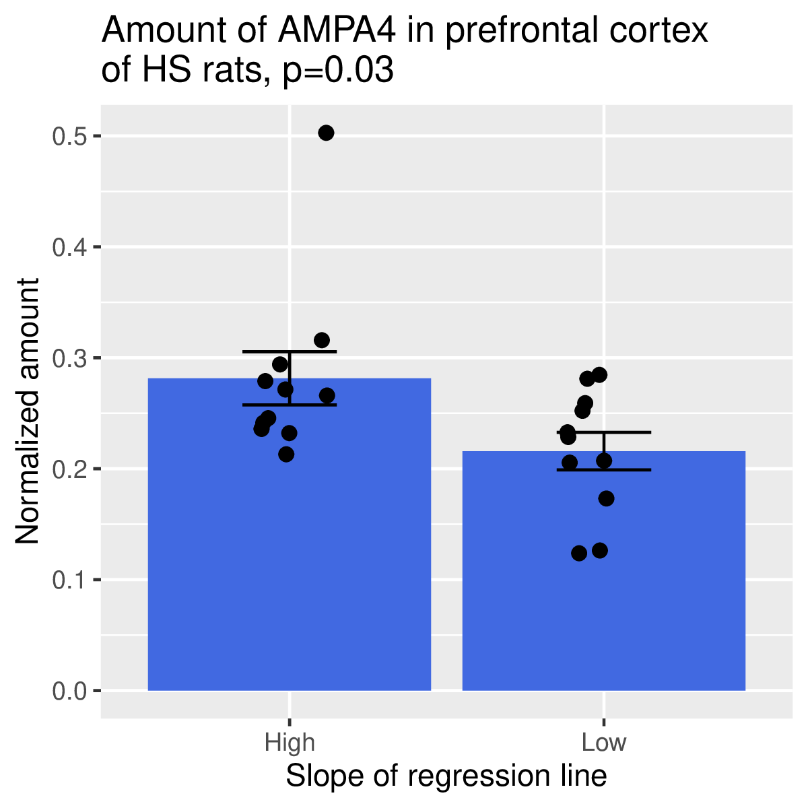
</td></tr></table>

---

## Gria4 null mutation abolishes nicotine CCP in C.elegans

<table><tr><td width=15%>

<b> Dr. Changhoon Jee   Assistant Prof, UTHSC</b>

</td><td width=85%>
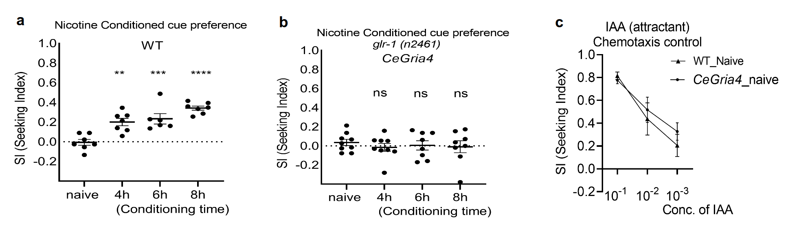
</td></tr></table>

---

## Base Editing Zebrafish Genome

<table><tr><td width=50%>

</td>
<td width=50%>
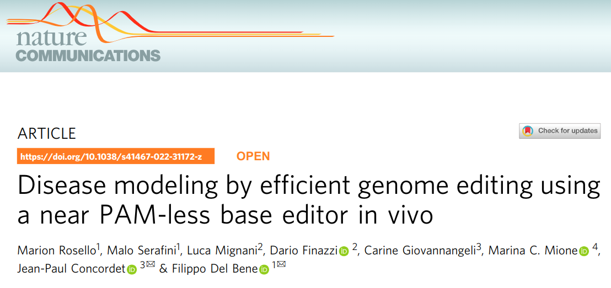
</td></tr>

</td></table>

---

## HS progenitors contain ~80% of the genetic variants in lab rats

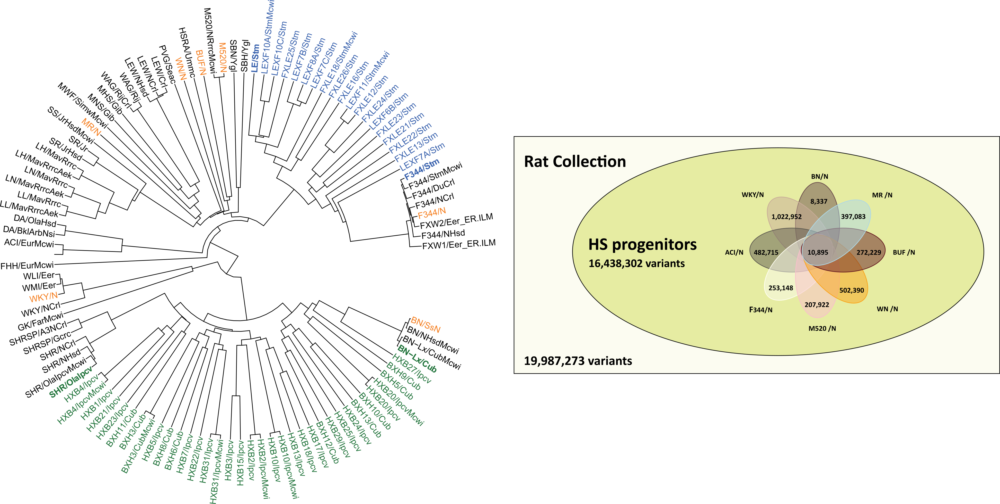

 de Jong et al., Cell Genomics, 2024 

---

## Is the appetitive cue driving IVSA?

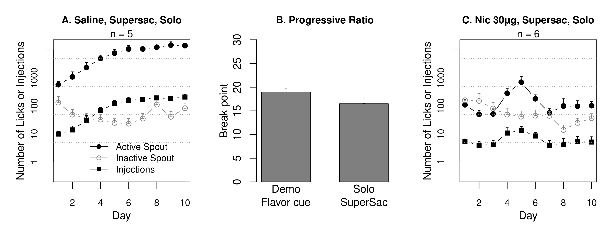

 Chen, et al., Neuropsychopharmacology, 2011 

Note:
Obviously, there are many questions in this somewhat complicated model. There is nicotine, there is flavor cue, there is social cue. They key question is what is driving the self-admnistration behavior. We've done a lot of expeirments to show that the operant licking behavior is driven by nicotine. I don't have time to show you all the data but here are some of the key findings. First of all, is a flavor cue with strong appetitiveness sufficient to drive nicotine intake without social factors.

---
