# GWAS of socially acquired nicotine self-administration in adolescent outbred rats 

## Hao Chen, Ph.D.

### Department of Pharmacology, Addiction Science and Toxicology
### University of Tennessee Health Science Center

---

## Outline

* Socially acquired nicotine intravenous self-administration in rats
* Genome-wide association study identifies genomic regions  

---

## Nicotine is primarily aversive in non-smokers 

<table>
 <tr>
 <td width=50%>
 
 </td>
 <td width=90%>
 
 </td>
 </tr>
 <tr>
 <td>
 Nausea, dizziness, sickness, headache, burning throat, coughing, etc..
 </td>
 <td>
 Nicotine induces drug high only in <em>significantly nicotine-deprived smokers</em>. 
 </td>
 </tr>
</table>

Note:
We all know nicotine is higly addicitive. However, unlikely other addicive sustances, it does not produce strong euhphorian. Not only that, it also has has strong aversive properties. This aversiveness is especially promimant in non-smokers, or in otherwords, for people start experimenting with tobacco. New smokers experience diziness, sickness 

---

## Nicotine produces aversive effects in rats

 Kumar, et. al., Br J Pharmac 1983

Note: https://www.ncbi.nlm.nih.gov/pmc/articles/PMC2044849/?page=3
flavors: sodium sacchaine vs sodium chloride
water access were limited to 1 h per day. flavors were presented every other day, followed by nicotine vs saline injection. 

Here is an early nicotine conditioned taste aversion experiment.

The dose here, 0.08mg/kg, is about 3 infusions in most nicotine self-admionistration studies using rats. But rats also self-administer iv nicotine. One question is then do rats also experience the aversive response when nicotine is self-administered. 

---

## Flavor cues conditioned to self-administered nicotine is aversive 

 Chen, et al., Neuropsychopharmacology, 2011 

Note:
One way you can study this is by combining conditioned taste aversion with i.v. self-administraion. 
adolescent rats developed conditioned aversion to an appetitive flavor cue (saccharine + grape odor) associated with self-administered i.v. nicotine. In this operant <i>licking</i> model, oral flavor cue and <strong>i.v.</strong> nicotine were delivered simultaneously upon the completion of a fixed-ratio 10 reinforcement schedule. 
Session length is 3h

---

## Social influence is a key factor in smoking initiation 

 

 

Note: 
Now that we established self-administered nicotine is aversive, the question then is why do invididuals take it? In humans, a lot of research points out that social environment is a key.

---
## Social transmission of food preference in rats

 

Galef, Curr Protoc Neurosci, 2003

Note:
In rats, there is also a long tradition of studying social learning. The particular procedure is called STFP. It takes advantage to the fact that rats are neophobic when it comes to novel foods. This is a three stage protocol. 

---

## Social learning enables nicotine self-administration

 Chen, et al., Neuropsychopharmacology, 2011 

Note:
However, with the presence of a "demonstrator" rat consuming the same flavor cue, nicotine i.v. self-administration was established. 
No water or food deprivation or operant pretraining is needed. Thus the model is appropriate for studying smoking initiation in adolescents. 

---

## Flavor cue with greater appetitiveness does not support nicotine IVSA

 Chen, et al., Neuropsychopharmacology, 2011 

Note: 
Obviously, there are many questions in this  complicated model. There is nicotine, there is flavor cue, there is social cue. They key question is what is driving the self-admnistration behavior. We've done a lot of expeirments to show that the operant licking behavior is driven by nicotine. I don't have time to show you all the data but here are some of the key findings. First of all, is a flavor cue with strong appetitiveness sufficient to drive nicotine intake without social factors. 
Are rats self-administering the appetitive flavor cue or nicotine?

---

## Social learning supports nicotine IVSA with an aversive flavor cue
<table>
<tr><td width=15% valign="middle">Social, Non-learning</td><td rowspan=2>

</td></tr>
<tr><td> Social, Learning</td></tr></table>

 Wang, et al., Psychopharmacology, 2016 

Note:
To further demonstrate that the appetitiveness of flavor cue is driving nicotine intake in our model, we replace the saccyhrine cue with a quinine cue. The bitterness of quinine is often used to show rats with self-administration history that will resist the punishment in order to obtain drug. Here we paired it as a contingent cue at the begining of nicotine self-administration. We also improved our control by adding a demonstration rat on the left side of the operant chamber. 
<b>NSE</b>: neutral social environemnt, i.e., the presence of a companion rat. 
<b>ISE</b>: indusive social environment, i.e., the presences of a companion rat who has access to the flavor cue. 
<b>AV</b>: audiovisual cue 

---

## IVSA is driven by nicotine 
### NOT by the subjective value of the flavor cue

<b>Aversive vs appetitive flavor cue</b>

Reinforcement schedule: FR10TO20

 Wang, et al., Psychopharmacology, 2016 

---

### Summary 
## Socially acquired nicotine IVSA in adolescent rats

<ul>

<li class="fragment">  This model incoporates the aversive and reinforcing properties of nicotine  </li>

<li  class="fragment">   Flavor cues are associated with the aversive property of nicotine  </li>

<li class="fragment">  Operant responding is driven by the rewarding property of nicotine 
<ul>
	<li class="fragment"> nicotine can be self-administered with an aversive flavor cue 
	<li class="fragment">  dose response to nicotine across isogenic strains 
    </ul>
<li class="fragment"> Social learning facilitates nicotine intake by enhancing the extinction of conditioned aversion
<li class="fragment"> Social learning is mediated by Carbon Disulfide in the breath 
<li class="fragment"> Social learning requires oxytocin signalling 
<li class="fragment"> A good model to use GWAS because it models the complex sensory and social cues

</ul>

---

## Nicotine intake is heritable 

### h2=0.54-0.65 estimated using 12 isogenic strains across two doses 

 Han, et al., Sci Report, 2017 

---

## Heterogeneous stock rats

<table><tr><td width=20%>

<b>Leah Solberg Woods, Wake Forest School of Medicine 
</b>
</td>
<td width=80%>

 Garret and Korstanje, Trends Genet, 2020
</td>
</tr></table>

---

## Socially acquired nicotine self-administration in HS rats

### 52 adult males and 48 adult females

 Wang, et al., Gene Brain Behav, 2014

---

## Experimental design

| Age | Test |
|---|---|
|PND21|Wean, Body weight|
|PND31|Open field |
|PND32|Novel object |
|PND33|Social interaction in the same arena as openfield |
|PND34|Elevated plus maze |
|PND38|Surgery|
|PND39 - 41| Recovery|
|PND42 - 51|Socially acquired nicotine IVSA|
|PND52| Progressive ratio test |
|PND53 - 56 |Extinction|
|PND57|Contextual cue induced reinstatement|
|PND59|Tissue Collection|

<table width=80%><tr><td>
We phenotyped 1600 adolescent heterogeneous stock rats on socially acquired nicotine IVSA using an flavor cue containing CS2. We also collected other behavioral traits before nicotine IVSA was started. Spleen from each rat was collected for genotyping once behavioral tests were completed. 
</td></tr></table>

---

## Can behavioral traits predict nicotine IVSA? 

<h4 align="center">Loading of PCA</h4>

 

 Wang, et al., Scientific Report, 2018 

#### PCA regression summary 

|Phenotype | Sex| Variance Explained| 
|---|---|---|
|Infusion, first 3 d| F| 0.18| 
|Infusion, first 3 d| M| 0.17| 
|Infusion, last 3 d | F | 0.12| 
|Infusion, last 3 d | M | 0.20| 
|Infusion, progressive ratio | F | 0.14| 
|Infusion, progressive ratio | M | 0.18| 
|Active spout lick, reinstatement | F | 0.08| 
|Active spout lick, reinstatement | M | 0.19| 

---

## Nicotine self-administration

Adolescent HS rats (711 F, 711 M)

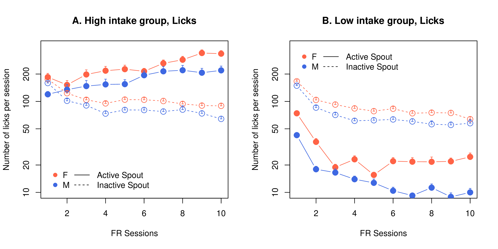

---

## Genotyping and GWAS

<table> <tr>
	<td width=50%>
		
  

		

		 Gileta et al., G3, 2020. 
		

	</td>
	<td width=50%>
		

		
		 
		<b>Abraham Palmer, UCSD</b>
		

		

		<ul>	
			<li> 3.5 million SNPs per individual (estimated error rate <1%)
			<li> GCTA with liner mixed model
			<li> Leave one chromosome out procedure
			<li> Genome-wide significance level set by permuation: -log10(p) > 5.6 
		</ul>
	</td>
</tr>
</table>

---

<section id="manh_d5">

## GWAS: Nicotine infusion on session 5 

<table ></tr><td width=80%>
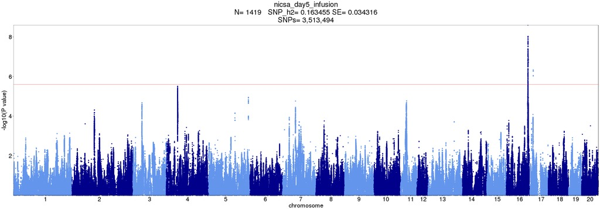
</td>
<td width=20%>

 
<b>
Apurva Chitre, UCSD
</b>

</td>
</tr>
</table>

---

## Summary of GWAS 

|Behavior | Sample size | N traits | N sig. QTL| 
|---|---|---:|---:|
| open field | 626 M, 620 F | 6 | 9 | 
| novel object interaction|623 M, 622 F| 6 | 7|
| social interaction | 664 M, 664 F | 11| 14| 
| elevated plus maze | 659 M, 658 F | 10| 7| 
| socially acquired nicotine IVSA| 711 M, 711 F| 63| 32| 

---

## GWAS on behaviors tested before nicotine IVSA 

<table><tr><td>

OFT

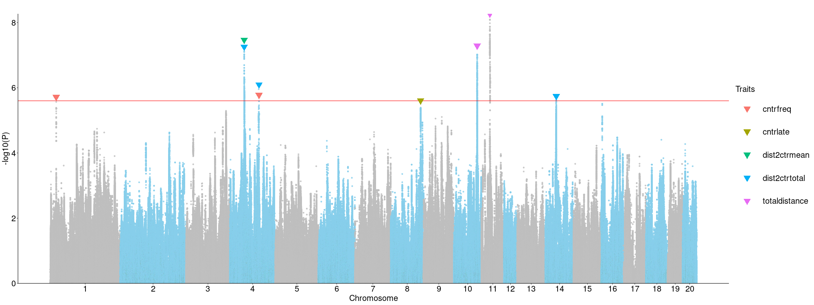

</td>

<td>

NOIT 

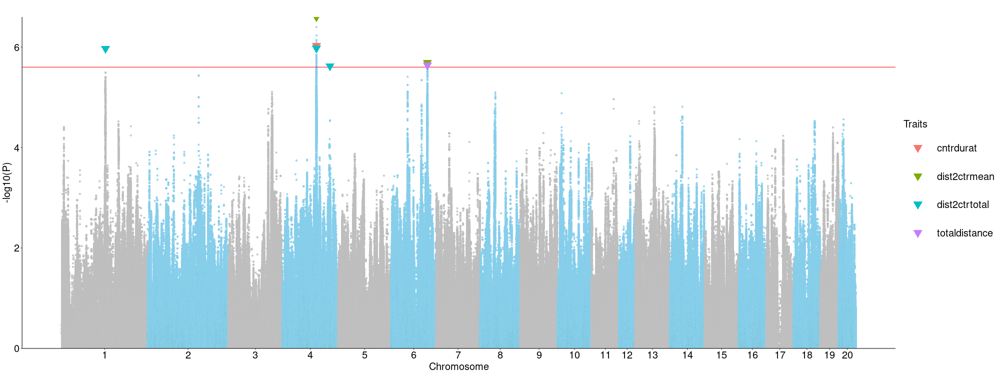
</td>
</tr><td>

SIT 

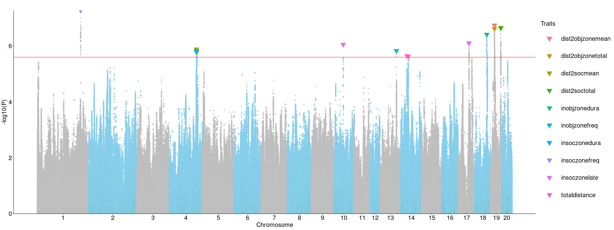
</td>

<td>

EPM

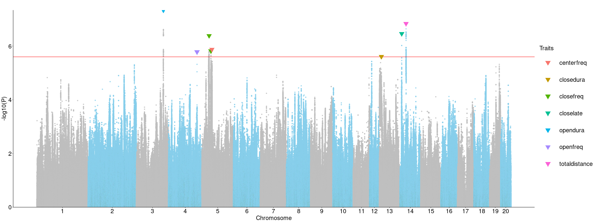
</td></tr></table>

Gunturkun, et.al., Front Psychiatry, 2022</a>

Note:
We identified 17 candidate genes (Adarb2, Ankrd26, Cacna1c, Cacng4, Clock, Ctu2, Cyp26b1, Dnah9, Gda, Grxcr1, Eva1a, Fam114a1, Kcnj9, Mlf2, Rab27b, Sec11a, and Ube2h) for these traits. Many of these genes have been implicated by human GWAS of various psychiatric or drug abuse related traits.

---

## GWAS on socially acquired nicotine IVSA

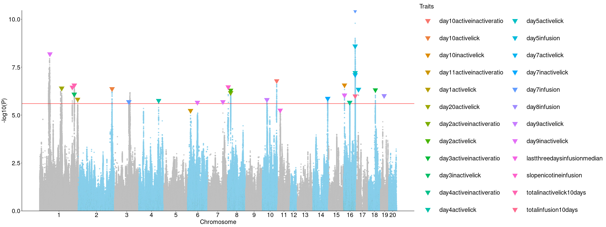

---

## Slope of nicotine intake chr8:4459578 

<table><tr>
<td width=50%>
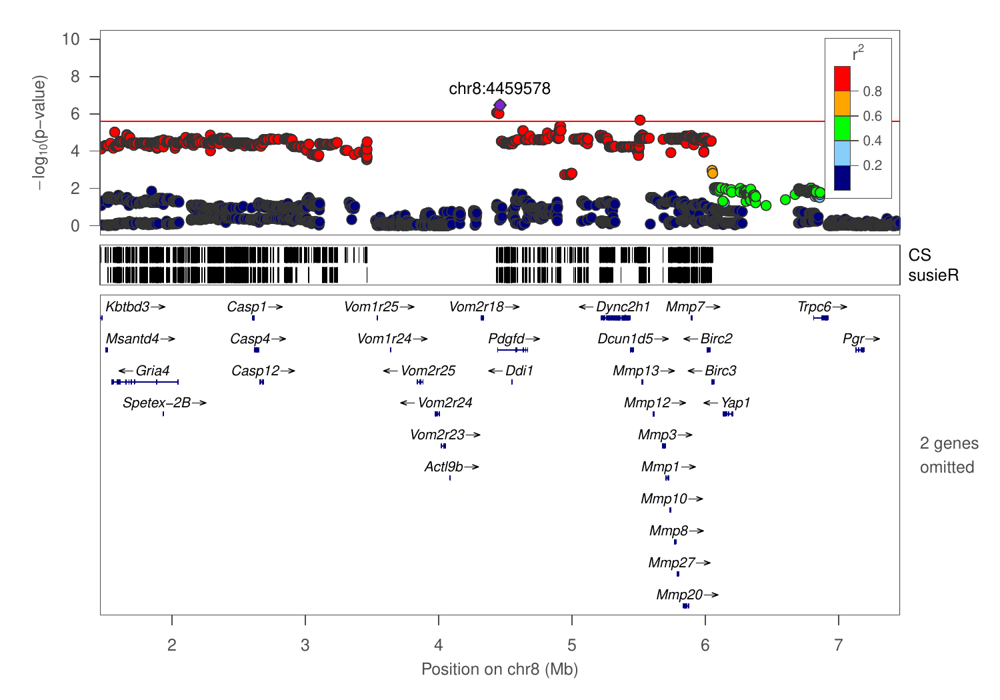
There are 32 known genes in this 5.1 Mb interval. Gria4 is a candidate gene.
</td>

<td valign="middle">

* Prioritizing candidate genes
	* mis-sense variants
	* cis-eQTL
	* expressed in relevant brain regions
	* relevant biological function 
	* associated with related traits in human GWAS

</td>
</tr></table>

---

<table> <tr>
<td width=30%>
	

	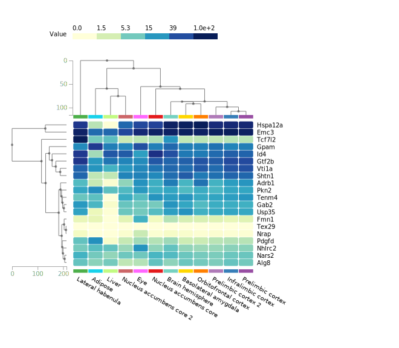
	

</td>
<td width=50%>
	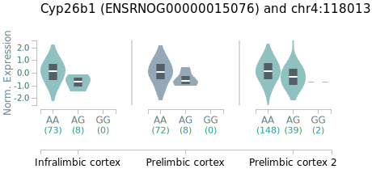
</td>
<td width=20%>
	
	

	<b> Dan Munro, UCSD</b>
</td>
</tr></table>

 Munro, et al., Nucleic Acids Research 2022

---

## <a href="http://genecup.org" target=_new> GeneCup.org </a>

<a href="https://genecup.org/cytoscape/?rnd=tmpDYEQAw&genequery=Shtn1_Gria4_Arhgef7_Alg8" target=_new>
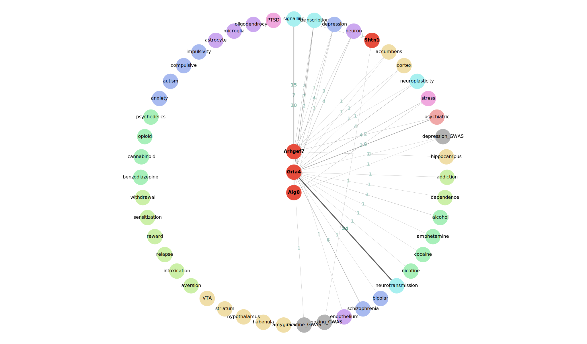
</a>

 Gunturkun, et. al., G3, 2022

---

#### Summary of nicotine GWAS 

## Number of licks on the active spout

|ID |Session|Loc| Genes (n) | Overlapping with human smoking GWAS|
|---|:---:|---|---|---|
|12.20 | day 1 | chr1:278524299| 99 | [Shtn1](http://rats.pub/cytoscape/?rnd=tmpJiHXFf&genequery=KIAA1598_SHOOTIN-1_SHOOTIN1_SHTN1)&spades;&diams;, [Nrap](http://rats.pub/cytoscape/?rnd=tmpaUzTZp&genequery=N-RAP_NEBULIN-RELATED-ANCHORING-PROTEIN_NRAP)&spades;, [Vti1a](http://rats.pub/cytoscape/?rnd=tmpUpzbbT&genequery=VTI1A)&spades;, Gpam&clubs;&diams;, Casp7&diams; Nhlrc2&clubs;&diams; Adrb1&clubs; Tcf7l2&diams; Hspa12a |
|12.29 | day 2 | chr8:22496077| 29| Carm1|
|12.24 | day 4 | chr4:145377793| 20| Emc3 |
|12.12 | day 5 | chr16:83955432| 23| LINC02337| 
|12.08 | day 7 | chr16:83489214| 23| LINC02337| 
|12.02 | day 9 | chr10:32845925| 90| | 
|12.22 | day 10 | chr2:247766389|20| Pkn2, Gtf2b |
|12.16 | Reinstatment | chr1:161226950| 28|Usp35&dagger;, Gab2&dagger;, Tenm4&dagger;, [Alg8](http://rats.pub/cytoscape/?rnd=tmpJKLgcJ&genequery=Usp35_Gab2_Nars2_Tenm4_Alg8)&diams;&hearts;&dagger; |

&spades;: Smoking initiation 
&clubs;: Alcohol GWAS 
&diams;: cis-eQTL
&hearts; missense variants
&dagger; Psychiatric GWAS

---

## Vti1a, Shtn1 and/or Nrap 

Human GWAS: smoking initiation 

SmkInit: ever being a regular smoker (e.g., 100 cigarettes, or smoked every day for a month) 

Rat GWAS: number of licks on active spout on day 1 

Common: Initial response to tobacco/nicotine?

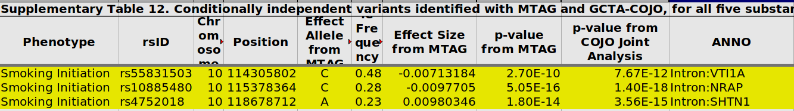

Association studies of up to 1.2 million individuals yield new insights into the genetic etiology of tobacco and alcohol use

Liu, et. al., Nature Genetics 2019
</cite>

---

#### Summary of nicotine GWAS

## Number of nicotine infusions

|ID |Session|Loc| Genes (n) | Overlapping with human smoking GWAS|
|---|:---:|---|---|---|
|12.09 | day 5 | chr16:83500180| 23| LINC02337 |
|12.13 | day 5 | chr17:17103044| 1| ID4 |
|12.11 | day 7 | chr16:83500180| 23| LINC02337|
|12.23 | day 7 | chr3:104723116| 8| Hmgn4, Fmn1 |
|12.15 | day 8 | chr19:26396258| 1| |
|12.03 | median of last 3 days | chr11:17834164|27| | 
|12.10 |total infusion | <a href="#/manh_d5">chr16:83500180</a>| 23| LINC02337|
|12.30 |slope of regression | chr8:4459578| 74| Gria4&diams;, Pdgfd&diams;, Mmp12 |

&diams;: cis-eQTL

---

## LINC02337

Human GWAS: Pack years 

PackYears: Cigarettes per day divided by 20, multiplied by number of years smoking 

Rat GWAS: Total nicotine infusion

Common: total overall exposure to tobacco/nicotine. 

<table> <tr> <td width=50%>

</td>
<td>

<a href="https://www.ebi.ac.uk/gwas/variants/rs2026174" target=_new> New annotation: LINC02337 </a> 

<a href="http://genome.ucsc.edu/cgi-bin/hgTracks?db=hg38&lastVirtModeType=default&lastVirtModeExtraState=&virtModeType=default&virtMode=0&nonVirtPosition=&position=chr13%3A110979763%2D112075449&hgsid=1385374851_DFWqHgcyTThiDJV0a0SLgElBbEDP" target=_new> Is Arhgef7 more likely?</a> Arhgef7 expression is FPKM=30 in our dataset. It is involed in spine morphogenesis. Loss of Arhgef7 results in extensive loss of axons (PMID:30683798, PMID:29891904)

Exome Chip Meta-analysis Fine Maps Causal Variants and Elucidates the Genetic Architecture of Rare Coding Variants in Smoking and Alcohol Use 
Brazel, et. al., Biol Psychiatry 2019

</td></tr></table>

Note:

---

## Potential targets for validation 

* Shtn1 (active lick on day 1)
* Gria4 (progression of intake)
* Arhgef7 (total intake)
* Alg8 (reinstatement) 

---

## Gria4 Western blot

<table><tr><td width=60%>

</td>
<td width=40% valign="middle"> 

</td></tr></table>

---

## Gria4 null mutation abolishes nicotine CCP in C.elegans 

<table><tr><td width=15%>

<b> Dr. Changhoon Jee   Assistant Prof, UTHSC</b>

</td><td width=85%>

</td></tr></table>

---

## Screening of genetic contribution to nicotine reward using zebrafish

* Conditioned place preference for nicotine 
* Cas9 mediated genome editing

<table> <tr><td width=70%>

</td>
<td width=30%>

</td></tr></table>

---

## Brain region and cell-type specific in vivo genome editing in rats

<table><tr><td width=60%>
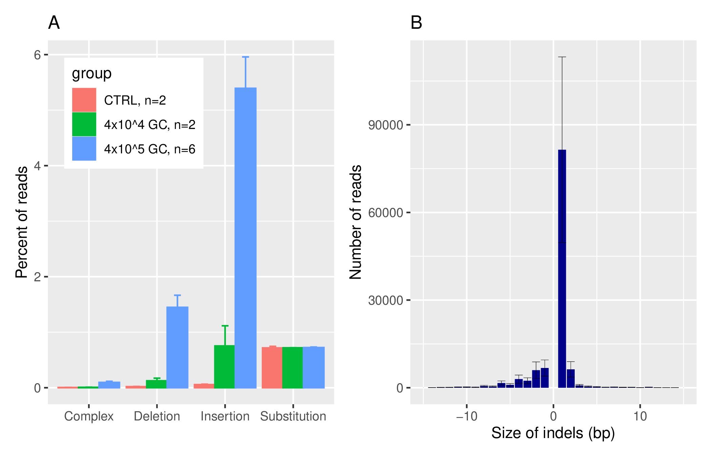
</td><td width=40%>

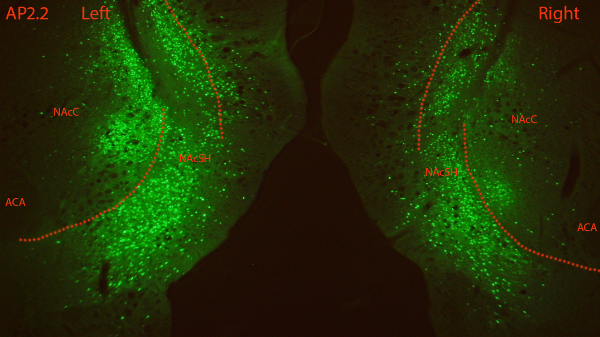
</td></tr>
</table>

 
 Sharp et al. BioRxiv 2023 

---

## Acknowledgements

<table><tr>
<td width=12.5%>

Tengfei Wang
</td>
<td width=12.5%>

Angel Garcia Martinez
</td>
<td width=12.5%>

Shuangying Leng
</td>

<td width=12.5%>

Caroline Jones
</td>

<td width=12.5%>

Gwen Johnson
</td>

<td width=12.5%>
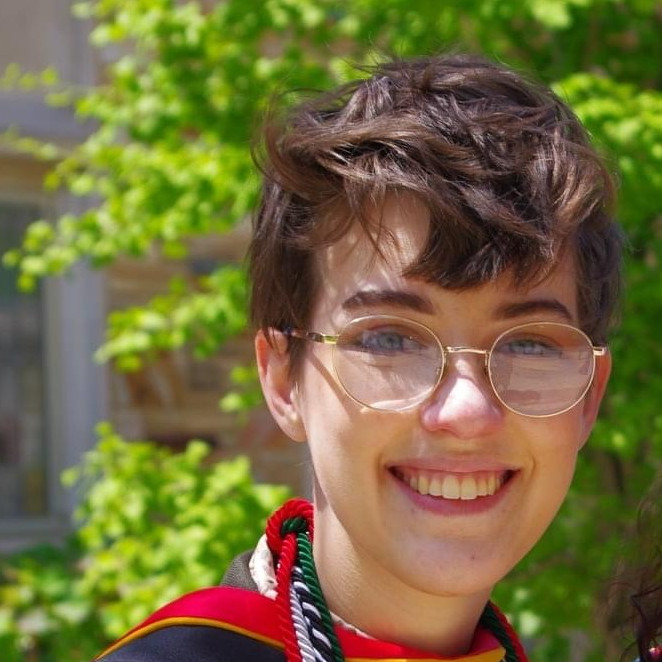
Rachel Ward
</td>
<td width=12.5%>

Jun Huang 
</td>
<td width=12.5%>

Tristan de Jong
</td>
</tr>
</table>

<b>Past lab members </b>: Jie Shen | Wenyan Han | Pawandeep Kaur | Yanyan Lin | Xinyu Fan | Hukan Gunturkun 

* UCSD: Abraham Palmer | Oksana Polaskaya | Apurva Chitre 
* Wake Forest: Leah Solberg-Woods 
* UTHSC: Changhoon Jee | Burt Sharp | Rob Williams

Funding: NIH/NIDA P50DA037844

---

## Social interaction is not required to maintain nicotine intake

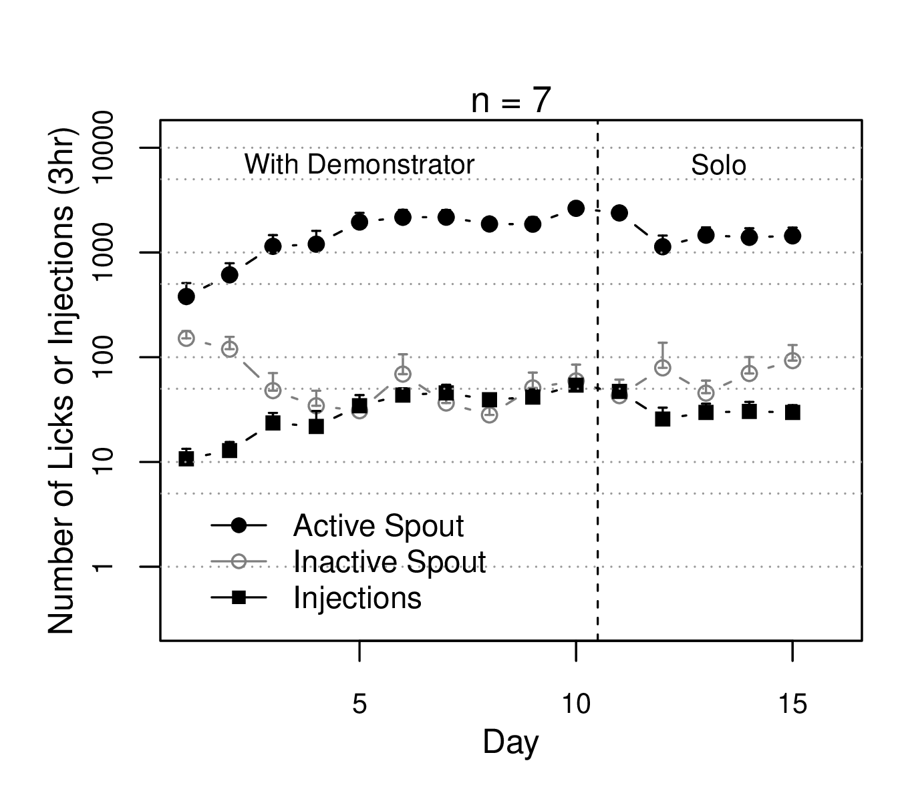

 
 Chen, et al., Neuropsychopharmacology, 2011 

---

## Nicotine IVSA with aversive flavor cue containing CS2

Adolescent heterogeneous rats 

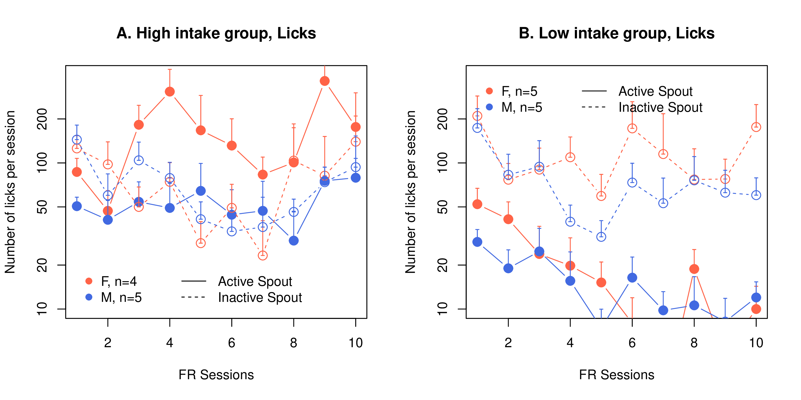

---

#### Summary of nicotine GWAS, part 3/4

## Number of licks on the inactive spout 

|ID |Session|Loc| Genes (n) | Overlapping with human smoking GWAS|
|---|:---:|---|---|---|
|12.18 | day 3 | chr1:253523411| 10| |
|12.04 | day 7 | chr14:108854633|23| XPO1, USP34, BCL11A |
|12.06 | day 9 | chr16:5256755|1| Cacna2d3 |
|12.21 | day 9 | chr1:74927958| 195| U2af2, KMT5C, FAM71E2, TMEM238, COX6B2, TMEM190, Il11, Lilrb4| 
|12.26 | day 9 | chr6:71588778| 46| Foxg1, Heatr5a&hearts;, Prkd1 |
|12.27 | day 9 | chr7:110658276| 7| |
|12.07 | day 10 | chr16:5288954|1 | Cacna2d3 |
|12.17 | total | chr1:239058463| 7||
|12.19 | total | chr1:253766837| 10||

&hearts;:protein coding variant

---

#### Summary of nicotine GWAS, part 4/4

## Ratio of licks on the active/inactive spouts

|ID |Session|Loc| Genes (n) | Overlapping with human smoking GWAS|
|---|:---:|---|---|---|
|12.28 | day 2 | chr8:22201332| 37| Carm1 | 
|12.14 | day 3 | chr18:50265173| 13| |
|12.05 | day 4 | chr16:43380960|7 | |
|12.01 | day 10 | chr10:104395310| 54|Tsen54 |
|12.25 | day 11 | chr6:21268257| 5| TTC27 |

---

## Is self-administration driven by nicotine or flavor cue?

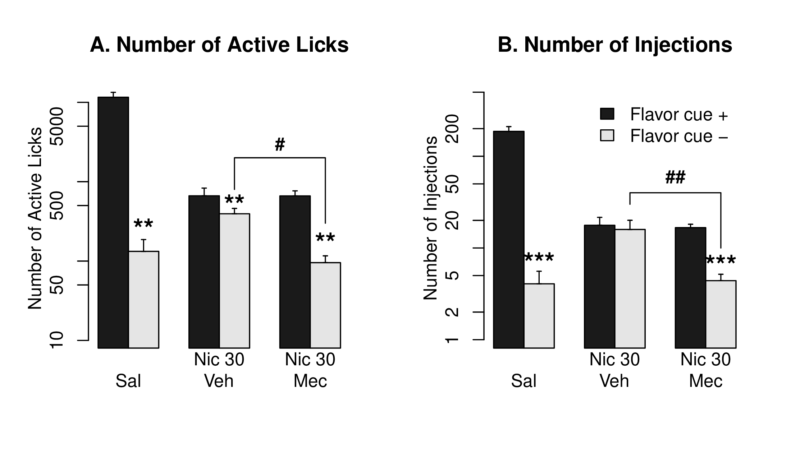

 Chen, et al., Neuropsychopharmacology, 2011 

---

## Overlapping genes between rat nicotine and human addiction/psychiatric GWAS 

| Trait| Number of human genes* | Overlap expected by random | Actual overlap| Difference| 
|---|---:|---:|---:|---:|
|Smoking | 1772| 32|39| 7| 
|Body height| 2467| 46| 36| -10|
|Body mass|2920|54 |46|-8 |
|Education |1214 |23 | 13|-10 |

 There are a total of 16913 genes symbols common between human and rat. There are 315 genes under nicotine QTL share the symbol with human genes. Chance of human/rat gene involved in smoking: 1772/16913=10%. For 315 genes, we expect to find 32 genes. The actual overlap is 39. Although this is a small enrichment, calculation conducted on other traits shows that this is an under-estimation. This is likely because the nicotine QTL contained many genes. *: reported in <a href="https://pubmed.ncbi.nlm.nih.gov/30584246/">GWAS catalog</a>

---

## Candidate genes for OFT, NOIT, SIT 

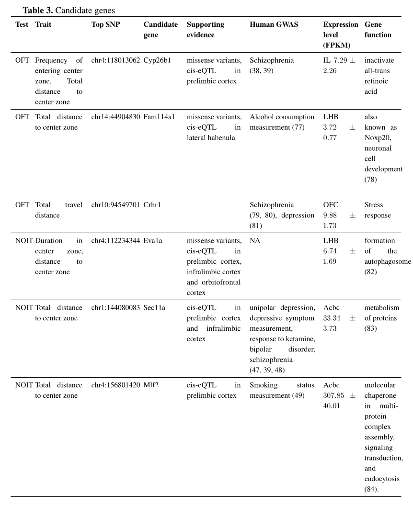

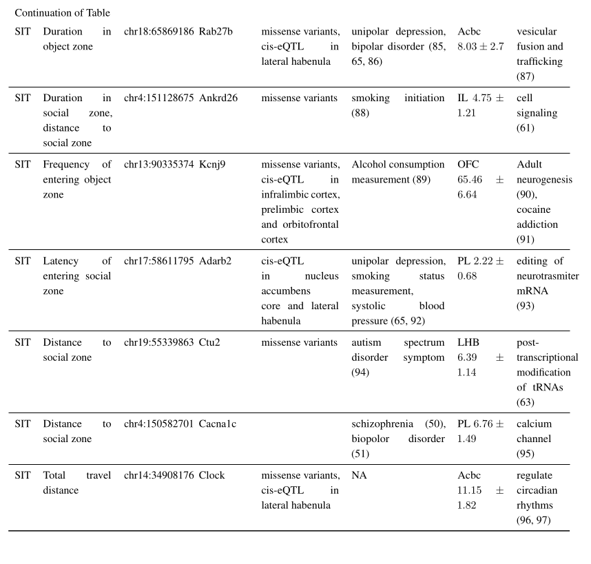

Gunturkun, et.al., Front Psychiatry, 2022</a>

---

## Correlations among open field, novel object, social interaction, and elevated plus maze

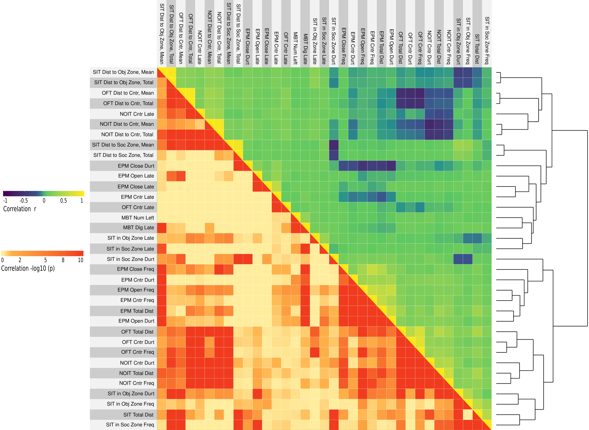

 Wang, et al., Scientific Report, 2018 

---

<section id="cta0">

## Flavor cues conditioned to self-administered nicotine is aversive 

 
 Chen, et al., Neuropsychopharmacology, 2011 

Note: 
To further confirm that nicotine is aversive, we tested removing nicotine after three sessions. So this is an extinction procedure, where the cue is presented without the uncontitioned stimulus. In these adolescent SD rats, extinction happened relatively quickly. We'll come back to this extinction procedure shortly. 

---

## Social learning is mediated by Carbon Disulfide (CS2) in rats 

 
 

---

## Both CS2 and flavor cue are necessary for socially acquired nicotine IVSA 

 Wang, et al., PLoS One, 2014 

Note:
We confirmed that neither nicotine associated flavor cue nor carbon disulfide alone supported nicotine IVSA. However, their combination was sufficient to replicate the behavior induced by live demonstrator rats. 

---

## Is CS2 relevant to human?

 Chen, unpublished data

---

## GWAS reports

<table ></tr><td width=70%>

<a href="https://palmerlab.s3.sdsc.edu/p50_reports/open_field.html" target=_new>

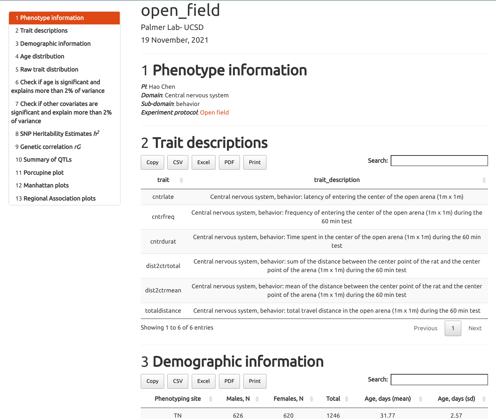
</a>

</td>
<td>

 

<b>
Apurva Chitre, UCSD
</b>

</td>
</tr>
</table>

---

<section id="cta1">

## Social learning facilitates the extinction of conditioned nicotine aversion

 Han, et al., Sci Report, 2017 

Note:
With these inbred rats, we wanted to ask another question, which is the relationship between the aversive response and nicotine intake. One obvious hypothesis was that rats with stronger conditioned aversion to nicotine will self-administer less. To measure CTA, we have two groups, one recives nicotine and one recives iv nicotine. We did three days of nicotine becasuse we knew it was sufficient. After day 4, both groups recived saline. The difference in number of rewards between nicotine and saline on day 4 is an index for CFA. I really hated to discard the rats away after only getting four days data, especailly we went through all the trouble in during jugular surgery. So we added five extinction sessions. we use the number of rewards on the last session as an index of extion. So CFA and Extion of CFA are on the y-axis, the x-axis of these plots are number of nicotine infusions. It turns out, there was no correlations between CFA and intake but extinction of CFA is a predictor of nicotine intake. So this suggests, that the way social learning works is by facilite the extinction, or the dissociation between the flavor and the aversive effect of nicotine. 

---

## No correlation between nicotine metabolism and intake

---

## SNP heritability

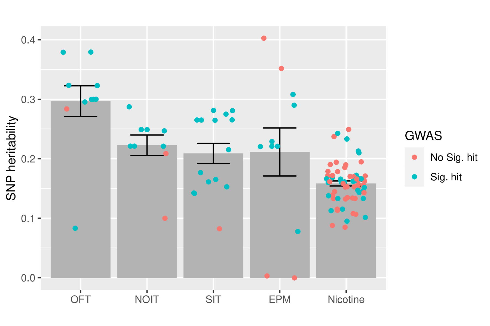

---

