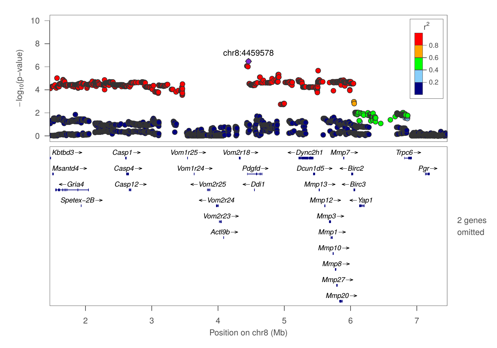
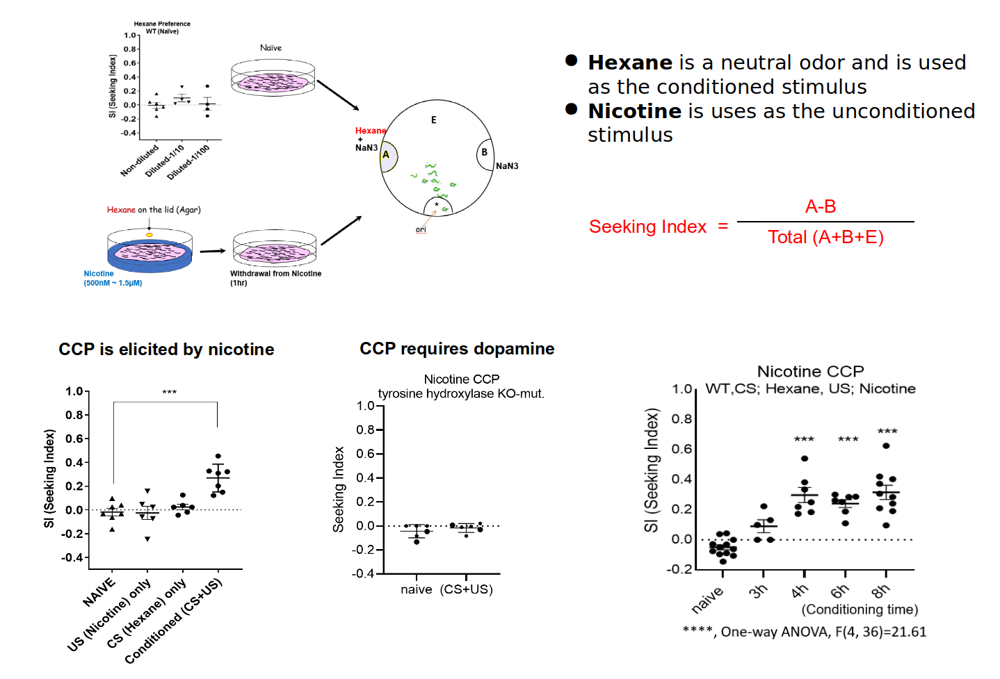
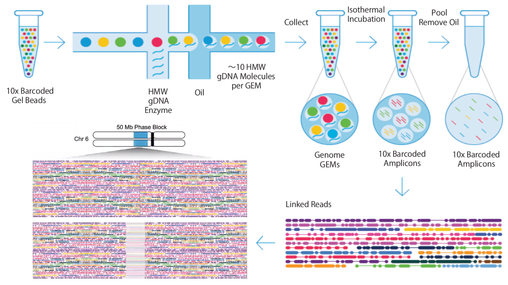
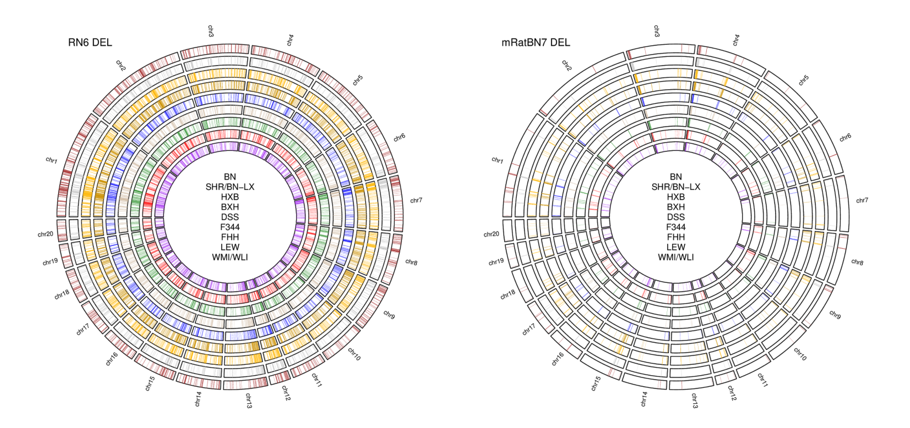
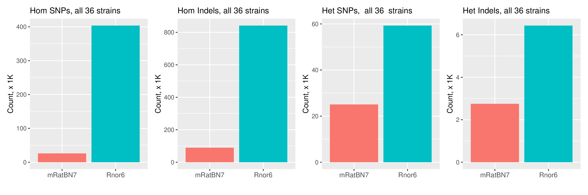
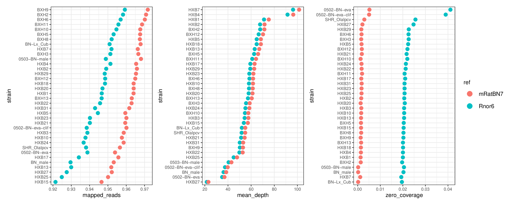

# Genetic mapping of nicotine self-administration in outbred and inbred rats using whole genome sequencing data

## Hao Chen, Ph.D.
### Associate Professor

### Department of Pharmacology, Addiction Science and Toxicology
### University of Tennessee Health Science Center

---

## Outline

* Socially-acquired nicotine i.v. self-administration
	* Genetic mapping using heterogeneous stock rats
* Oral menthol cue for nicotine i.v. self-administration
	* Whole genome sequencing of the hybrid rat diversity panel

---

## Nicotine is primarily aversive in non-smokers 

<table>
 <tr>
 <td width=50%>
 
 </td>
 <td width=90%>
 
 </td>
 </tr>
 <tr>
 <td>
 Coughing, nausea, dizziness, sickness, burning throat, headache.
 </td>
 <td>
 Nicotine induces drug high only in <em>significantly nicotine-deprived smokers</em>. 
 </td>
 </tr>
</table>

---

## Nicotine conditioned taste aversion in rats

 Kumar, et. al., Br J Pharmac 1983

Note: https://www.ncbi.nlm.nih.gov/pmc/articles/PMC2044849/?page=3
flavors: sodium sacchaine vs sodium chloride
water access were limited to 1 h per day. flavors were presented every other day, followed by nicotine vs saline injection 

---

## Flavor cues conditioned to self-administered nicotine is aversive 

 Chen, et al., Neuropsychopharmacology, 2011 

Note:
We previously reported that 
adolescent rats developed conditioned aversion to an appetitive flavor cue (saccharine + grape odor) associated with self-administered i.v. nicotine. In this operant <i>licking</i> model, oral flavor cue and <strong>i.v.</strong> nicotine were delivered simultaneously upon the completion of a fixed-ratio 5 reinforcement schedule. 

---

<section id="cta0">

## Flavor cues conditioned to self-administered nicotine is aversive 

 
 Chen, et al., Neuropsychopharmacology, 2011 

---

## Social influence is a key factor in smoking initiation 

 

 

---
## Social transmission of food preference  in rats

 

Galef,  Curr Protoc Neurosci, 2003

---

## Social learning enables nicotine self-administration

 Chen, et al., Neuropsychopharmacology, 2011 

Note:
However, with the presence of a "demonstrator" rat consuming the same flavor cue, nicotine i.v. self-administration was established. 
No water or food deprivation or operant pretraining is needed. Thus the model is appropriate for studying smoking initiation in adolescents. 

---

## Flavor cue with greater appetitiveness does not support nicotine IVSA

 Chen, et al., Neuropsychopharmacology, 2011 

---

## Social learning supports nicotine IVSA with an aversive flavor cue

 Wang, et al., Psychopharmacology, 2016 

Note:
We further reported that even when an aversive (i.e. quinine) flavor was used in place of the appetitive flavor, adolescent rats obtained nicotine IVSA, with the presence of a demonstrator consuming a flavor cue containing the same odor as the nicotine cue (i.e. inducive social environemnt (<b>ISE</b>). The number of nicotine infusions were almost identical between the two cues. <b>Therefore, licking on the active spout is most likely motivated by nicotine in this model</b> The reduced licks on the active spout was due to the reduction of licking during the timeout period following nicotine and cue delivery. 

<b>NSE</b>: neutral social environemnt, i.e., the presence of a companion rat. 
<b>ISE</b>: indusive social environment, i.e., the presences of a companion rat who has access to the flavor cue. 
<b>AV</b>: audiovisual cue 

---

##  Aversive vs appetitive flavor cue

 Wang, et al., Psychopharmacology, 2016 

---

## Nicotine intake is heritable 

### h2=0.54-0.65 estimated using 12 isogenic strains across two doses 

 Han, et al., Sci Report, 2017 

---

## Social learning is mediated by Carbon Disulfide (CS2) in rats 

 
 

---

## Both CS2 and flavor cue are necessary for socially acquired nicotine IVSA 

 Wang, et al., PLoS One, 2014 

Note:
We confirmed that neither nicotine associated flavor cue nor carbon disulfide alone supported nicotine IVSA. However, their combination was sufficient to replicate the behavior induced by live demonstrator rats. 

---

<section id="cta1">

## Social learning facilitates the extinction of conditioned nicotine aversion

 Han, et al., Sci Report, 2017 

---

### Summary 
## Socially acquired nicotine IVSA in adolescent rats

* Nicotine has both aversive and reinforcing properties
* Flavor cues are associated with the aversive property of nicotine 
* Social learning facilitates nicotine intake by
	* enhancing the extinction of nicotine CFA, and not by  
	* increasing the appetitiveness of the flavor cue 
* Operant responding is driven by the rewarding property of nicotine 
	* dose response to nicotine across multiple strains
	* nicotine can be self-administered with an aversive flavor cue 

---

## Heterogeneous stock rats

<table><tr><td width=20%>

<b>Leah Solberg Woods, Wake Forest School of Medicine 
</b>
</td>
<td width=80%>

 Garret and Korstanje, Trends Genet, 2020
</td>
</tr></table>

---

## Socially acquired nicotine self-administration in HS rats

### 52 adult males and 48 adult females

 Wang, et al., Gene Brain Behav, 2014

---

## Experimental design

| Age | Test |
|---|---|
|PND21|Wean, Body weight|
|PND31|Open field |
|PND32|Novel object |
|PND33|Social interaction in the same arena as openfield |
|PND34|Elevated plus maze |
|PND38|Surgery|
|PND39 - 41| Recovery|
|PND42 - 51|Socially acquired nicotine IVSA|
|PND52| Progressive ratio test |
|PND53 - 56 |Extinction|
|PND57|Contextual cue induced reinstatement|
|PND59|Tissue Collection|

<table width=80%><tr><td>
We phenotyped 1600 adolescent heterogeneous stock rats on socially acquired nicotine IVSA using an flavor cue containing CS2. We also collected other behavioral traits before nicotine IVSA was started. Spleen from each rat was collected for genotyping once behavioral tests were completed. 
</td></tr></table>

---

## Correlations among open field, novel object, social interaction, and elevated plus maze

 Wang, et al., Scientific Report, 2018 

---

## Nicotine self-administration

Adolescent HS rats (711 F,  711 M)

---

## Nicotine metabolism

---

## Genotyping  and GWAS

<table> <tr>
	<td width=50%>
		
  

		

		 Gileta et al., G3, 2020. 
		

	</td>
	<td width=50%>
		

		
		 
		<b>Abraham Palmer, UCSD</b>
		

		

		<ul>	
			<li> 3.5 million SNPs per individual (estimated error rate <1%)
			<li> GCTA with liner mixed model
			<li> Leave one chromosome out procedure
			<li> Genome-wide significance level set by permuation: -log10(p) > 5.6 
		</ul>
	</td>
</tr>
</table>

---

## Summary of GWAS 

|Behavior | Sample size | N traits | N sig. QTL| 
|---|---|---:|---:|
| open field | 626 M, 620 F | 6 | 9 | 
| novel object interaction|623 M, 622 F| 6 | 7|
| social interaction | 664 M, 664 F | 11| 14| 
| elevated plus maze | 659 M, 658 F | 10| 8| 
| socially acquired nicotine IVSA| 711 M, 711 F| 63| 30| 

---

## GWAS: Nicotine infusion on session 5 

---

## Porcupine plot of behavioral traits

 
 Gunturkun, et. al., BioRxiv, 2021

---

## Slope of nicotine intake chr8:4459578 

There are 38 known genes in this 5.1 Mb interval. Gria4 is a candidate gene.

http://genecup.org is designed to take a list of gene symbols and mine the PubMed and GWAS catalog for sentences pertain to addiction.

 Gunturkun, et. al., BioRxiv, 2021

---

## Candidate genes for OFT, NOIT, SIT 

Gunturkun, et.al., BioRxiv 2021</a>

---

#### Summary of nicotine GWAS 

## Number of licks on the active spout

|ID |Session|Loc| Genes (n) | Overlapping with human smoking GWAS|
|---|:---:|---|---|---|
|12.20 | day 1 | chr1:278524299| 99 | Gpam&clubs;&diams;, [Vti1a](http://rats.pub/cytoscape/?rnd=tmpUpzbbT&genequery=VTI1A)&spades;, Nhlrc2&clubs;&diams;, Adrb1&clubs;, Tcf7l2, [Hspa12a](http://rats.pub/cytoscape/?rnd=tmpFrhLrJ&genequery=HEAT-SHOCK-PROTEIN-FAMILY-A-HSP70-MEMBER-12A_HSPA12A)&spades;, [Shtn1](http://rats.pub/cytoscape/?rnd=tmpJiHXFf&genequery=KIAA1598_SHOOTIN-1_SHOOTIN1_SHTN1)&spades;&diams;, [Nrap](http://rats.pub/cytoscape/?rnd=tmpaUzTZp&genequery=N-RAP_NEBULIN-RELATED-ANCHORING-PROTEIN_NRAP)&spades;, Casp7&diams; Gfra1|
|12.29 | day 2 | chr8:22496077| 29| [Carm1](http://rats.pub/cytoscape/?rnd=tmpaHVoNJ&genequery=carm1) |
|12.24 | day 4 | chr4:145377793| 20| [Emc3](http://rats.pub/cytoscape/?rnd=tmpQXgUzk&genequery=emc3) |
|12.12 | day 5 | chr16:83955432| 23| Tex29| 
|12.08 | day 7 | chr16:83489214| 23| Tex29| 
|12.02 | day 9 | chr10:32845925| 90| | 
|12.22 | day 10 | chr2:247766389|20| [Pkn2, Gtf2b](http://rats.pub/cytoscape/?rnd=tmpPoBkQf&genequery=Pkn2_Gtf2b) |
|12.16 | Reinstatment | chr1:161226950| 28|Usp35, Gab2, Nars2, Tenm4, [Alg8](http://rats.pub/cytoscape/?rnd=tmpJKLgcJ&genequery=Usp35_Gab2_Nars2_Tenm4_Alg8)&diams;&hearts; |

&spades;: smoking initiation genes
&clubs;: Alcohol consumption genes
&diams;: cis-eQTL
&hearts; missense variants

---

## Vti1a, Shtn1 and Nrap 

Human GWAS: smoking initiation 

Rat GWAS: number of licks on active spout on day 1 

Association studies of up to 1.2 million individuals yield new insights into the genetic etiology of tobacco and alcohol use

Liu, et. al., Nature Genetics 2010
</cite>

---

#### Summary of nicotine GWAS

## Number of nicotine infusions

|ID |Session|Loc| Genes (n) | Overlapping with human smoking GWAS|
|---|:---:|---|---|---|
|12.09 | day 5 | chr16:83500180| 23| Tex29 |
|12.13 | day 5 | chr17:17103044| 1| [ID4](http://rats.pub/cytoscape/?rnd=tmpdaIxug&genequery=ID4) |
|12.11 | day 7 | chr16:83500180| 23| Tex29|
|12.23 | day 7 | chr3:104723116| 8|[Hmgn4, Fmn1](http://rats.pub/cytoscape/?rnd=tmpSBamBX&genequery=Hmgn4_Fmn1) |
|12.15 | day 8 | chr19:26396258| 1| |
|12.03 | median of last 3 days | chr11:17834164|27| | 
|12.10 |total infusion | chr16:83500180| 23| [Tex29](http://rats.pub/cytoscape/?rnd=tmpesQlMB&genequery=tex29)|
|12.30 |slope of regression | chr8:4459578| 74| [Gria4](http://rats.pub/cytoscape/?rnd=tmpAjmeXn&genequery=Gria4_Pdgfd_Mmp12)&diams;, Pdgfd&diams;, Mmp12 |

&diams;: cis-eQTL

---

## Tex29

Human GWAS: pack years (a measure of total overall exposure to tobacco)

Rat GWAS: total nicotine infusion

Exome Chip Meta-analysis Fine Maps Causal Variants and Elucidates the Genetic Architecture of Rare Coding Variants in Smoking and Alcohol Use 
Brazel, et. al., Biol Psychiatry 2019

Note:
Not much literature is available for Tex29. Tex29 is not detected in our RNA-seq dataset (GTEx does report its detection). 
The annotation is intergenic. <a href=
"http://genome.ucsc.edu/cgi-bin/hgTracks?db=hg38&lastVirtModeType=default&lastVirtModeExtraState=&virtModeType=default&virtMode=0&nonVirtPosition=&position=chr13%3A110979763%2D112075449&hgsid=1028729693_QukEveNO4EoDL3hNviIqVJ3lcbnb"> Is Arhgef7 more likely?</a> Arhgef7 expression is FPKM=30 in our dataset. It is involed in spine morphogenesis. Loss of Arhgef7 results in extensive loss of axons PMID:30683798, PMID:29891904

---

## Potential targets for validation 

* Shtn1 (active lick on day 1)
* Gria4 (progression of intake)
* Tex29 (total intake)
* Alg8 (reinstatement) 

---

## C.elegans model of nicotine conditioned cue preference

### Dr. Changhoon Jee, Assistant Prof, UTHSC

<table><tr><td>

</td><td>

</td></tr></table>

---

## Gria4 null mutation abolishes nicotine CCP 

### Dr. Changhoon Jee, Assistant Prof, UTHSC

---

## The cooling sensation of menthols is a conditioned cue for nicotine reward 

---

## Using the hybrid rat diversity panel for mapping

---

## Nicotine IVSA with menthol cue: inbred strains

---

##  Extinction burst in inbred strains

---

##  Reinstatement in inbred strains

---

## Whole genome sequencing of HRDP using linked-read technology 

---

## mRatBN7.2 improves assembly accuracy 

---

## mRatBN7.2 improves base level accuracy 

#### SNPs and Indels shared by 32 HXB/BXH strains and 4 BN/NHsdMcwi samples

---

## mRatBN7.2 improves mapping of WGS data 

---

## Detection of structural variants using linked read data

---

## SVJAM: joint calling of SV from linked read data

<table><tr><td width=30%>

 Gunturkun, et. al., BioRxiv 2021
</td>
<td>

</td>
</tr>
</table>

---

## Annotate diseases associated high impact variants in HRDP

---

## Potential remaining errors in mRatBN7.2 

* 134,781 variants (SNPs and indels) shared by more than 92 of 94 WGS samples (including 6 BN/NHsdMcwi samples) (10X reduction compared to <a href="#/sharedrn6">Rnor6</a>)

||Hom| Het|
|---|---|---:|
|Indel| 95,131| 998 |
|SNP| 24,292 |13,360|

 Monika Tutaj,  Mindy Dwinell et al., MCW for sharing data
 

---

## Potential remaining errors in mRatBN7.2 

|Impact|Annotation|Count|
|:---|:---|---:|
|HIGH|frameshift_variant| <a href="#/refseq">550<a> |
|HIGH|splice_acceptor_variant|615|
|HIGH|splice_donor_variant|25|
|MODERATE|missense_variant|291|
|MODIFIER|3_prime_UTR_variant|884|
|MODIFIER|5_prime_UTR_variant|418|
|MODIFIER|downstream_gene_variant|6381|
|MODIFIER|intergenic_region|68990|
|MODIFIER|intron_variant|45338|

Examples of genes with high impact variants:  <b>Akap10, Cacna1c, Crhr1, Chat, Egfr, Gabrg2, Grin2a, Oprm1, etc.</b>

aaaTaaaAAAgAAA 

aaaTaaa

---

## Acknowledgements

<table><tr>
<td width=12.5%>

Tengfei Wang
</td>
<td width=12.5%>

Angel Garcia Martinez
</td>
<td width=12.5%>

Shuangying Leng
</td>

<td width=12.5%>

Caroline Jones
</td>

<td width=12.5%>

Gwen Johnson
</td>

<td width=12.5%>

Rachel Ward
</td>
<td width=12.5%>

Jun Huang 
</td>
<td width=12.5%>

Tristan de Jong
</td>
</tr>
</table>

<b>Past lab members </b>: Jie Shen | Wenyan Han | Pawandeep Kaur | Yanyan Lin | Xinyu Fan  | Hukan Gunturkun 

* UCSD:  Abraham Palmer | Oksana Polaskaya | Apurva Chitre 
* Wake Forest:  Leah Solberg-Woods 
* MCW:  Mindy Dwinell |  Aron Geurts | Anne Kwitek | Monika Tutaj
* U Mich:  Jun Li
* USUHS: Clifton Dalgard
* UTHSC: Changhoon Jee | Rob Williams

Funding: NIH/NIDA P50DA037844 U01DA047638

---

## Social interaction is not required to maintain nicotine intake

 
 Chen, et al., Neuropsychopharmacology, 2011 

---

## Nicotine IVSA with aversive flavor cue containing CS2

Adolescent heterogeneous rats 

---

#### Summary of nicotine GWAS, part 3/4

## Number of licks on the inactive spout 

|ID |Session|Loc| Genes (n) | Overlapping with human smoking GWAS|
|---|:---:|---|---|---|
|12.18 | day 3 | chr1:253523411| 10| |
|12.04 | day 7 | chr14:108854633|23| XPO1, USP34, BCL11A |
|12.06 | day 9 | chr16:5256755|1| Cacna2d3 |
|12.21 | day 9 | chr1:74927958| 195| U2af2, KMT5C, FAM71E2, TMEM238, COX6B2, TMEM190, Il11, Lilrb4| 
|12.26 | day 9 | chr6:71588778| 46| Foxg1, Heatr5a&hearts;, Prkd1 |
|12.27 | day 9 | chr7:110658276| 7| |
|12.07 | day 10 | chr16:5288954|1 | Cacna2d3 |
|12.17 | total | chr1:239058463| 7||
|12.19 | total | chr1:253766837| 10||

&hearts;:protein coding variant

---

#### Summary of nicotine GWAS, part 4/4

## Ratio of licks on the active/inactive spouts

|ID |Session|Loc| Genes (n) | Overlapping with human smoking GWAS|
|---|:---:|---|---|---|
|12.28 | day 2 | chr8:22201332| 37| Carm1 | 
|12.14 | day 3 | chr18:50265173| 13| |
|12.05 | day 4 | chr16:43380960|7 | |
|12.01 | day 10 | chr10:104395310| 54|Tsen54 |
|12.25 | day 11 | chr6:21268257| 5| TTC27 |

---

## Is self-administration driven by nicotine or flavor cue?

 Chen, et al., Neuropsychopharmacology, 2011 

---

## Overlapping genes between rat nicotine and human smoking GWAS 

| Trait| Number of human genes* | Overlap expected by random | Actual overlap| Difference| 
|---|---:|---:|---:|---:|
|Smoking | 1772| 32|39| 7| 
|Body height| 2467| 46| 36| -10|
|Body mass|2920|54 |46|-8 |
|Education |1214 |23 | 13|-10 |

 There are a total of 16913 genes symbols common between human and rat. There are 315 genes under nicotine QTL share the symbol with human genes. Chance of human/rat gene involved in smoking: 1772/16913=10%. For 315 genes, we expect to find 32 genes. The actual overlap is 39. Although this is a small enrichment, calculation conducted on other traits shows that this is an under-estimation. This is likely because the nicotine QTL contained many genes. *: reported in <a href="https://pubmed.ncbi.nlm.nih.gov/30584246/">GWAS catalog</a>

---

## Can behavioral traits predict nicotine IVSA? 

#### Loading of PCA

 

 

#### PCA regression summary 

|Phenotype | Sex| Variance Explained| 
|---|---|---|
|Infusion, first 3 d| F| 0.18| 
|Infusion, first 3 d| M| 0.17| 
|Infusion, last 3 d | F | 0.12| 
|Infusion, last 3 d | M | 0.20| 
|Infusion, progressive ratio | F | 0.14| 
|Infusion, progressive ratio | M | 0.18| 
|Active spout lick, reinstatement | F | 0.08| 
|Active spout lick, reinstatement | M | 0.19| 

---

## Rat pangenome, chr1

---

