# A guided tour of nuclear receptor pharmacology

### Hao Chen

hchen@uthsc.edu

Spring 2026

<h3>
<a href="https://chen42.github.io/slides/nucrec.html">
https://chen42.github.io/slides/nucrec.html</a>
</h3>

All figures are linked to the original papers

<a href="https://notebooklm.google.com/notebook/49995e80-9df9-473e-954e-fcebf995620d?authuser=1">NotebookLM</a>

---

## Outline

- Nuclear receptor family
- Ligands
- Structure
- Signaling
- Diseases

---

## Nuclear receptor family

---

---

## Human has 48 NR

<a href="https://www.ncbi.nlm.nih.gov/pmc/articles/PMC8628184/">

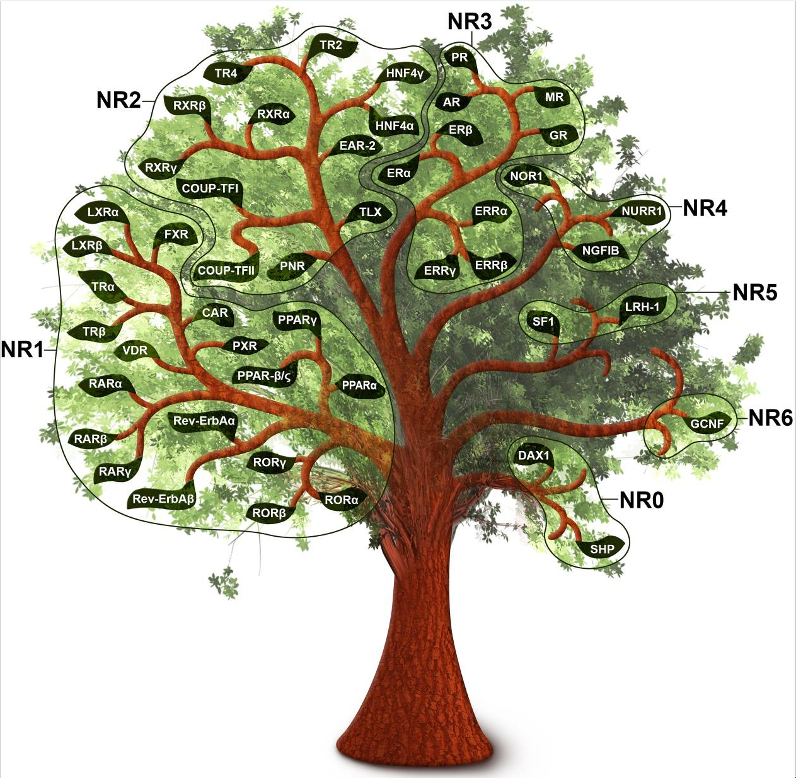
</a>

---

## Four types of NR

<table> <tr><td width=50%>
<a href="https://www.ncbi.nlm.nih.gov/pmc/articles/PMC6159888/">
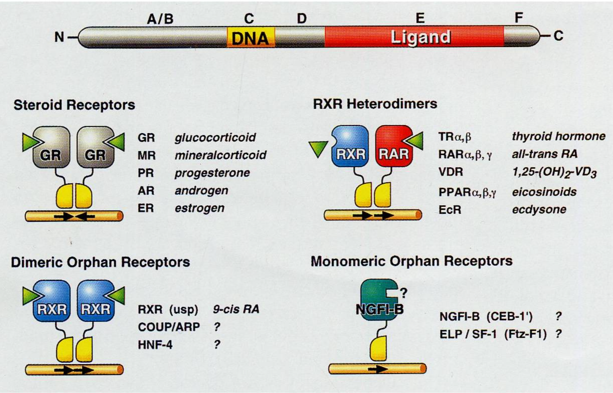`
</a>

</td><td width=50%>

<a href ="https://pmc.ncbi.nlm.nih.gov/articles/PMC6201731/#pro3496-sec-0003">

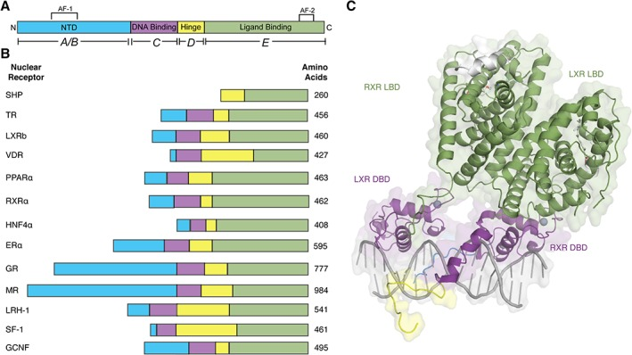
</a>
        </td></tr></table>

---

## RXR

<table> <tr><td width=50%>

</td><td width=50%>

<a href="https://pmc.ncbi.nlm.nih.gov/articles/PMC4097889/#S56">
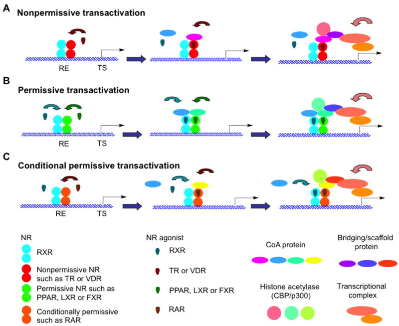
</td></tr></table>

---

## DNA binding properties of NR

<table> <tr><td width=50%>
<a href="https://academic.oup.com/biolreprod/article/83/1/3/2530060?login=false">

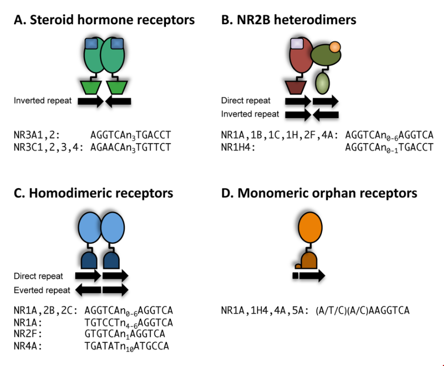
</a>

</td><td width=50%>
<a href ="https://pmc.ncbi.nlm.nih.gov/articles/PMC6201731/#pro3496-sec-0009">

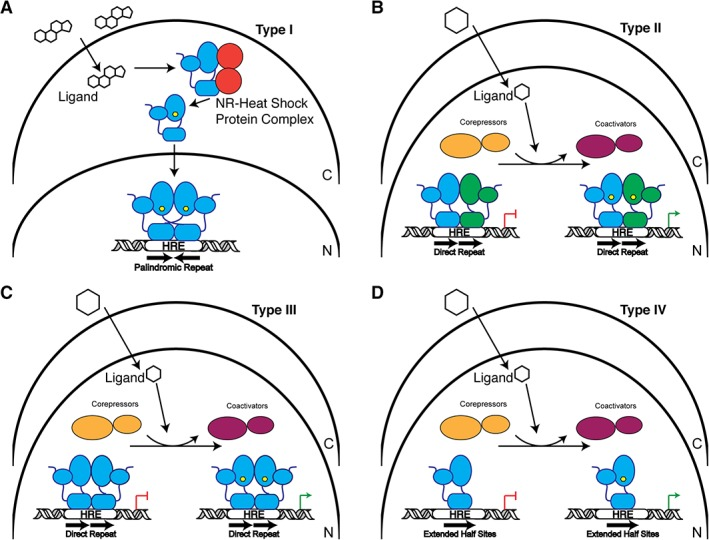
</a>

## </td></tr></table>

---

## NR mechanism of action

#### Coactivator and corepressor complexes and histone acetylation

<table> <tr><td width=50%>

<a href="https://journals.physiology.org/doi/full/10.1152/physrev.2001.81.3.1269?rfr_dat=cr_pub++0pubmed&url_ver=Z39.88-2003&rfr_id=ori%3Arid%3Acrossref.org">
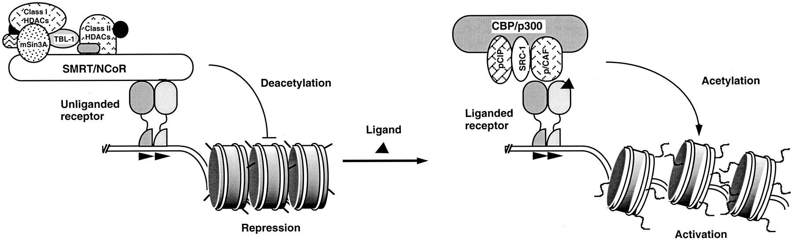

</a>

 </td><td width=50%>

<a href="https://onlinelibrary.wiley.com/doi/full/10.1002/pro.3496">
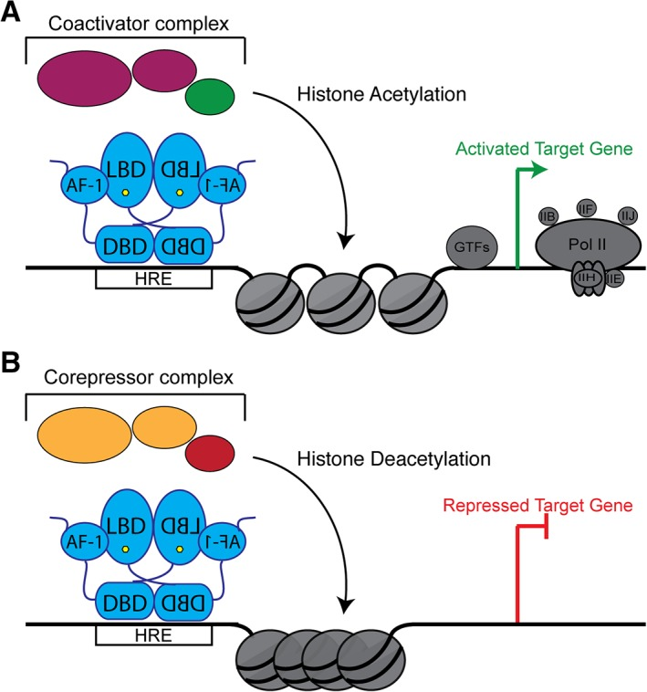

</a>
</td></tr></table>

---

## Human GR

---

## GR signaling pathways

<a href="https://www.ncbi.nlm.nih.gov/pmc/articles/PMC4084612/">
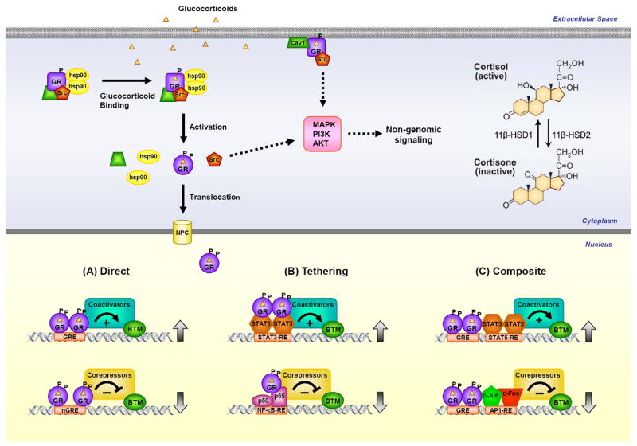

---

## NR signaling

<a href="https://pubmed.ncbi.nlm.nih.gov/8521508/">
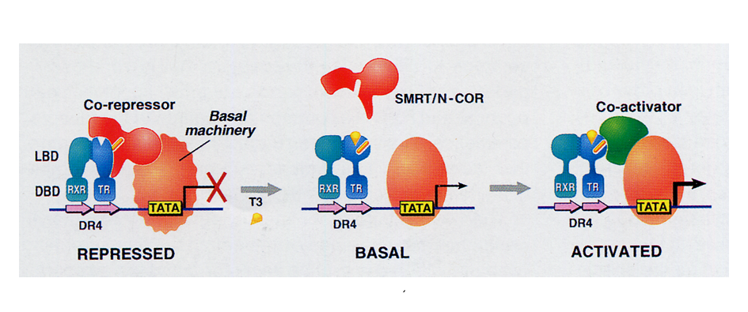
</a>

---

## Transcriptional activation by GR

---

## Nuclear receptor and histone modification

---

## Anti-inflammatory effect of GR

<a href="https://www.dropbox.com/scl/fi/86eid6uondf56pdkwk3uu/barnes2006.pdf?rlkey=w7voj4b6e6fxvg1sb0sgpr9oe&dl=0">
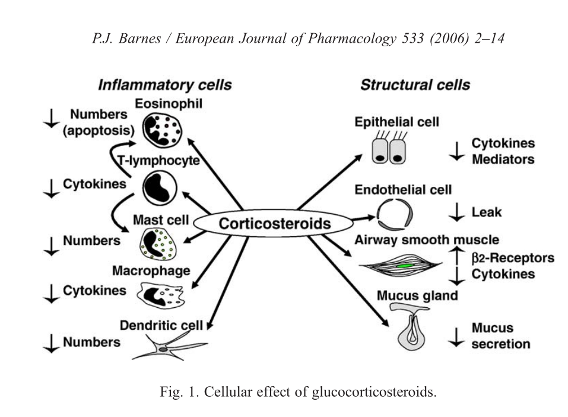
</a>

---

## Drugs for prostate cancer

---

## Nuclear receptor crosstalk

---

## Now you are ready to read this review

Burris TP, de Vera IMS, Cote I, Flaveny CA, Wanninayake US, Chatterjee A, Walker JK, Steinauer N, Zhang J, Coons LA, Korach KS, Cain DW, Hollenberg AN, Webb P, Forrest D, Jetten AM, Edwards DP, Grimm SL, Hartig S, Lange CA, Richer JK, Sartorius CA, Tetel M, Billon C, Elgendy B, Hegazy L, Griffett K, Peinetti N, Burnstein KL, Hughes TS, Sitaula S, Stayrook KR, Culver A, Murray MH, Finck BN, Cidlowski JA.
<a href="https://www.ncbi.nlm.nih.gov/pmc/articles/PMC10595025/">
International Union of Basic and Clinical Pharmacology CXIII: Nuclear Receptor Superfamily-Update 2023. Pharmacol Rev. 2023 Nov;75(6):1233-1318. doi: 10.1124/pharmrev.121.000436. Epub 2023 Aug 16. PMID: 37586884; PMCID: PMC10595025.</a>

---

## 3D genome structure

<iframe width="560" height="315" src="https://www.youtube.com/embed/dES-ozV65u4?si=ADzfh9QmKnGOrX2w&amp;start=174" title="YouTube video player" frameborder="0" allow="accelerometer; autoplay; clipboard-write; encrypted-media; gyroscope; picture-in-picture; web-share" allowfullscreen></iframe>
