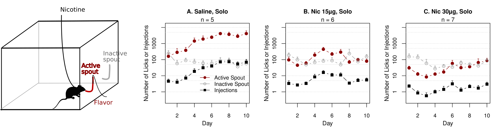
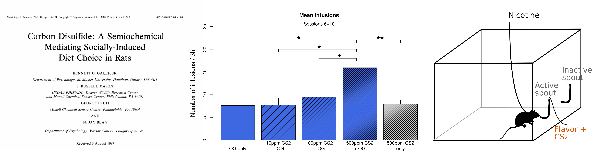
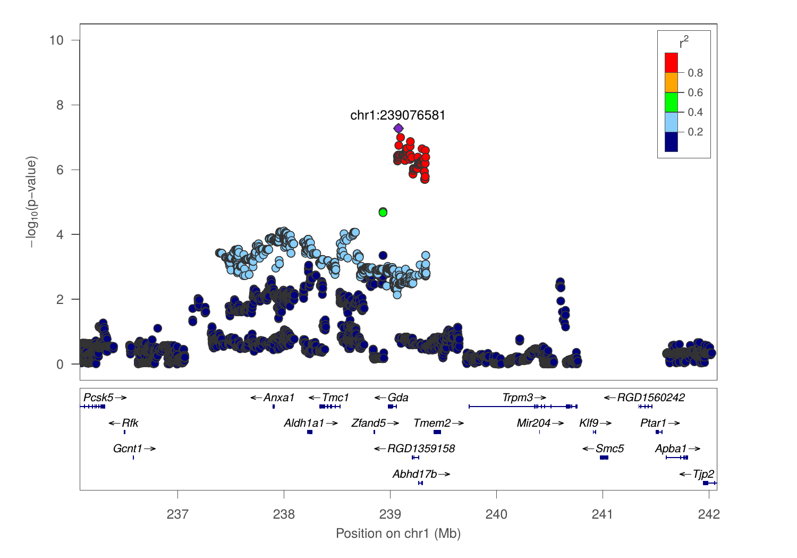
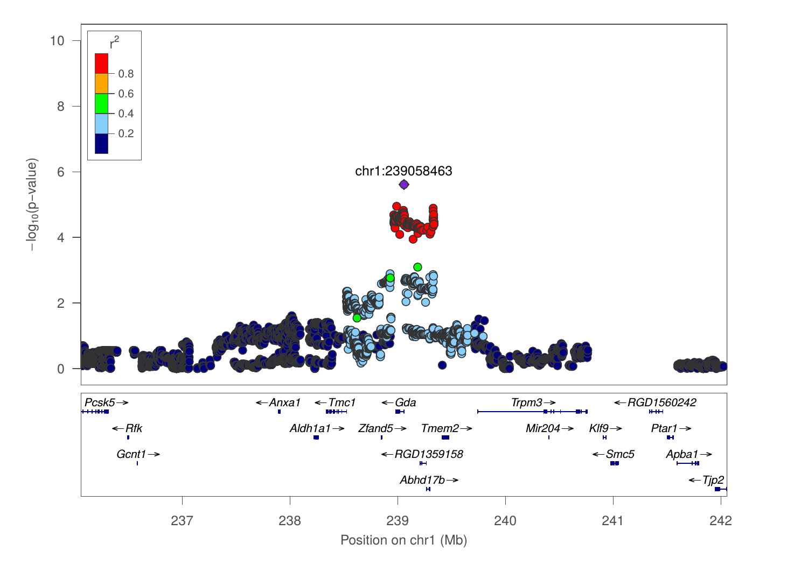
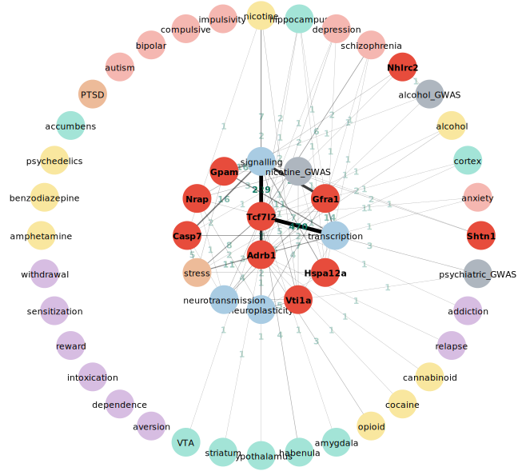
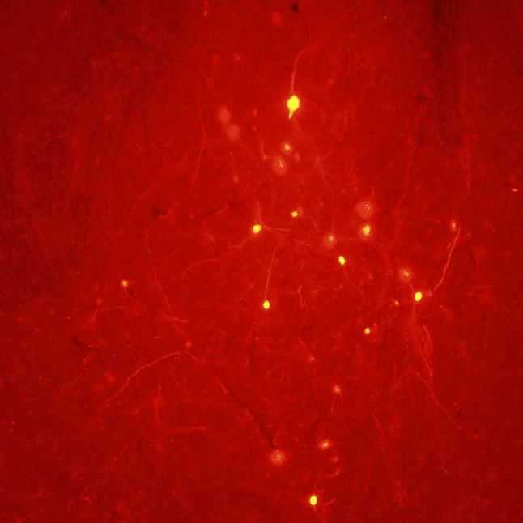
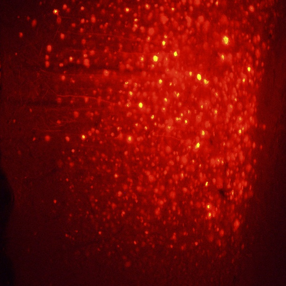
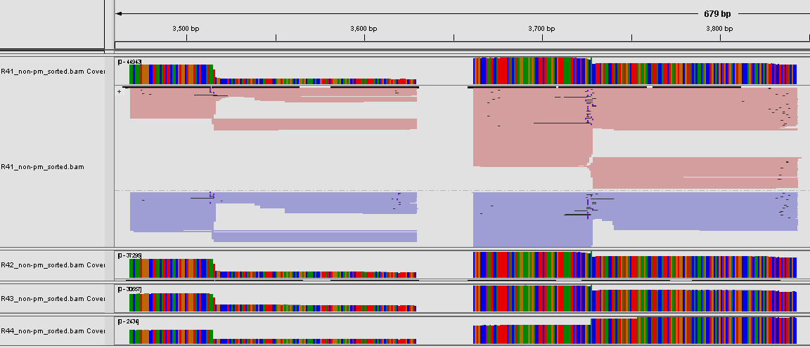

## Project 2 

# Socially acquired nicotine 
# self-administration 

##	Hao Chen

### University of Tennessee Health Science center

P50 virtual retreat, Nov 2nd, 2020

---

## Specific Aims 

<h3 style="color:#069; text-align:left">
 Aim 1. Phenotype adolescent HS rats on socially acquired nicotine IVSA. </h3>
<h4 style="text-align:left; text-indent:40px">
 Aim 1A. Breed adolescent HS rats at UTHSC. 
</h4>
<h4 style="text-align:left; text-indent:40px">
 Aim 1B. Phenotype HS rats on social and emotional traits. 
</h4>
<h4 style="text-align:left; text-indent:40px">
 Aim 1C. Phenotype HS rats using the socially acquired nicotine IVSA model. 
</h4>
<h3 style="color:#069; text-align:left">
Aim 2. Analyze the relationships between behavioral traits using regression, phenome-wide association (PheWAS), and genetic correlation.
</h3>
<h3 style="color:#069; text-align:left">
Aim 3. Obtain naïve brain tissues for transcriptome sequencing.
</h3>

<small>We already have 88 samples each includes five brain regsions (IL, PL, OF, NAcc, LHb). We will collect samples (pVTA, mHb, vHIP, IC, and LH) from 500 additional brains provided by the Solberg Wood's lab.
</small>

---

## Social learning enables nicotine self-administration

 No water or food deprivation or operant pretraining, can be used to model smoking initiation in adolescents. 

<cite> Chen, et al., Neuropsychopharmacology, 2011 </cite>

---

## Flavor cues do <a href="#/stfp">not</a> support nicotine self-administration

<cite> Chen, et al., Neuropsychopharmacology, 2011</cite>

---

## Nicotine intake with appetitive vs aversive cues

<cite> Wang, et al., Psychopharmacology, 2016 </cite>

---

## Socially acquired nicotine self-administration

### Young adult HS rats (52M, 48F) 

<cite> Wang, et al., Gene Brain Behav, 2014</cite>

---

## Modeling social learning in rats

 
 

<cite>Galef, Dev Psychobiol., 1982 </cite>

	 
	

	

	<cite> Wang, et al., Gene Brain Behav 2014 </cite>
	

---

## What is the social signal?

<cite> Wang, et al., Psychopharmacology, 2016 </cite>

---

## Timetable for behavioral tests

| Age | Test |
|---|---|
|PND21|Wean, Body weight|
|PND31|Open field (20min)|
|PND32|Novel object (20min)|
|PND33|Social interaction in the same arena as openfield (20 min)       |
|PND34|Elevated plus maze (6min)|
|PND35|Free moving social (15 min habituation + 15 min video recording)|
|PND38|Surgery|
|PND39 -- 41| Recovery|
|PND42 -- 51|Socially acquired nicotine IVSA|
|PND52| Progressive ratio test |
|PND53 -- 56 |Extinction|
|PND57|Contextual cue induced reinstatement|
|PND59|Tissue Collection for the IVSA rats|
|PND84|Tissue Collection for the naive RNAseq rats|

---
p50_2020.md## GWAS summary, version 3

|Behavior |  Sample size | N traits | N QTL traits | N significant QTL| 
|---|---|---:|---:|---:|
| open field | 626 M, 620 F |  6 | 5 | 9 | 
| novel object interaction|623 M, 622 F|  6 | 4| 7|
| social interaction | 664 M, 664 F | 11| 10|  14| 
| elevated plus maze |  659 M, 658 F | 10| 7| 8| 
| socially acquired nicotine IVSA| 711 M, 711 F| 63| 24 | 30| 

One trait mapped to multiple loci; multiple traits mapped to the same loci

---

## Overlapping QLT between social interaction & socially acquired nicotine IVSA  

 
In social zone frequency

 
Total inactive lick, 10 sessions

<small>
pearson correlation r=0.11, p=8.9e-05
 
<b>The QTL region is 266k bp, has one known gene Abhd17b</b>, abhydrolase domain containing 17B, which is located on the postsynaptic  membrane of glutamatergic synapses, and regulates dendritic spine maintenance.
</small>

---

## Number of licks on the active spout in first session: chr1:278524299

The QLT region is 6.9 Mbp and has 39 known genes. Four genes has missense variants, two genes has cis-eQTL with r2 > 0.6.

http://rats.pub is designed to take a list of gene symbols and mine the PubMed and GWAS catalog for sentences pertain to addiction.

---

#### Summary of nicotine GWAS, part 1/4

## Number of licks on the active spout

|ID |Session|Location| Genes (n) | Human Smoking GWAS Genes|
|---|:---:|---|---|---|
|12.20 | day 1 | chr1:278524299| 99 | Gpam&clubs;&diams;, [Vti1a](http://rats.pub/cytoscape/?rnd=tmpUpzbbT&genequery=VTI1A)&spades;, Nhlrc2&clubs;&diams;, Adrb1&clubs;, Tcf7l2, [Hspa12a](http://rats.pub/cytoscape/?rnd=tmpFrhLrJ&genequery=HEAT-SHOCK-PROTEIN-FAMILY-A-HSP70-MEMBER-12A_HSPA12A)&spades;, [Shtn1](http://rats.pub/cytoscape/?rnd=tmpJiHXFf&genequery=KIAA1598_SHOOTIN-1_SHOOTIN1_SHTN1)&spades;&diams;, [Nrap](http://rats.pub/cytoscape/?rnd=tmpaUzTZp&genequery=N-RAP_NEBULIN-RELATED-ANCHORING-PROTEIN_NRAP)&spades;, Casp7&diams; Gfra1|
|12.29 | day 2 | chr8:22496077| 29| [Carm1](http://rats.pub/cytoscape/?rnd=tmpaHVoNJ&genequery=carm1) |
|12.24 | day 4 | chr4:145377793| 20| [Emc3](http://rats.pub/cytoscape/?rnd=tmpQXgUzk&genequery=emc3) |
|12.12 | day 5 | chr16:83955432| 23| Tex29| 
|12.08 | day 7 | chr16:83489214| 23| Tex29| 
|12.02 | day 9 | chr10:32845925| 90|  | 
|12.22 | day 10 | chr2:247766389|20| [Pkn2, Gtf2b](http://rats.pub/cytoscape/?rnd=tmpPoBkQf&genequery=Pkn2_Gtf2b) |
|12.16 | Reinstatment | chr1:161226950| 28|Usp35, Gab2,  Nars2, Tenm4, [Alg8](http://rats.pub/cytoscape/?rnd=tmpJKLgcJ&genequery=Usp35_Gab2_Nars2_Tenm4_Alg8)&diams;&hearts; |

&spades;: smoking initiation genes
&clubs;: Alcohol consumption genes
&diams;: cis-eQTL
&hearts; missense variants

---

## Vti1a, Shtn1 and Nrap for smoking initiation 

Association studies of up to 1.2 million individuals yield new insights into the genetic etiology of tobacco and alcohol use
 
Mengzhen Liu, ... Scott Vrieze, Nature Genetics 2019

---

#### Summary of nicotine GWAS, part 2/4

## Number of infusions

|ID|Session|Location| Genes (n)| Human Smoking GWAS Genes|
|---|:---:|---|---|---|
|12.09 | day 5  | chr16:83500180| 23| Tex29  |
|12.13 | day 5  | chr17:17103044| 1| [ID4](http://rats.pub/cytoscape/?rnd=tmpdaIxug&genequery=ID4) |
|12.11 | day 7  | chr16:83500180| 23| Tex29|
|12.23 | day 7  | chr3:104723116| 8|[Hmgn4, Fmn1](http://rats.pub/cytoscape/?rnd=tmpSBamBX&genequery=Hmgn4_Fmn1) |
|12.15 | day 8  | chr19:26396258| 1| |
|12.03 | median of last 3 days  |  chr11:17834164|27| | 
|12.10 |total infusion  | chr16:83500180| 23| [Tex29](http://rats.pub/cytoscape/?rnd=tmpesQlMB&genequery=tex29)|
|12.30 |slope of regression  | chr8:4459578| 74| [Gria4](http://rats.pub/cytoscape/?rnd=tmpAjmeXn&genequery=Gria4_Pdgfd_Mmp12)&diams;, Pdgfd&diams;, Mmp12 |

&diams;: cis-eQTL

---

## Tex29

Exome Chip Meta-analysis Fine Maps Causal Variants and Elucidates the Genetic Architecture of Rare Coding Variants in Smoking and Alcohol Use 
 
David Brazel, ... Scott Vrieze, Biol Psychiatry 2019

<pre>

2. Pack Years (PckYr).
Defined in the same way as cigarettes per day but not necessarily binned, divided by 20 (cigarettes in 
a pack), and multiplied by number of years smoking. This yielded a measure of total overall exposure to
tobacco and is relevant to disease outcomes for which smoking is a risk factor, such as cancer and 
chronic obstructive pulmonary disease risk

</pre>

---

#### Summary of nicotine GWAS, part 3/4

## Number of licks on the inactive spout 

|ID|Session|Location| Genes (n)|Human Smoking GWAS Genes|
|---|:---:|---|---|---|
|12.18  |  day 3  |  chr1:253523411| 10| |
|12.04  |  day 7  |  chr14:108854633|23| XPO1, USP34, BCL11A |
|12.06  |  day 9  |  chr16:5256755|1| Cacna2d3 |
|12.21  |  day 9  |  chr1:74927958| 195| U2af2, KMT5C, FAM71E2, TMEM238, COX6B2, TMEM190, Il11, Lilrb4| 
|12.26  |  day 9  |  chr6:71588778| 46| Foxg1, Heatr5a&hearts;, Prkd1 |
|12.27  |  day 9  |  chr7:110658276| 7| |
|12.07  |  day 10 |  chr16:5288954|1 |  Cacna2d3  |
|12.17  |  total  |  chr1:239058463| 7||
|12.19  |  total  |  chr1:253766837| 10||

&hearts;:protein coding variant

---

#### Summary of nicotine GWAS, part 4/4

## Ratio of licks on the active/inactive spouts

|ID|Session|Location| Genes (n) | Human Smoking GWAS Genes|
|---|:---:|---|---|---|
|12.28  |  day 2  | chr8:22201332| 37| Carm1 | 
|12.14  |  day 3  | chr18:50265173| 13| |
|12.05  |  day 4  | chr16:43380960|7 | |
|12.01  |  day 10  |   chr10:104395310| 54|Tsen54 |
|12.25  |  day 11  | chr6:21268257| 5| TTC27 |

---

## Current Progress 

### Behavior phenotyping

| Batch | Breeders received on | Rats phenotyped |
|---|---|---|
|17|2019-09-18  | 51 M,  52 F |
|18|2020-01-15  | 46 M,  46 F |
|19|batch 18 offspring  | 19 M,  18 F |
|20|2020-10-20  | |

COVID abruptly shutting down the lab on March 24th 2020. Limited Work resumed on June 1st, 2020. Social distancing rules remain in effect. 

---

## Pharmacological validation of GWAS target

* Gria4: slope of nicotine infusion ~ session 
* Gria4 has cis-eQTL in infralimbic cortex
* SNP:rs68081839, P value: 2E-8, Mapped trait: nicotine dependence symptom count, depressive symptom measurement [Zhou,...Gelernter, Transl Psychiatry 2018](https://pubmed.ncbi.nlm.nih.gov/30287806/)
* TOPIRAMATE is an AMPA/Kainate antagonist. It has been tested clinically for smoking cessation.
* No data on nicotine self-administration 
* We are testing topiramate on socially-acquired nicotine IVSA

---

## Using CRISPR/Cas9 knockin rat for validation

### P50 pilot award

#### NAc

#### PFC

<b>Rosa26 transgene</b>: LoxP-Stop-LoxP-Cas9

<b>AAV</b>: hSyn-Kozak-iCre-P2A-mRuby2-U6-sgRNA

 

<cite> Back,... Harvey, et al., Neuron 2019 </cite>

---

## Validation of in vivo genome editing 

---

## Potential targets for in vivo genome editing

* Shtn1 (active lick on day 1)
* Gria4 (progression of intake)
* Tex29 (total intake)
* Alg8 (reinstatement) 

---

## Acknowledgements

* Current lab members working on this project 

<table><tr>
<td width=20%>

Tengfei Wang

</td>
<td width=20%>

Angel Garcia Martinez

</td>
<td width=20%>

Shuangying Leng

</td>
<td width=20%>

Sarah Cartwright

</td>
<td width=20%>

Hakan Gunturkun

</td>

</tr>
</table>

* Past technicians 
	* *Xia Hong* | *Jie Shen* | *Wenyan Han* | *Pawandeep Kaur* | *Yanyan Lin* | *Xinyu Fan*   | *Mallory Udell*|
* Summer students 
	* Abigale Salinero (REHU 2015) | Cindy Tay (REHU 2016) | Raven David (REHU 2017) | Christian Hurt (REHU 2018) 
* P50 collaborators 
	* Abraham Palmer | Oksana Polaskaya | Apurva Chitre | Leah-Solberg Woods 
* P30 collaborators
 * Laura Saba | Rob Williams | Pjotr Prins 
* UTHSC
 * Burt Sharp

---

## Nicotine metabolism

---

## Changes proposed in the renewal 

<iframe width=80% height="550" src="https://www.youtube.com/embed/Lwfg2t9nXcI?start=45" frameborder="0" allow="autoplay; encrypted-media" allowfullscreen></iframe>

---
