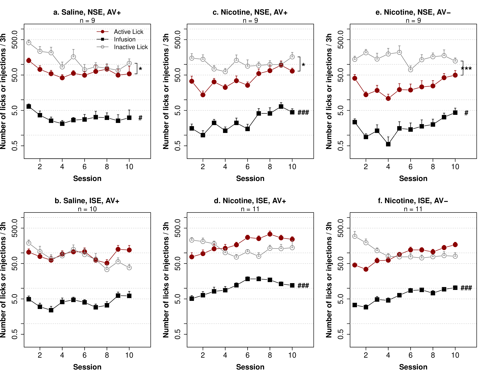
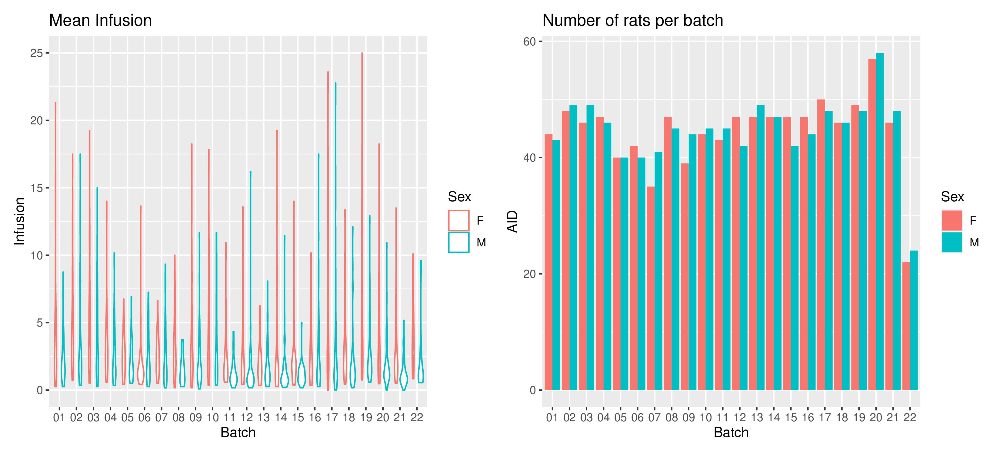
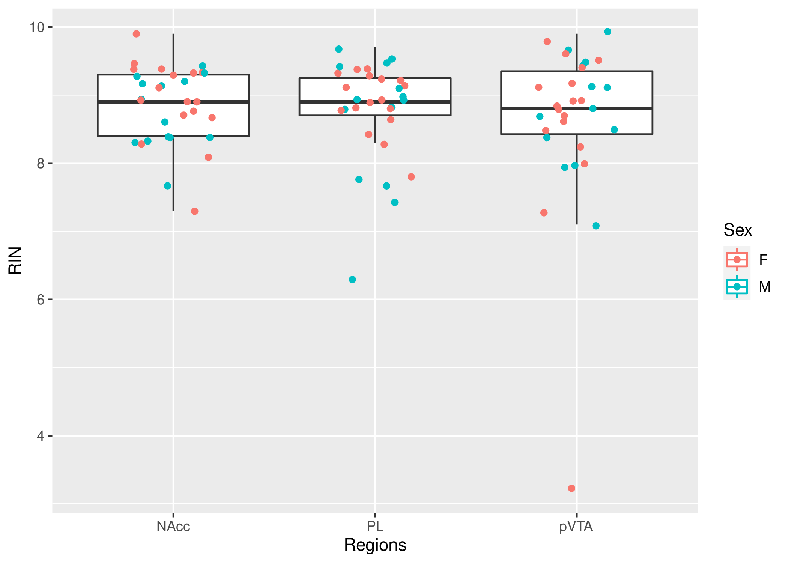

## Project 2 

# Socially acquired nicotine 
# self-administration 

##	Hao Chen

### University of Tennessee Health Science center

P50 virtual retreat, Nov 4nd, 2021

---

## Specific Aims 

<h3 style="color:#069; text-align:left">
Aim 1. Phenotype adolescent HS rats on socially acquired nicotine IVSA. </h3>
<h3 style="color:#069; text-align:left">
Aim 2. Analyze the relationships between behavioral traits using regression, phenome-wide association (PheWAS), and genetic correlation.
</h3>
<h3 style="color:#069; text-align:left">
Aim 3. Obtain naïve brain tissues for transcriptome sequencing.
</h3>

</small>

---

## Nicotine is primarily aversive in non-smokers 
<table>
 <tr>
 <td width=50%>
 
 </td>
 <td width=90%>
 
 </td>
 </tr>
 <tr>
 <td>
 Coughing, nausea, dizziness, sickness, burning throat, headache.
 </td>
 <td>
 Nicotine induces drug high only in <em>significantly nicotine-deprived smokers</em>. 
 </td>
 </tr>
</table>

---

## Flavor cues do not support nicotine self-administration

 
<cite> Chen, et al., Neuropsychopharmacology, 2011 </cite>

Note:
We previously reported that 
adolescent rats developed conditioned aversion to an appetitive flavor cue (saccharine + grape odor) associated with self-administered i.v. nicotine. In this operant <i>licking</i> model, oral flavor cue and <strong>i.v.</strong> nicotine were delivered simultaneously upon the completion of a fixed-ratio 5 reinforcement schedule. 

---

## Intravenous nicotine paired with a flavor cue is aversive 

 
<cite> Chen, et al., Neuropsychopharmacology, 2011 </cite>

---

## Social influence is a key factor in smoking initiation 

 

 

---

## Social learning enables nicotine self-administration

 
<cite> Chen, et al., Neuropsychopharmacology, 2011 </cite>

Note:
However, with the presence of a "demonstrator" rat consuming the same flavor cue, nicotine i.v. self-administration was established. 
No water or food deprivation or operant pretraining is needed. Thus the model is appropriate for studying smoking initiation in adolescents. 

---

## Stable nicotine intake at two doses across 12 isogeneic strains 

### Nicotine intake is heritable (h2=0.54-0.65).

<cite> Han, et al., Sci Report, 2017 </cite>

---

## Nicotine IVSA with an aversive flavor cue

<b>NSE</b>: neutral social environemnt, i.e., the presence of a companion rat. 
<b>ISE</b>: indusive social environment, i.e., the presences of a companion rat who has access to the flavor cue. 
<b>AV</b>: audiovisual cue 

<cite> Wang, et al., Psychopharmacology, 2016 </cite>

---

## Nicotine IVSA with an aversive flavor cue

<cite> Wang, et al., Psychopharmacology, 2016 </cite>

Note:
We further reported that even when an aversive (i.e. quinine) flavor was used in place of the appetitive flavor, adolescent rats obtained nicotine IVSA, with the presence of a demonstrator consuming a flavor cue containing the same odor as the nicotine cue (i.e. inducive social environemnt (<b>ISE</b>). The number of nicotine infusions were almost identical between the two cues. <b>Therefore, licking on the active spout is most likely motivated by nicotine in this model</b> The reduced licks on the active spout was due to the reduction of licking during the timeout period following nicotine and cue delivery. 

---

## Social learning is mediated by Carbon Disulfide (CS2) in rats 

 
 

---

## Social learning facilitates the extinction of conditioned nicotine aversion

<cite> Han, et al., Sci Report, 2017 </cite>

---

### Summary 
## Socially acquired nicotine IVSA

* Nicotine has both aversive and reinforcing properties
* Nicotine contingent flavor cues are associated with its the aversive property 
* Social learning facilitates the extinction of conditioned nicotine flavor aversion, reduces overall aversive response and allows the establishment of nicotine IVSA
	* social interaction is no longer needed once self-administration is established
* <a href="#/8">Operant responding is driven by the reinforcing property of nicotine</a> 
	* rats are not water or food deprived
	* dose response to nicotine across multiple strains
	* nicotine can be self-administered with an aversive flavor cue 

---

## Timetable for behavioral tests

| Age | Test |
|---|---|
|PND21|Wean, Body weight|
|PND31|Open field (20min)|
|PND32|Novel object (20min)|
|PND33|Social interaction in the same arena as openfield (20 min)       |
|PND34|Elevated plus maze (6min)|
|PND35|Free moving social (15 min habituation + 15 min video recording)|
|PND38|Surgery|
|PND39 -- 41| Recovery|
|PND42 -- 51|Socially acquired nicotine IVSA|
|PND52| Progressive ratio test |
|PND53 -- 56 |Extinction|
|PND57|Contextual cue induced reinstatement|
|PND59|Tissue Collection for the IVSA rats|

---

## Current phenotyping progress 

---

## Current RNA extraction progress 
### 33 rats about 100 samples

---

## Progress in Reanalysis of Ethovision data

* Previous data were recorded using Ethovision version 4.
	* Does not allow exporting of time bins
* We are now using Ethovision version 15. 
* We have reanalyzed ~1,500 old recordings (Open field) 
	* Other behavioral tests will all be re-analyzed 	

---

## GWAS summary

|Behavior |  Sample size | N traits | N QTL traits | N significant QTL| 
|---|---|---:|---:|---:|
| Open field test (OFT) | 626 M, 620 F |  6 | 5 | 9 | 
| Novel object interaction (NOIT) |623 M, 622 F|  6 | 4| 7|
| Social interaction test (SIT) | 664 M, 664 F | 11| 10|  14| 
| Elevated plus maze  (EPM) |  659 M, 658 F | 10| 7| 8| 
| Socially acquired nicotine IVSA| 711 M, 711 F| 63| 24 | 30| 

One trait mapped to multiple loci; multiple traits mapped to the same loci

---

## Candidate genes for OFT, NOIT, SIT 

---

#### Summary of nicotine GWAS

## Number of licks on the active spout

|ID |Session|Location| Genes (n) | Human Smoking GWAS Genes|
|---|:---:|---|---|---|
|12.20 | day 1 | chr1:278524299| 99 | Gpam&clubs;&diams;, [Vti1a](http://rats.pub/cytoscape/?rnd=tmpUpzbbT&genequery=VTI1A)&spades;, Nhlrc2&clubs;&diams;, Adrb1&clubs;, Tcf7l2, [Hspa12a](http://rats.pub/cytoscape/?rnd=tmpFrhLrJ&genequery=HEAT-SHOCK-PROTEIN-FAMILY-A-HSP70-MEMBER-12A_HSPA12A)&spades;, [Shtn1](http://rats.pub/cytoscape/?rnd=tmpJiHXFf&genequery=KIAA1598_SHOOTIN-1_SHOOTIN1_SHTN1)&spades;&diams;, [Nrap](http://rats.pub/cytoscape/?rnd=tmpaUzTZp&genequery=N-RAP_NEBULIN-RELATED-ANCHORING-PROTEIN_NRAP)&spades;, Casp7&diams; Gfra1|
|12.29 | day 2 | chr8:22496077| 29| [Carm1](http://rats.pub/cytoscape/?rnd=tmpaHVoNJ&genequery=carm1) |
|12.24 | day 4 | chr4:145377793| 20| [Emc3](http://rats.pub/cytoscape/?rnd=tmpQXgUzk&genequery=emc3) |
|12.12 | day 5 | chr16:83955432| 23| Tex29| 
|12.08 | day 7 | chr16:83489214| 23| Tex29| 
|12.02 | day 9 | chr10:32845925| 90|  | 
|12.22 | day 10 | chr2:247766389|20| [Pkn2, Gtf2b](http://rats.pub/cytoscape/?rnd=tmpPoBkQf&genequery=Pkn2_Gtf2b) |
|12.16 | Reinstatment | chr1:161226950| 28|Usp35, Gab2,  Nars2, Tenm4, [Alg8](http://rats.pub/cytoscape/?rnd=tmpJKLgcJ&genequery=Usp35_Gab2_Nars2_Tenm4_Alg8)&diams;&hearts; |

&spades;: smoking initiation genes
&clubs;: Alcohol consumption genes
&diams;: cis-eQTL
&hearts; missense variants

---

#### Summary of nicotine GWAS

## Number of infusions

|ID|Session|Location| Genes (n)| Human Smoking GWAS Genes|
|---|:---:|---|---|---|
|12.09 | day 5  | chr16:83500180| 23| Tex29  |
|12.13 | day 5  | chr17:17103044| 1| [ID4](http://rats.pub/cytoscape/?rnd=tmpdaIxug&genequery=ID4) |
|12.11 | day 7  | chr16:83500180| 23| Tex29|
|12.23 | day 7  | chr3:104723116| 8|[Hmgn4, Fmn1](http://rats.pub/cytoscape/?rnd=tmpSBamBX&genequery=Hmgn4_Fmn1) |
|12.15 | day 8  | chr19:26396258| 1| |
|12.03 | median of last 3 days  |  chr11:17834164|27| | 
|12.10 |total infusion  | chr16:83500180| 23| [Tex29](http://rats.pub/cytoscape/?rnd=tmpesQlMB&genequery=tex29)|
|12.30 |slope of regression  | chr8:4459578| 74| [Gria4](http://rats.pub/cytoscape/?rnd=tmpAjmeXn&genequery=Gria4_Pdgfd_Mmp12)&diams;, Pdgfd&diams;, Mmp12 |

&diams;: cis-eQTL

---

## Potential targets for validation 

* Shtn1 (active lick on day 1)
* Gria4 (progression of intake)
* Tex29 (total intake)
* Alg8 (reinstatement) 

---

##  Validation of GWAS targets

* Using CRISPR/Cas9 knockin rat for validation
* PCR/Western blotting on rats with high vs low nicotine intake 

---

## C.elegans model of nicotine conditioned cue preference

### Dr. Changhoon Jee, Assistant Prof, UTHSC

<table><tr><td>

</td><td>

</td></tr></table>

---

## Gria4 null mutation abolishes nicotine CCP 

### Dr. Changhoon Jee, Assistant Prof, UTHSC

---

## Publications so far

* Published
	* Wang T, Han W, Wang B, Jiang Q, Solberg-Woods LC, Palmer AA, Chen H. Propensity for social interaction predicts nicotine-reinforced behaviors in outbred rats. Genes Brain Behav. 2014 Feb;13(2):202–212. PMCID: PMC3934210
	* Wang T, Han W, Chitre AS, Polesskaya O, Solberg Woods LC, Palmer AA, Chen H. Social and anxiety-like behaviors contribute to nicotine self-administration in adolescent outbred rats. Sci Rep. 2018 Dec 24;8(1):18069. PMCID: PMC6305389
	* Han W, Wang T, Chen H. Social learning promotes nicotine self-administration by facilitating the extinction of conditioned aversion in isogenic strains of rats. Sci Rep. Nature Publishing Group; 2017 Aug 14;7(1):8052. PMCID: PMC5556091

* BioRxiv (also under review)
	* Gunturkun MH, Flashner E, Wang T, Mulligan MK, Williams RW, Prins P, Chen H. GeneCup: mine PubMed for gene relationships using custom ontology and deep learning. bioRxiv. 2021. p. 2020.09.17.297358. Available from: https://www.biorxiv.org/content/10.1101/2020.09.17.297358v5
	* Gunturkun MH, Wang T, Chitre AS, Martinez AG, Holl K, St. Pierre C, Bimschleger H, Gao J, Cheng R, Polesskaya O, Solberg-Woods LC, Palmer AA, Chen H. Genome-wide association study of open field behavior in outbred heterogeneous stock rats identifies multiple loci implicated in psychiatric disorders. bioRxiv. 2021. p. 2021.10.18.464872. Available from: https://www.biorxiv.org/content/10.1101/2021.10.18.464872v1

---

## Acknowledgements

* Current lab members working on this project 

<table><tr>
<td width=20%>

Tengfei Wang

</td>
<td width=20%>

Angel Garcia Martinez

</td>
<td width=20%>

Shuangying Leng

</td>
<td width=20%>

Rachel Ward

</td>
<td width=20%>

Hakan Gunturkun

</td>
</tr>
</table>

* Past technicians 
	* *Xia Hong* | *Jie Shen* | *Wenyan Han* | *Pawandeep Kaur* | *Yanyan Lin* | *Xinyu Fan*   | *Mallory Udell*|
* Summer students 
	* Abigale Salinero (REHU 2015) | Cindy Tay (REHU 2016) | Raven David (REHU 2017) | Christian Hurt (REHU 2018) 
* P50 collaborators 
	* Abraham Palmer | Oksana Polaskaya | Apurva Chitre | Leah-Solberg Woods 
* UTHSC collaborators
	* Changhoon Jee | Burt Sharp | Rob Williams

---

## Nicotine metabolism

---

