## Project 2 

# Socially acquired nicotine 
# self-administration 

##	Hao Chen

### University of Tennessee Health Science center

P50 retreat, November 17th, 2022

---

## Specific Aims 

<table> <tr><td width=50%>
<h3 style="color:#069; text-align:left">
Aim 1. Phenotype adolescent HS rats on socially acquired nicotine IVSA. </h3>
<h3 style="color:#069; text-align:left">
Aim 2. Analyze the relationships between behavioral traits using regression, phenome-wide association (PheWAS), and genetic correlation.

</h3>
<h3 style="color:#069; text-align:left">
Aim 3. Obtain naïve brain tissues for transcriptome sequencing.
</h3>

</small>

</td></tr></table>

---

## Social learning enables nicotine self-administration

 
<cite> Chen, et al., Neuropsychopharmacology, 2011 </cite>

Note:
However, with the presence of a "demonstrator" rat consuming the same flavor cue, nicotine i.v. self-administration was established. 
No water or food deprivation or operant pretraining is needed. Thus the model is appropriate for studying smoking initiation in adolescents. 

---

## Nicotine IVSA with an aversive flavor cue

<cite> Wang, et al., Psychopharmacology, 2016 </cite>

Note:
We further reported that even when an aversive (i.e. quinine) flavor was used in place of the appetitive flavor, adolescent rats obtained nicotine IVSA, with the presence of a demonstrator consuming a flavor cue containing the same odor as the nicotine cue (i.e. inducive social environemnt (<b>ISE</b>). The number of nicotine infusions were almost identical between the two cues. <b>Therefore, licking on the active spout is most likely motivated by nicotine in this model</b> The reduced licks on the active spout was due to the reduction of licking during the timeout period following nicotine and cue delivery. 

---

## Timetable for behavioral tests

| Age | Test |
|---|---|
|PND21|Wean, Body weight|
|PND31|Open field (20min)|
|PND32|Novel object (20min)|
|PND33|Social interaction in the same arena as openfield (20 min) |
|PND34|Elevated plus maze (6min)|
|PND35|Free moving social (15 min habituation + 15 min video recording)|
|PND38|Surgery|
|PND39 -- 41| Recovery|
|PND42 -- 51|Socially acquired nicotine IVSA|
|PND52| Progressive ratio test |
|PND53 -- 56 |Extinction|
|PND57|Contextual cue induced reinstatement|
|PND59|Tissue Collection for the IVSA rats|

---

## GWAS summary

|Behavior | Sample size | N traits | N QTL traits | N significant QTL| 
|---|---|---:|---:|---:|
| Open field test (OFT) | 626 M, 620 F | 6 | 5 | 9 | 
| Novel object interaction (NOIT) |623 M, 622 F| 6 | 4| 7|
| Social interaction test (SIT) | 664 M, 664 F | 11| 10| 14| 
| Elevated plus maze (EPM) | 659 M, 658 F | 10| 7| 8| 
| Socially acquired nicotine IVSA| 711 M, 711 F| 63| 24 | 30| 

One trait mapped to multiple loci; multiple traits mapped to the same loci

---

#### Aim 1

## Progress in reanalysis of ethovision data

* Previous data were recorded using Ethovision version 4.
	* Does not allow exporting of time bins
* We are now using Ethovision version 15. 
* We have reanalyzed over 3,000 recordings 
 * open field: 60 min, novel object interaction: 20 min
	* social interaction and elevated plus maze will be started next. 

---

#### Aim 1

## Ethovision data reanalysis
### Batches 1-16
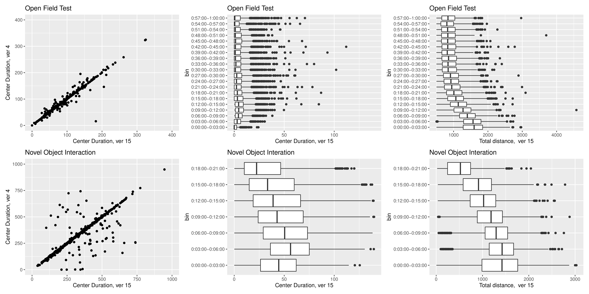 

---

#### Aim 1

## Open field and novel object interaction data
### Batches 1-25
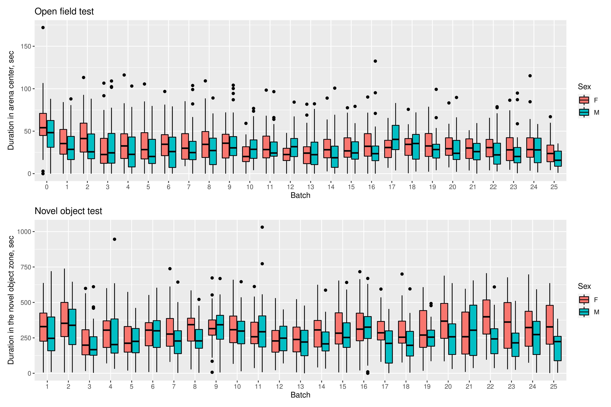

---

#### Aim 1

## Social interaction and elevaed plus maze data 
### Batches 1-25

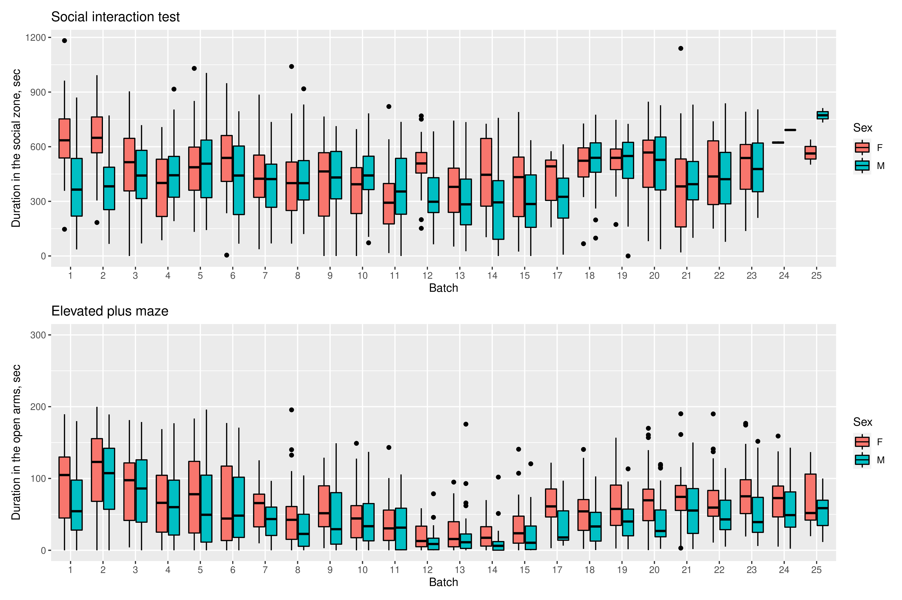

---

#### Aim 1

## Socially acquired nicotine IVSA
### Batches 1-25

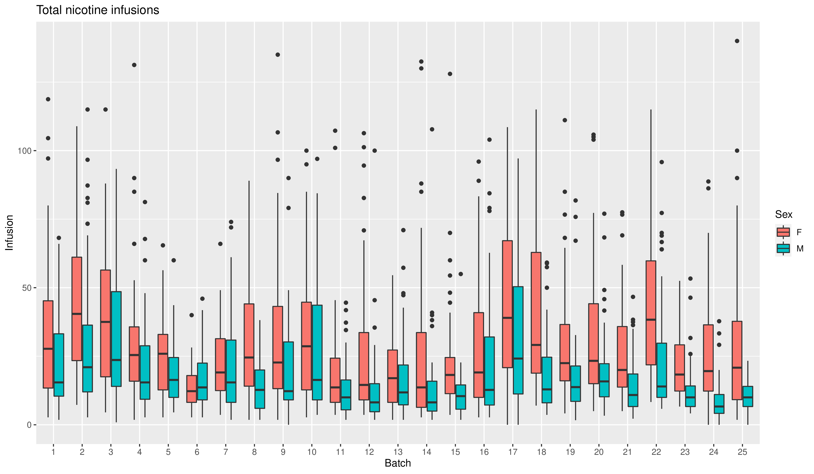

---

#### Aim 2

## Correlations between nicotine and behavioral traits

<table><tr>
<td width=50%>

<b>
250 variables x 1490 female rats
</b>

</td>
<td>

<b>
250 variables x 1357 male rats
</b>

</td>
</tr></table>

---

#### Fun excursion 

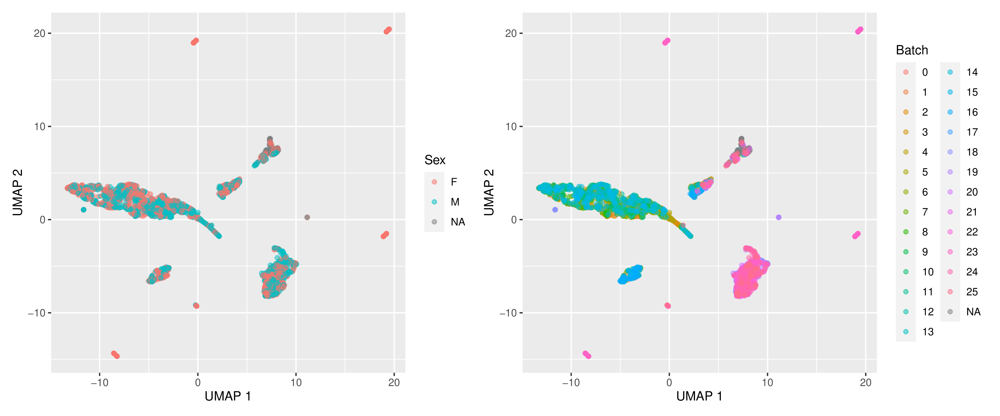

---

#### Aim 2

## Correlations between nicotine and behavioral traits
### summary

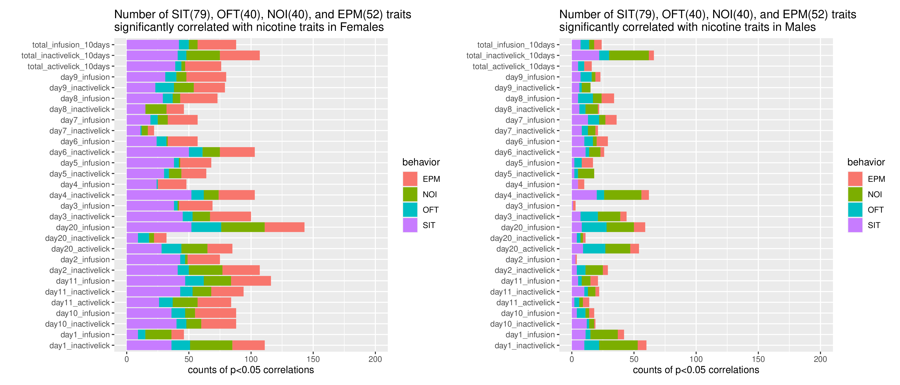

---

#### Aim 2

## Example correlations 
### in females
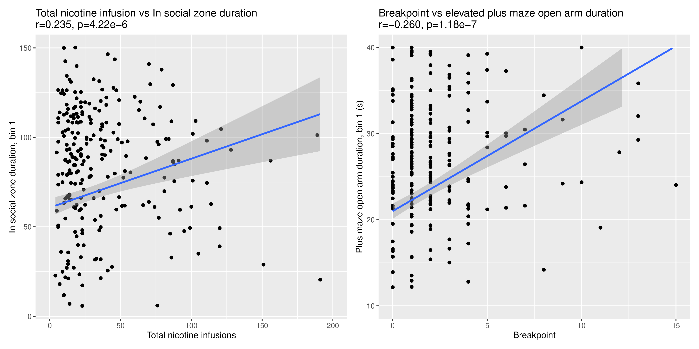

---

#### Aim 2

## The benefit of time bins 
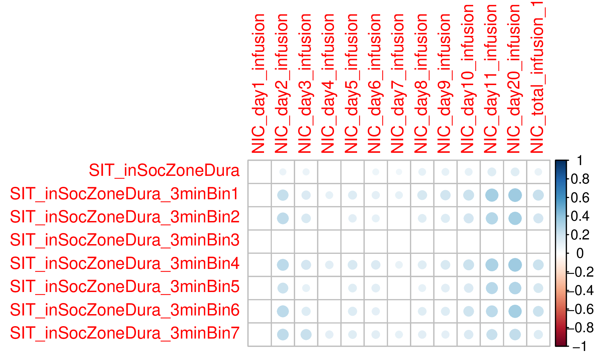

---

#### Aim 2

## The benefit of time bins 

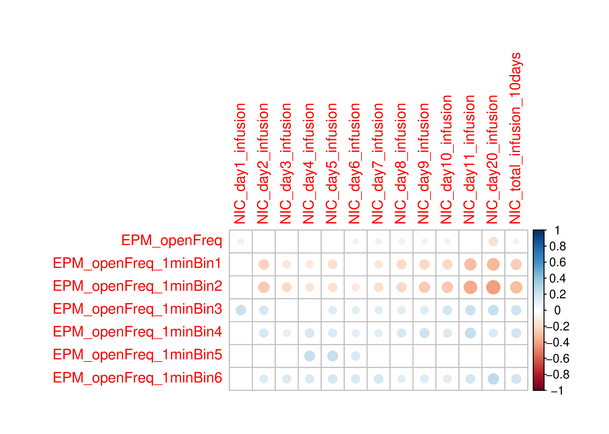

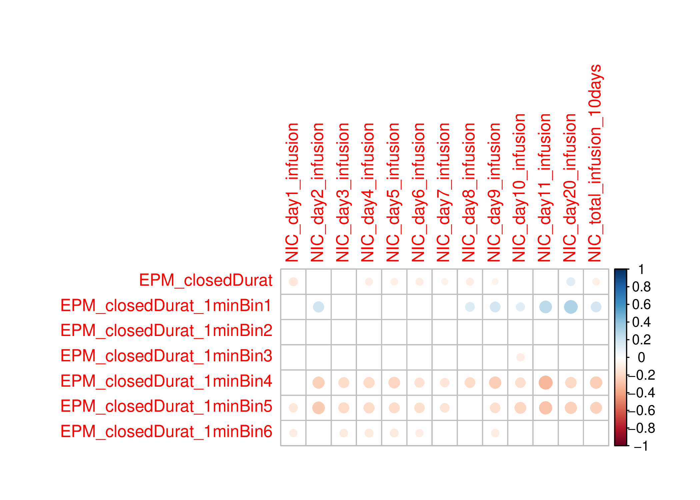

---

#### Aim 3

## RNA extraction from naive HS rats 
### 133 rats, 384 samples
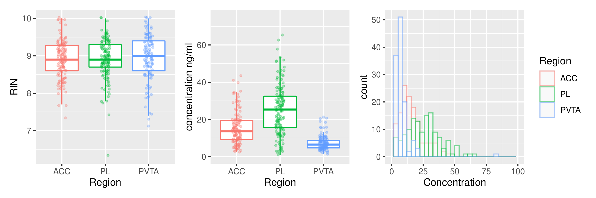

---

#### Extracurricular 

## Validation of GWAS targets

Slope for the progression of nicotine infusion across sessions

Gria4 has <a href="https://ratgtex.org/gene-eqtl-visualizer/#gria4">cis-eQTL in many brain regions</a>, and is associated with comorbid nicotine dependence and major depression in humans <a href="https://pubmed.ncbi.nlm.nih.gov/30287806/" target=_new>PMID: 30287806</a>

---

#### Extracurricular 

## Gria4 null mutation abolishes nicotine CCP 

### Dr. Changhoon Jee, Assistant Prof, UTHSC

---

#### Extracurricular 

## Select samples for Gria4 Western blot

---

#### Extracurricular 

## Gria4 Western blot

<table><tr><td width=75%>

</td>
<td width=25%> 

</td></tr></table>

---

## Publications in 2022 

* Gunturkun MH, Flashner E, Wang T, Mulligan MK, Williams RW, Prins P, Chen H. GeneCup: mining PubMed and GWAS catalog for gene-keyword relationships. G3 (Bethesda). 2022 May 6;12(5):jkac059. doi: 10.1093/g3journal/jkac059. PMID: 35285473; PMCID: PMC9073678.
* Gunturkun MH, Wang T, Chitre AS, Garcia Martinez A, Holl K, St Pierre C, Bimschleger H, Gao J, Cheng R, Polesskaya O, Solberg Woods LC, Palmer AA, Chen H. Genome-Wide Association Study on Three Behaviors Tested in an Open Field in Heterogeneous Stock Rats Identifies Multiple Loci Implicated in Psychiatric Disorders. Front Psychiatry. 2022 Feb 14;13:790566. doi: 10.3389/fpsyt.2022.790566. PMID: 35237186; PMCID: PMC8882588.

---

## Acknowledgements

* Lab members working on this project 

<table><tr>
<td width=14.3%>

Tengfei Wang
</td>
<td width=14.3%>

Angel Garcia Martinez
</td>
<td width=14.3%>

Shuangying Leng
</td>

<td width=14.3%>

Caroline Jones
</td>

<td width=14.3%>

Gwen Johnson
</td>

<td width=14.3%>

Rachel Ward
</td>
<td width=14.3%>

Hakan Gunturkun
</td>
</tr>
</table>

* Past technicians 
	* *Xia Hong* | *Jie Shen* | *Wenyan Han* | *Pawandeep Kaur* | *Yanyan Lin* | *Xinyu Fan* | *Mallory Udell* |
* Summer students 
	* Abigale Salinero (REHU 2015) | Cindy Tay (REHU 2016) | Raven David (REHU 2017) | Christian Hurt (REHU 2018) | Gwen Johnson (REHU 2021) | Olivia Harrison (REHU 2022)
* P50 collaborators 
	* Abraham Palmer | Oksana Polaskaya | Apurva Chitre | Leah-Solberg Woods 
* UTHSC collaborators
	* Changhoon Jee | Wenlin Sun| Rob Williams
---

---

## Nicotine metabolism

---

## Nicotine IVSA with an aversive flavor cue

<b>NSE</b>: neutral social environemnt, i.e., the presence of a companion rat. 
<b>ISE</b>: indusive social environment, i.e., the presences of a companion rat who has access to the flavor cue. 
<b>AV</b>: audiovisual cue 

<cite> Wang, et al., Psychopharmacology, 2016 </cite>

---

