## Project 2 

# Socially Acquired Nicotine 
# Self-administration 

##	Hao Chen

### University of Tennessee Health Science Center

P50 Retreat, Oct 27th, 2023

---

## Specific Aims 

<table> <tr><td width=50%>
<h3 style="color:#069; text-align:left">
Aim 1. Phenotype adolescent HS rats on socially acquired nicotine IVSA. </h3>
<h3 style="color:#069; text-align:left">
Aim 2. Analyze the relationships between behavioral traits using regression, phenome-wide association (PheWAS), and genetic correlation.

</h3>
<h3 style="color:#069; text-align:left">
Aim 3. Obtain naïve brain tissues for transcriptome sequencing.
</h3>

</small>

</td></tr></table>

---

## RNA Extraction from Naive HS Rats 
### 198 Rats, 575 samples
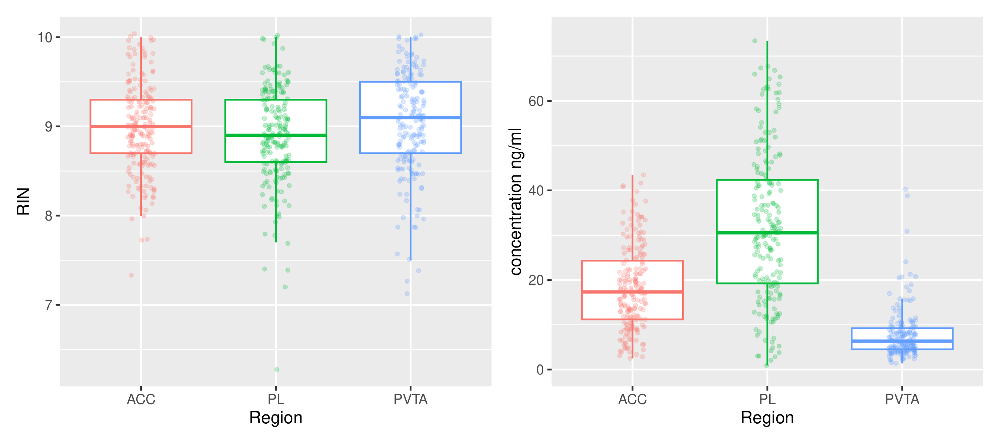

---

## Socially Acquired Nicotine Intravenous Self-administration

 
<cite> Chen, et al., Neuropsychopharmacology, 2011 </cite>

Note:
However, with the presence of a "demonstrator" rat consuming the same flavor cue, nicotine i.v. self-administration was established. 
No water or food deprivation or operant pretraining is needed. Thus the model is appropriate for studying smoking initiation in adolescents. 

---

## Nicotine IVSA with an Aversive Flavor Cue

<cite> Wang, et al., Psychopharmacology, 2016 </cite>

Note:
We further reported that even when an aversive (i.e. quinine) flavor was used in place of the appetitive flavor, adolescent rats obtained nicotine IVSA, with the presence of a demonstrator consuming a flavor cue containing the same odor as the nicotine cue (i.e. inducive social environemnt (<b>ISE</b>). The number of nicotine infusions were almost identical between the two cues. <b>Therefore, licking on the active spout is most likely motivated by nicotine in this model</b> The reduced licks on the active spout was due to the reduction of licking during the timeout period following nicotine and cue delivery. 

---

## Behavioral Test Schedule 

<table> <tr><td width=30%>

</td><td>

| Age | Test |
|---|---|
|PND21|Wean, Body weight|
|PND31|Open field test (20min)|
|PND32|Novel object interaction (20min)|
|PND33|Social interaction test (20 min) |
|PND34|Elevated plus maze (6min)|
|PND38|Surgery|
|PND39 -- 41| Recovery|
|PND42 -- 51|Socially acquired nicotine IVSA|
|PND52| Progressive ratio test |
|PND53 -- 56 |Extinction|
|PND57|Contextual cue induced reinstatement|
|PND59|Tissue Collection for the IVSA rats|

</td></tr></table>

---

## Phenotype: Open Field Test

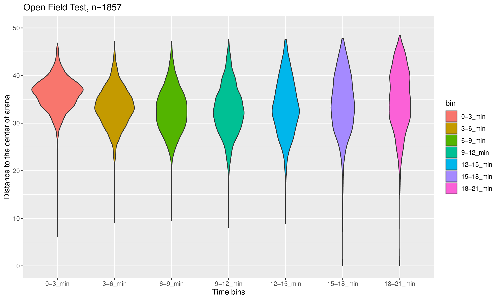

---
## GWAS: Open Field Test

n=1857

---

## Phenotype: Novel Object  Test

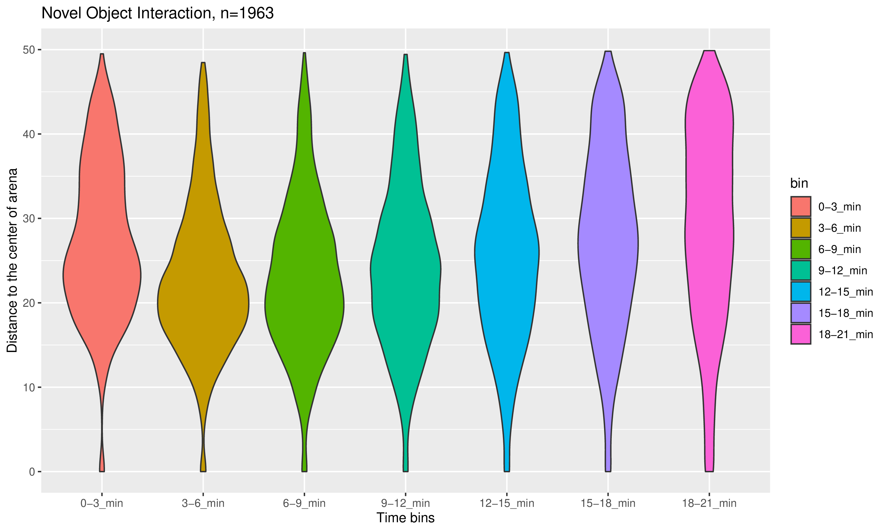
---

## GWAS: Novel Object Interaction

n=1963

---

## Phenotype: Social Interaction Test

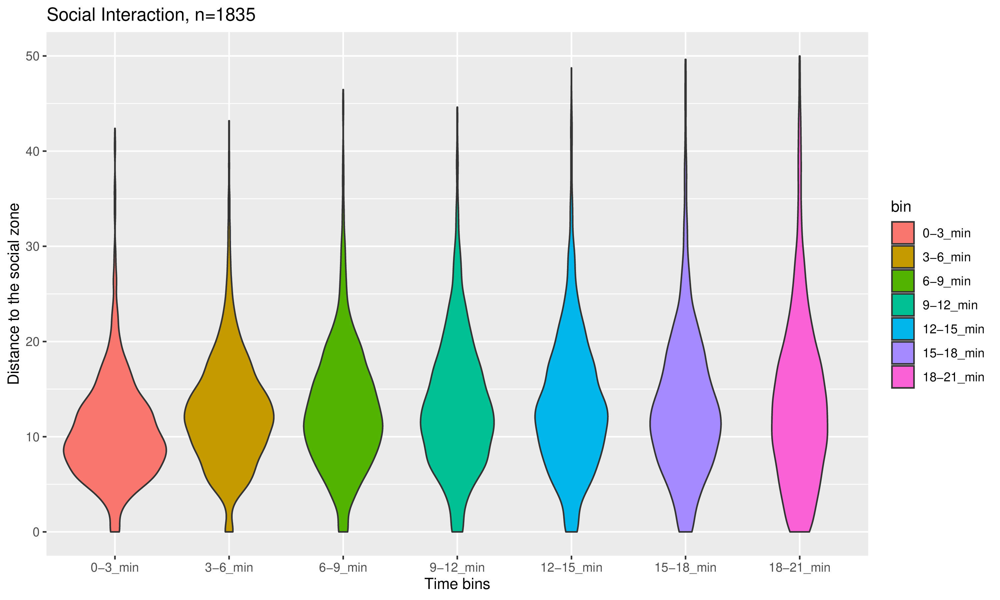

---
## GWAS: Social Interaction

n=1835

---

## Phenotype: Elevated Plus Maze

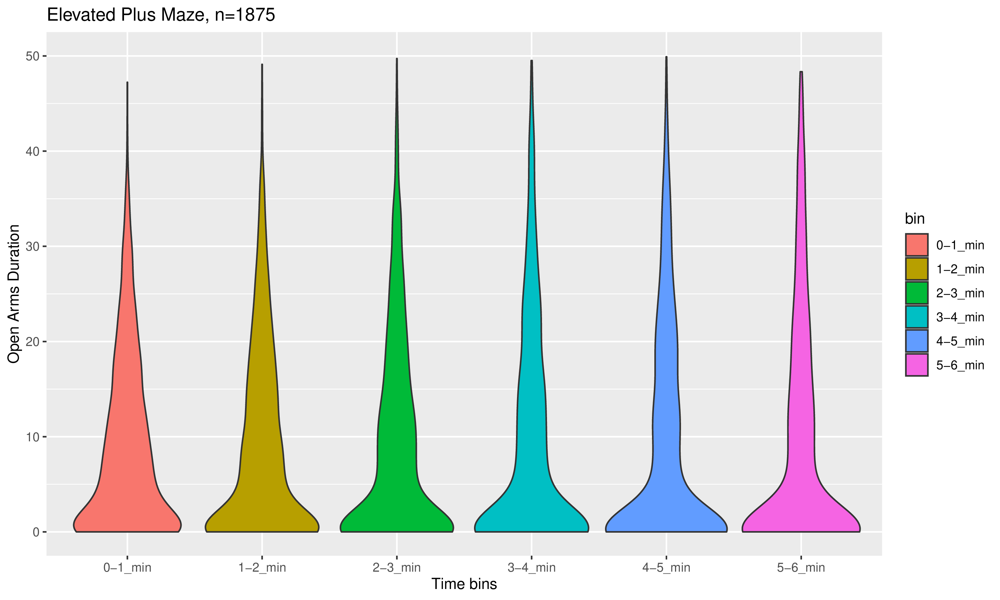

---
## GWAS: Elevated Plus Maze 

n=1875

---

## Phenotype: Socially Acquired Nicotine IVSA  

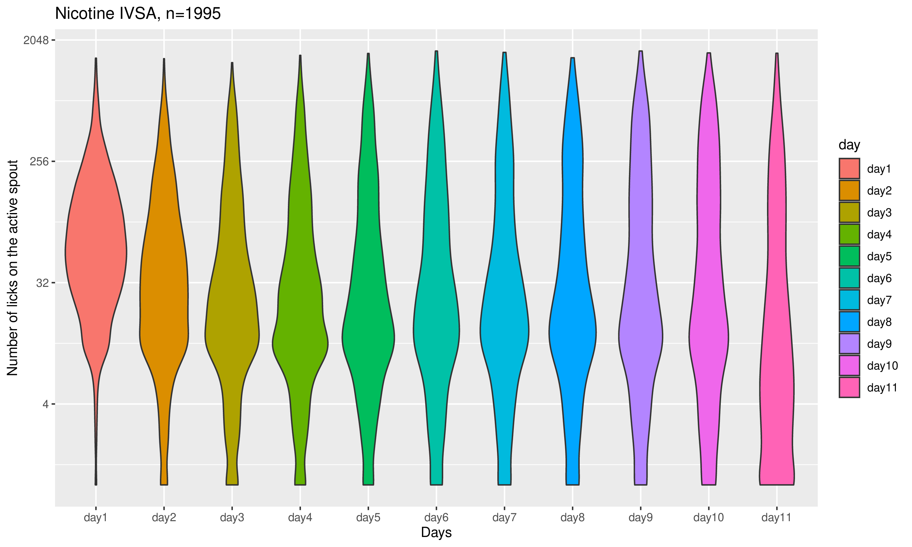

---
## Heritability: Socially Acquired Nicotine IVSA  

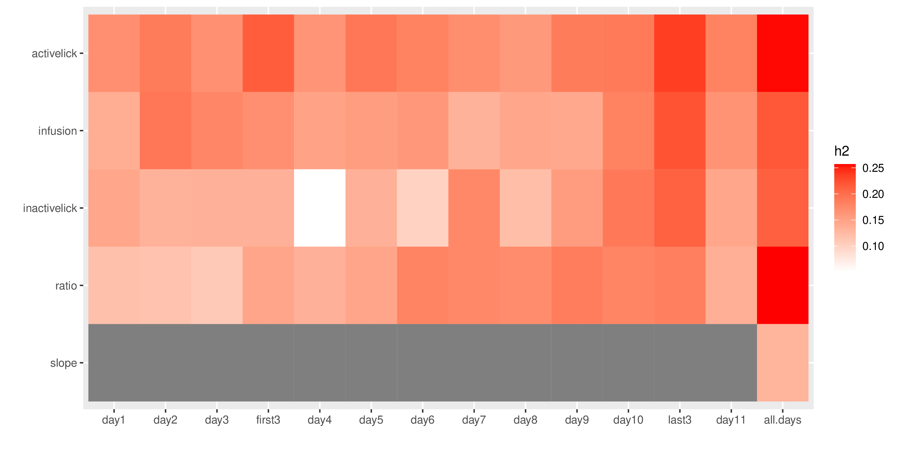

---

## GWAS: Socially Acquired Nicotine IVSA

n=1995

---

## Many QTL are Very Narrow

<table><tr><td width=50%>

 
 

</td><td>

 
 

</td></tr></table>

---

## A Few QTL are Wide

---

## Multiple Causal Genes in One QTL?

---

## PheWAS: Social Interaction & Socially Acquired Nicotine IVSA

<table><tr>
<td width=33%>  </td>
<td width=33%> </td>
<td width=33%></td>
</tr></table>

|SNP PheDb|-Log10(p)PheDb|R2|DP|trait PheDb|
|---|---|---|---|---|
|4:151349337|5.04|0.959|0.982|nicsa day1 infusion|
|4:151240226|4.057|0.798|0.995|nicsa day1 active inactive ratio|
|4:151324325|6.15|0.966|0.987|nicsa first three days activelick total|
|4:151324325|4.78|0.966|0.987|nicsa first three days infusion total|
|4:151964479|4.329|0.408|0.953|social 0 to 3 insoczonedura|

---

## Top Smoking Phenotypes in GWAS Catalogue 

|Trait| Number of Sig. SNPs 1 | Note|
|---|---|---|
|Smoking initiation 2              |   5498  | 5269 from Saunders, et al. PMID: 36477530 and Liu et al.,  PMID: 30643251|
|Cigarettes smoked per day       |   610   | | 
|Smoking status 3                  |   481  | 218 were from Karlsson Linnér  et al. PMID: 30643258. |
|Smoking cessation 4              |   452  | 335 were from Saunders, et al.,  PMID: 36477530.|
|Age of smoking initiation       |   243  ||

<table><tr><td>

1. p-val < 5E-8, replicated finding not filtered out
 
2. Ever being a regular smoker in their life (current or former) vs  never being a regular smoker in their life 
 
3. Ever vs nerver smoker
 
4. Current smokers vs  former smokers 

</td></tr></table>

---

## Overlap Between Genes Under Rat NicIVSA QTL 
## and Human Smoking Initiation 

---

## Overlap Between Genes Under Rat NicIVSA QTL 
## and Cigarettes per Day 

---

## Gene Ontology Enrichment of Overlapping Rat and Human Genes

---

## Candidate Genes Based on eQTL and Variant Impact
### filtering by literatuer using GeneCup.org

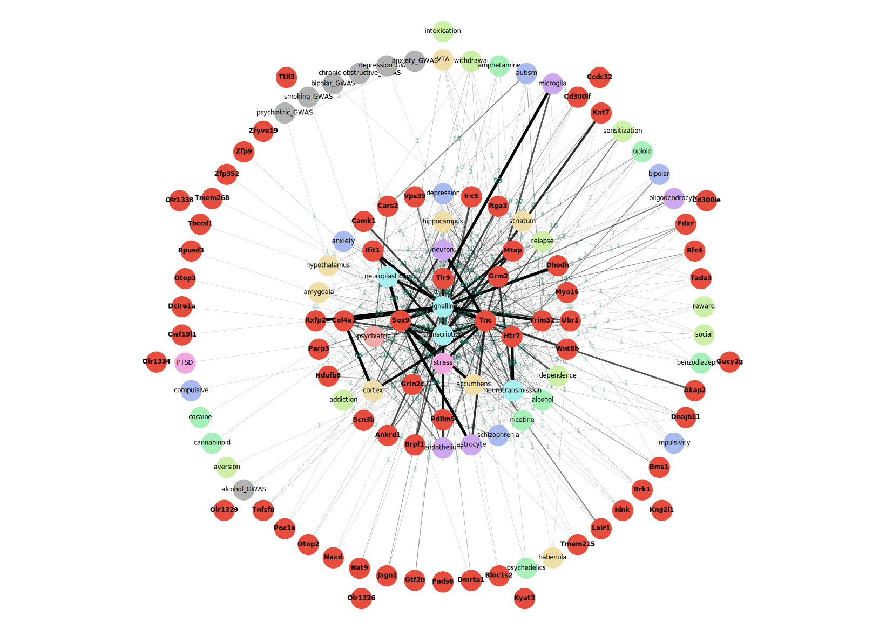

---

## Large Language Model Reads the Papers 

<table><tr><td>
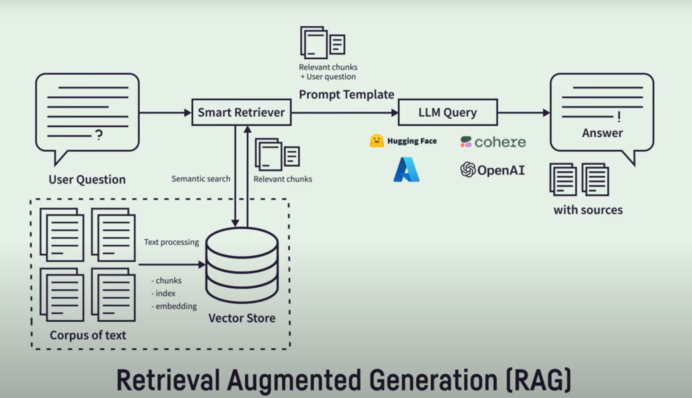
<small>credit: https://www.youtube.com/watch?app=desktop&v=ctzDFIINSrI</small>
 </td>
 <td>
 <b>User:</b> What are the potential molecular pathways where Camk1 may affect nicotine addiction?
 

 <b>Arithmo-Mistral-7B: </b> 
    One possible mechanism by which CamK1 may affect nicotine addiction is
    through the regulation of glutamate release in the VTA. Glutamate is the
    primary excitatory neurotransmitter in the brain, and its release in the
    VTA is thought to play a key role in the reinforcement process of nicotine
    addiction. CamK1 may regulate glutamate release by phosphorylating specific
    proteins involved in exocytosis, such as syntaxin1 and SNAP-25.
    </td></tr></table>

---

## Novel Candidate Genes for Nicotine IVSA not Reported in Human GWAS

---

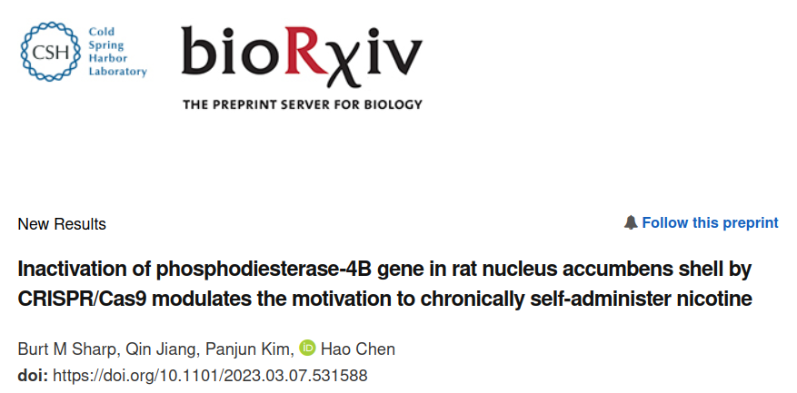

---

## Zebrafish Nicotine Conditioned Place Preference Test

<table><tr><td width=50%>

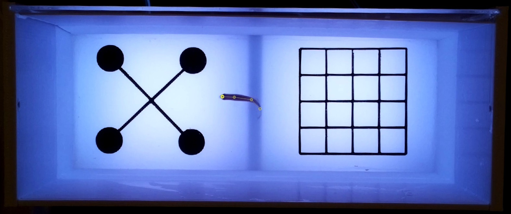

</td><td>

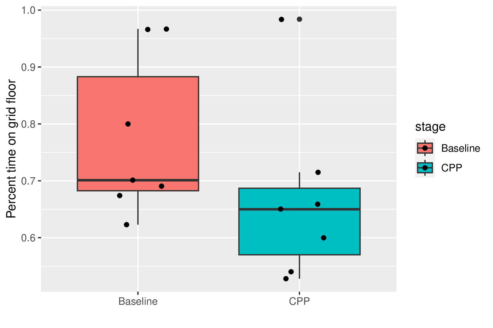
</td></table>

---

## Base Editing Zebrafish Genome 

<table><tr><td width=37%>

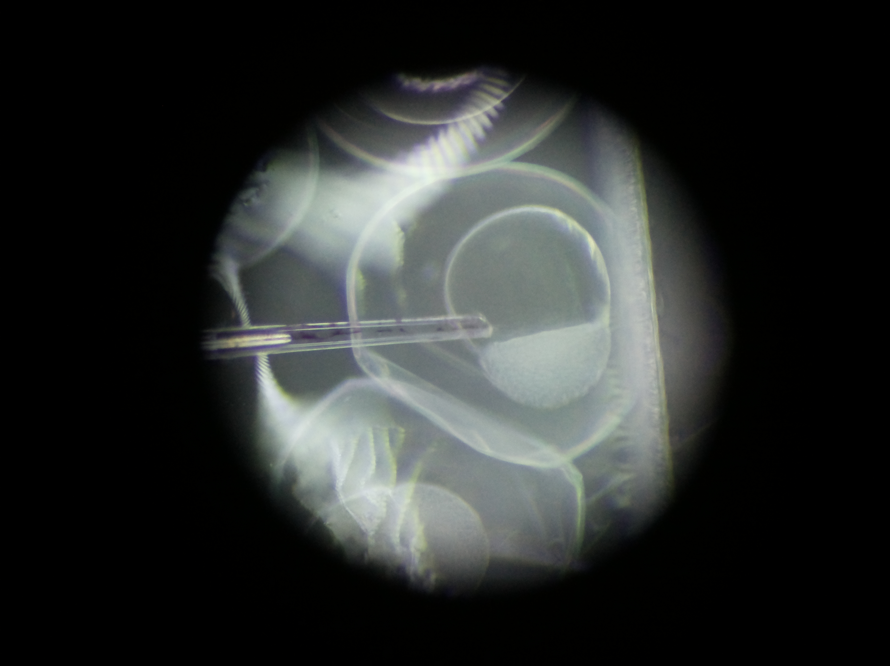

</td><td width=63%>

</td></table>

---

## Acknowledgements

<table width=70%><tr>

<td width=20%>

Angel Garcia Martinez
</td>
<td width=20%>

Shuangying Leng
</td>
<td width=20%>

Caroline Jones
</td>
<td width=20%>

Rachel Ward
</td>

</tr>
</table>

* Past technicians and analysts 
	* *Xia Hong* | *Jie Shen* | *Wenyan Han* | *Pawandeep Kaur* | *Yanyan Lin* | *Xinyu Fan* | *Mallory Udell* | *Gwen Johnson* |  *Hakan Gunturkun* | *Tengfei Wang* |
* REHU students 
	* Abigale Salinero (2015) | Cindy Tay (2016) | Raven David (2017) | Christian Hurt (2018) | Gwen Johnson (2021) | Olivia Harrison (2022, 2023) | 
Ryan Luib (2023)
* P50 collaborators 
	* Abraham Palmer | Oksana  Polesskaya | Sanches, Thiago | Apurva Chitre | Shae Ziegler | Leah Solberg-Woods 
* UTHSC collaborators
	* Changhoon Jee | Burt Sharp | Thirumalini Vaithianathan | Rob Williams
---

## Nicotine metabolism

---

## Nicotine IVSA with an aversive flavor cue

<b>NSE</b>: neutral social environemnt, i.e., the presence of a companion rat. 
<b>ISE</b>: indusive social environment, i.e., the presences of a companion rat who has access to the flavor cue. 
<b>AV</b>: audiovisual cue 

<cite> Wang, et al., Psychopharmacology, 2016 </cite>

---

