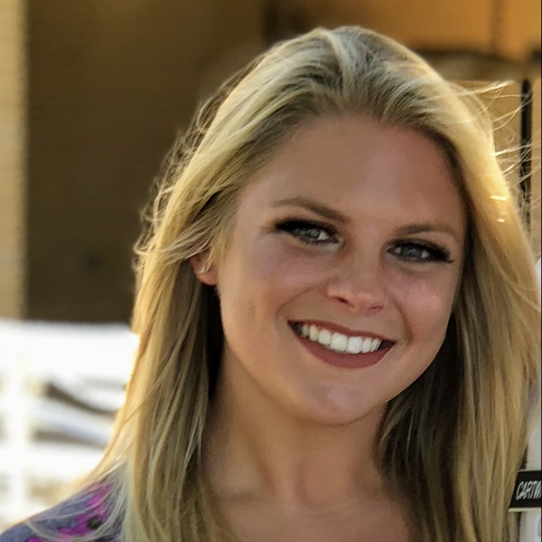

## GWAS on socially acquired nicotine IVSA in heterogeneous stock rats

###	Hao Chen

### University of Tennessee Health Science center

#### Feb 12, 2021

---

## Social learning enables nicotine self-administration

 No water or food deprivation or operant pretraining, can be used to model smoking initiation in adolescents. 

<cite> Chen, et al., Neuropsychopharmacology, 2011 </cite>

---

## Nicotine intake with appetitive vs aversive cues

<cite> Wang, et al., Psychopharmacology, 2016 </cite>

---

## Nicotine self-administration

### cue: saccharin + grape odor + CS2

#### Adolescent HS rats (711 F, 711 M)

---

## Nicotine self-administration

### cue:  quinine + grape odor + CS2 

---

## GWAS summary, version 3

|Behavior | Sample size | N traits | N QTL traits | N significant QTL| 
|---|---|---:|---:|---:|
| open field | 626 M, 620 F | 6 | 5 | 9 | 
| novel object interaction|623 M, 622 F| 6 | 4| 7|
| social interaction | 664 M, 664 F | 11| 10| 14| 
| elevated plus maze | 659 M, 658 F | 10| 7| 8| 
| socially acquired nicotine IVSA| 711 M, 711 F| 63| 24 | 30| 

One trait mapped to multiple loci; multiple traits mapped to the same loci

---

## Overlapping QLT between social interaction & socially acquired nicotine IVSA 

In social zone frequency

 

Total inactive lick, 10 sessions

 

<small>
Pearson correlation r=0.11, p=8.9e-05;
PhWAS: -logP=7.273, r2=0.275, dprime=0.993

 
The QTL region is 266k bp, has two known genes:
 <b>Abhd17b</b>, abhydrolase domain containing 17B, is located on the postsynaptic membrane of glutamatergic synapses, and regulates dendritic spine maintenance.
 <b>Gda</b>, guanine deaminase, is expressed in cortical and hippocampal neurons and increases dendritic branching in culture. 
</small>

---

## Number of licks on the active spout in first session: chr1:278524299

The QLT region is 6.9 Mbp and has 39 known genes. Four genes has missense variants, two genes has cis-eQTL with r2 > 0.6.

---

## http://rats.pub

Rats.pub is designed to take a list of gene symbols and mine the PubMed and GWAS catalog for sentences pertain to addiction.

---

##  Rat GWAS and human smoking overlaps
<pre>
 16913 rat human common gene symbols
  1600 human smoking/copd gene symbol avaialbe in rat
   805 nicsa gene symbols 
   315 nicsa gene symbols available in human
    33 gene symbols overlapping nicsa and human smoking 

 Chance of human/rat gene involved in smoking/copd: 1600/16913=0.946
 For 315 genes, we expect to find 29.8 genes 
</pre>

---

#### Summary of nicotine GWAS, part 1/4

## Number of licks on the active spout

|ID |Session|Location| Genes (n) | Human Smoking GWAS Genes|
|---|:---:|---|---|---|
|12.20 | day 1 | chr1:278524299| 99 | Gpam&clubs;&diams;, [Vti1a](http://rats.pub/cytoscape/?rnd=tmpUpzbbT&genequery=VTI1A)&spades;, Nhlrc2&clubs;&diams;, Adrb1&clubs;, Tcf7l2, [Hspa12a](http://rats.pub/cytoscape/?rnd=tmpFrhLrJ&genequery=HEAT-SHOCK-PROTEIN-FAMILY-A-HSP70-MEMBER-12A_HSPA12A)&spades;, [Shtn1](http://rats.pub/cytoscape/?rnd=tmpJiHXFf&genequery=KIAA1598_SHOOTIN-1_SHOOTIN1_SHTN1)&spades;&diams;, [Nrap](http://rats.pub/cytoscape/?rnd=tmpaUzTZp&genequery=N-RAP_NEBULIN-RELATED-ANCHORING-PROTEIN_NRAP)&spades;, Casp7&diams; Gfra1|
|12.29 | day 2 | chr8:22496077| 29| [Carm1](http://rats.pub/cytoscape/?rnd=tmpaHVoNJ&genequery=carm1) |
|12.24 | day 4 | chr4:145377793| 20| [Emc3](http://rats.pub/cytoscape/?rnd=tmpQXgUzk&genequery=emc3) |
|12.12 | day 5 | chr16:83955432| 23| Tex29| 
|12.08 | day 7 | chr16:83489214| 23| Tex29| 
|12.02 | day 9 | chr10:32845925| 90| | 
|12.22 | day 10 | chr2:247766389|20| [Pkn2, Gtf2b](http://rats.pub/cytoscape/?rnd=tmpPoBkQf&genequery=Pkn2_Gtf2b) |
|12.16 | Reinstatment | chr1:161226950| 28|Usp35, Gab2, Nars2, Tenm4, [Alg8](http://rats.pub/cytoscape/?rnd=tmpJKLgcJ&genequery=Usp35_Gab2_Nars2_Tenm4_Alg8)&diams;&hearts; |

&spades;: smoking initiation genes
&clubs;: Alcohol consumption genes
&diams;: cis-eQTL
&hearts; missense variants

---

## Vti1a, Shtn1 and Nrap for smoking initiation 

Association studies of up to 1.2 million individuals yield new insights into the genetic etiology of tobacco and alcohol use
 
Mengzhen Liu, ... Scott Vrieze, Nature Genetics 2019

<b>Vti1a</b> is expressed in all 440 RNAseq samples from 5 brain regions, FPKM:30.    Vti1a regulates synaptic vesicle and dense core vesicle secretion via protein sorting at the Golgi. PMID:30143604, 10908612. Vti1a has no cis-eQTL
 
<b>Nrap</b> is not well detected in most RNAseq samples (FPKM: 0.1-0.2), involved in ribosome biogenesis (PMID11895476).  
<b>Shtn1</b> expression is about FPKM:19. Shtn1 accumulates in the neurite tips and is a key regulator of axon outgrowth (PMID:20664640) Shtn1 has a cis-eQTL (but may not be in LD with top behavioral SNP).

---

#### Summary of nicotine GWAS, part 2/4

## Number of infusions

|ID|Session|Location| Genes (n)| Human Smoking GWAS Genes|
|---|:---:|---|---|---|
|12.09 | day 5 | chr16:83500180| 23| Tex29 |
|12.13 | day 5 | chr17:17103044| 1| [ID4](http://rats.pub/cytoscape/?rnd=tmpdaIxug&genequery=ID4) |
|12.11 | day 7 | chr16:83500180| 23| Tex29|
|12.23 | day 7 | chr3:104723116| 8|[Hmgn4, Fmn1](http://rats.pub/cytoscape/?rnd=tmpSBamBX&genequery=Hmgn4_Fmn1) |
|12.15 | day 8 | chr19:26396258| 1| |
|12.03 | median of last 3 days | chr11:17834164|27| | 
|12.10 |total infusion | chr16:83500180| 23| [Tex29](http://rats.pub/cytoscape/?rnd=tmpesQlMB&genequery=tex29)|
|12.30 |slope of regression | chr8:4459578| 74| [Gria4](http://rats.pub/cytoscape/?rnd=tmpAjmeXn&genequery=Gria4_Pdgfd_Mmp12)&diams;, Pdgfd&diams;, Mmp12 |

&diams;: cis-eQTL

---

## Tex29

Exome Chip Meta-analysis Fine Maps Causal Variants and Elucidates the Genetic Architecture of Rare Coding Variants in Smoking and Alcohol Use 
 
David Brazel, ... Scott Vrieze, Biol Psychiatry 2019

<pre>

2. Pack Years (PckYr).
Defined in the same way as cigarettes per day but not necessarily binned, divided by 20 (cigarettes in 
a pack), and multiplied by number of years smoking. This yielded a measure of total overall exposure to
tobacco and is relevant to disease outcomes for which smoking is a risk factor, such as cancer and 
chronic obstructive pulmonary disease risk

</pre>

Not much literature on this gene and expression level in the brain is almost 0. But GTex reports its detection. 
The annotation is intergenic! <a href=
"http://genome.ucsc.edu/cgi-bin/hgTracks?db=hg38&lastVirtModeType=default&lastVirtModeExtraState=&virtModeType=default&virtMode=0&nonVirtPosition=&position=chr13%3A110979763%2D112075449&hgsid=1028729693_QukEveNO4EoDL3hNviIqVJ3lcbnb"> What else is here?</a>

Could it be Arhgef7? Brain expression FPKM=30. Involed in spine morphogenesis. Loss of Arhgef7 results in extensive loss of axons PMID:30683798, PMID:29891904

---

#### Summary of nicotine GWAS, part 3/4

## Number of licks on the inactive spout 

|ID|Session|Location| Genes (n)|Human Smoking GWAS Genes|
|---|:---:|---|---|---|
|12.18 | day 3 | chr1:253523411| 10| |
|12.04 | day 7 | chr14:108854633|23| XPO1, USP34, BCL11A |
|12.06 | day 9 | chr16:5256755|1| Cacna2d3 |
|12.21 | day 9 | chr1:74927958| 195| U2af2, KMT5C, FAM71E2, TMEM238, COX6B2, TMEM190, Il11, Lilrb4| 
|12.26 | day 9 | chr6:71588778| 46| Foxg1, Heatr5a&hearts;, Prkd1 |
|12.27 | day 9 | chr7:110658276| 7| |
|12.07 | day 10 | chr16:5288954|1 | Cacna2d3 |
|12.17 | total | chr1:239058463| 7||
|12.19 | total | chr1:253766837| 10||

&hearts;:protein coding variant

<b>Cacna2d3</b> is associated with nicotine dependence, smoking status, lung cancer, and COPD in five studies. FPKM 100 in Accumbens, 30-40 in cortex

---

#### Summary of nicotine GWAS, part 4/4

## Ratio of licks on the active/inactive spouts

|ID|Session|Location| Genes (n) | Human Smoking GWAS Genes|
|---|:---:|---|---|---|
|12.28 | day 2 | chr8:22201332| 37| Carm1 | 
|12.14 | day 3 | chr18:50265173| 13| |
|12.05 | day 4 | chr16:43380960|7 | |
|12.01 | day 10 | chr10:104395310| 54|Tsen54 |
|12.25 | day 11 | chr6:21268257| 5| TTC27 |

---

## Acknowledgements

* Current lab members working on this project 

<table><tr>
<td width=20%>

Tengfei Wang

</td>
<td width=20%>

Angel Garcia Martinez

</td>
<td width=20%>

Shuangying Leng

</td>
<td width=20%>

Sarah Cartwright

</td>
<td width=20%>

Hakan Gunturkun

</td>

</tr>
</table>

* Past technicians 
	* *Xia Hong* | *Jie Shen* | *Wenyan Han* | *Pawandeep Kaur* | *Yanyan Lin* | *Xinyu Fan* | *Mallory Udell*|
* Summer students 
	* Abigale Salinero (REHU 2015) | Cindy Tay (REHU 2016) | Raven David (REHU 2017) | Christian Hurt (REHU 2018) 
* P50 collaborators 
	* Abraham Palmer | Oksana Polaskaya | Apurva Chitre | Leah-Solberg Woods 
* P30 collaborators
 * Laura Saba | Rob Williams | Pjotr Prins 
* UTHSC
 * Chang Hoon Jee 

---

## Nicotine metabolism

---

## Changes proposed in the renewal 

<iframe width=80% height="550" src="https://www.youtube.com/embed/Lwfg2t9nXcI?start=45" frameborder="0" allow="autoplay; encrypted-media" allowfullscreen></iframe>

---
