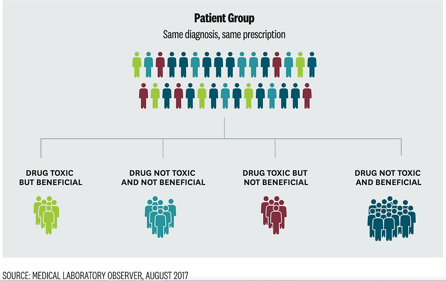
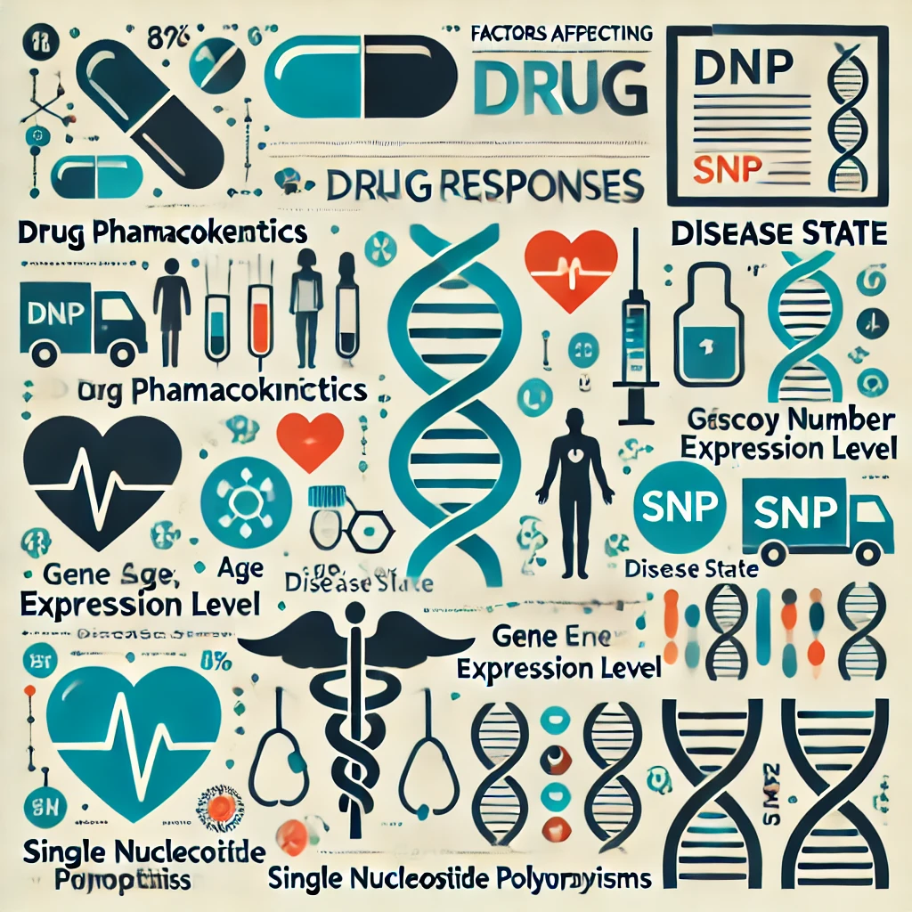
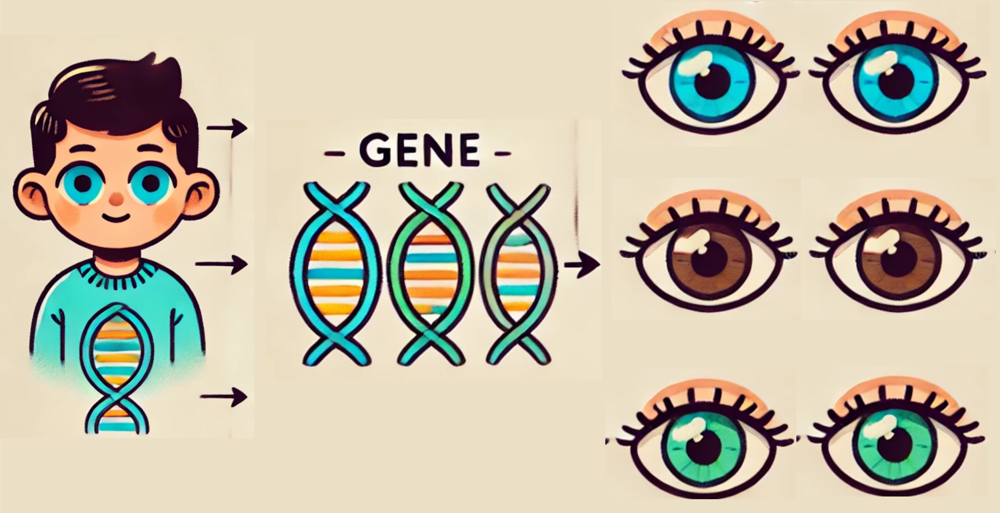
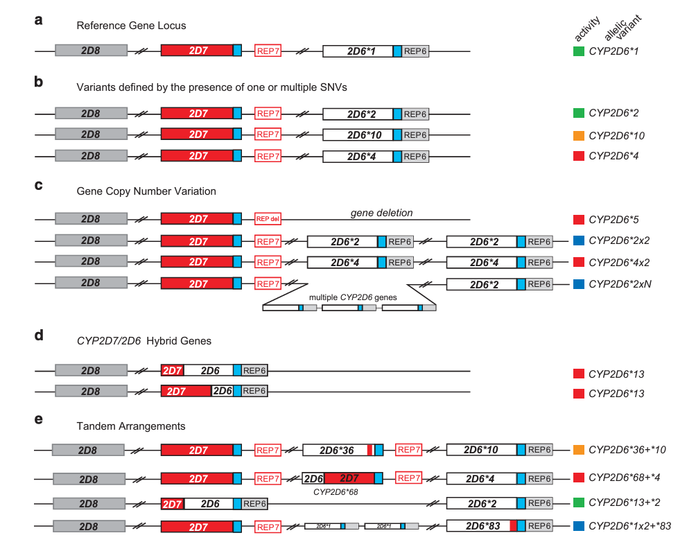
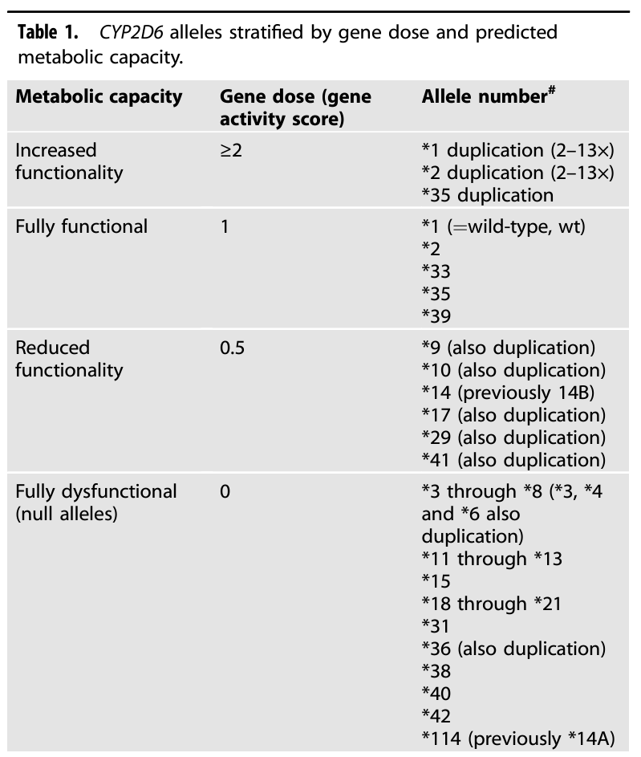
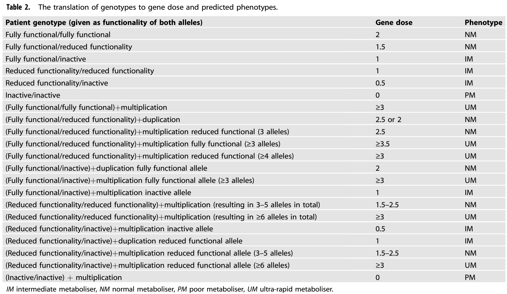
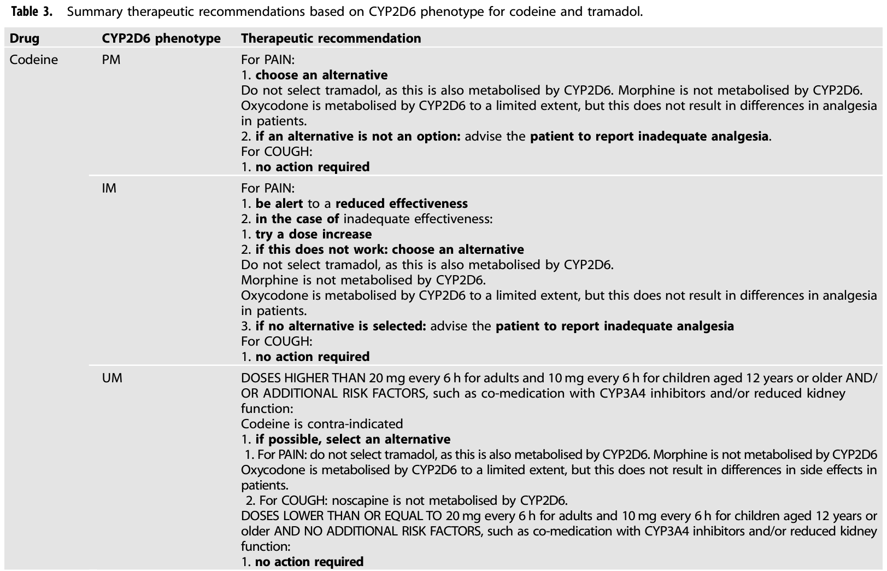
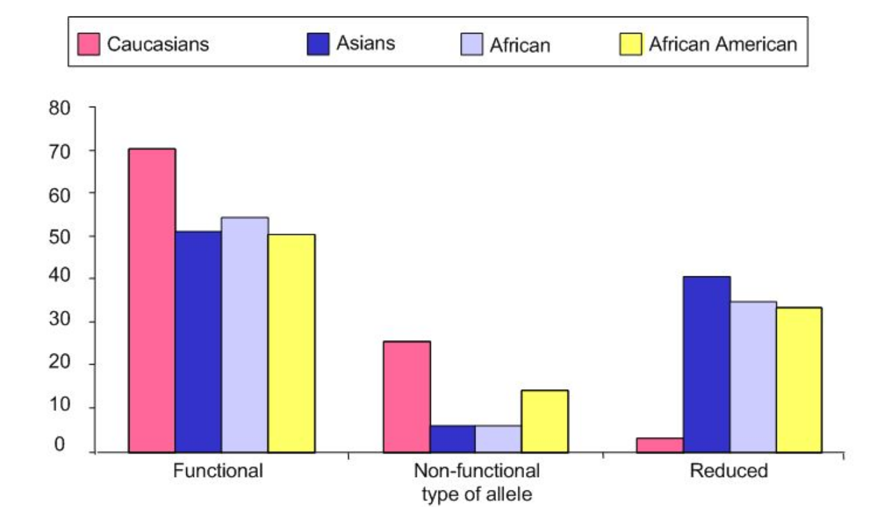
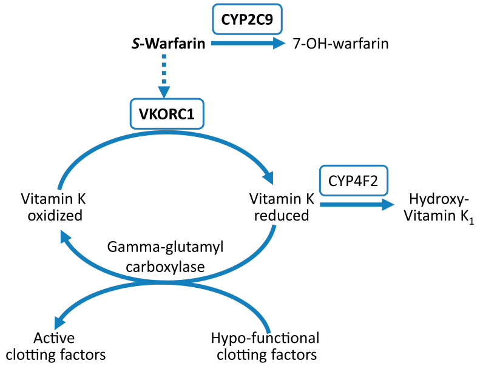
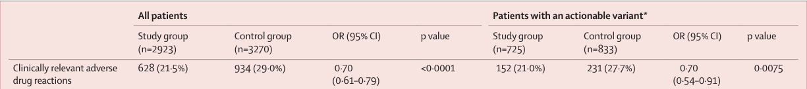

# Dental Pharmacology

## Pharmacogenetics / Pharmacogenomics

### Hao Chen, Ph.D

hchen@uthsc.edu Department ot Pharmacology, Addiction Science and Toxicology, UTHSC

Please use the live online version at http://chen42.github.io/slides/pgx.html

Or download the [**Printable version that can be saved as a pdf file**](http://chen42.github.io/slides/pgx.html?print-pdf#/).

<b>Last update: Aug 26th, 2025</b>

<a href="https://notebooklm.google.com/notebook/6bf15dba-6d7c-47f0-950f-936af6694300?authuser=1">AI study tutor for this lecture</a>

---

## Note

- These slides are intended to be used in a web browser.
- All navigational keys (Page Down / Page Up / Space Bar / Left | Right Arrows ) should work
- Links will show up in a new window/tab

---

## Text books

#### May need to login using your UTHSC NETID

- Basic & Clinical Pharmacology, 15e Bertram G. Katzung, Todd W. Vanderah

  - <a href="https://accesspharmacy-mhmedical-com.ezproxy.uthsc.edu/content.aspx?bookid=2988&sectionid=250594573" target=_new> Chapter 5: Pharmacogenomics </a>

- Goodman & Gilman's: The Pharmacological Basis of Therapeutics, 14th Edition
  - <a href="https://accessmedicine-mhmedical-com.ezproxy.uthsc.edu/content.aspx?bookid=3191&sectionid=268215725#1193227102" target=_new> Chapter 7: Pharmacogenetics and Pharmacogenomics </a>

---

<section id="objectives">

## Objectives

- Understand the principle concepts of Pharmacogenetics / Pharmacogenomics
- Identify key genetic variants influencing drug metabolism
- Interpret pharmacogenetic data for personalized medicine
- Navigate and utilize pharmacogenetic databases

---

## PGx: What are in the names?

- **Pharmacogenetics**

focuses on the study of how variations in a single gene or a few genes affect an individual's response to a particular drug. It examines specific genetic variations, such as single nucleotide polymorphisms (**SNPs**), that influence drug metabolism, efficacy, and the likelihood of adverse reactions. An example would be the study of how variations in the CYP2C9 gene affect the metabolism of warfarin, a commonly used anticoagulant.

- **Pharmacogenomics**

often used interchangeably with pharmacogenetics. Pharmacogenetics is more limited to single gene-drug interactions, while pharmacogenomics refers to polygenic drug response and encompasses transcriptomics, proteomics, and metabolomics.

---

## Why pharmacogenetics

Note:
Responder vs non-responder
Safe vs sever side effect

---

## Factors affect drug responses (precision medicine)

<table><tr> <td width=25%>

 
        Image Generated by ChatGPT, contains mistakes, for illustration purpose only

</td> <td>

- Drug (dose, route, formulation)
- Environment (diet, other drugs)
- Clinical (age, other infection, hormone, organ function, microbiome)
- **Genetic Factors**:

  - [Types of genetic variations](https://www.genome.gov/about-genomics/educational-resources/fact-sheets/human-genomic-variation)

    - Single Nucleotide Polymorphisms (SNPs, e.g., A->G; T->A)
    - Insertions and deletions (indels, e.g., AAACTAC->G; T-> ATAGATCG )
    - Structural variants (inversion, duplication, large deletion, large insertion)

  - Consequence: differences in
    - drug metabolism | drug transport | drug targets | genes regulated by drugs

- Pharmacokinetics (Absorption | Distribution | Metabolism | Excretion) and Pharmacodynamics

</td></tr></table>

---

## Gene vs alleles

[An allele is one of two or more versions of DNA sequence (a single base or a segment of bases) at a given genomic location.](https://www.genome.gov/genetics-glossary/Allele)

---

## How genes affect phenotypes

 
Source: <a href="https://www.ncbi.nlm.nih.gov/pmc/articles/PMC8317496/figure/F1/" target=_new> DOI:10.1007/s11886-021-01540-0</a>

---

## Not all genetic variants are equal

- Variant Characteristics

  - Variants can differ by number of base pairs involved, gene location, and impact on the encoded protein.

- Population Characteristics
  - Individual variants can range from extremely rare (documented in a single individual) to very common (difficult to define a “wild type” allele).
  - Allele frequencies can vary significantly across different populations.

---

## A hypothetical example

- One metabolism gene have two alleles in the population, one is functional and one is not.
  - Individuals inherit two alleles with no function are poor-metabolizers (PM) of the drug
  - Those have one functional allele and one nonfunctional allele are intermediate metabolizers (IM)
  - Those have two functional alleles normal metabolizers (NM).
  - In many cases, there are also alleles that results in ultrarapid metabolizers (UM)
  - Thus, we expect to have PM - IM - NM - UM in the population

---

## What is a star allele

    !! make sure you understand this !! Read the text book by clicking on the image.

<table> <tr><td width=60%>

<a href="https://accessmedicine.mhmedical.com/content.aspx?bookid=3191&sectionid=268215725#1193227102" target=_new>

</a>

</td><td>

<b>Common CYP2C19 variants, haplotypes, star alleles, functional effects, and metabolizer status.</b>

The patterns of individual variants define _haplotypes_, which in turn are designated using specific star alleles.

\*1 is normal

<b>A</b> The patterns of individual variants define haplotypes, which in turn are designated using specific star alleles. CYP2C19\*1 has normal enzyme function.

<b>B</b> Each individual inherits two CYP2C19 alleles (one maternal and one paternal), as shown in panel B. The combination of alleles determines the total amount of CYP2C19 enzyme functional activity or metabolizer status.

<small>Source: Chapter 7: Pharmacogenetics and Pharmacogenomics Dan M. Roden; Sara L. Van Driest
</small>

</td></tr></table>

---

## CYP2D6

CYP2D6 contributes to hepatic metabolism of 25% of the drugs in clinical use

CYP2D6 metabolizes several opioid pain medications commonly used in dental practice (Codeine, tremadol, oxycodone)

<table> <tr><td width=50%>

   
  </td>
  <td>

 
</td></tr></table>

<small>
Both codeine and tramadol are  of prodrugs. They are administered in an less active form and require metabolic conversion by *Cyp2D6* in the liver to produce their primary therapeutic effect.

**Codeine**: Codeine itself has a weak affinity for mu-opioid receptors and provides minimal pain relief on its own. Its analgesic power comes from its conversion into morphine.

**Tramadol**: The opioid-related pain relief effect of tramadol is dependent on its metabolism by CYP2D6 into O-desmethyltramadol (M1). The M1 metabolite binds to mu-opioid receptors with a much higher affinity (up to 200 times greater) than tramadol.

Source: <a href="https://pubmed.ncbi.nlm.nih.gov/34267337/" target=_new> Eur J Hum Genet
. 2022 Oct;30(10):1105-1113. doi: 10.1038/s41431-021-00920-y. </a>

</small>

---

## CYP2D6 alleles

CYP2D6 is a highly polymorphic gene and contains 1536 variants, from which over 140 CYP2D6 alleles and 250 sub-alleles have been identified.

<a href="https://genome.ucsc.edu/cgi-bin/hgTracks?db=hg38&lastVirtModeType=default&lastVirtModeExtraState=&virtModeType=default&virtMode=0&nonVirtPosition=&position=chr22%3A42121168-42167211&hgsid=3046983582_AjmqAESMUd6R4TP7EVF0HG6z04hP" target=_new>CYP2D7, CYP2D8, CYP2D9 on Chr22</a>

<table><tr><td width=60%>

</td><td>

The CYP2D6 activity conveyed by these haplotypes is indicated by colour-coded boxes (red, non-functional variant; orange, decreased activity; green, fully functional reference activity; blue, increased activity).

Panel <b>a</b>. Reference refers to reference human genome (assumed to be normal)

Panel <b>b</b>. SNV is single nucleotide variants (same as SNP), they are too small to show. *10 has SNP that reduced the function of the enzyme, *4 has SNPs that rendered the enzyme non-functional.

Panel <b>c</b>. Copy number variation includes deletions, duplications

Panel <b>d</b>. CYP2D7 and CYP2D8 are non-functional pseudogenes

Panel <b>e</b>. Different kind of repeats

Source: <a href="https://www.ncbi.nlm.nih.gov/pmc/articles/PMC5685293/" target=_new> NPJ Genom Med. 2016; 1: 15007.</a>

</td></tr></table>

---

## Assigning gene "dose" to alleles

<small>The complexity rises from variants (SNPs, Indels, SVs) to alleles (*1, *2, ...), lets makie the PGx information easier to use.
</small>

<table><tr><td width=50%>
       
</td><td>

</td></tr></table>

Source: <a href="https://pubmed.ncbi.nlm.nih.gov/34267337/" target=_new> Eur J Hum Genet
. 2022 Oct;30(10):1105-1113. doi: 10.1038/s41431-021-00920-y. </a>

---

## Translation of genotype to phenotype

<small> We need to consider both copies of the gene (by addiing their doses)</small>

Source: <a href="https://pubmed.ncbi.nlm.nih.gov/34267337/" target=_new> Eur J Hum Genet
. 2022 Oct;30(10):1105-1113. doi: 10.1038/s41431-021-00920-y. </a>

---

## From predicted phenotype to personalized recommendation

Source: <a href="https://pubmed.ncbi.nlm.nih.gov/34267337/" target=_new> Eur J Hum Genet
. 2022 Oct;30(10):1105-1113. doi: 10.1038/s41431-021-00920-y. </a>

---

## CYP2D6 allele frequency differs by ethnic groups

Source: <a href="https://pubmed.ncbi.nlm.nih.gov/11972444/" target=_new> Pharmacogenomics . 2002 Mar;3(2):229-43. doi: 10.1517/14622416.3.2.229. </a>

---

## Same allele, different response between ethnic groups

<table><tr><td width=50%>

</td><td>

                
- Genetic background also plays a role (interacting with other genes)
                 
    - Three CYP2D6 substrates was used to test the function of this enzyme. (Rows)
                 
    - Each column is a genotype group (i.e. groups of alleles)

    - The \* indicates differences between ethnic groups.

DF, decreased function; FF, full function; IM, intermediate metabolizer; NF, null function;

NM, normal metabolizer; PM, poor metabolizer; UM, ultrarapid metabolizer.

</td></tr></table>
Source: <a href="https://www.ncbi.nlm.nih.gov/pmc/articles/PMC10264946/" target=_new> Clin Transl Sci. 2023 Jun; 16(6): 1012–1020.</a>

---

## Summary on PGx of CYP2D6

- Many genetic variants (SNPs, Indels, Structural variants)
- Many star alleles
- Gene dose score can be generated for each allele
- The effect of alleles on phenotype can be predicted based on gene dose
- The predicted phenotype classifies patents into different groups
  - PM, IM, NM, UM
- Customized guidelines are available for these group.
- But additional factors also contribute to the variability within each group (e.g. ethnicity)

---

## PGx of drug hypersensitivity

- Abacavir is used in the treatment of HIV

  - associated with hypersensitivity reactions in the skin
  - for many years appeared to be idiosyncratic, ie, of unknown mechanism.

- Abcavir specifically interact with with the product of HLA-B\*57:01

- <a href="https://www.nejm.org/doi/full/10.1056/NEJMoa0706135#core-r007" target=_new> HLA-B\*57:01 screening reduced the risk of hypersensitivity reaction to abacavir.</a>

  - Screening eliminated immunologically confirmed hypersensitivity reaction (0% in the prospective-screening group vs. 2.7% in the control group, P<0.001).
  - The results show that a pharmacogenetic test can be used to prevent a specific toxic effect of a drug.

- Genetic testing of the HLA-B\*57:01 for abacavir hypersensitivity has been rapidly incorporated.
  - <a href="https://clinicalinfo.hiv.gov/en/guidelines/hiv-clinical-guidelines-adult-and-adolescent-arv/what-start-initial-combination?view=full" target=_new> Clinical Guideline</a>

---

## Multigenic PGx traits

<table><tr><td width=50%>

</td><td>

- The pathway
  - Vitamin K (reduced) is required for the activation of clotting factors
  - Vitamin K (reduced) is recycled from its oxidized form by VKROC1
  - Warfarin interacts with VKORC1 to inhibit vitamin K and is used as an anticoagulant
- The regulators
  - S-Warfarin is metabolized by CYP2C9
  - VKORC1 variants affect the dosing of warfarin
  - Vitamin K is metabolized by CYP4F2

</td></tr></table>

Source: <a href="https://pharmrev.aspetjournals.org/content/65/3/987" target= _new>Pharmacological Reviews July 2013, 65 (3) 987-1009; DOI: https://doi.org/10.1124/pr.112.007252</a>

---

## <a href="https://accessmedicine.mhmedical.com/content.aspx?bookid=3191&sectionid=268215725#1193227105" target=_new>PGx in clinical practice</a>

- Point-of-care testing
  - Genotyping is ordered at the time of drug prescription.
  - Each drug requires a separate assay.
- Pre-testing genotyping multiple drug response loci
  - Embedding this information in the patient's EHR.
- Barriers to widespread adoption
  - The need for solid evidence linking a variant to a variable drug response.
  - The variable outcome must be clinically significant.
  - Genetically guided advice should be provided, such as choosing a different drug or dose.

---

## A 12-gene pharmacogenetic panel prevents adverse drug reactions

This study assessed 41,696 patients. Among them 6944 participants were genotyped for 50 germline variants in 12 genes, and those with an actionable variant (ie, a drug–gene interaction test result for which the Dutch Pharmacogenetics Working Group recommended a change to standard-of-care drug treatment).
 

The problem is that those without actionable variant also showed reduced side effect. Many comments were made in the follow up correspondence. The authored pointed out in their reply that the original analysis have pointed out "Casemix" (mixing of study population is different between groups) is the cause of similar effects. After correcting it, the difference reduced to 13% in All patients and increased to 39% in patients with actionable variants.

Source: <a href="https://pubmed.ncbi.nlm.nih.gov/36739136/" target=_new> Lancet
. 2023 Feb 4;401(10374):347-356. doi: 10.1016/S0140-6736(22)01841-4.</a>

---

## PGx resources

- <a href="https://cpicpgx.org/" target=_new>CPIC: Practice Guidelines by Clinical Pharmacogenetics Implementation Consortium </a>

- <a href="https://www.pharmgkb.org/" target=_new>PharmGKB: Pharmacogenomic information for individual drugs</a>

- <a href="https://www.fda.gov/drugs/scienceresearch/researchareas/pharmacogenetics/ucm083378.htm" target=_new> Pharmacogenomic markers in drug labeling by FDA</a>
