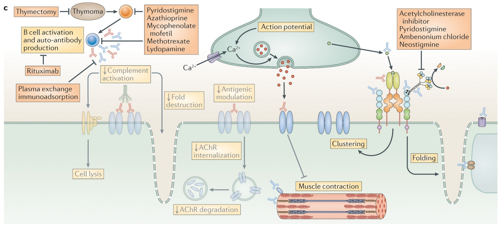

# Peripheral nervous system pharmacology

### Hao Chen

hchen@uthsc.edu

2021-04-06

---

## Outline

* Introduction to the PNS
* Myasthenia Gravis
* hATTR 
* Gut microbiota-brain axis

---

## The peripheral nervous system

---

## The peripheral nervous system

---

## PNS neurotransmitters

---

## Nicotinic receptor subtypes

Models of pentameric arrangements of homomeric and some heteromeric nAChRs. α7 and α9 are the only α-type subunits capable of forming functional homomeric receptors, which contain five identical binding sites. In α7, occupancy of only one site is required for activation.  Examples of possible combinations of α and non-α subunits in heteromeric arrangements are shown. An α-type subunit is required for the principal face of the binding site. The muscle nAChR contains two functional binding sites at α/δ and α/ε(γ) interfaces. 
Some subunits can assemble with different stoichiometries, such as α4 and β2. In addition to the arrangement shown, (α4)3(β2)2 receptors are also functional.

Early studies of nAChR subtypes expressed on autonomic neurons showed a great diversity of channel subtypes that varied through development (Moss et al., 1989). While α3 appears to be a common component of most ganglionic neuronal nAChRs, it has been shown to co-assemble with β2 or β4 subunits in varying stoichiometries, sometimes also with α5 (David et al., 2010). [Neuropharmacology 168 (2020) 108021](https://pubmed.ncbi.nlm.nih.gov/32146229/)

It has been suggested that the expression of α9α10 nAChRs may be a universal feature of all DRG neurons (Lips et al., 2002).  Recent studies indicate that antagonists of α9-containing nAChRs are analgesic in animal models of neuropathic pain. [Br J Pharmacol . 2018 Jun;175(11):1915-1927.](https://pubmed.ncbi.nlm.nih.gov/28662295/)

---

## Craig Mello 

<iframe width="560" height="315" src="https://www.youtube.com/embed/IUnYx-xFP9o" title="YouTube video player" frameborder="0" ></iframe>

---

## Special considerations of the PNS for giants 

The tallest giraffes have necks up to 2.4 m long (Toon and Toon 2003), so the total length of the nervous pathway from the brainstem to the larynx along the descending vagus and ascending recurrent laryngeal nerves approaches 5 m in the largest individuals.

Pain signals from the larynx to the brain in sauropods may have been considerably delayed. Unmyelinated vagal afferent fibers have conduction velocities as low as 0.5 m/s (Iggo 1958), and some unmyelinated fibers are present even in the recurrent laryngeal nerve of the giraffe (Harrison 1981). Unless selected for faster response, similar unmyelinated fibers would have taken almost <b>a full minute</b> to relay “slow pain” signals to the brain of Supersaurus!

The physiology of neurons measuring many meters or tens of meters is difficult to investigate. One area of potential interest is axoplasmic streaming. An axon must not only transmit nerve impulses but also transport materials between the nerve cell body and axon terminals. ...  Fast transport of neurotransmitters and enzymes can reach 200–400 mm/day, whereas the slow transport of some proteins averages 0.1–1.0 mm/day (Oztas 2003). Even at 1 mm/day, slow axoplasmic streaming would take more than <b>four decades </b> to move proteins from the nerve cell body to the axon terminals in the longest neurons of large whales. 

---

## Myasthenia Gravis

The most benign form of MG, sometimes called ocular myasthenia, affects only the small muscles around the eye. The most visible sign is a drooping of the eyelid, or “ptosis” (pronounced “toh-sis”). Ptosis can occur on one or both sides (bilaterally). 

In other patients, more muscles are affected and additional symptoms may include double vision, clumsiness, falling, difficulty speaking or swallowing, shortness of breath, and tiring easily while playing. 

<a href="https://www.jns-journal.com/article/S0022-510X(19)30360-0/fulltext">
Historical achievements
</a>
<li> Friedrich Jolly was the first to suggest the name “Myasthenia gravis pseudoparalytica” in 1895
<li> In 1913, Sauerbruch accidentally discovered that partial removal of the thymus to treat hyperthyroidism in a 21-year-old female patient with both hyperthyroidism and MG improved her MG symptoms. 
<li> In the 1930s, Dale and other researchers demonstrated that ACh was indeed released at the motor nerve end plates to induce striated muscle contraction, and such effects were inhibited by the enzyme cholinesterase.
<li> In 1934 Mary B. Walker recognized the similarities between symptoms of curare poisoning and MG, so she tried the antidote for curare poisoning, physostigmine, on a 56-year-old female patient with MG. The hypodermic injections of physostigmine salicylate began working within an hour and the positive effects wore off gradually over 2 to 4 h. 
<li> Years later, Walker demonstrated that neostigmine, another acetylcholinesterase inhibitor, worked well with fewer side effects than physostigmine.

---

## Normal neuromuscular junction 

<small>The neuromuscular junction comprises the presynaptic nerve terminal and the postsynaptic muscle cell. Agrin released from the nerve terminal binds to lipoprotein-receptor-related protein 4 (LRP4) and muscle-specific kinase (MuSK), leading to the activation of MuSK, which in turn causes clustering of the acetylcholine (ACh) receptors (AChRs), which is necessary for the maintenance of the postsynaptic structures. AChE, acetylcholinesterase; ColQ, collagen Q; Kv1.4, voltage-gated potassium channel; RyR, ryanodine receptor; VGSC, voltage-gated sodium channel.</small>
---

## Muscle contraction

---

## Myasthenia Gravis etiology

<small> Anti-acetylcholine (ACh) receptor (AChR) antibodies activate complement, leading to damage of the postsynaptic membrane at the neuromuscular junction through production of the membrane attack complex (MAC). Anti-AChR antibodies can also crosslink AChRs, leading to their accelerated internalization and degradation rate. Some antibodies can directly block the ACh binding site. Anti-muscle-specific kinase (MuSK) antibodies do not activate complement and typically prevent the interaction of MuSK and lipoprotein-receptor-related protein 4 (LRP4), among other proteins, leading to reduced AChR clustering on the postsynaptic membrane. </small>

---

## Anti-MuSK in myasthenia Gravis 

---

## How are autoimmune antibody generated

The recognition of self-antigens in the thymus is facilitated by multigene transcription factors, such as AIRE (autoimmune regulator), which is expressed in thymic medulla. AIRE leads to the expression of major peripheral proteins on the surface of thymic epithelial cells, after which T cells that recognize these proteins (or ‘self-antigens’) are targeted for negative selection and undergo apoptosis. Self-reactive T cells that escape central tolerance enter the periphery, where they can undergo apoptosis, enter into a state of anergy or undergo suppression (peripheral tolerance). The central and peripheral tolerance of T and B cells to self-antigens is crucial for health and development. In myasthenia gravis, there is a failure of central tolerance, occurring within the thymus in most patients, leading to the development of self-reactive cells. 

AChR, acetylcholine receptor; APC, antigen-presenting cell; MHC, major histocompatibility complex; TCR, T cell receptor; Treg cell, regulatory T cell.

Note: Antibody responses to protein antigens require antigen-specific T-cell help. B cells can receive help from armed helper T cells when antigen bound by surface immunoglobulin is internalized and returned to the cell surface as peptides bound to MHC class II molecules. https://www.ncbi.nlm.nih.gov/books/NBK27142/

---

## Myasthenia Gravis pharmacological intervention

a | Treatment of chronic myasthenia gravis (MG). 

b | Treatment of acute exacerbations of MG. 

The individualized combination of symptomatic drugs, immunosuppressive drugs, thymectomy and supportive therapy should lead to a very good outcome in patients with MG. The combination of prednisolone and azathioprine is recommended, but prednisolone alone or prednisolone combined with mycophenolate mofetil are alternative first-line immunosuppressive treatments. 

IVIg, intravenous immunoglobulin.  [IVIg is prepared from Ig from >1000 healthy donors](https://www.ncbi.nlm.nih.gov/pmc/articles/PMC2536015/?page=4) [Mechanism of Action for IVIg](https://www.ncbi.nlm.nih.gov/pmc/articles/PMC2811867/) 

---

## Myasthenia Gravis immunological intervention

---

## Myasthenia Gravis immunological intervention 

<a href="https://www.frontiersin.org/articles/10.3389/fonc.2018.00163/full">

Rituximab is a chimeric mouse/human monoclonal antibody (mAb) therapy with binding specificity to CD20.

</a>

FcRn (so named because it was initially identified in neonatal intestinal epithelium) is a protective receptor crucial for regulating the half life of IgG. In normal circumstances, IgG binds to FcRn and is protected from catabolism after being internalised in the endosome. IVIg is thought to saturate these receptors and thus accelerate the breakdown of endogenous IgG which may be mediating the autoimmune repertoire 

---
 
## Myasthenia Gravis Antibody Treatment

---

## How to produce monoclonal antibodies 

---

## Types of mAB used for therapeutics 

<a href="https://jbiomedsci.biomedcentral.com/articles/10.1186/s12929-019-0592-z">

<small>Around the world, at least 570 therapeutic mAbs have been studied in clinical trials by commercial companies, and 79 therapeutic mAbs have been approved by the United States Food and Drug Administration and are currently on the market, including 30 mAbs for the treatment of cancer). </small>

</a>

---

## Phage display

<a href="https://www.frontiersin.org/articles/10.3389/fimmu.2020.01986/full">

</a>

 

---

## Generating human Ig in mice

---

## VDJ recombination 

 
<a href="https://www.nobelprize.org/prizes/medicine/1987/summary/"> Susumu Tonegawa    The Nobel Prize in Physiology or Medicine 1987</a> 

---

## hATTR

hATTR amyloidosis is caused by an inherited gene mutations. There are 120 or more gene mutations known to be associated with hATTR amyloidosis. These mutations affect the function of a protein called transthyretin (TTR), a protein that is made primarily in the liver and carries substances such as vitamin A. hATTR is characterized by the buildup of abnormal deposits of protein fibers called amyloid in the body's organs and tissues, interfering with their normal functioning. These protein deposits most frequently occur in the peripheral nervous system, which can result in a loss of sensation, pain, or immobility in the arms, legs, hands and feet. Amyloid deposits can also affect the functioning of the heart, kidneys, eyes and gastrointestinal tract. Treatment options have generally focused on symptom management.

</a>

Note: amyloid: Amyloids are aggregates of proteins characterised by a fibrillar morphology of 7–13 nm in diameter, a β-sheet secondary structure (known as cross-β) 

---

<h2><a href="https://www.fda.gov/news-events/press-announcements/fda-approves-first-its-kind-targeted-rna-based-therapy-treat-rare-disease">
FDA approves first-of-its kind targeted RNA-based therapy
</a>
</h2>
August 10, 2018 

 The U.S. Food and Drug Administration today approved Onpattro (patisiran) infusion for the treatment of peripheral nerve disease (polyneuropathy) caused by hereditary transthyretin-mediated amyloidosis (hATTR) in adult patients. This is the first FDA-approved treatment for patients with polyneuropathy caused by hATTR, a rare, debilitating and often fatal genetic disease characterized by the buildup of abnormal amyloid protein in peripheral nerves, the heart and other organs. It is also the first FDA approval of a new class of drugs called small interfering ribonucleic acid (siRNA) treatment. 

---

## Potent and specific genetic interference by double-stranded RNA in Caenorhabditis elegans

Andrew Fire, SiQun Xu, Mary K. Montgomery, Steven A. Kostas, Samuel E. Driver & Craig C. Mello 

<a href="https://www.nature.com/articles/35888">
Nature volume 391, pages 806–811 (1998)
</a>

Experimental introduction of RNA into cells can be used in certain biological systems to interfere with the function of an endogenous gene1,2. Such effects have been proposed to result from a simple antisense mechanism that depends on hybridization between the injected RNA and endogenous messenger RNA transcripts. RNA interference has been used in the nematode Caenorhabditis elegans to manipulate gene expression3,4. Here we investigate the requirements for structure and delivery of the interfering RNA. To our surprise, we found that double-stranded RNA was substantially more effective at producing interference than was either strand individually. After injection into adult animals, purified single strands had at most a modest effect, whereas double-stranded mixtures caused potent and specific interference. The effects of this interference were evident in both the injected animals and their progeny. Only a few molecules of injected double-stranded RNA were required per affected cell, arguing against stochiometric interference with endogenous mRNA and suggesting that there could be a catalytic or amplification component in the interference process.

---

## RNA interference  

<iframe title="vimeo-player" src="https://player.vimeo.com/video/513844828" width="640" height="360" frameborder="0" allowfullscreen></iframe>

---

## How does RNAi work?

<small>(1) Mammalian primary microRNA (miRNA) transcripts (pri-miRNA) are transcribed in the nucleus 

(2) and cleaved by the Microprocessor complex (Drosha–DGCR8) to produce (~30 bp) short hairpin RNAs (shRNAs) called pre-miRNA. 

(3) Exportin 5 binds and transports the pre-miRNA to the cytoplasm (4) where it disengages from exportin 5 
(5) and binds with Dicer and TAR RNA-binding protein (TRBP). (There are also non-Dicer-mediated pathways.) 

(6) Dicer cleaves the terminal loop of pre-miRNA (7) and induces formation of an RNA-induced silencing complex (RISC)-loading complex (RLC) with an Argonaute (Ago1–Ago4) protein. 

(8) A guide strand (antisense) is selected and loaded into Ago1–Ago4 and the passenger (sense) strand is discarded. 

(9) The mature RISC can regulate gene expression by inhibiting mRNA translation, inducing mRNA sequestration in cytoplasmic P-bodies and/or GW-bodies, promoting mRNA degradation and directing transcriptional gene silencing of the target gene loci.

Argonaute, GW182 and the guide strand are essential for the mRNA-silencing activities of RISC. TRBP and DICER can dissociate from mature RISC after guide strand loading. mRNAs with as few as 7 bases of complementarity to the seed region (bases 2–8 from the 5ʹ end) of guide strands can be affected by RNAi. 

(10) Synthetic small interfering RNAs (siRNAs) enter the cytosol via endocytosis followed by rare endosomal escape events. (11) siRNAs then interact directly with the cytosolic RNA interference (RNAi) enzymes (Dicer and TRBP) (12) to form the RLC via Dicer-mediated or non-Dicer-mediated pathways (13) and undergo strand selection to produce mature RISC. (14) siRNA guide strands usually have full complementarity to a single target mRNA to induce potent and narrowly targeted gene silencing. (15) Ago2 is particularly important for RNAi therapeutics as it has intrinsic slicer activity to efficiently cleave mRNA targets. m7G, 7-methylguanosine. </a>

<a href="https://www.nature.com/articles/nsmb.2149">GW182 serves as both a platform that recruits deadenylases and as a deadenylase coactivator that facilitates the removal of the poly(A) tail </a>

---

## How does RNAi treatment work?

<small>Patisiran consists of the small interfering RNA (siRNA) shown in complex with lipid excipients. The components are assembled under acidic pH into lipid nanoparticles (LNPs) and injected intravenously once every 3 weeks (q3w) at dosages of 0.3 mg per kg. 

The siRNA targets the 3ʹ untranslated region (UTR) of the TTR gene, which encodes transthyretin, to silence all possible mRNAs with coding region mutations. 

RNA interference (RNAi) silencing results in sustained >70% reductions of circulating TTR proteins, effectively stopping deposition of TTR amyloids. 

For the siRNA, ‘m’ = 2ʹ-O-methyl-modified bases, ‘r’ = RNA and ‘d’ = DNA. </a>

---

## Craig Mello talks about the Universe and RNAi

<iframe width="560" height="315" src="https://www.youtube.com/embed/qdclPkmAQ0I" title="YouTube video player" frameborder="0" allow="accelerometer; autoplay; clipboard-write; encrypted-media; gyroscope; picture-in-picture" allowfullscreen></iframe>

---

## The Gut microbiota-brain axis

<a href="https://www.nature.com/articles/s41579-020-00460-0">

 

</a>

<small>Bidirectional communication between the gut microbiota and the central nervous system (CNS) is mediated by several direct and indirect pathways of the gut–brain axis. Most of the information on host–microbiota interactions, and thus the data presented in this figure, is derived from studies in animal models where researchers can effectively control the environment of the test animals. The routes of communication involve the <b>autonomic nervous system</b> (for example, the enteric nervous system (ENS) and the vagus nerve), the neuroendocrine system, the hypothalamic–pituitary–adrenal (HPA) axis, the immune system and metabolic pathways. 

Within the gut, the microbiota can produce neuroactive compounds such as neurotransmitters (for example, γ-aminobutyric acid (GABA), noradrenaline, dopamine and serotonin (5-hydroxytryptamine (5-HT))), amino acids (for example, tyramine and tryptophan) and microbial metabolites (for example, short-chain fatty acids and 4-ethylphenylsulfate). These metabolites can travel through portal circulation to interact with the host immune system, influence metabolism and/or affect local neuronal cells of the ENS and afferent pathways of the vagus nerve that signal directly to the brain. 

The gut microbiota can also influence gut barrier integrity that controls the passage of signalling molecules from the gut lumen to the lamina propria, which contain immune cells and terminal ends of ENS neurons, or to portal circulation. Gut barrier integrity can become disrupted in some neuropsychiatric conditions, such as anxiety, autism spectrum disorder and depression. 

Within the nervous system, stress can activate the HPA axis response that involves neurons of the hypothalamus that secrete hormones such as corticotropin receptor hormone (CRH) into the brain or the portal circulation, triggering the release of adrenocorticotrophic hormone (ACTH), which then initiates the synthesis and release of cortisol. Cortisol regulates neuroimmune signalling responses that, in turn, affect intestinal barrier integrity. Stress hormones, immune-mediators and CNS neurotransmitters can activate neuronal cells of the ENS and afferent pathways of the vagus nerve, which can change the gut environment and alter the microbiota composition.</small>

---

## Microbiota modulate host behaviour and nervous system function

<small>
Microorganisms can induce host production of metabolites and neurotransmitters that mediate gut–brain signalling and can produce some of these neuroactive compounds themselves. Microbial-derived molecules signal to the brain via neuronal pathways of the vagus nerve or modulate the immune system. 

For example, Lactobacillus reuteri has the capacity to upregulate plasma and brain levels of oxytocin in mice, a molecule that increases social behaviour. The administration of L. reuteri increases social behaviour in mouse models of autism spectrum disorder (ASD). However, the effects of supplementation with L. reuteri on humans with ASD remain to be determined. 

Lactobacillus rhamnosus produces γ-aminobutyric acid (GABA) and regulates GABA receptors in the brain (that is, GABAAα2 and GABAB1b receptors), and has been shown to attenuate depression and anxiety-like behaviour in mice but failed to improve stress symptoms in healthy humans. 

Bifidobacterium longum NCC3001, which has been demonstrated to ameliorate mood alterations in individuals with irritable bowel syndrome, upregulates brain-derived neurotrophic factor (BDNF), augments neuronal plasticity in the enteric nervous system (ENS) and reduces anxiety and depression-like behaviours in mice. 

Each of these three phenomena described above requires the presence of intact vagus nerve signalling. In other cases, a direct mechanism remains to be explored. For instance, Bacteroides fragilis is known to improve anxiety-like behaviour, repetitive behaviour and communication in mice. The effects of B. fragilis are in part due to reduction of 4-ethylphenylsulfate (4-EPS), which modulates anxiety-like behaviour in mice. Short-chain fatty acids (SCFAs) can regulate genes that are involved in microglia maturation and induce morphology changes in mice.

</small>

---

## Pharmacology beyond small molecules 

* What are needed for precision medicine?
* Protein, peptide, RNAi, gene therapy, epigenome modification?

Jennifer Doudna and Emmanuelle Charpentier   2020 Nobel chemistry prize  for the discovery of a game-changing gene-editing technique

[FDA approves first test of CRISPR to correct genetic defect causing sickle cell disease](https://news.berkeley.edu/2021/03/30/fda-approves-first-test-of-crispr-to-correct-genetic-defect-causing-sickle-cell-disease/)
